# 📚 Resilience Documentation Guide: Which Document When?

> **TL;DR**: Clear guidance on which resilience document to use for your specific situation. This document resolves confusion about when to use each resilience guide.

---

## 🎯 Document Purpose Matrix

| Document | Primary Purpose | When to Use | Target Audience | Content Type |
|----------|----------------|-------------|-----------------|--------------|
| **[Troubleshooting Guide](troubleshooting-guide.md)** | **Emergency response** | System is broken RIGHT NOW | Operations, DevOps, Support | Step-by-step diagnostics |
| **[Quick Reference](quick-reference.md)** | **Developer lookup** | Building code, need patterns | Developers, Engineers | Decision matrix + code templates |
| **[Implementation Guide](resilience-implementation-guide.md)** | **Complete implementation** | Building new resilient components | Senior developers, Architects | Comprehensive examples |
| **[Error Scenarios Guide](error-scenarios-guide.md)** | **Detailed debugging** | Understanding complex error flows | Debugging specialists, Senior devs | Real-world debugging examples |
| **[Infrastructure Failures](failure-scenarios/README.md)** | **Operations procedures** | Infrastructure outages | Operations teams, SRE | System-level procedures |
| **[Error Classification](error-classification-severity.md)** | **Framework foundation** | Understanding the methodology | All technical roles | Concepts and decision trees |
| **[Recovery Strategy Selection](recovery-strategy-selection.md)** | **Strategy algorithm** | Understanding recovery logic | Architects, Senior developers | Algorithms and decision logic |
| **[Circuit Breakers](circuit-breakers.md)** | **Service protection** | Setting up failure isolation | Platform engineers, DevOps | Configuration and patterns |
| **[Error Propagation](error-propagation.md)** | **Cross-tier coordination** | Understanding system-wide flows | System architects, Senior devs | Architecture and patterns |

---

## 🔄 Document Flow Patterns

### **🚨 Crisis Response Flow**
```
System Issue → Troubleshooting Guide → Quick fixes
                    ↓ (if complex)
               Error Scenarios Guide → Detailed analysis
                    ↓ (if infrastructure)
               Infrastructure Failures → Operations procedures
```

### **🏗️ Development Flow**
```
Building component → Quick Reference → Code patterns
                         ↓ (for complete guide)
                    Implementation Guide → Full patterns
                         ↓ (for framework understanding)
                    Error Classification + Recovery Strategy
```

### **🔍 Understanding Flow**
```
Learn framework → Error Classification → Understand concepts
                      ↓
                 Recovery Strategy → Understand algorithms
                      ↓
                 Error Propagation → Understand system flows
                      ↓
                 Error Scenarios → See examples in action
```

---

## ❓ Common Questions Resolved

### **"I need error handling code. Quick Reference or Implementation Guide?"**
- **Quick Reference**: You understand resilience basics, need fast lookup of patterns
- **Implementation Guide**: You're building a complete component and need systematic approach

### **"System is broken. Troubleshooting or Error Scenarios?"**
- **Troubleshooting Guide**: You need immediate fixes with diagnostic steps
- **Error Scenarios Guide**: You need to understand WHY the error happened and debug complex flows

### **"Infrastructure issues. Infrastructure Failures or Error Scenarios?"**
- **Infrastructure Failures**: Database outages, network issues, service crashes (operations team)
- **Error Scenarios Guide**: Application-level errors within the infrastructure (development team)

### **"Understanding errors. Error Classification or Recovery Strategy?"**
- **Error Classification**: Learn HOW to categorize errors systematically
- **Recovery Strategy Selection**: Learn HOW to choose the right recovery approach

---

## 🎯 Usage Scenarios by Role

### **👨‍💻 Frontend/Fullstack Developer**
1. **Quick Reference** - Common error patterns and fixes
2. **Implementation Guide** - How to build resilient components
3. **Error Classification** - Understanding error types

### **🏗️ Backend/Platform Engineer**
1. **Implementation Guide** - Complete component patterns
2. **Circuit Breakers** - Service protection setup
3. **Error Propagation** - Cross-service coordination
4. **Infrastructure Failures** - Operations procedures

### **🚨 DevOps/SRE**
1. **Troubleshooting Guide** - Emergency response procedures
2. **Infrastructure Failures** - System-level recovery
3. **Circuit Breakers** - Protection configuration
4. **Error Propagation** - Understanding escalation

### **🔍 Debugging Specialist**
1. **Error Scenarios Guide** - Detailed debugging examples
2. **Error Propagation** - Understanding error flows
3. **Troubleshooting Guide** - Quick diagnostic patterns
4. **Implementation Guide** - Understanding component behavior

### **📐 System Architect**
1. **Error Classification** + **Recovery Strategy** - Framework foundation
2. **Error Propagation** - System-wide coordination
3. **Implementation Guide** - Complete patterns
4. **Circuit Breakers** - Protection strategy

---

## 🔗 Document Dependencies

```mermaid
graph TB
    subgraph "Foundation (Read First)"
        EC[Error Classification<br/>📋 Core concepts]
        RS[Recovery Strategy<br/>🧠 Selection logic]
    end
    
    subgraph "Implementation"
        QR[Quick Reference<br/>⚡ Fast patterns]
        IG[Implementation Guide<br/>🔧 Complete examples]
        CB[Circuit Breakers<br/>🛡️ Protection setup]
    end
    
    subgraph "Debugging & Operations"
        TG[Troubleshooting Guide<br/>🚨 Emergency response]
        ES[Error Scenarios<br/>🔍 Detailed debugging]
        IF[Infrastructure Failures<br/>🏗️ Operations procedures]
    end
    
    subgraph "Advanced"
        EP[Error Propagation<br/>🌊 Cross-tier flows]
    end
    
    EC --> QR
    EC --> IG
    RS --> IG
    RS --> ES
    EC --> TG
    
    IG --> CB
    IG --> EP
    
    TG --> ES
    TG --> IF
    
    classDef foundation fill:#e3f2fd,stroke:#1565c0,stroke-width:2px
    classDef implementation fill:#e8f5e8,stroke:#2e7d32,stroke-width:2px
    classDef operations fill:#ffebee,stroke:#c62828,stroke-width:2px
    classDef advanced fill:#f3e5f5,stroke:#7b1fa2,stroke-width:2px
    
    class EC,RS foundation
    class QR,IG,CB implementation
    class TG,ES,IF operations
    class EP advanced
```



**Reading Order by Learning Path:**

1. **🚀 Quick Start**: Troubleshooting Guide → Quick Reference
2. **📚 Complete Learning**: Error Classification → Recovery Strategy → Implementation Guide
3. **🔧 Building Focus**: Quick Reference → Implementation Guide → Circuit Breakers
4. **🔍 Debugging Focus**: Troubleshooting Guide → Error Scenarios Guide → Error Propagation

---

## 📝 Content Overlap Analysis

### **Intentional Overlap (Good)**
- **Quick Reference** + **Implementation Guide**: Code patterns at different detail levels
- **Troubleshooting** + **Error Scenarios**: Emergency fixes vs. detailed analysis
- **All documents**: Reference the Error Classification framework

### **Avoided Overlap (Cleaned Up)**
- **Troubleshooting** vs **Quick Reference**: Diagnostic steps vs code patterns
- **Error Scenarios** vs **Infrastructure Failures**: Application vs system-level
- **Implementation** vs **Circuit Breakers**: Complete patterns vs specific protection

---

> 💡 **Meta-Tip**: Bookmark this guide! It's your map to efficient resilience documentation navigation. Start here when you're unsure which document you need.

---

## 📚 Related Documentation

- **[Resilience Architecture](README.md)** - Main resilience hub with overview
- **[All Referenced Documents](#-document-purpose-matrix)** - Complete document list above
- **[Communication Architecture](../communication/README.md)** - How tiers coordinate during errors
- **[Event-Driven Architecture](../event-driven/README.md)** - Event-based error coordination 