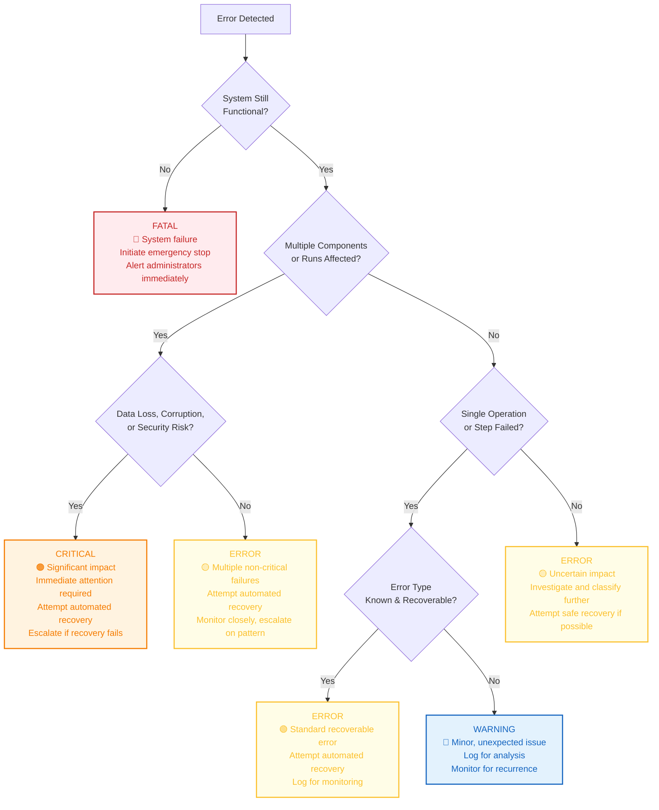

# 📋 Error Classification and Severity Assessment

> **TL;DR**: Systematic decision algorithm for classifying errors by severity and type. Use this to ensure consistent error handling across all tiers.

---

## 🔄 Severity Decision Tree

This flowchart helps determine the severity of a detected error based on its impact on the system and data.

---

## 📊 Severity Levels Defined

| Level | Symbol | Description | Response |
|-------|--------|-------------|----------|
| **FATAL** | 🔴 | Complete system failure or imminent catastrophic risk | Immediate system-wide halt and manual intervention |
| **CRITICAL** | 🟠 | Severe error with significant impact (data loss, security breach, major component failure) | Immediate attention, automated recovery, escalation if needed |
| **ERROR** | 🟡 | Functionality impacted but not critical (single operation failure, multiple minor failures) | Automated recovery as primary response |
| **WARNING** | 🔵 | Minor issue that doesn't immediately impact functionality but could lead to problems | Log for monitoring, alert on patterns |
| **INFO** | ⚪ | Informational messages about normal system operation | Standard logging |

---

## 🎯 Classification Examples

### **🔧 Tool/API Errors**
- **Rate Limit**: 🟡 ERROR → Retry with delay or alternative
- **Authentication Failure**: 🟠 CRITICAL → Security implications
- **Service Unavailable**: 🟡 ERROR → Alternative service or cached results

### **💰 Resource Errors**
- **Credit Exhaustion**: 🟠 CRITICAL → Scope reduction or emergency expansion
- **Memory Overflow**: 🔴 FATAL → System protection required
- **Timeout**: 🟡 ERROR → Retry or alternative approach

### **📡 Communication Errors**
- **Network Timeout**: 🟡 ERROR → Alternative communication path
- **MCP Server Down**: 🟠 CRITICAL → Fallback to direct interface
- **Event Bus Failure**: 🟠 CRITICAL → Local buffering and direct calls

### **🗃️ State Errors**
- **Checkpoint Corruption**: 🟠 CRITICAL → Previous checkpoint or reconstruction
- **Context Loss**: 🟡 ERROR → Rebuild from swarm state
- **Concurrency Conflict**: 🔵 WARNING → Retry with backoff

---

> 💡 **Usage**: This classification algorithm drives recovery strategy selection and escalation procedures. The output severity level determines the appropriate response pattern.

> 📚 **Next Steps**: Use [Recovery Strategy Selection](recovery-strategy-selection.md) to choose the appropriate recovery approach based on the classification. 