# Error Propagation and Recovery Framework

This document is the **single authoritative source** for error classification, recovery strategy selection, and systematic error handling across Vrooli's three-tier execution architecture. All other architectural components reference this framework for error management.

**Prerequisites**: 
- Read [README.md](../communication/README.md) for overall architectural context and navigation.
- Review the [Centralized Type System](../types/core-types.ts) for all error-related interface and type definitions (e.g., `ExecutionError`, `ErrorSeverity`, `RecoveryStrategy`, `ErrorContext`).
- Understand the [Communication Patterns](../communication/communication-patterns.md) to see where error handling integrates with each pattern.

**All error handling types are defined in the centralized type system** at [types/core-types.ts](../types/core-types.ts). This document focuses on error protocols, decision algorithms, and recovery procedures.

```typescript
import type {
    ExecutionError,
    ErrorSeverity,
    ExecutionErrorType,
    RecoveryStrategy,
    ErrorPropagationResult,
    EmergencyStopReason
} from "./types/index.js";
```

## Error Propagation Architecture

The error propagation system coordinates error handling across all three tiers using systematic algorithms and centralized interfaces. **All error classification must use the [Error Classification Decision Tree](decision-trees/error-classification-severity.md#severity-decision-tree) and all recovery selection must use the [Recovery Strategy Selection Algorithm](decision-trees/recovery-strategy-selection.md#recovery-strategy-selection-flowchart).**

```mermaid
graph TB
    subgraph "Error Source Detection"
        T3Error[Tier 3: Execution Error<br/>🔧 Tool execution failures<br/>📊 Resource exhaustion<br/>⚡ Strategy failures]
        T2Error[Tier 2: Process Error<br/>🔄 Routine navigation failures<br/>📊 State management errors<br/>⚖️ Resource conflicts]
        T1Error[Tier 1: Coordination Error<br/>🐝 Swarm coordination failures<br/>👥 Team management errors<br/>🎯 Goal decomposition failures]
        SystemError[System Error<br/>🌐 Infrastructure failures<br/>🔒 Security violations<br/>💾 Data corruption]
    end
    
    subgraph "Error Coordination Framework"
        Coordinator[Error Coordinator<br/>📊 Route to classification<br/>⚡ Apply recovery algorithms<br/>🎯 Coordinate escalation]
        
        ClassificationEngine[Classification Engine<br/>🔍 Apply decision tree<br/>⏰ Assess time sensitivity<br/>📊 Determine severity]
        
        RecoveryCoordinator[Recovery Coordinator<br/>🔄 Execute recovery strategies<br/>📊 Monitor success rates<br/>⚡ Coordinate resources]
        
        EscalationManager[Escalation Manager<br/>⬆️ Cross-tier escalation<br/>📊 Resource coordination<br/>🔄 Strategy adaptation]
    end
    
    subgraph "Recovery Execution"
        LocalRecovery[Local Recovery<br/>🔧 Component-level recovery<br/>⚡ Immediate fixes<br/>📊 Success validation]
        
        TierEscalation[Tier Escalation<br/>⬆️ Cross-tier escalation<br/>📊 Resource coordination<br/>🔄 Strategy adaptation]
        
        SystemRecovery[System Recovery<br/>🌐 System-wide recovery<br/>🛑 Emergency procedures<br/>📊 Damage assessment]
        
        HumanEscalation[Human Escalation<br/>👤 Manual intervention<br/>📧 Alert notifications<br/>📊 Decision support]
    end
    
    %% Error coordination flow
    T3Error --> Coordinator
    T2Error --> Coordinator  
    T1Error --> Coordinator
    SystemError --> Coordinator
    
    Coordinator --> ClassificationEngine
    ClassificationEngine --> RecoveryCoordinator
    RecoveryCoordinator --> EscalationManager
    
    EscalationManager --> LocalRecovery
    LocalRecovery -->|Failure| TierEscalation
    TierEscalation -->|Failure| SystemRecovery
    SystemRecovery -->|Failure| HumanEscalation
    
    %% Direct escalation for critical errors
    ClassificationEngine -.->|Critical Errors| SystemRecovery
    ClassificationEngine -.->|Fatal Errors| HumanEscalation
    
    classDef error fill:#ffebee,stroke:#c62828,stroke-width:2px
    classDef coordination fill:#fff3e0,stroke:#f57c00,stroke-width:2px
    classDef recovery fill:#e8f5e8,stroke:#2e7d32,stroke-width:2px
    
    class T3Error,T2Error,T1Error,SystemError error
    class Coordinator,ClassificationEngine,RecoveryCoordinator,EscalationManager coordination
    class LocalRecovery,TierEscalation,SystemRecovery,HumanEscalation recovery
```



### **Error Coordination Process**

The error coordination system follows this systematic process:

1. **Error Detection**: Component detects error condition
2. **Error Classification**: Apply [Error Classification Decision Tree](decision-trees/error-classification-severity.md#severity-decision-tree)
3. **Recovery Selection**: Use [Recovery Strategy Selection Algorithm](decision-trees/recovery-strategy-selection.md#recovery-strategy-selection-flowchart)
4. **Recovery Execution**: Execute selected recovery strategy with monitoring
5. **Escalation Decision**: Apply escalation rules based on recovery success

**Integration Validation**: Use [Integration Map Error Handling Integration](integration-map.md#error-handling-integration) for comprehensive validation of the error coordination system.

## Tier-Specific Error Interfaces

### **Error Propagation Flow Between Tiers**


**Error Interface Integration**: All error propagation uses [Error Propagation Interfaces](types/core-types.ts) from the centralized type system for consistency across tiers.

## Recovery Strategy Coordination Framework

### **Coordinated Recovery Strategy Execution**

The recovery coordination system manages recovery strategies across all tiers and components. **All recovery strategy selection must use the [Recovery Strategy Selection Algorithm](decision-trees/recovery-strategy-selection.md#recovery-strategy-selection-flowchart) to ensure consistent and optimal recovery approaches.**

```mermaid
graph LR
    subgraph "Recovery Strategy Coordination"
        StrategySelector[Strategy Selector<br/>🔄 Apply selection algorithm<br/>📊 Evaluate success probability<br/>⚡ Consider resource availability]
        
        RecoveryExecutor[Recovery Executor<br/>⚡ Execute selected strategy<br/>📊 Monitor progress<br/>🔄 Adapt as needed]
        
        ResourceCoordinator[Resource Coordinator<br/>💰 Allocate recovery resources<br/>📊 Prevent conflicts<br/>⚖️ Balance priorities]
        
        SuccessMonitor[Success Monitor<br/>📊 Track recovery progress<br/>✅ Validate success criteria<br/>⚡ Trigger escalation]
    end
    
    subgraph "Recovery Strategy Types"
        Immediate[Immediate Recovery<br/>⚡ Instant fixes<br/>🔄 Retry mechanisms<br/>📊 Local resources only]
        
        Graceful[Graceful Recovery<br/>⏰ Planned recovery<br/>🔄 State preservation<br/>📊 Resource coordination]
        
        Compensation[Compensation Recovery<br/>🔄 Rollback operations<br/>📊 Data consistency<br/>⚖️ Transaction reversal]
        
        Escalation[Escalation Recovery<br/>⬆️ Higher tier involvement<br/>👤 Human intervention<br/>🌐 System-wide coordination]
    end
    
    %% Strategy coordination flow
    StrategySelector --> RecoveryExecutor
    RecoveryExecutor --> ResourceCoordinator
    ResourceCoordinator --> SuccessMonitor
    
    %% Strategy execution
    StrategySelector --> Immediate
    StrategySelector --> Graceful
    StrategySelector --> Compensation
    StrategySelector --> Escalation
    
    %% Success feedback
    SuccessMonitor -.->|Success| Complete[Recovery Complete]
    SuccessMonitor -.->|Failure| StrategySelector
    
    classDef coordination fill:#fff3e0,stroke:#f57c00,stroke-width:2px
    classDef strategy fill:#e8f5e8,stroke:#2e7d32,stroke-width:2px
    classDef outcome fill:#e3f2fd,stroke:#1565c0,stroke-width:2px
    
    class StrategySelector,RecoveryExecutor,ResourceCoordinator,SuccessMonitor coordination
    class Immediate,Graceful,Compensation,Escalation strategy
    class Complete outcome
```



**Strategy Coordination Integration**: Recovery strategy coordination integrates with [Resource Coordination Emergency Protocols](resource-coordination.md#emergency-protocols) and [Circuit Breaker Integration](implementation/circuit-breakers.md#circuit-breaker-protocol-and-integration), detailed in their respective documents.

## Emergency Stop Protocols

### **System-Wide Emergency Stop Coordination**

The emergency stop protocol provides immediate system protection for critical failures. **All emergency procedures must use the [Emergency Stop Interfaces](types/core-types.ts) for consistent emergency response.**


**Emergency Integration**: Emergency procedures use [Emergency Interfaces](types/core-types.ts) from the centralized type system and coordinate with [Resource Emergency Protocols](resource-coordination.md#emergency-protocols) and the overall system state management described in [State Synchronization](state-synchronization.md).

## Error Handling Across Communication Patterns

Different communication patterns have specialized error handling approaches, all integrated with this central framework:

### **Tool Routing Communication**

**Error Context**: Tool routing errors are classified using the [Error Classification Decision Tree](error-classification-severity.md), ranging from MINOR tool validation failures to CRITICAL infrastructure outages.

**Recovery Strategy**: Recovery strategy selection follows the [Recovery Strategy Selection Algorithm](recovery-strategy-selection.md), with common strategies including:
- Retry with exponential backoff for MINOR errors
- Fallback to alternative tool implementations for ERROR level
- Circuit breaker activation for MAJOR errors affecting multiple tools
- Emergency stop for CRITICAL infrastructure failures

**MCP Integration**: Error handling in MCP tool communication is detailed in [MCP Integration](../communication/implementation/mcp-integration.md#error-handling-and-validation).

### **Direct Service Interface**

**Error Context**: Direct service errors involve database failures, service unavailability, or integration issues, classified by severity and scope of impact.

**Recovery Strategy**: Recovery strategies include automatic retries, service degradation modes, fallback to cached data, and coordinated service restarts.

### **Event-Driven Messaging**

**Error Context**: Event-driven errors include message delivery failures, consumer processing errors, and event ordering violations.

**Recovery Strategy**: Recovery strategies include dead letter queues, replay mechanisms, consumer restart, and event store reconciliation.

**Event Bus Integration**: Event bus error handling is detailed in [Event Bus Protocol](../event-driven/event-bus-protocol.md#event-handling-error-management).

### **State Synchronization**

**Error Context**: State synchronization errors include cache corruption, database inconsistencies, and transaction failures.

**Recovery Strategy**: Recovery strategies include cache invalidation, database repair, transaction rollback, and consistent state reconstruction.

**State Sync Integration**: State synchronization error handling is detailed in [State Synchronization](../context-memory/state-synchronization.md#error-handling-for-state-and-cache-issues).

## Related Documentation

- **[README.md](../communication/README.md)** - Overall navigation for the communication architecture
- **[Types System](../types/core-types.ts)** - Complete error handling type definitions
- **[Error Classification Decision Tree](error-classification-severity.md)** - Systematic error classification algorithm
- **[Recovery Strategy Selection](recovery-strategy-selection.md)** - Algorithm for selecting recovery strategies
- **[Circuit Breakers](circuit-breakers.md)** - Circuit breaker integration with error handling
- **[Failure Scenarios](failure-scenarios/README.md)** - Specific failure scenario documentation
- **[Communication Patterns](../communication/communication-patterns.md)** - Error handling within each communication pattern
- **[Integration Map](../communication/integration-map.md)** - End-to-end error handling validation
- **[Performance Characteristics](../monitoring/performance-characteristics.md)** - Performance impact of error handling
- **[Resource Management](../resource-management/resource-coordination.md)** - Resource coordination during error recovery
- **[Security Boundaries](../security/security-boundaries.md)** - Security enforcement during error situations
- **[State Synchronization](../context-memory/state-synchronization.md)** - State consistency during error recovery
- **[Event Bus Protocol](../event-driven/event-bus-protocol.md)** - Event-driven error coordination

This document provides the comprehensive framework for systematic error handling across the entire Vrooli execution architecture, ensuring reliable operation through centralized error management and coordinated recovery procedures. 