# 🚨 Error Scenarios & Patterns: Comprehensive Implementation Examples

> **TL;DR**: This guide provides concrete examples of error scenarios in Vrooli's execution architecture, organized by execution tier. It shows how errors are detected, propagated, and recovered with detailed TypeScript implementations. Use this as a practical reference for understanding error patterns and building resilient code.

---

## 🧭 Navigation Guide

**📍 You're in the right place if you want:**
- **Detailed code examples** organized by execution tier (T1/T2/T3)
- **TypeScript implementations** of error handling patterns
- **Step-by-step error flow** explanations with code

**🔀 Use [Failure Scenarios](failure-scenarios/README.md) instead if you need:**
- **Infrastructure-specific failures** (communication outages, database failures)
- **System-level recovery procedures** for specific failure types
- **Operational troubleshooting** for infrastructure issues

**🚨 Need immediate help?** Start with **[Troubleshooting Guide](troubleshooting-guide.md)** for quick fixes.

---

## 📚 Table of Contents

- [🔍 Error Classification Overview](#-error-classification-overview)
- [⚡ Tier 3: Execution Level Errors](#-tier-3-execution-level-errors)
- [⚙️ Tier 2: Routine Level Errors](#️-tier-2-routine-level-errors)
- [🧠 Tier 1: Coordination Level Errors](#-tier-1-coordination-level-errors)
- [🔄 Cross-Tier Error Propagation](#-cross-tier-error-propagation)
- [🛠️ Recovery Patterns in Action](#️-recovery-patterns-in-action)
- [🎯 Error Prevention Strategies](#-error-prevention-strategies)

---

## 🔍 Error Classification Overview

Vrooli's execution architecture handles errors through a layered approach, where each tier has specific responsibilities for detection, handling, and recovery:

```mermaid
graph TB
    subgraph "🚨 Error Types by Severity"
        Critical[🔴 CRITICAL<br/>System integrity threats<br/>Immediate emergency stop<br/>Cross-tier coordination required]
        High[🟠 HIGH<br/>Mission-critical failures<br/>Automatic recovery attempts<br/>Escalation if failed]
        Medium[🟡 MEDIUM<br/>Recoverable issues<br/>Retry with fallback<br/>Continue with degraded service]
        Low[🟢 LOW<br/>Expected variations<br/>Log and continue<br/>Self-healing behavior]
    end
    
    subgraph "🎯 Error Sources by Tier"
        T3_Errors[Tier 3 Errors<br/>🔧 Tool failures<br/>💰 Resource limits<br/>🔒 Permission denials<br/>⏱️ Timeouts]
        
        T2_Errors[Tier 2 Errors<br/>🔄 Routine failures<br/>📊 State corruption<br/>🧭 Navigator issues<br/>⚡ Branch deadlocks]
        
        T1_Errors[Tier 1 Errors<br/>🎯 Goal conflicts<br/>👥 Team formation failures<br/>🤖 Agent unavailability<br/>📋 Resource exhaustion]
    end
    
    subgraph "🔄 Recovery Strategies"
        Immediate[Immediate Recovery<br/>🔄 Retry with backoff<br/>🔧 Tool substitution<br/>⚡ Partial execution]
        
        Fallback[Fallback Recovery<br/>📋 Alternative routines<br/>🤖 Agent replacement<br/>🧭 Navigator switching]
        
        Escalation[Human Escalation<br/>👤 Manual intervention<br/>📞 Alert notifications<br/>🛑 Controlled shutdown]
    end
    
    Critical --> Escalation
    High --> Fallback
    Medium --> Immediate
    Low --> Immediate
    
    T3_Errors --> Immediate
    T2_Errors --> Fallback
    T1_Errors --> Escalation
    
    classDef critical fill:#ffebee,stroke:#c62828,stroke-width:3px
    classDef high fill:#fff3e0,stroke:#f57c00,stroke-width:2px
    classDef medium fill:#fff9c4,stroke:#f57f17,stroke-width:2px
    classDef low fill:#e8f5e8,stroke:#2e7d32,stroke-width:2px
    classDef tier fill:#e3f2fd,stroke:#1565c0,stroke-width:2px
    classDef recovery fill:#f3e5f5,stroke:#7b1fa2,stroke-width:2px
    
    class Critical critical
    class High high
    class Medium medium
    class Low low
    class T3_Errors,T2_Errors,T1_Errors tier
    class Immediate,Fallback,Escalation recovery
```



---

## ⚡ Tier 3: Execution Level Errors

### **Scenario 1: API Rate Limit Exceeded**

**Context**: A financial analysis routine hits rate limits on a premium data API during market research.

```typescript
// Error detection and immediate handling
class UnifiedExecutor {
  async executeStep(stepRequest: StepExecutionRequest): Promise<StepExecutionResult> {
    try {
      const result = await this.toolOrchestrator.executeTool({
        toolName: "premium_market_data",
        parameters: {
          symbols: ["AAPL", "MSFT", "GOOGL", "AMZN"],
          timeframe: "1Y",
          include_fundamentals: true
        }
      });
      
      return result;
    } catch (error) {
      if (error instanceof RateLimitError) {
        // Immediate recovery strategy
        return await this.handleRateLimitError(error, stepRequest);
      }
      throw error; // Escalate to Tier 2
    }
  }
  
  private async handleRateLimitError(
    error: RateLimitError,
    stepRequest: StepExecutionRequest
  ): Promise<StepExecutionResult> {
    
    // 1. Log the rate limit hit
    await this.eventBus.publish({
      eventType: "tool/rate_limited",
      payload: {
        toolName: error.toolName,
        limitType: "requests_per_minute",
        resetTime: error.resetAt,
        backoffStrategy: "exponential",
        stepId: stepRequest.stepId,
        runId: stepRequest.runId
      }
    });
    
    // 2. Check if we can wait for reset
    const resetWaitTime = error.resetAt - Date.now();
    const maxWaitTime = stepRequest.timeoutMs * 0.5; // Use half remaining time
    
    if (resetWaitTime <= maxWaitTime) {
      // Strategy A: Wait and retry
      await this.delay(resetWaitTime + 1000); // Add 1s buffer
      
      try {
        return await this.toolOrchestrator.executeTool(stepRequest.toolCall);
      } catch (retryError) {
        // Still failed after wait - try alternative
        return await this.tryAlternativeDataSource(stepRequest);
      }
    } else {
      // Strategy B: Immediate alternative
      return await this.tryAlternativeDataSource(stepRequest);
    }
  }
  
  private async tryAlternativeDataSource(
    stepRequest: StepExecutionRequest
  ): Promise<StepExecutionResult> {
    
    // Try free/backup data sources
    const alternatives = [
      { toolName: "yahoo_finance", cost: 5, quality: 0.85 },
      { toolName: "alpha_vantage", cost: 8, quality: 0.90 },
      { toolName: "iex_cloud", cost: 3, quality: 0.80 }
    ];
    
    for (const alt of alternatives) {
      try {
        const result = await this.toolOrchestrator.executeTool({
          toolName: alt.toolName,
          parameters: stepRequest.toolCall.parameters
        });
        
        // Emit degraded quality warning
        await this.eventBus.publish({
          eventType: "execution/quality_degraded",
          payload: {
            originalTool: stepRequest.toolCall.toolName,
            fallbackTool: alt.toolName,
            qualityReduction: 1.0 - alt.quality,
            stepId: stepRequest.stepId
          }
        });
        
        return {
          ...result,
          qualityScore: alt.quality,
          notes: `Fallback from ${stepRequest.toolCall.toolName} due to rate limits`
        };
      } catch (altError) {
        // Continue to next alternative
        continue;
      }
    }
    
    // All alternatives failed - escalate to Tier 2
    throw new ToolExecutionError({
      message: "All data sources failed or rate limited",
      originalError: error,
      attemptedAlternatives: alternatives.map(a => a.toolName),
      stepId: stepRequest.stepId,
      recoverable: false
    });
  }
}
```

**Error Flow:**
```mermaid
sequenceDiagram
    participant T3 as UnifiedExecutor
    participant Tool as Premium API
    participant EB as Event Bus
    participant Alt as Alternative APIs
    participant T2 as RunStateMachine
    
    T3->>Tool: premium_market_data call
    Tool-->>T3: RateLimitError (reset in 15min)
    T3->>EB: tool/rate_limited event
    
    T3->>T3: Evaluate wait time (15min > 5min limit)
    T3->>Alt: Try yahoo_finance
    Alt-->>T3: Success (degraded quality)
    T3->>EB: execution/quality_degraded event
    T3-->>T2: StepResult (with quality warning)
```

### **Scenario 2: Resource Limit Exceeded**

**Context**: A routine hits its credit limit midway through execution.

```typescript
class ResourceManager {
  async checkAndReserveResources(
    stepRequest: StepExecutionRequest,
    estimatedCost: number
  ): Promise<ResourceReservation> {
    
    const swarmConfig = await this.chatStore.loadConfig(stepRequest.conversationId);
    const limits = swarmConfig.limits || ChatConfig.defaultLimits();
    const currentUsage = swarmConfig.stats;
    
    // Check if this step would exceed limits
    const projectedCredits = BigInt(currentUsage.totalCredits) + BigInt(estimatedCost);
    const maxCredits = BigInt(limits.maxCredits);
    
    if (projectedCredits > maxCredits) {
      // Emit resource exhaustion event
      await this.eventBus.publish({
        eventType: "swarm/resource/exhausted",
        payload: {
          swarmId: stepRequest.conversationId,
          resourceType: "credits",
          limit: limits.maxCredits,
          used: currentUsage.totalCredits,
          requested: estimatedCost.toString(),
          shortfall: (projectedCredits - maxCredits).toString(),
          stepId: stepRequest.stepId,
          urgency: this.calculateUrgency(stepRequest)
        }
      });
      
      // Check for emergency expansion approval
      const expansionResult = await this.requestEmergencyExpansion({
        swarmId: stepRequest.conversationId,
        requestedAmount: estimatedCost,
        justification: this.generateJustification(stepRequest),
        timeoutMs: 30000 // 30 second emergency decision window
      });
      
      if (expansionResult.approved) {
        // Update limits and proceed
        await this.updateSwarmLimits(stepRequest.conversationId, expansionResult.newLimits);
        return this.reserveResources(stepRequest.stepId, estimatedCost);
      } else {
        // Resource expansion denied - explore alternatives
        throw new ResourceLimitExceededError({
          resourceType: "credits",
          limit: limits.maxCredits,
          requested: estimatedCost,
          alternatives: await this.suggestCostReductionAlternatives(stepRequest)
        });
      }
    }
    
    return this.reserveResources(stepRequest.stepId, estimatedCost);
  }
  
  private async suggestCostReductionAlternatives(
    stepRequest: StepExecutionRequest
  ): Promise<CostAlternative[]> {
    
    const alternatives: CostAlternative[] = [];
    
    // Alternative 1: Cached/approximate result
    const cachedResult = await this.lookupCachedResult(stepRequest);
    if (cachedResult) {
      alternatives.push({
        type: "cached_result",
        description: "Use cached result from similar recent execution",
        costReduction: estimatedCost * 0.95, // 95% savings
        qualityImpact: -0.1, // 10% quality reduction
        timeImpact: -5000 // 5 seconds faster
      });
    }
    
    // Alternative 2: Reduced scope
    if (stepRequest.toolCall.parameters.include_premium_features) {
      alternatives.push({
        type: "reduced_scope",
        description: "Exclude premium features to reduce cost",
        costReduction: estimatedCost * 0.6, // 60% savings
        qualityImpact: -0.25, // 25% quality reduction
        timeImpact: 0
      });
    }
    
    // Alternative 3: Delayed execution
    alternatives.push({
      type: "delayed_execution",
      description: "Schedule for next billing cycle when limits reset",
      costReduction: 0, // Same cost, different timing
      qualityImpact: 0,
      timeImpact: this.getTimeUntilLimitReset() // Time delay
    });
    
    return alternatives;
  }
}
```

---

## ⚙️ Tier 2: Routine Level Errors

### **Scenario 3: State Corruption During Checkpoint Recovery**

**Context**: A long-running routine crashes and attempts to recover from a checkpoint, but the saved state is corrupted.

```typescript
class RunStateMachine {
  async recoverFromCheckpoint(
    runId: string,
    checkpointId: string
  ): Promise<RunContext> {
    
    try {
      // Load checkpoint data
      const checkpoint = await this.stateStore.loadCheckpoint(runId, checkpointId);
      
      // Validate checkpoint integrity
      const validation = await this.validateCheckpointIntegrity(checkpoint);
      
      if (!validation.isValid) {
        // State corruption detected
        await this.eventBus.publish({
          eventType: "routine/state/corrupted",
          payload: {
            runId,
            checkpointId,
            corruptionType: validation.errors,
            severity: "high",
            recoverable: validation.partiallyRecoverable
          }
        });
        
        if (validation.partiallyRecoverable) {
          return await this.attemptPartialRecovery(checkpoint, validation);
        } else {
          throw new StateCorruptionError({
            runId,
            checkpointId,
            errors: validation.errors,
            recoverable: false
          });
        }
      }
      
      // Checkpoint valid - restore state
      return await this.restoreFromValidCheckpoint(checkpoint);
      
    } catch (error) {
      if (error instanceof StateCorruptionError) {
        return await this.handleStateCorruption(runId, error);
      }
      throw error; // Escalate to Tier 1
    }
  }
  
  private async handleStateCorruption(
    runId: string,
    error: StateCorruptionError
  ): Promise<RunContext> {
    
    // Strategy 1: Try previous checkpoint
    const previousCheckpoints = await this.stateStore.listCheckpoints(runId);
    const sortedCheckpoints = previousCheckpoints.sort((a, b) => 
      new Date(b.timestamp).getTime() - new Date(a.timestamp).getTime()
    );
    
    for (const checkpoint of sortedCheckpoints) {
      if (checkpoint.id === error.checkpointId) continue; // Skip corrupted one
      
      try {
        const validation = await this.validateCheckpointIntegrity(checkpoint);
        if (validation.isValid) {
          // Found valid earlier checkpoint
          await this.eventBus.publish({
            eventType: "routine/state/recovered",
            payload: {
              runId,
              corruptedCheckpointId: error.checkpointId,
              recoveredFromCheckpointId: checkpoint.id,
              dataLoss: this.calculateDataLoss(checkpoint, error.checkpointId)
            }
          });
          
          return await this.restoreFromValidCheckpoint(checkpoint);
        }
      } catch (validationError) {
        continue; // Try next checkpoint
      }
    }
    
    // Strategy 2: Reconstruct from execution history
    try {
      return await this.reconstructFromExecutionHistory(runId);
    } catch (reconstructionError) {
      // All recovery attempts failed - escalate to Tier 1 for decision
      throw new UnrecoverableStateError({
        runId,
        originalError: error,
        attemptedRecoveries: [
          "previous_checkpoints",
          "execution_history_reconstruction"
        ],
        recommendedAction: "restart_from_beginning"
      });
    }
  }
  
  private async reconstructFromExecutionHistory(runId: string): Promise<RunContext> {
    // Attempt to rebuild state from execution events
    const executionEvents = await this.eventStore.getEvents({
      filter: { runId },
      eventTypes: [
        "routine/started",
        "step/completed", 
        "routine/context/updated",
        "routine/branch/created"
      ],
      orderBy: "timestamp"
    });
    
    let reconstructedContext = this.createEmptyRunContext(runId);
    
    for (const event of executionEvents) {
      switch (event.eventType) {
        case "routine/started":
          reconstructedContext = this.applyStartEvent(reconstructedContext, event);
          break;
        case "step/completed":
          reconstructedContext = this.applyStepCompletionEvent(reconstructedContext, event);
          break;
        case "routine/context/updated":
          reconstructedContext = this.applyContextUpdateEvent(reconstructedContext, event);
          break;
        // ... other event types
      }
    }
    
    // Validate reconstructed state
    if (this.isContextViable(reconstructedContext)) {
      await this.eventBus.publish({
        eventType: "routine/state/reconstructed",
        payload: {
          runId,
          method: "execution_history",
          eventsProcessed: executionEvents.length,
          confidence: this.calculateReconstructionConfidence(reconstructedContext)
        }
      });
      
      return reconstructedContext;
    } else {
      throw new ReconstructionFailedError({
        runId,
        eventsProcessed: executionEvents.length,
        reason: "reconstructed_state_not_viable"
      });
    }
  }
}
```

### **Scenario 4: Navigator Execution Failure**

**Context**: A BPMN workflow navigator encounters an unsupported workflow pattern.

```typescript
class BpmnNavigator {
  async executeWorkflow(
    bpmnDefinition: BpmnDefinition,
    runContext: RunContext
  ): Promise<RoutineExecutionResult> {
    
    try {
      // Validate BPMN definition
      const validation = await this.validateBpmnDefinition(bpmnDefinition);
      if (!validation.isSupported) {
        throw new UnsupportedWorkflowError({
          navigatorType: "BPMN",
          unsupportedFeatures: validation.unsupportedFeatures,
          bpmnVersion: bpmnDefinition.version,
          fallbackAvailable: true
        });
      }
      
      // Proceed with execution
      return await this.executeBpmnProcess(bpmnDefinition, runContext);
      
    } catch (error) {
      if (error instanceof UnsupportedWorkflowError) {
        return await this.handleUnsupportedWorkflow(error, runContext);
      }
      throw error; // Let Tier 2 handle other errors
    }
  }
  
  private async handleUnsupportedWorkflow(
    error: UnsupportedWorkflowError,
    runContext: RunContext
  ): Promise<RoutineExecutionResult> {
    
    // Emit navigation failure event
    await this.eventBus.publish({
      eventType: "routine/navigator/failed",
      payload: {
        runId: runContext.runId,
        navigatorType: "BPMN",
        failureReason: "unsupported_features",
        unsupportedFeatures: error.unsupportedFeatures,
        fallbackRequired: true
      }
    });
    
    // Strategy 1: Try simplified BPMN conversion
    try {
      const simplifiedBpmn = await this.convertToSupportedBpmn(
        error.originalDefinition,
        error.unsupportedFeatures
      );
      
      if (simplifiedBpmn) {
        await this.eventBus.publish({
          eventType: "routine/navigator/fallback",
          payload: {
            runId: runContext.runId,
            originalNavigator: "BPMN",
            fallbackStrategy: "simplified_bpmn",
            featureChanges: simplifiedBpmn.changes
          }
        });
        
        return await this.executeBpmnProcess(simplifiedBpmn.definition, runContext);
      }
    } catch (conversionError) {
      // Simplified conversion failed, try next strategy
    }
    
    // Strategy 2: Convert to Native Navigator
    try {
      const nativeWorkflow = await this.convertBpmnToNative(error.originalDefinition);
      
      await this.eventBus.publish({
        eventType: "routine/navigator/fallback",
        payload: {
          runId: runContext.runId,
          originalNavigator: "BPMN",
          fallbackStrategy: "native_conversion",
          qualityImpact: -0.1 // Some BPMN features lost in conversion
        }
      });
      
      // Switch to Native Navigator
      const nativeNavigator = new CustomNavigator();
      return await nativeNavigator.executeWorkflow(nativeWorkflow, runContext);
      
    } catch (nativeConversionError) {
      // Both fallback strategies failed
      throw new NavigatorFailureError({
        runId: runContext.runId,
        originalNavigator: "BPMN",
        attemptedFallbacks: ["simplified_bpmn", "native_conversion"],
        recommendation: "manual_workflow_redesign",
        unsupportedFeatures: error.unsupportedFeatures
      });
    }
  }
}
```

---

## 🧠 Tier 1: Coordination Level Errors

### **Scenario 5: Team Formation Failure**

**Context**: A swarm cannot find suitable agents for a specialized task requiring rare capabilities.

```typescript
class SwarmStateMachine {
  async handleMessage(message: ChatMessage): Promise<void> {
    try {
      // Process user request for specialized financial modeling
      const taskAnalysis = await this.analyzeTask(message.content);
      
      if (taskAnalysis.requiresSpecializedTeam) {
        const team = await this.formSpecializedTeam(taskAnalysis.requiredCapabilities);
        // ... continue with execution
      }
      
    } catch (error) {
      if (error instanceof TeamFormationError) {
        await this.handleTeamFormationFailure(error, message);
      } else {
        throw error; // Other errors bubble up to conversation error handling
      }
    }
  }
  
  private async handleTeamFormationFailure(
    error: TeamFormationError,
    originalMessage: ChatMessage
  ): Promise<void> {
    
    // Emit team formation failure event
    await this.eventBus.publish({
      eventType: "swarm/team/formation_failed",
      payload: {
        swarmId: this.conversationId,
        requiredCapabilities: error.requiredCapabilities,
        availableAgents: error.availableAgents,
        missingCapabilities: error.missingCapabilities,
        severity: "high"
      }
    });
    
    // Strategy 1: Try relaxed requirements
    const relaxedCapabilities = await this.relaxRequirements(error.requiredCapabilities);
    try {
      const partialTeam = await this.formTeam(relaxedCapabilities);
      
      await this.respondToUser({
        content: `I've formed a team with available expertise, though we're missing some specialized capabilities in ${error.missingCapabilities.join(", ")}. I'll do my best with the available resources and recommend bringing in external experts for the missing areas.`,
        warning: {
          type: "degraded_capabilities",
          missingExpertise: error.missingCapabilities,
          qualityImpact: "moderate"
        }
      });
      
      // Continue with partial team
      await this.executeWithPartialTeam(partialTeam, originalMessage);
      
    } catch (partialFormationError) {
      // Strategy 2: Request external recruitment
      await this.requestExternalRecruitment(error);
    }
  }
  
  private async requestExternalRecruitment(error: TeamFormationError): Promise<void> {
    // Check if user has permissions and budget for external recruitment
    const recruitmentOptions = await this.getRecruitmentOptions(error.missingCapabilities);
    
    if (recruitmentOptions.length === 0) {
      // No recruitment options available - escalate to user
      await this.respondToUser({
        content: `I'm unable to form a suitable team for this task. The following specialized capabilities are required but not available: ${error.missingCapabilities.join(", ")}. 
        
**Options:**
1. **Modify the request** to work with available capabilities
2. **Contact your administrator** to add agents with these specializations
3. **Break down the task** into smaller parts that can be handled separately

How would you like to proceed?`,
        errorType: "team_formation_failed",
        suggestedActions: [
          "modify_request",
          "contact_admin", 
          "break_down_task"
        ]
      });
      
      // Set swarm to waiting state
      await this.updateSwarmState({
        status: "waiting_for_user_input",
        blockingIssue: "missing_required_capabilities",
        requiredCapabilities: error.missingCapabilities
      });
      
    } else {
      // Present recruitment options to user
      await this.presentRecruitmentOptions(recruitmentOptions);
    }
  }
  
  private async presentRecruitmentOptions(
    options: RecruitmentOption[]
  ): Promise<void> {
    
    const optionsList = options.map((opt, idx) => 
      `${idx + 1}. **${opt.agentType}** - ${opt.description} (Cost: ${opt.cost} credits/hour, Available: ${opt.availabilityTime})`
    ).join("\n");
    
    await this.respondToUser({
      content: `I found some external specialists who could help with this task:

${optionsList}

Would you like me to recruit any of these specialists? Note that external agents will consume additional credits and may require approval for sensitive operations.`,
      actionRequired: true,
      options: options.map(opt => ({
        action: "recruit_agent",
        agentId: opt.agentId,
        label: `Recruit ${opt.agentType}`,
        cost: opt.cost
      }))
    });
  }
  
  private async executeWithPartialTeam(
    partialTeam: TeamConfiguration,
    originalMessage: ChatMessage
  ): Promise<void> {
    
    // Update swarm configuration with partial team
    await this.updateSwarmSharedState({
      teamId: partialTeam.teamId,
      swarmLeader: partialTeam.leaderId,
      
      // Document capability gaps
      capabilityGaps: partialTeam.missingCapabilities,
      
      // Adjust goal to be achievable with available team
      goal: await this.adjustGoalForCapabilities(originalMessage.content, partialTeam),
      
      // Set appropriate quality expectations
      qualityExpectations: {
        target: 0.8, // Reduced from default 0.9 due to missing capabilities
        reasons: ["missing_specialized_capabilities"],
        mitigation: "external_expert_recommendations"
      }
    });
    
    // Proceed with adapted execution
    await this.beginTaskExecution(originalMessage);
  }
}
```

### **Scenario 6: Goal Conflict Resolution**

**Context**: User changes the goal midway through execution, creating conflicts with current work.

```typescript
class GoalConflictResolver {
  async handleGoalUpdate(
    newGoal: string,
    currentSwarmState: ChatConfigObject
  ): Promise<void> {
    
    // Analyze goal compatibility
    const conflictAnalysis = await this.analyzeGoalConflict(
      currentSwarmState.goal,
      newGoal,
      currentSwarmState.subtasks
    );
    
    if (conflictAnalysis.hasConflicts) {
      await this.eventBus.publish({
        eventType: "swarm/goal/conflict_detected",
        payload: {
          swarmId: this.conversationId,
          originalGoal: currentSwarmState.goal,
          newGoal,
          conflicts: conflictAnalysis.conflicts,
          inProgressWork: conflictAnalysis.affectedSubtasks,
          severity: conflictAnalysis.severity
        }
      });
      
      await this.resolveGoalConflict(conflictAnalysis, newGoal, currentSwarmState);
    } else {
      // No conflicts - proceed with goal update
      await this.updateGoalSafely(newGoal, currentSwarmState);
    }
  }
  
  private async resolveGoalConflict(
    analysis: GoalConflictAnalysis,
    newGoal: string,
    currentState: ChatConfigObject
  ): Promise<void> {
    
    switch (analysis.severity) {
      case "low":
        // Minor conflicts - automatic resolution
        await this.handleMinorGoalConflict(analysis, newGoal, currentState);
        break;
        
      case "medium":
        // Moderate conflicts - present options to user
        await this.presentConflictResolutionOptions(analysis, newGoal, currentState);
        break;
        
      case "high":
        // Major conflicts - require explicit user decision
        await this.requireExplicitConflictResolution(analysis, newGoal, currentState);
        break;
        
      case "critical":
        // Critical conflicts - emergency stop and full replanning
        await this.handleCriticalGoalConflict(analysis, newGoal, currentState);
        break;
    }
  }
  
  private async handleCriticalGoalConflict(
    analysis: GoalConflictAnalysis,
    newGoal: string,
    currentState: ChatConfigObject
  ): Promise<void> {
    
    // Emergency stop all current work
    await this.emergencyStopAllWork(currentState);
    
    // Calculate work loss
    const workLoss = this.calculateWorkLoss(currentState.subtasks, currentState.stats);
    
    await this.respondToUser({
      content: `⚠️ **Critical Goal Conflict Detected**

Your new goal conflicts significantly with the current work in progress. Continuing would require stopping all current tasks and starting over.

**Current Goal:** ${currentState.goal}
**New Goal:** ${newGoal}

**Impact of Change:**
- **Work Lost:** ${workLoss.completedSubtasks} completed tasks, ${workLoss.creditsSpent} credits spent
- **Resources Created:** ${currentState.resources.length} resources that may no longer be relevant
- **Time Investment:** ${this.formatDuration(workLoss.timeSpent)} of work

**Conflicts:**
${analysis.conflicts.map(c => `• ${c.description} (Impact: ${c.impact})`).join("\n")}

**Options:**
1. **Proceed with new goal** - Stop current work and start fresh (loses current progress)
2. **Refine the new goal** - Adjust to minimize conflict with current work  
3. **Complete current goal first** - Finish current work, then address new goal
4. **Create separate swarm** - Keep current swarm running, start new one for new goal

How would you like to proceed?`,
      severity: "critical",
      actionRequired: true,
      options: [
        { action: "proceed_new_goal", label: "Start fresh with new goal", destructive: true },
        { action: "refine_goal", label: "Refine the new goal" },
        { action: "complete_current", label: "Finish current work first" },
        { action: "spawn_separate", label: "Create separate swarm" }
      ]
    });
    
    // Set swarm to conflict resolution state
    await this.updateSwarmSharedState({
      status: "conflict_resolution",
      conflictType: "critical_goal_conflict",
      originalGoal: currentState.goal,
      proposedGoal: newGoal,
      awaitingUserDecision: true
    });
  }
}
```

---

## 🔄 Cross-Tier Error Propagation

### **Error Escalation Example: Complete Flow**

Let's trace a complex error that propagates through all three tiers:


### **Recovery Coordination Example**

```typescript
class CrossTierRecoveryCoordinator {
  async handleCascadingFailure(
    failure: CascadingFailure
  ): Promise<RecoveryPlan> {
    
    // Analyze failure propagation
    const impactAnalysis = await this.analyzeFailureImpact(failure);
    
    // Generate tier-specific recovery strategies
    const recoveryStrategies = {
      tier3: await this.generateTier3Recovery(failure.tier3Errors),
      tier2: await this.generateTier2Recovery(failure.tier2Errors, impactAnalysis),
      tier1: await this.generateTier1Recovery(failure.tier1Errors, impactAnalysis)
    };
    
    // Coordinate recovery across tiers
    const coordinatedPlan = await this.coordinateRecovery(
      recoveryStrategies,
      impactAnalysis.dependencies
    );
    
    // Execute recovery with rollback capability
    return await this.executeCoordinatedRecovery(coordinatedPlan);
  }
  
  private async executeCoordinatedRecovery(
    plan: CoordinatedRecoveryPlan
  ): Promise<RecoveryPlan> {
    
    const recoverySteps: RecoveryStep[] = [];
    
    try {
      // Phase 1: Stabilize Tier 3 (stop further damage)
      for (const step of plan.tier3Steps) {
        await this.executeTier3Recovery(step);
        recoverySteps.push({ tier: 3, step, status: "completed" });
      }
      
      // Phase 2: Recover Tier 2 (restore process state)
      for (const step of plan.tier2Steps) {
        await this.executeTier2Recovery(step);
        recoverySteps.push({ tier: 2, step, status: "completed" });
      }
      
      // Phase 3: Reestablish Tier 1 coordination
      for (const step of plan.tier1Steps) {
        await this.executeTier1Recovery(step);
        recoverySteps.push({ tier: 1, step, status: "completed" });
      }
      
      return {
        status: "success",
        steps: recoverySteps,
        qualityImpact: plan.estimatedQualityImpact,
        resourcesUsed: plan.estimatedRecoveryCost
      };
      
    } catch (recoveryError) {
      // Recovery failed - initiate rollback
      await this.rollbackRecovery(recoverySteps);
      throw new RecoveryFailedError({
        originalFailure: plan.originalFailure,
        recoverySteps: recoverySteps,
        rollbackCompleted: true,
        recommendedAction: "manual_intervention"
      });
    }
  }
}
```

---

## 🛠️ Recovery Patterns in Action

### **Pattern 1: Graceful Degradation**

**When to use**: Non-critical features fail but core functionality can continue.

```typescript
class GracefulDegradationHandler {
  async handleNonCriticalFailure(
    failure: NonCriticalFailure,
    context: ExecutionContext
  ): Promise<DegradedExecutionResult> {
    
    // Identify what can continue without the failed component
    const coreFeatures = await this.identifyCoreFeatures(context);
    const affectedFeatures = this.mapFailureToFeatures(failure);
    const continuableFeatures = coreFeatures.filter(f => 
      !affectedFeatures.includes(f)
    );
    
    // Reconfigure execution to skip failed features
    const degradedConfig = await this.createDegradedConfiguration(
      context.originalConfig,
      continuableFeatures
    );
    
    // Notify user of degradation
    await this.notifyDegradation({
      affectedFeatures,
      continuableFeatures,
      qualityImpact: this.calculateQualityImpact(affectedFeatures),
      estimatedCompletion: degradedConfig.estimatedCompletion
    });
    
    // Continue with degraded functionality
    return await this.executeWithDegradedConfig(degradedConfig);
  }
}
```

### **Pattern 2: Circuit Breaker**

**When to use**: External service becomes unreliable and needs temporary isolation.

```typescript
class CircuitBreakerManager {
  private circuitBreakers = new Map<string, CircuitBreaker>();
  
  async executeWithCircuitBreaker(
    serviceId: string,
    operation: () => Promise<any>
  ): Promise<any> {
    
    const breaker = this.getOrCreateCircuitBreaker(serviceId);
    
    if (breaker.state === "open") {
      // Circuit is open - use fallback immediately
      await this.eventBus.publish({
        eventType: "circuit_breaker/operation_blocked",
        payload: {
          serviceId,
          reason: "circuit_open",
          fallbackUsed: true
        }
      });
      
      return await this.executeFallback(serviceId);
    }
    
    try {
      const result = await operation();
      breaker.recordSuccess();
      return result;
    } catch (error) {
      breaker.recordFailure();
      
      if (breaker.shouldOpen()) {
        await this.eventBus.publish({
          eventType: "circuit_breaker/opened",
          payload: {
            serviceId,
            failureCount: breaker.failureCount,
            resetTime: breaker.resetTime
          }
        });
      }
      
      throw error;
    }
  }
}
```

### **Pattern 3: Retry with Exponential Backoff**

**When to use**: Transient failures that may resolve with time.

```typescript
class RetryManager {
  async executeWithRetry<T>(
    operation: () => Promise<T>,
    config: RetryConfig
  ): Promise<T> {
    
    let lastError: Error;
    
    for (let attempt = 1; attempt <= config.maxAttempts; attempt++) {
      try {
        const result = await operation();
        
        if (attempt > 1) {
          await this.eventBus.publish({
            eventType: "operation/retry_succeeded",
            payload: {
              operation: config.operationName,
              attempt,
              totalAttempts: config.maxAttempts
            }
          });
        }
        
        return result;
      } catch (error) {
        lastError = error;
        
        if (!this.isRetryableError(error) || attempt === config.maxAttempts) {
          break;
        }
        
        const backoffTime = this.calculateBackoff(attempt, config.backoffStrategy);
        
        await this.eventBus.publish({
          eventType: "operation/retry_attempt",
          payload: {
            operation: config.operationName,
            attempt,
            error: error.message,
            nextRetryIn: backoffTime
          }
        });
        
        await this.delay(backoffTime);
      }
    }
    
    throw new MaxRetriesExceededError({
      operation: config.operationName,
      attempts: config.maxAttempts,
      lastError
    });
  }
}
```

---

## 🎯 Error Prevention Strategies

### **Proactive Error Detection**

```typescript
class ProactiveErrorDetector {
  async monitorForPotentialIssues(): Promise<void> {
    
    // Monitor resource trends
    await this.monitorResourceTrends();
    
    // Check for degrading performance
    await this.detectPerformanceDegradation();
    
    // Verify external service health
    await this.checkExternalServiceHealth();
    
    // Validate configuration consistency
    await this.validateConfigurationIntegrity();
  }
  
  private async detectPerformanceDegradation(): Promise<void> {
    const recentMetrics = await this.getRecentPerformanceMetrics();
    const baseline = await this.getPerformanceBaseline();
    
    const degradation = this.calculateDegradation(recentMetrics, baseline);
    
    if (degradation.severity >= 0.3) { // 30% degradation threshold
      await this.eventBus.publish({
        eventType: "performance/degradation_detected",
        payload: {
          severity: degradation.severity,
          affectedAreas: degradation.areas,
          trend: degradation.trend,
          recommendedActions: degradation.mitigations
        }
      });
    }
  }
}
```

### **Error Budget Management**

```typescript
class ErrorBudgetManager {
  async checkErrorBudget(
    swarmId: string,
    operationType: string
  ): Promise<ErrorBudgetStatus> {
    
    const budget = await this.getErrorBudget(swarmId, operationType);
    const currentUsage = await this.getCurrentErrorRate(swarmId, operationType);
    
    const budgetStatus = {
      remaining: budget.total - currentUsage.consumed,
      percentageUsed: (currentUsage.consumed / budget.total) * 100,
      timeWindow: budget.timeWindow,
      resetAt: budget.resetAt
    };
    
    if (budgetStatus.percentageUsed > 80) {
      await this.eventBus.publish({
        eventType: "error_budget/threshold_warning",
        payload: {
          swarmId,
          operationType,
          percentageUsed: budgetStatus.percentageUsed,
          estimatedExhaustionTime: this.estimateExhaustionTime(budgetStatus, currentUsage.rate)
        }
      });
    }
    
    return budgetStatus;
  }
}
```

---

This error scenarios guide provides practical examples of how Vrooli's execution architecture handles failures at each tier, demonstrates error propagation and recovery patterns, and shows how the system maintains resilience through intelligent error handling strategies. 