# 💥 Failure Scenarios: Infrastructure & System-Level Failures

This directory contains detailed documentation for specific **infrastructure and system-level failure scenarios**, their systematic analysis, and recovery procedures within Vrooli's execution architecture.

> **📖 Prerequisites**: Review [Error Classification](../error-classification-severity.md) and [Recovery Strategy Selection](../recovery-strategy-selection.md) to understand the systematic approach applied to all failure scenarios.

---

## 🧭 Navigation Guide

**📍 You're in the right place if you need:**
- **🏗️ Infrastructure failure procedures** (database outages, network partitions, service crashes)
- **⚙️ System-level recovery procedures** for operational issues
- **📡 Communication layer troubleshooting** (MCP failures, event bus issues)

**🔀 Quick alternatives:**
- **🚨 Need immediate fixes?** → **[Troubleshooting Guide](../troubleshooting-guide.md)**
- **⚡ Need quick patterns?** → **[Quick Reference](../quick-reference.md)**
- **💻 Application logic errors?** → **[Error Scenarios & Patterns](../error-scenarios-guide.md)**
- **🔧 Building resilient code?** → **[Implementation Guide](../resilience-implementation-guide.md)**

---

## 🎯 Failure Scenario Categories

### **🏗️ Infrastructure Failures**
- **[Critical Component Failures](critical-component-failures.md)** - Database outages, service crashes, infrastructure issues
  - Database connection failures and recovery
  - Service dependency outages 
  - Infrastructure resource exhaustion
  - Container/pod failures and recovery

### **📡 Communication Failures**  
- **[Communication Failures](communication-failures.md)** - Tool routing issues, event bus problems, state synchronization failures
  - MCP server connectivity issues
  - Event bus delivery failures
  - Inter-tier communication breakdowns  
  - State synchronization conflicts

### **⚙️ Planned Failure Types** *(Coming Soon)*
- **Resource Exhaustion Scenarios** - Credit limits, memory/CPU exhaustion, rate limiting scenarios
- **Security Incident Response** - Permission boundary violations, unauthorized access, security breach procedures  
- **Data Consistency Issues** - State corruption, checkpoint failures, distributed consistency problems

> 📝 **Note**: Additional failure scenarios will be added based on operational experience and identified needs.

---

## 🔄 Integration with Resilience Framework

All failure scenarios in this directory follow the systematic resilience framework:

```mermaid
graph LR
    Detection[🔍 Failure Detection] --> Classification[📋 Error Classification]
    Classification --> Strategy[🧠 Recovery Strategy Selection]
    Strategy --> Execution[⚙️ Recovery Execution]
    Execution --> Monitoring[📊 Recovery Monitoring]
    
    classDef process fill:#e3f2fd,stroke:#1565c0,stroke-width:2px
    class Detection,Classification,Strategy,Execution,Monitoring process
```

1. **[Error Classification](../error-classification-severity.md)** - Severity assessment and categorization
2. **[Recovery Strategy Selection](../recovery-strategy-selection.md)** - Algorithm-driven recovery approach
3. **[Circuit Breakers](../circuit-breakers.md)** - Component protection and isolation
4. **[Error Propagation](../error-propagation.md)** - Cross-tier coordination and escalation

---

## 🚀 Quick Navigation for Common Infrastructure Issues

| Problem Type | Start Here | Also Reference |
|--------------|------------|----------------|
| **Service won't start** | [Critical Component Failures](critical-component-failures.md) | [Troubleshooting Guide](../troubleshooting-guide.md) |
| **Communication between tiers broken** | [Communication Failures](communication-failures.md) | [Error Propagation](../error-propagation.md) |
| **Database connectivity issues** | [Critical Component Failures](critical-component-failures.md) | [Circuit Breakers](../circuit-breakers.md) |
| **Event delivery failures** | [Communication Failures](communication-failures.md) | [Event-Driven Architecture](../../event-driven/README.md) |
| **Memory/CPU exhaustion** | *(Coming Soon: Resource Exhaustion Scenarios)* | [Troubleshooting Guide](../troubleshooting-guide.md) |
| **Multiple systems failing** | Both documents + [Error Propagation](../error-propagation.md) | [Troubleshooting Guide](../troubleshooting-guide.md) |

---

## 📚 Related Documentation

- **[Resilience Architecture](../README.md)** - Main resilience documentation hub
- **[Troubleshooting Guide](../troubleshooting-guide.md)** - Quick diagnostic reference for immediate issues
- **[Error Scenarios & Patterns](../error-scenarios-guide.md)** - Code-level error handling examples  
- **[Error Classification](../error-classification-severity.md)** - Systematic error severity assessment
- **[Recovery Strategy Selection](../recovery-strategy-selection.md)** - Recovery decision algorithms
- **[Circuit Breakers](../circuit-breakers.md)** - Component protection and failure isolation
- **[Types System](../../types/core-types.ts)** - Complete failure scenario interface definitions

This directory provides comprehensive infrastructure failure analysis for systematic recovery through documented procedures and coordinated response strategies. 