# 🔗 Communication Failures: Handling Inter-Tier Communication Issues

> **TL;DR**: This document provides comprehensive guidance for handling communication failures between Vrooli's three tiers, including tool routing failures, event bus issues, and state synchronization problems. Each scenario includes detection, classification, and systematic recovery procedures.

---

## 📚 Table of Contents

- [🎯 Communication Failure Overview](#-communication-failure-overview)
- [🔧 Tool Routing Failures](#-tool-routing-failures)
- [📡 Event Bus Failures](#-event-bus-failures)
- [💾 State Synchronization Failures](#-state-synchronization-failures)
- [🌐 Network Partition Scenarios](#-network-partition-scenarios)
- [🔄 Recovery Coordination](#-recovery-coordination)

---

## 🎯 Communication Failure Overview

Communication failures in Vrooli's three-tier architecture can disrupt the flow of information between tiers, leading to execution delays, inconsistent state, and degraded system performance. Each communication pattern has specific failure modes and recovery strategies.

### **Communication Failure Types**

```mermaid
graph TB
    subgraph "🔧 Tool Routing Failures"
        TRF1[MCP Connection Loss<br/>🔌 Connection timeouts<br/>📡 Protocol errors<br/>🔄 Retry exhaustion]
        TRF2[Tool Discovery Failures<br/>🔍 Service unavailable<br/>📋 Configuration errors<br/>⚙️ Version mismatches]
        TRF3[Execution Timeouts<br/>⏱️ Response delays<br/>💰 Resource constraints<br/>🚫 Permission issues]
    end
    
    subgraph "📡 Event Bus Failures"
        EBF1[Message Delivery Failures<br/>📨 Lost messages<br/>🔄 Duplicate delivery<br/>⏱️ Delivery delays]
        EBF2[Consumer Processing Errors<br/>💥 Handler crashes<br/>🔄 Processing loops<br/>⚡ Resource exhaustion]
        EBF3[Topic Corruption<br/>📊 Schema mismatches<br/>🔄 Ordering violations<br/>💾 Storage issues]
    end
    
    subgraph "💾 State Sync Failures"
        SSF1[Cache Corruption<br/>💾 Data inconsistency<br/>🔄 Version conflicts<br/>⏱️ Expiration issues]
        SSF2[Database Connection Loss<br/>🔌 Connection timeouts<br/>🔄 Transaction failures<br/>📊 Deadlocks]
        SSF3[Distributed State Issues<br/>🌐 Network partitions<br/>🔄 Split-brain scenarios<br/>📊 Consensus failures]
    end
    
    classDef routing fill:#ffebee,stroke:#c62828,stroke-width:2px
    classDef events fill:#fff3e0,stroke:#f57c00,stroke-width:2px
    classDef state fill:#e8f5e8,stroke:#2e7d32,stroke-width:2px
    
    class TRF1,TRF2,TRF3 routing
    class EBF1,EBF2,EBF3 events
    class SSF1,SSF2,SSF3 state
```



---

## 🔧 Tool Routing Failures

Tool routing failures occur when Tier 1 agents cannot successfully communicate with Tier 2 routines through the CompositeToolRunner.

### **Scenario 1: MCP Connection Loss**

**Context**: A Tier 1 agent loses connection to the MCP server during routine execution.

```typescript
class McpConnectionFailureHandler {
  async handleConnectionLoss(
    error: McpConnectionError,
    toolRequest: ToolRequest
  ): Promise<ToolResult> {
    
    // Classify the connection error
    const classification = await this.classifyConnectionError(error);
    
    // Emit connection failure event
    await this.eventBus.publish({
      eventType: 'communication/mcp_connection_lost',
      payload: {
        serverId: error.serverId,
        errorType: error.type,
        lastSuccessfulConnection: error.lastSuccessTime,
        classification,
        affectedTools: await this.getAffectedTools(error.serverId)
      }
    });
    
    // Apply recovery strategy based on classification
    return await this.recoverFromConnectionLoss(error, classification, toolRequest);
  }
  
  private async classifyConnectionError(
    error: McpConnectionError
  ): Promise<ErrorClassification> {
    
    if (error.type === 'network_timeout') {
      return {
        severity: 'ERROR',
        category: 'transient',
        type: 'network_timeout',
        recoverability: 'recoverable',
        context: {
          timeoutDuration: error.timeoutMs,
          retryAttempts: error.retryAttempts,
          networkConditions: await this.assessNetworkConditions()
        }
      };
    }
    
    if (error.type === 'authentication_failure') {
      return {
        severity: 'CRITICAL',
        category: 'security',
        type: 'authentication',
        recoverability: 'non_recoverable',
        context: {
          authMethod: error.authMethod,
          errorDetails: error.authError
        }
      };
    }
    
    if (error.type === 'protocol_mismatch') {
      return {
        severity: 'CRITICAL',
        category: 'configuration',
        type: 'protocol_version',
        recoverability: 'partially_recoverable',
        context: {
          clientVersion: error.clientVersion,
          serverVersion: error.serverVersion,
          compatibilityMatrix: error.compatibility
        }
      };
    }
    
    // Default classification
    return {
      severity: 'ERROR',
      category: 'unknown',
      type: 'connection_failure',
      recoverability: 'partially_recoverable',
      context: error
    };
  }
  
  private async recoverFromConnectionLoss(
    error: McpConnectionError,
    classification: ErrorClassification,
    toolRequest: ToolRequest
  ): Promise<ToolResult> {
    
    switch (classification.type) {
      case 'network_timeout':
        return await this.handleNetworkTimeout(error, toolRequest);
        
      case 'authentication':
        return await this.handleAuthenticationFailure(error, toolRequest);
        
      case 'protocol_version':
        return await this.handleProtocolMismatch(error, toolRequest);
        
      default:
        return await this.handleGenericConnectionFailure(error, toolRequest);
    }
  }
  
  private async handleNetworkTimeout(
    error: McpConnectionError,
    toolRequest: ToolRequest
  ): Promise<ToolResult> {
    
    // Try immediate reconnection with exponential backoff
    const maxRetries = 3;
    let attempt = 0;
    
    while (attempt < maxRetries) {
      try {
        await this.delay(Math.pow(2, attempt) * 1000); // 1s, 2s, 4s backoff
        
        // Attempt to reconnect
        await this.mcpClient.reconnect(error.serverId);
        
        // Retry the original tool request
        return await this.mcpClient.executeToolCall(toolRequest);
        
      } catch (retryError) {
        attempt++;
        
        if (attempt >= maxRetries) {
          // All retries failed - try alternative approaches
          return await this.tryAlternativeToolRouting(toolRequest);
        }
      }
    }
  }
  
  private async tryAlternativeToolRouting(
    toolRequest: ToolRequest
  ): Promise<ToolResult> {
    
    // Check for alternative MCP servers that provide the same tool
    const alternativeServers = await this.findAlternativeServers(toolRequest.toolName);
    
    for (const server of alternativeServers) {
      try {
        return await this.executeOnAlternativeServer(server, toolRequest);
      } catch (error) {
        // Continue to next alternative
        continue;
      }
    }
    
    // Check for local/cached implementations
    const cachedResult = await this.tryLocalCache(toolRequest);
    if (cachedResult) {
      return this.createDegradedResult(cachedResult, 'using_cached_data');
    }
    
    // Check for simplified/fallback implementations
    const fallbackResult = await this.tryFallbackImplementation(toolRequest);
    if (fallbackResult) {
      return this.createDegradedResult(fallbackResult, 'using_fallback_implementation');
    }
    
    // All alternatives failed - escalate to Tier 2
    throw new ToolRoutingFailureError({
      originalError: error,
      toolRequest,
      attemptedAlternatives: alternativeServers.map(s => s.id),
      recommendedAction: 'manual_intervention'
    });
  }
}
```

### **Scenario 2: Tool Discovery Failures**

**Context**: The CompositeToolRunner cannot discover or validate required tools.

```typescript
class ToolDiscoveryFailureHandler {
  async handleDiscoveryFailure(
    toolName: string,
    discoveryError: ToolDiscoveryError
  ): Promise<ToolDescriptor> {
    
    // Log discovery failure
    await this.eventBus.publish({
      eventType: 'communication/tool_discovery_failed',
      payload: {
        toolName,
        errorType: discoveryError.type,
        searchedLocations: discoveryError.searchedLocations,
        timestamp: new Date()
      }
    });
    
    // Try progressive discovery strategies
    return await this.progressiveToolDiscovery(toolName, discoveryError);
  }
  
  private async progressiveToolDiscovery(
    toolName: string,
    originalError: ToolDiscoveryError
  ): Promise<ToolDescriptor> {
    
    // Strategy 1: Refresh tool registry
    try {
      await this.toolRegistry.refresh();
      const tool = await this.toolRegistry.findTool(toolName);
      if (tool) return tool;
    } catch (refreshError) {
      // Continue to next strategy
    }
    
    // Strategy 2: Query all available MCP servers
    try {
      const servers = await this.mcpClient.getAllServers();
      for (const server of servers) {
        const tools = await server.listTools();
        const matchingTool = tools.find(t => t.name === toolName);
        if (matchingTool) {
          // Register discovered tool
          await this.toolRegistry.registerTool(matchingTool);
          return matchingTool;
        }
      }
    } catch (queryError) {
      // Continue to next strategy
    }
    
    // Strategy 3: Check for semantic matches
    try {
      const semanticMatches = await this.findSemanticMatches(toolName);
      if (semanticMatches.length > 0) {
        const bestMatch = semanticMatches[0];
        
        // Emit semantic match event for user confirmation
        await this.eventBus.publish({
          eventType: 'communication/semantic_tool_match_found',
          payload: {
            requestedTool: toolName,
            suggestedTool: bestMatch.name,
            similarity: bestMatch.similarity,
            requiresUserConfirmation: true
          }
        });
        
        // For now, return the semantic match (in practice, might wait for user confirmation)
        return bestMatch;
      }
    } catch (semanticError) {
      // Continue to next strategy
    }
    
    // Strategy 4: Create dynamic tool wrapper
    try {
      return await this.createDynamicToolWrapper(toolName);
    } catch (dynamicError) {
      // All strategies failed
    }
    
    // All discovery strategies failed
    throw new ToolNotFoundError({
      toolName,
      originalError,
      strategiesAttempted: [
        'registry_refresh',
        'server_query',
        'semantic_matching',
        'dynamic_wrapping'
      ],
      recommendations: await this.generateDiscoveryRecommendations(toolName)
    });
  }
  
  private async createDynamicToolWrapper(toolName: string): Promise<ToolDescriptor> {
    // Attempt to create a dynamic wrapper based on tool name patterns
    const toolPatterns = {
      'get_*': (name: string) => this.createGetterTool(name),
      'set_*': (name: string) => this.createSetterTool(name),
      'calculate_*': (name: string) => this.createCalculatorTool(name),
      'send_*': (name: string) => this.createSenderTool(name)
    };
    
    for (const [pattern, creator] of Object.entries(toolPatterns)) {
      if (this.matchesPattern(toolName, pattern)) {
        return await creator(toolName);
      }
    }
    
    throw new Error(`Cannot create dynamic wrapper for tool: ${toolName}`);
  }
}
```

---

## 📡 Event Bus Failures

Event bus failures disrupt asynchronous communication and can lead to system inconsistencies.

### **Scenario 3: Message Delivery Failures**

**Context**: Critical events fail to reach their intended consumers, breaking coordination.

```typescript
class EventBusFailureHandler {
  async handleDeliveryFailure(
    event: EventMessage,
    deliveryError: DeliveryError
  ): Promise<void> {
    
    // Classify delivery failure
    const classification = await this.classifyDeliveryFailure(deliveryError);
    
    // Emit delivery failure event (with careful recursion prevention)
    await this.safeEventEmit({
      eventType: 'communication/event_delivery_failed',
      payload: {
        originalEvent: event,
        deliveryError: deliveryError,
        classification,
        affectedConsumers: deliveryError.failedConsumers
      }
    });
    
    // Apply recovery strategy
    await this.recoverFromDeliveryFailure(event, classification);
  }
  
  private async classifyDeliveryFailure(
    error: DeliveryError
  ): Promise<ErrorClassification> {
    
    if (error.type === 'consumer_unavailable') {
      return {
        severity: 'ERROR',
        category: 'transient',
        type: 'consumer_unavailable',
        recoverability: 'recoverable',
        context: {
          unavailableConsumers: error.failedConsumers,
          lastSuccessfulDelivery: error.lastSuccessTime,
          retryability: 'high'
        }
      };
    }
    
    if (error.type === 'message_too_large') {
      return {
        severity: 'ERROR',
        category: 'configuration',
        type: 'message_size_limit',
        recoverability: 'recoverable',
        context: {
          messageSize: error.messageSize,
          sizeLimit: error.sizeLimit,
          compressionPossible: error.compressionPossible
        }
      };
    }
    
    if (error.type === 'topic_not_found') {
      return {
        severity: 'CRITICAL',
        category: 'configuration',
        type: 'topic_configuration',
        recoverability: 'partially_recoverable',
        context: {
          topicName: error.topicName,
          availableTopics: error.availableTopics
        }
      };
    }
    
    return {
      severity: 'ERROR',
      category: 'unknown',
      type: 'delivery_failure',
      recoverability: 'partially_recoverable',
      context: error
    };
  }
  
  private async recoverFromDeliveryFailure(
    event: EventMessage,
    classification: ErrorClassification
  ): Promise<void> {
    
    switch (classification.type) {
      case 'consumer_unavailable':
        await this.handleConsumerUnavailable(event, classification);
        break;
        
      case 'message_size_limit':
        await this.handleMessageTooLarge(event, classification);
        break;
        
      case 'topic_configuration':
        await this.handleTopicNotFound(event, classification);
        break;
        
      default:
        await this.handleGenericDeliveryFailure(event, classification);
    }
  }
  
  private async handleConsumerUnavailable(
    event: EventMessage,
    classification: ErrorClassification
  ): Promise<void> {
    
    const failedConsumers = classification.context.unavailableConsumers;
    
    // Store event in dead letter queue for each failed consumer
    for (const consumer of failedConsumers) {
      await this.deadLetterQueue.store({
        event,
        consumer,
        failureReason: 'consumer_unavailable',
        retryCount: 0,
        nextRetryTime: Date.now() + 30000 // Retry in 30 seconds
      });
    }
    
    // Set up consumer health monitoring
    for (const consumer of failedConsumers) {
      await this.healthMonitor.monitorConsumerRecovery(consumer, {
        checkInterval: 15000, // Check every 15 seconds
        onRecovery: async () => {
          await this.replayEventsFromDeadLetter(consumer);
        }
      });
    }
    
    // Try alternative delivery mechanisms
    await this.tryAlternativeDelivery(event, failedConsumers);
  }
  
  private async handleMessageTooLarge(
    event: EventMessage,
    classification: ErrorClassification
  ): Promise<void> {
    
    const messageSize = classification.context.messageSize;
    const sizeLimit = classification.context.sizeLimit;
    
    // Strategy 1: Compress the message
    if (classification.context.compressionPossible) {
      try {
        const compressedEvent = await this.compressEvent(event);
        if (compressedEvent.size < sizeLimit) {
          await this.eventBus.publish(compressedEvent);
          return;
        }
      } catch (compressionError) {
        // Continue to next strategy
      }
    }
    
    // Strategy 2: Split the message
    try {
      const fragments = await this.fragmentEvent(event, sizeLimit);
      
      // Send fragments with coordination metadata
      for (let i = 0; i < fragments.length; i++) {
        await this.eventBus.publish({
          ...fragments[i],
          metadata: {
            ...fragments[i].metadata,
            fragmentInfo: {
              fragmentId: i,
              totalFragments: fragments.length,
              originalEventId: event.id
            }
          }
        });
      }
      
      return;
    } catch (fragmentationError) {
      // Continue to next strategy
    }
    
    // Strategy 3: Use external storage reference
    try {
      const storageRef = await this.storeEventExternally(event);
      
      const referenceEvent = {
        ...event,
        payload: {
          eventReference: storageRef,
          retrievalInstructions: {
            method: 'external_storage',
            location: storageRef.location,
            accessToken: storageRef.accessToken
          }
        }
      };
      
      await this.eventBus.publish(referenceEvent);
      return;
      
    } catch (storageError) {
      // All strategies failed
    }
    
    // All size reduction strategies failed
    throw new MessageTooLargeError({
      originalEvent: event,
      messageSize,
      sizeLimit,
      strategiesAttempted: ['compression', 'fragmentation', 'external_storage']
    });
  }
}
```

### **Scenario 4: Consumer Processing Errors**

**Context**: Event consumers crash or enter infinite loops while processing events.

```typescript
class ConsumerFailureHandler {
  async handleConsumerCrash(
    consumerId: string,
    event: EventMessage,
    error: ConsumerError
  ): Promise<void> {
    
    // Classify consumer error
    const classification = await this.classifyConsumerError(error);
    
    // Emit consumer failure event
    await this.eventBus.publish({
      eventType: 'communication/consumer_crashed',
      payload: {
        consumerId,
        failedEvent: event,
        error: error,
        classification,
        processingHistory: await this.getConsumerHistory(consumerId)
      }
    });
    
    // Handle the crash based on severity
    await this.recoverFromConsumerCrash(consumerId, event, classification);
  }
  
  private async recoverFromConsumerCrash(
    consumerId: string,
    event: EventMessage,
    classification: ErrorClassification
  ): Promise<void> {
    
    switch (classification.severity) {
      case 'FATAL':
        await this.handleFatalConsumerError(consumerId, event, classification);
        break;
        
      case 'CRITICAL':
        await this.handleCriticalConsumerError(consumerId, event, classification);
        break;
        
      case 'ERROR':
        await this.handleRecoverableConsumerError(consumerId, event, classification);
        break;
        
      default:
        await this.handleMinorConsumerError(consumerId, event, classification);
    }
  }
  
  private async handleCriticalConsumerError(
    consumerId: string,
    event: EventMessage,
    classification: ErrorClassification
  ): Promise<void> {
    
    // Stop the problematic consumer immediately
    await this.consumerManager.stopConsumer(consumerId);
    
    // Move the problematic event to poison message queue
    await this.poisonMessageQueue.store({
      event,
      consumerId,
      error: classification,
      timestamp: new Date(),
      investigationNeeded: true
    });
    
    // Try to restart consumer in safe mode
    try {
      await this.consumerManager.restartConsumerInSafeMode(consumerId, {
        skipPoisonMessages: true,
        enableDebugLogging: true,
        reduceParallelism: true
      });
      
      // Monitor recovery
      await this.monitorConsumerRecovery(consumerId);
      
    } catch (restartError) {
      // Consumer restart failed - escalate to human intervention
      await this.escalateConsumerFailure(consumerId, event, classification, restartError);
    }
  }
  
  private async handleRecoverableConsumerError(
    consumerId: string,
    event: EventMessage,
    classification: ErrorClassification
  ): Promise<void> {
    
    // Implement retry with exponential backoff
    const maxRetries = 3;
    let attempt = 0;
    
    while (attempt < maxRetries) {
      try {
        // Wait before retry
        await this.delay(Math.pow(2, attempt) * 1000);
        
        // Attempt to reprocess the event
        await this.consumerManager.reprocessEvent(consumerId, event);
        
        // Success - consumer recovered
        await this.eventBus.publish({
          eventType: 'communication/consumer_recovered',
          payload: {
            consumerId,
            recoveredEvent: event,
            attemptsRequired: attempt + 1
          }
        });
        
        return;
        
      } catch (retryError) {
        attempt++;
        
        if (attempt >= maxRetries) {
          // Max retries exceeded - treat as critical
          await this.handleCriticalConsumerError(consumerId, event, {
            ...classification,
            severity: 'CRITICAL'
          });
        }
      }
    }
  }
  
  private async monitorConsumerRecovery(consumerId: string): Promise<void> {
    const monitoringDuration = 300000; // 5 minutes
    const checkInterval = 15000; // 15 seconds
    const startTime = Date.now();
    
    while (Date.now() - startTime < monitoringDuration) {
      const health = await this.consumerManager.getConsumerHealth(consumerId);
      
      if (health.status === 'healthy' && health.eventsProcessed > 0) {
        // Consumer appears to be working normally
        await this.eventBus.publish({
          eventType: 'communication/consumer_recovery_confirmed',
          payload: {
            consumerId,
            recoveryTime: Date.now() - startTime,
            healthMetrics: health
          }
        });
        return;
      }
      
      if (health.status === 'failed') {
        // Consumer failed again - escalate
        await this.escalateConsumerFailure(consumerId, null, null, new Error('Consumer failed during recovery monitoring'));
        return;
      }
      
      await this.delay(checkInterval);
    }
    
    // Recovery monitoring timed out - consumer may be in degraded state
    await this.handleDegradedConsumer(consumerId);
  }
}
```

---

## 💾 State Synchronization Failures

State synchronization failures lead to inconsistencies between cached and persistent state.

### **Scenario 5: Cache Corruption**

**Context**: The distributed cache becomes corrupted or inconsistent with the database.

```typescript
class CacheSyncFailureHandler {
  async handleCacheCorruption(
    cacheKey: string,
    corruptionError: CacheCorruptionError
  ): Promise<void> {
    
    // Classify corruption severity
    const classification = await this.classifyCacheCorruption(corruptionError);
    
    // Emit cache corruption event
    await this.eventBus.publish({
      eventType: 'communication/cache_corrupted',
      payload: {
        cacheKey,
        corruptionType: corruptionError.type,
        affectedEntries: corruptionError.affectedEntries,
        classification,
        detectionMethod: corruptionError.detectionMethod
      }
    });
    
    // Apply corruption recovery strategy
    await this.recoverFromCacheCorruption(cacheKey, classification);
  }
  
  private async recoverFromCacheCorruption(
    cacheKey: string,
    classification: ErrorClassification
  ): Promise<void> {
    
    switch (classification.type) {
      case 'data_inconsistency':
        await this.handleDataInconsistency(cacheKey, classification);
        break;
        
      case 'version_conflict':
        await this.handleVersionConflict(cacheKey, classification);
        break;
        
      case 'serialization_error':
        await this.handleSerializationError(cacheKey, classification);
        break;
        
      default:
        await this.handleGenericCacheCorruption(cacheKey, classification);
    }
  }
  
  private async handleDataInconsistency(
    cacheKey: string,
    classification: ErrorClassification
  ): Promise<void> {
    
    // Get authoritative data from database
    const authoritativeData = await this.database.get(cacheKey);
    
    if (!authoritativeData) {
      // Data doesn't exist in database either - this is a problem
      await this.handleOrphanedCacheEntry(cacheKey);
      return;
    }
    
    // Invalidate corrupted cache entry
    await this.cache.invalidate(cacheKey);
    
    // Refresh cache with authoritative data
    await this.cache.set(cacheKey, authoritativeData, {
      ttl: this.calculateRefreshTtl(classification),
      metadata: {
        refreshReason: 'corruption_recovery',
        refreshTime: new Date(),
        originalCorruption: classification.type
      }
    });
    
    // Verify cache integrity after refresh
    const verificationResult = await this.verifyCacheIntegrity(cacheKey);
    
    if (!verificationResult.isValid) {
      // Cache is still corrupted - disable caching for this key temporarily
      await this.temporarilyDisableCaching(cacheKey, {
        duration: 300000, // 5 minutes
        reason: 'persistent_corruption',
        fallbackToDatabase: true
      });
    }
    
    // Emit recovery status
    await this.eventBus.publish({
      eventType: 'communication/cache_recovery_completed',
      payload: {
        cacheKey,
        recoveryMethod: 'database_refresh',
        success: verificationResult.isValid,
        cachingDisabled: !verificationResult.isValid
      }
    });
  }
  
  private async handleVersionConflict(
    cacheKey: string,
    classification: ErrorClassification
  ): Promise<void> {
    
    const conflictData = classification.context;
    
    // Determine the correct version using conflict resolution strategy
    const resolution = await this.resolveVersionConflict({
      cacheVersion: conflictData.cacheVersion,
      databaseVersion: conflictData.databaseVersion,
      lastModifiedTimes: conflictData.lastModifiedTimes,
      conflictResolutionStrategy: 'last_write_wins' // configurable
    });
    
    // Apply the resolution
    switch (resolution.action) {
      case 'use_database_version':
        await this.cache.set(cacheKey, resolution.data);
        break;
        
      case 'use_cache_version':
        await this.database.update(cacheKey, resolution.data);
        break;
        
      case 'merge_versions':
        const merged = await this.mergeVersions(
          conflictData.cacheVersion,
          conflictData.databaseVersion
        );
        await this.cache.set(cacheKey, merged);
        await this.database.update(cacheKey, merged);
        break;
        
      case 'manual_resolution_required':
        await this.escalateVersionConflict(cacheKey, conflictData);
        break;
    }
    
    // Log resolution for audit
    await this.auditLog.record({
      type: 'version_conflict_resolution',
      cacheKey,
      resolution: resolution.action,
      timestamp: new Date(),
      conflictData
    });
  }
}
```

---

## 🌐 Network Partition Scenarios

Network partitions can split the system and lead to complex recovery scenarios.

### **Scenario 6: Split-Brain Recovery**

**Context**: Network partition causes different parts of the system to operate independently.

```typescript
class NetworkPartitionHandler {
  async handleSplitBrainScenario(
    partitionEvent: NetworkPartitionEvent
  ): Promise<void> {
    
    // Detect which partition we're in
    const currentPartition = await this.detectCurrentPartition();
    
    // Assess partition viability
    const viability = await this.assessPartitionViability(currentPartition);
    
    if (viability.canOperateAutonomously) {
      await this.enterPartitionedMode(currentPartition);
    } else {
      await this.enterDegradedMode(currentPartition);
    }
    
    // Set up partition recovery monitoring
    await this.monitorPartitionRecovery(partitionEvent);
  }
  
  private async enterPartitionedMode(partition: NetworkPartition): Promise<void> {
    // Configure system for autonomous operation
    await this.configureAutonomousOperation({
      disableRemoteStateSync: true,
      enableLocalLeaderElection: true,
      increaseLocalCaching: true,
      enableConflictLogging: true
    });
    
    // Emit partition event
    await this.eventBus.publish({
      eventType: 'communication/partition_mode_entered',
      payload: {
        partitionId: partition.id,
        mode: 'autonomous',
        availableComponents: partition.components,
        restrictions: partition.restrictions
      }
    });
  }
  
  private async monitorPartitionRecovery(
    originalEvent: NetworkPartitionEvent
  ): Promise<void> {
    
    const recoveryMonitor = setInterval(async () => {
      const connectivityStatus = await this.checkCrossPartitionConnectivity();
      
      if (connectivityStatus.isFullyConnected) {
        clearInterval(recoveryMonitor);
        await this.initiatePartitionRecovery(originalEvent);
      }
    }, 10000); // Check every 10 seconds
    
    // Set maximum monitoring duration
    setTimeout(() => {
      clearInterval(recoveryMonitor);
      this.escalatePartitionRecovery(originalEvent);
    }, 1800000); // 30 minutes maximum
  }
  
  private async initiatePartitionRecovery(
    originalEvent: NetworkPartitionEvent
  ): Promise<void> {
    
    // Step 1: Collect state from all partitions
    const partitionStates = await this.collectPartitionStates();
    
    // Step 2: Detect and resolve conflicts
    const conflicts = await this.detectStateConflicts(partitionStates);
    const resolutions = await this.resolveStateConflicts(conflicts);
    
    // Step 3: Merge partition states
    const mergedState = await this.mergePartitionStates(partitionStates, resolutions);
    
    // Step 4: Synchronize all partitions to merged state
    await this.synchronizeAllPartitions(mergedState);
    
    // Step 5: Resume normal operation
    await this.resumeNormalOperation();
    
    // Emit recovery completion
    await this.eventBus.publish({
      eventType: 'communication/partition_recovery_completed',
      payload: {
        originalPartitionEvent: originalEvent,
        recoveryDuration: Date.now() - originalEvent.timestamp,
        conflictsResolved: conflicts.length,
        dataIntegrityMaintained: await this.verifyDataIntegrity()
      }
    });
  }
}
```

---

## 🔄 Recovery Coordination

### **Cross-Communication Pattern Recovery**

When multiple communication patterns fail simultaneously, coordinated recovery is required:

```typescript
class CommunicationRecoveryCoordinator {
  async coordinateSystemWideRecovery(
    failures: CommunicationFailure[]
  ): Promise<RecoveryResult> {
    
    // Classify failure scope and impact
    const analysis = await this.analyzeCommunicationFailures(failures);
    
    // Create recovery plan
    const recoveryPlan = await this.createRecoveryPlan(analysis);
    
    // Execute recovery plan with coordination
    return await this.executeCoordinatedRecovery(recoveryPlan);
  }
  
  private async executeCoordinatedRecovery(
    plan: RecoveryPlan
  ): Promise<RecoveryResult> {
    
    const results = [];
    
    // Phase 1: Stabilize critical communications
    for (const criticalStep of plan.criticalSteps) {
      const result = await this.executeRecoveryStep(criticalStep);
      results.push(result);
      
      if (!result.success && criticalStep.required) {
        return {
          success: false,
          phase: 'critical_stabilization',
          failedStep: criticalStep,
          results
        };
      }
    }
    
    // Phase 2: Restore normal communications
    for (const normalStep of plan.normalSteps) {
      const result = await this.executeRecoveryStep(normalStep);
      results.push(result);
    }
    
    // Phase 3: Verify system integrity
    const verificationResult = await this.verifySystemIntegrity();
    
    return {
      success: verificationResult.isHealthy,
      phase: 'completed',
      results,
      systemIntegrity: verificationResult
    };
  }
}
```

---

> 💡 **Key Insights**:
> - Communication failures require pattern-specific recovery strategies
> - Event-driven coordination enables resilient failure handling
> - State synchronization failures need careful conflict resolution
> - Network partitions require autonomous operation capabilities
> - Cross-pattern failures need coordinated recovery approaches
>
> **Related Documentation**: See **[Error Propagation Framework](../error-propagation.md)** for systematic error handling and **[Circuit Breakers](../circuit-breakers.md)** for preventing cascading communication failures. 