```mermaid
flowchart TD
    Detect[Swarm Failure Detected<br/>🚨 Coordination breakdown]
    
    Assess[Impact Assessment<br/>📊 Count affected agents<br/>💰 Assess resource impact<br/>🎯 Evaluate goal criticality]
    
    IsolateSwarm[Isolate Swarm<br/>🚧 Prevent cascade failures<br/>⏸️ Pause new agent joins<br/>🔒 Lock resource allocations]
    
    CheckState[Check Swarm State<br/>💾 Validate state integrity<br/>🔍 Check for corruption<br/>📊 Assess recovery feasibility]
    
    StateGood{State<br/>Recoverable?}
    
    QuickRestart[Quick Restart<br/>⚡ Restart coordinator<br/>📊 Reload from checkpoint<br/>🔄 Resume operations]
    
    StateFallback[State Fallback<br/>⬅️ Revert to last good state<br/>🔄 Replay recent events<br/>📊 Validate consistency]
    
    EmergencyEvac[Emergency Evacuation<br/>🚨 Migrate agents to backup swarm<br/>💰 Transfer resource allocations<br/>📤 Export critical data]
    
    Validate[Validate Recovery<br/>✅ Test coordination functions<br/>🎯 Verify goal processing<br/>💰 Confirm resource access]
    
    Resume[Resume Operations<br/>🔄 Re-enable agent joins<br/>📊 Resume goal processing<br/>✅ Complete validation]
    
    Detect --> Assess
    Assess --> IsolateSwarm
    IsolateSwarm --> CheckState
    CheckState --> StateGood
    
    StateGood -->|Yes| QuickRestart
    StateGood -->|Partial| StateFallback
    StateGood -->|No| EmergencyEvac
    
    QuickRestart --> Validate
    StateFallback --> Validate
    EmergencyEvac --> Validate
    
    Validate --> Resume
    
    classDef detection fill:#ffebee,stroke:#c62828,stroke-width:2px
    classDef assessment fill:#fff3e0,stroke:#f57c00,stroke-width:2px
    classDef recovery fill:#e8f5e8,stroke:#2e7d32,stroke-width:2px
    classDef validation fill:#e3f2fd,stroke:#1565c0,stroke-width:2px
    
    class Detect detection
    class Assess,IsolateSwarm,CheckState assessment
    class QuickRestart,StateFallback,EmergencyEvac recovery
    class Validate,Resume validation
```

```mermaid
graph LR
    subgraph "Failure Detection"
        MultipleFailures[Multiple Tool Failures<br/>🔧❌ Tool A failed<br/>🔧❌ Tool B failed<br/>🔧❌ Tool C failed]
        
        PatternAnalysis[Pattern Analysis<br/>🔍 Common root cause?<br/>📊 Failure correlation<br/>⏰ Timing analysis]
        
        RootCause[Root Cause<br/>🌐 Network outage<br/>💰 Resource exhaustion<br/>🔒 Auth failures<br/>⚙️ Service degradation]
    end
    
    subgraph "Recovery Actions"
        CircuitBreaker[Circuit Breaker<br/>🚧 Open failing tools<br/>⏰ Set recovery timeout<br/>🔄 Enable health checks]
        
        Fallback[Fallback Tools<br/>🔄 Alternative implementations<br/>📊 Reduced functionality<br/>🎯 Essential operations only]
        
        QueueRequests[Queue Requests<br/>📋 Buffer tool calls<br/>⏰ Implement backoff<br/>🔄 Retry when healthy]
        
        GracefulDeg[Graceful Degradation<br/>📉 Reduce operation scope<br/>✅ Complete critical paths<br/>❌ Skip optional operations]
    end
    
    subgraph "Recovery Validation"
        HealthCheck[Health Monitoring<br/>🩺 Tool availability<br/>📊 Performance metrics<br/>✅ Success rates]
        
        GradualRestore[Gradual Restoration<br/>🔄 Slowly reintroduce tools<br/>📊 Monitor success rates<br/>⚡ Scale up gradually]
    end
    
    %% Flow
    MultipleFailures --> PatternAnalysis
    PatternAnalysis --> RootCause
    
    RootCause --> CircuitBreaker
    RootCause --> Fallback
    RootCause --> QueueRequests
    RootCause --> GracefulDeg
    
    CircuitBreaker --> HealthCheck
    Fallback --> HealthCheck
    QueueRequests --> HealthCheck
    GracefulDeg --> HealthCheck
    
    HealthCheck --> GradualRestore
    
    classDef detection fill:#ffebee,stroke:#c62828,stroke-width:2px
    classDef recovery fill:#e8f5e8,stroke:#2e7d32,stroke-width:2px
    classDef validation fill:#e3f2fd,stroke:#1565c0,stroke-width:2px
    
    class MultipleFailures,PatternAnalysis,RootCause detection
    class CircuitBreaker,Fallback,QueueRequests,GracefulDeg recovery
    class HealthCheck,GradualRestore validation
```

# Critical Component Failures and Recovery

This document provides comprehensive analysis of failure modes and recovery procedures for critical components across all three tiers of the Vrooli execution architecture.

**All failure and recovery types are defined in the centralized type system** at `types/core-types.ts`. This document focuses on specific failure scenarios, detection methods, and recovery procedures.

```typescript
import type {
    ExecutionError,
    ExecutionErrorType,
    ErrorSeverity,
    RecoveryType,
    EmergencyActionType,
    Tier
} from "../types/index.js";
```

## Tier 1: Coordination Intelligence Failures

### **SwarmStateMachine Failures**

#### **Scenario 1: Swarm Coordination Breakdown**

**Failure Description:**
The SwarmStateMachine loses coordination capability, affecting goal decomposition, agent management, and resource allocation.

**Detection Methods:**
- Heartbeat failures from swarm coordinator
- Agent joining/leaving events stop flowing
- Resource allocation requests timing out
- Goal decomposition failures

**Recovery Procedures:**



**Recovery Strategies:**
- **RETRY_SAME** for transient coordination failures
- **FALLBACK_STRATEGY** using backup coordinator
- **ESCALATE_TO_HUMAN** for persistent coordination issues
- **EMERGENCY_STOP** if critical system integrity threatened

#### **Scenario 2: Agent Pool Exhaustion**

**Failure Description:**
All available agents in the swarm become unresponsive or overloaded, preventing new task allocation.

**Detection Methods:**
- All agents report maximum resource utilization
- New task assignments timing out
- Agent health check failures
- Response time degradation beyond thresholds

**Recovery Procedures:**
1. **REDUCE_SCOPE** - Scale back current operations to free agent capacity
2. **REQUEST_MORE_RESOURCES** - Request additional agent allocation from parent swarm
3. **WAIT_AND_RETRY** - Queue new tasks until agent capacity becomes available
4. **ESCALATE_TO_PARENT** - Request parent swarm intervention

## Tier 2: Process Intelligence Failures

### **RunStateMachine Failures**

#### **Scenario 3: Routine Execution Deadlock**

**Failure Description:**
The RunStateMachine encounters a circular dependency or resource deadlock preventing routine progression.

**Detection Methods:**
- Step execution timeout without progress
- Circular dependency detection in step graph
- Resource allocation deadlock detection
- Step synchronization failures

**Recovery Procedures:**


**Recovery Strategies:**
- **RETRY_MODIFIED** with different execution order
- **REDUCE_SCOPE** by eliminating non-critical steps
- **FALLBACK_STRATEGY** using alternative execution plan
- **ESCALATE_TO_PARENT** for resource allocation assistance

#### **Scenario 4: Context Corruption**

**Failure Description:**
The execution context becomes corrupted, leading to invalid state or data inconsistencies.

**Detection Methods:**
- Context validation checksum failures
- Type validation errors on context variables
- Unexpected null/undefined values in critical context
- Context size exceeding memory limits

**Recovery Procedures:**
1. **CHECKPOINT_RECOVERY** - Restore from most recent valid checkpoint
2. **STATE_RECONSTRUCTION** - Rebuild context from execution logs
3. **ROLLBACK_STATE** - Revert to parent context state
4. **GRACEFUL_DEGRADATION** - Continue with minimal context

## Tier 3: Execution Intelligence Failures

### **UnifiedExecutor Failures**

#### **Scenario 5: Tool Execution Cascade Failure**

**Failure Description:**
Multiple tools fail simultaneously, potentially due to external service outages or resource exhaustion.

**Detection Methods:**
- High frequency of tool execution failures
- Common error patterns across multiple tools
- External service health check failures
- Resource exhaustion in tool execution environment

**Recovery Procedures:**



**Recovery Strategies:**
- **ALTERNATE_TOOL** for individual tool failures
- **FALLBACK_STRATEGY** using reduced functionality approaches
- **WAIT_AND_RETRY** with exponential backoff
- **CIRCUIT_BREAKER** for systematic failures

#### **Scenario 6: Strategy Selection Failures**

**Failure Description:**
The strategy selection mechanism fails to choose appropriate execution strategies, leading to poor performance or failures.

**Detection Methods:**
- Consistently poor execution quality scores
- Strategy selection timeout errors
- Invalid strategy configurations
- Model prediction failures

**Recovery Procedures:**
1. **FALLBACK_STRATEGY** - Use default/conservative strategy
2. **STRATEGY_EVOLUTION** - Revert to previously successful strategy
3. **MANUAL_INTERVENTION** - Request human strategy specification
4. **ADAPTIVE** - Use simple heuristic-based selection

## Cross-Tier Failure Scenarios

### **Scenario 7: Communication Infrastructure Failure**

**Failure Description:**
The underlying communication infrastructure (event bus, state cache, network) fails, disrupting inter-tier communication.

**Detection Methods:**
- Message delivery failures across multiple tiers
- State synchronization timeouts
- Network connectivity failures
- Event bus unavailability

**Recovery Procedures:**

```typescript
interface CommunicationFailureRecovery {
    // Failure detection
    detectCommunicationFailure(symptoms: FailureSymptom[]): Promise<FailureAssessment>;
    
    // Emergency protocols
    activateEmergencyProtocols(assessment: FailureAssessment): Promise<EmergencyResponse>;
    
    // Fallback communication
    establishFallbackChannels(tierPairs: TierPair[]): Promise<FallbackChannelResult>;
    
    // State preservation
    preserveCriticalState(state: CriticalState): Promise<StatePreservationResult>;
}

interface FailureSymptom {
    readonly type: SymptomType;
    readonly severity: ErrorSeverity;
    readonly description: string;
    readonly detectedAt: Date;
    readonly affectedTiers: Tier[];
}

enum SymptomType {
    MESSAGE_DELIVERY_FAILURE = "message_delivery_failure",
    STATE_SYNC_TIMEOUT = "state_sync_timeout",
    NETWORK_CONNECTIVITY_LOSS = "network_connectivity_loss",
    EVENT_BUS_UNAVAILABLE = "event_bus_unavailable",
    CACHE_UNREACHABLE = "cache_unreachable"
}

interface FailureAssessment {
    readonly failureType: CommunicationFailureType;
    readonly scope: FailureScope;
    readonly estimatedRecoveryTime: number;
    readonly businessImpact: BusinessImpactLevel;
    readonly recommendedActions: EmergencyActionType[];
}

enum CommunicationFailureType {
    PARTIAL_OUTAGE = "partial_outage",
    COMPLETE_OUTAGE = "complete_outage",
    DEGRADED_PERFORMANCE = "degraded_performance",
    INTERMITTENT_FAILURE = "intermittent_failure"
}

enum FailureScope {
    SINGLE_TIER = "single_tier",
    TIER_PAIR = "tier_pair",
    MULTI_TIER = "multi_tier",
    SYSTEM_WIDE = "system_wide"
}

enum BusinessImpactLevel {
    MINIMAL = "minimal",
    LOW = "low",
    MODERATE = "moderate",
    HIGH = "high",
    CRITICAL = "critical"
}

interface EmergencyResponse {
    readonly responseId: string;
    readonly actions: EmergencyAction[];
    readonly timeline: ResponseTimeline;
    readonly success: boolean;
}

interface EmergencyAction {
    readonly actionType: EmergencyActionType;
    readonly description: string;
    readonly estimatedTime: number;
    readonly prerequisites: string[];
    readonly rollbackPlan?: string;
}

interface ResponseTimeline {
    readonly phases: ResponsePhase[];
    readonly totalEstimatedTime: number;
}

interface ResponsePhase {
    readonly name: string;
    readonly actions: EmergencyAction[];
    readonly duration: number;
    readonly parallel: boolean;
}

interface TierPair {
    readonly fromTier: Tier;
    readonly toTier: Tier;
    readonly priority: number;
}

interface FallbackChannelResult {
    readonly success: boolean;
    readonly establishedChannels: FallbackChannel[];
    readonly failedChannels: TierPair[];
}

interface FallbackChannel {
    readonly tierPair: TierPair;
    readonly channelType: FallbackChannelType;
    readonly capacity: number;
    readonly latency: number;
    readonly reliability: number;
}

enum FallbackChannelType {
    DIRECT_HTTP = "direct_http",
    FILE_BASED = "file_based",
    DATABASE_POLLING = "database_polling",
    EMERGENCY_QUEUE = "emergency_queue"
}

interface CriticalState {
    readonly stateId: string;
    readonly data: Record<string, unknown>;
    readonly priority: number;
    readonly expiresAt?: Date;
}

interface StatePreservationResult {
    readonly success: boolean;
    readonly preservedStates: string[];
    readonly failedStates: string[];
    readonly backupLocation: string;
}
```

**Recovery Strategies:**
- **ACTIVATE_FALLBACK** - Switch to backup communication channels
- **GRACEFUL_DEGRADATION** - Reduce communication frequency
- **EMERGENCY_CHECKPOINT** - Save critical state before recovery
- **ESCALATE_TO_HUMAN** - Request infrastructure intervention

### **Scenario 8: Resource Exhaustion Crisis**

**Failure Description:**
System-wide resource exhaustion affecting all tiers simultaneously.

**Detection Methods:**
- Memory usage exceeding critical thresholds across all tiers
- CPU utilization at maximum across the system
- Network bandwidth saturation
- Credit/quota exhaustion

**Recovery Procedures:**
1. **EMERGENCY_STOP** - Halt non-critical operations immediately
2. **SHED_LOAD** - Drop lowest priority tasks and requests
3. **SCALE_UP** - Request additional infrastructure resources
4. **GRACEFUL_DEGRADATION** - Switch to minimal functionality mode

## Recovery Validation and Testing

### **Recovery Validation Framework**

```typescript
interface RecoveryValidationSuite {
    // Validation tests
    validateRecovery(scenario: FailureScenario): Promise<ValidationResult>;
    
    // Recovery testing
    simulateFailure(scenario: FailureScenario): Promise<SimulationResult>;
    
    // Performance impact assessment
    assessPerformanceImpact(recovery: RecoveryResult): Promise<ImpactAssessment>;
}

interface FailureScenario {
    readonly scenarioId: string;
    readonly description: string;
    readonly affectedComponents: string[];
    readonly triggerConditions: TriggerCondition[];
    readonly expectedOutcome: ExpectedOutcome;
}

interface TriggerCondition {
    readonly type: string;
    readonly parameters: Record<string, unknown>;
    readonly timing: number;
}

interface ExpectedOutcome {
    readonly recoveryTime: number;
    readonly dataLoss: DataLossLevel;
    readonly serviceAvailability: number;
    readonly performanceImpact: number;
}

enum DataLossLevel {
    NONE = "none",
    MINIMAL = "minimal",
    ACCEPTABLE = "acceptable",
    SIGNIFICANT = "significant",
    UNACCEPTABLE = "unacceptable"
}

interface ValidationResult {
    readonly success: boolean;
    readonly recoveryTime: number;
    readonly dataIntegrityMaintained: boolean;
    readonly performanceImpact: number;
    readonly issues: ValidationIssue[];
}

interface ValidationIssue {
    readonly type: IssueType;
    readonly severity: ErrorSeverity;
    readonly description: string;
    readonly recommendation: string;
}

enum IssueType {
    RECOVERY_TIME_EXCEEDED = "recovery_time_exceeded",
    DATA_LOSS_DETECTED = "data_loss_detected",
    PERFORMANCE_DEGRADATION = "performance_degradation",
    INCOMPLETE_RECOVERY = "incomplete_recovery",
    SIDE_EFFECTS = "side_effects"
}

interface SimulationResult {
    readonly scenarioId: string;
    readonly simulationSuccess: boolean;
    readonly actualRecoveryTime: number;
    readonly observedBehavior: string[];
    readonly unexpectedEvents: string[];
    readonly recoveryEffectiveness: number;
}

interface RecoveryResult {
    readonly resultId: string;
    readonly recoveryStrategy: RecoveryType;
    readonly success: boolean;
    readonly recoveryTime: number;
    readonly resourcesUsed: Record<string, number>;
    readonly sideEffects: string[];
}

interface ImpactAssessment {
    readonly performanceImpact: PerformanceImpact;
    readonly businessImpact: BusinessImpact;
    readonly userImpact: UserImpact;
    readonly operationalImpact: OperationalImpact;
}

interface PerformanceImpact {
    readonly latencyIncrease: number;
    readonly throughputReduction: number;
    readonly resourceOverhead: number;
    readonly recoveryDuration: number;
}

interface BusinessImpact {
    readonly revenueImpact: number;
    readonly customerImpact: number;
    readonly reputationImpact: number;
    readonly complianceImpact: number;
}

interface UserImpact {
    readonly usersSffected: number;
    readonly serviceDisruption: number;
    readonly dataAccessibility: number;
    readonly userExperience: number;
}

interface OperationalImpact {
    readonly staffingRequirements: number;
    readonly systemComplexity: number;
    readonly maintenanceOverhead: number;
    readonly monitoringComplexity: number;
}
```

## Prevention and Monitoring

### **Failure Prevention Strategies**

1. **Proactive Monitoring** - Early detection of degradation patterns
2. **Resource Planning** - Capacity planning to prevent resource exhaustion
3. **Redundancy** - Multiple backup systems and fallback mechanisms
4. **Regular Testing** - Periodic failure scenario simulations
5. **Configuration Management** - Proper configuration validation and management

### **Continuous Improvement**

- Regular review of failure scenarios and recovery procedures
- Post-incident analysis and documentation updates
- Performance monitoring of recovery strategies
- User feedback integration into failure prevention measures

This comprehensive failure analysis provides robust guidance for maintaining system resilience across all tiers while leveraging the centralized type system for consistent error handling and recovery procedures. 