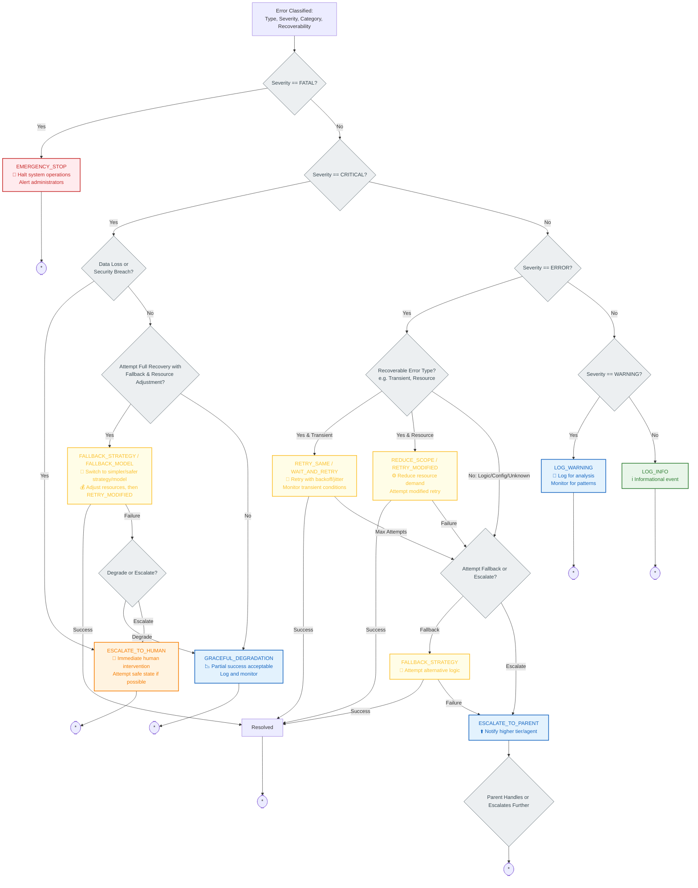

# 🧠 Recovery Strategy Selection Algorithm

> **TL;DR**: Systematic algorithm for choosing appropriate recovery strategies based on error classification and system context. Use this after classifying an error to determine the best recovery approach.

---

## 🔄 Recovery Strategy Selection Flowchart

This flowchart shows how to choose a recovery strategy once an error has been classified:

---

## 🎯 Key Recovery Strategies

| Strategy | When Used | Purpose | Example |
|----------|-----------|---------|---------|
| **EMERGENCY_STOP** | 🔴 FATAL errors | Halt system operations immediately | Memory overflow, security breach |
| **ESCALATE_TO_HUMAN** | 🟠 CRITICAL errors with data/security risk | Require human intervention | Data corruption, authentication failure |
| **FALLBACK_STRATEGY** | 🟠 CRITICAL or 🟡 ERROR | Switch to simpler/safer approach | Use cached data instead of API |
| **REDUCE_SCOPE** | 🟡 ERROR (resource issues) | Modify operation to use fewer resources | Analyze fewer data points |
| **GRACEFUL_DEGRADATION** | 🟠 CRITICAL (non-data-threatening) | Accept partial success | Serve limited results |
| **RETRY_SAME** | 🟡 ERROR (transient) | Retry exact same operation with backoff | Network timeout, temporary service outage |
| **WAIT_AND_RETRY** | 🟡 ERROR (resource constraint) | Wait for conditions to improve | Rate limit reset, resource availability |
| **RETRY_MODIFIED** | 🟡 ERROR | Retry with adjusted parameters | Different model, reduced scope |
| **ESCALATE_TO_PARENT** | 🟡 ERROR (unresolvable) | Let higher tier handle the error | Complex coordination required |
| **LOG_WARNING/INFO** | 🔵 WARNING / ⚪ INFO | Monitor and log for pattern analysis | Minor configuration issue |

---

## 🤖 Contextual Factors

The algorithm considers these factors when selecting strategies:

### **Error Context**
- **Recoverability**: Automatic, partial, or requires manual intervention
- **Error Category**: Transient, resource, logic, configuration, unknown
- **Attempt Count**: Number of previous recovery attempts
- **Circuit State**: Whether circuit breakers are open

### **System Context**
- **Resource Availability**: Current system load and available resources
- **Data Sensitivity**: Importance of preventing data loss
- **Performance Requirements**: Acceptable degradation levels
- **Security Constraints**: Privilege escalation risks

---

> 💡 **Usage**: Apply this algorithm after using [Error Classification](error-classification-severity.md) to determine error severity. The selected strategy guides the specific recovery implementation.

> 📚 **Implementation**: See [Quick Reference](quick-reference.md) for code patterns implementing these recovery strategies. 