# 🛠️ Resilience Implementation Guide: Building Fault-Tolerant Components

> **TL;DR**: This guide provides practical, step-by-step instructions for implementing resilient error handling in your Vrooli components across all three tiers. Learn how to detect, classify, and recover from errors systematically.

---

## 📚 Table of Contents

- [🎯 Implementation Overview](#-implementation-overview)
- [🔧 Tier 3: Execution Level Implementation](#-tier-3-execution-level-implementation)
- [⚙️ Tier 2: Process Level Implementation](#️-tier-2-process-level-implementation)
- [🧠 Tier 1: Coordination Level Implementation](#-tier-1-coordination-level-implementation)
- [🤖 Integration with Resilience Agents](#-integration-with-resilience-agents)
- [🔄 Testing Resilience](#-testing-resilience)

---

## 🎯 Implementation Overview

Building resilient components requires implementing three core capabilities:

```mermaid
graph TB
    subgraph "🔍 Detection Implementation"
        D1[Error Detection<br/>🚨 Try-catch blocks<br/>📊 Health checks<br/>⏱️ Timeout monitoring]
        D2[Classification<br/>📋 Apply decision tree<br/>🎯 Determine severity<br/>⚡ Set recovery path]
    end
    
    subgraph "🔄 Recovery Implementation"
        R1[Strategy Selection<br/>🧠 Use selection algorithm<br/>📊 Consider context<br/>⚙️ Execute recovery]
        R2[Execution<br/>⚡ Local recovery<br/>⬆️ Tier escalation<br/>🛑 Emergency protocols]
    end
    
    subgraph "📡 Integration Implementation"
        I1[Event Publishing<br/>📢 Emit error events<br/>📊 Report recovery status<br/>🔄 Share patterns]
        I2[Agent Coordination<br/>🤖 Subscribe to events<br/>💡 Learn from patterns<br/>📈 Improve strategies]
    end
    
    D1 --> D2 --> R1 --> R2
    R2 --> I1 --> I2
    I2 -.->|Feedback| D1
    
    classDef detection fill:#ffebee,stroke:#c62828,stroke-width:2px
    classDef recovery fill:#e8f5e8,stroke:#2e7d32,stroke-width:2px
    classDef integration fill:#e3f2fd,stroke:#1565c0,stroke-width:2px
    
    class D1,D2 detection
    class R1,R2 recovery
    class I1,I2 integration
```



### **Core Implementation Pattern**

Every resilient component follows this pattern:

```typescript
class ResilientComponent {
  constructor(
    private errorClassifier: ErrorClassifier,
    private recoverySelector: RecoverySelector,
    private eventBus: EventBus,
    private circuitBreaker: CircuitBreaker
  ) {}
  
  async executeOperation(request: OperationRequest): Promise<OperationResult> {
    try {
      // 1. Execute with circuit breaker protection
      return await this.circuitBreaker.execute(async () => {
        return await this.performOperation(request);
      });
      
    } catch (error) {
      // 2. Classify the error
      const classification = await this.errorClassifier.classify(error, {
        operation: 'executeOperation',
        context: request.context,
        tier: this.getTier()
      });
      
      // 3. Select and execute recovery strategy
      return await this.handleError(error, classification, request);
    }
  }
  
  private async handleError(
    error: Error,
    classification: ErrorClassification,
    request: OperationRequest
  ): Promise<OperationResult> {
    
    // Select recovery strategy
    const strategy = await this.recoverySelector.selectStrategy(classification, {
      attemptCount: request.metadata?.attemptCount || 0,
      availableResources: await this.getAvailableResources(),
      systemState: await this.getSystemState()
    });
    
    // Publish error event for resilience agents
    await this.eventBus.publish({
      eventType: 'error/detected',
      payload: {
        classification,
        strategy: strategy.type,
        context: request.context,
        component: this.componentId
      }
    });
    
    // Execute recovery strategy
    return await this.executeRecoveryStrategy(strategy, error, request);
  }
}
```

---

## 🔧 Tier 3: Execution Level Implementation

Tier 3 components handle tool execution, resource management, and strategy execution. Here's how to implement resilience:

### **Tool Execution Resilience**

```typescript
class ResilientToolOrchestrator {
  async executeTool(toolRequest: ToolRequest): Promise<ToolResult> {
    const maxRetries = 3;
    let attempt = 0;
    
    while (attempt < maxRetries) {
      try {
        // Execute with timeout and resource checks
        return await this.executeToolWithProtection(toolRequest);
        
      } catch (error) {
        attempt++;
        
        // Classify the error
        const classification = await this.classifyToolError(error, toolRequest);
        
        // Handle based on classification
        switch (classification.severity) {
          case 'FATAL':
            // Immediate escalation - no retry
            throw new FatalToolError(error, classification);
            
          case 'CRITICAL':
            // Try alternative tools if available
            if (await this.hasAlternativeTools(toolRequest)) {
              return await this.tryAlternativeTools(toolRequest);
            }
            throw new CriticalToolError(error, classification);
            
          case 'ERROR':
            // Apply recovery strategy based on error type
            const strategy = await this.selectToolRecoveryStrategy(classification);
            const result = await this.executeToolRecovery(strategy, toolRequest, attempt);
            if (result.success) return result.data;
            
            // Continue to retry if strategy suggests it
            if (!strategy.shouldRetry(attempt)) {
              throw new ToolExecutionError(error, classification, attempt);
            }
            break;
            
          case 'WARNING':
            // Log and continue with degraded result
            await this.logWarning(error, classification);
            return this.createDegradedResult(toolRequest, error);
        }
        
        // Wait before retry
        await this.waitWithBackoff(attempt, classification.category);
      }
    }
    
    throw new MaxRetriesExceededError(toolRequest, maxRetries);
  }
  
  private async classifyToolError(
    error: Error, 
    toolRequest: ToolRequest
  ): Promise<ErrorClassification> {
    
    // Apply systematic error classification
    if (error instanceof RateLimitError) {
      return {
        severity: 'ERROR',
        category: 'transient',
        type: 'rate_limit',
        recoverability: 'recoverable',
        context: {
          tool: toolRequest.toolName,
          resetTime: error.resetAt,
          limitType: error.limitType
        }
      };
    }
    
    if (error instanceof TimeoutError) {
      return {
        severity: 'ERROR',
        category: 'transient',
        type: 'timeout',
        recoverability: 'recoverable',
        context: {
          tool: toolRequest.toolName,
          timeoutMs: error.timeoutMs,
          actualTime: error.actualTime
        }
      };
    }
    
    if (error instanceof AuthenticationError) {
      return {
        severity: 'CRITICAL',
        category: 'security',
        type: 'authentication',
        recoverability: 'non_recoverable',
        context: {
          tool: toolRequest.toolName,
          authType: error.authType
        }
      };
    }
    
    // Default classification for unknown errors
    return {
      severity: 'ERROR',
      category: 'unknown',
      type: 'execution_failure',
      recoverability: 'partially_recoverable',
      context: {
        tool: toolRequest.toolName,
        errorMessage: error.message,
        errorType: error.constructor.name
      }
    };
  }
  
  private async selectToolRecoveryStrategy(
    classification: ErrorClassification
  ): Promise<RecoveryStrategy> {
    
    switch (classification.type) {
      case 'rate_limit':
        return {
          type: 'WAIT_AND_RETRY',
          waitTime: classification.context.resetTime - Date.now(),
          maxRetries: 2,
          alternatives: await this.getAlternativeTools(classification.context.tool)
        };
        
      case 'timeout':
        return {
          type: 'RETRY_MODIFIED',
          modifications: {
            timeout: classification.context.timeoutMs * 1.5,
            priority: 'high'
          },
          maxRetries: 1
        };
        
      case 'authentication':
        return {
          type: 'ESCALATE_TO_HUMAN',
          reason: 'Authentication failure requires manual intervention',
          urgency: 'high'
        };
        
      default:
        return {
          type: 'RETRY_SAME',
          maxRetries: 2,
          backoffStrategy: 'exponential'
        };
    }
  }
}
```

### **Resource Management Resilience**

```typescript
class ResilientResourceManager {
  async allocateResources(
    request: ResourceRequest
  ): Promise<ResourceAllocation> {
    
    try {
      // Check current usage
      const currentUsage = await this.getCurrentUsage(request.swarmId);
      const limits = await this.getSwarmLimits(request.swarmId);
      
      // Validate against limits
      if (this.wouldExceedLimits(currentUsage, request, limits)) {
        return await this.handleResourceExhaustion(request, currentUsage, limits);
      }
      
      // Allocate resources
      return await this.performAllocation(request);
      
    } catch (error) {
      const classification = await this.classifyResourceError(error, request);
      return await this.recoverFromResourceError(error, classification, request);
    }
  }
  
  private async handleResourceExhaustion(
    request: ResourceRequest,
    currentUsage: ResourceUsage,
    limits: ResourceLimits
  ): Promise<ResourceAllocation> {
    
    // Emit resource exhaustion event
    await this.eventBus.publish({
      eventType: 'swarm/resource/exhausted',
      payload: {
        swarmId: request.swarmId,
        resourceType: request.resourceType,
        requested: request.amount,
        available: limits.max - currentUsage.total,
        severity: 'high'
      }
    });
    
    // Try emergency expansion
    const expansionResult = await this.requestEmergencyExpansion(request);
    if (expansionResult.approved) {
      return await this.performAllocation(request);
    }
    
    // Try resource optimization
    const optimizedRequest = await this.optimizeResourceRequest(request);
    if (optimizedRequest && this.canFulfillOptimized(optimizedRequest, currentUsage, limits)) {
      return await this.performAllocation(optimizedRequest);
    }
    
    // Escalate to parent tier
    throw new ResourceExhaustionError({
      swarmId: request.swarmId,
      resourceType: request.resourceType,
      requested: request.amount,
      available: limits.max - currentUsage.total,
      alternatives: await this.suggestAlternatives(request)
    });
  }
}
```

---

## ⚙️ Tier 2: Process Level Implementation

Tier 2 components orchestrate routines and manage execution state. Resilience focuses on state recovery and routine coordination:

### **Routine Execution Resilience**

```typescript
class ResilientRunStateMachine {
  async executeRoutine(
    routineRequest: RoutineExecutionRequest
  ): Promise<RoutineExecutionResult> {
    
    let runContext: RunContext;
    
    try {
      // Initialize with checkpoint recovery if needed
      runContext = await this.initializeRunContext(routineRequest);
      
      // Execute routine steps with resilience
      return await this.executeStepsWithResilience(runContext);
      
    } catch (error) {
      const classification = await this.classifyRoutineError(error, runContext);
      return await this.recoverFromRoutineError(error, classification, runContext);
    }
  }
  
  private async executeStepsWithResilience(
    runContext: RunContext
  ): Promise<RoutineExecutionResult> {
    
    const navigator = this.getNavigator(runContext.routine.navigatorType);
    
    try {
      while (!runContext.isComplete) {
        // Get next step(s) from navigator
        const nextSteps = await navigator.getAvailableNextLocations(runContext);
        
        if (nextSteps.length === 0) {
          throw new NoNextStepsError(runContext);
        }
        
        // Execute steps (potentially in parallel)
        if (nextSteps.length === 1) {
          await this.executeSingleStep(nextSteps[0], runContext);
        } else {
          await this.executeParallelSteps(nextSteps, runContext);
        }
        
        // Create checkpoint for recovery
        await this.createCheckpoint(runContext);
      }
      
      return this.buildExecutionResult(runContext);
      
    } catch (error) {
      // Try to recover from checkpoint
      if (await this.canRecoverFromCheckpoint(runContext, error)) {
        return await this.recoverFromCheckpoint(runContext, error);
      }
      throw error;
    }
  }
  
  private async executeSingleStep(
    step: RoutineStep,
    runContext: RunContext
  ): Promise<void> {
    
    const maxStepRetries = 3;
    let attempt = 0;
    
    while (attempt < maxStepRetries) {
      try {
        // Execute step through Tier 3
        const stepResult = await this.unifiedExecutor.executeStep({
          stepId: step.stepId,
          stepType: step.stepType,
          inputs: this.resolveInputs(step, runContext),
          strategy: step.strategy || runContext.defaultStrategy,
          context: runContext,
          timeout: step.timeout || 30000
        });
        
        // Update run context with results
        runContext.completedSteps.push({
          stepId: step.stepId,
          result: stepResult,
          timestamp: new Date()
        });
        
        return;
        
      } catch (error) {
        attempt++;
        
        const classification = await this.classifyStepError(error, step, runContext);
        
        if (classification.severity === 'FATAL') {
          throw new FatalStepError(error, step, runContext);
        }
        
        if (attempt >= maxStepRetries) {
          throw new MaxStepRetriesExceededError(error, step, attempt);
        }
        
        // Apply step recovery strategy
        await this.executeStepRecovery(classification, step, runContext, attempt);
      }
    }
  }
  
  private async recoverFromCheckpoint(
    runContext: RunContext,
    error: Error
  ): Promise<RoutineExecutionResult> {
    
    // Find the most recent valid checkpoint
    const checkpoints = await this.getCheckpoints(runContext.runId);
    const validCheckpoint = await this.findValidCheckpoint(checkpoints);
    
    if (!validCheckpoint) {
      throw new CheckpointRecoveryError(error, 'No valid checkpoint found');
    }
    
    // Restore context from checkpoint
    const restoredContext = await this.restoreFromCheckpoint(validCheckpoint);
    
    // Emit recovery event
    await this.eventBus.publish({
      eventType: 'routine/state/recovered',
      payload: {
        runId: runContext.runId,
        checkpointId: validCheckpoint.id,
        errorType: error.constructor.name,
        stepsLost: this.calculateStepsLost(runContext, restoredContext)
      }
    });
    
    // Resume execution from checkpoint
    return await this.executeStepsWithResilience(restoredContext);
  }
}
```

### **Navigator Error Handling**

```typescript
class BpmnNavigatorWithResilience {
  async executeWorkflow(
    bpmnDefinition: BpmnDefinition,
    runContext: RunContext
  ): Promise<RoutineExecutionResult> {
    
    try {
      // Validate BPMN before execution
      const validation = await this.validateBpmnDefinition(bpmnDefinition);
      if (!validation.isValid) {
        throw new UnsupportedBpmnError(validation.errors);
      }
      
      // Execute with error handling
      return await this.executeBpmnWithResilience(bpmnDefinition, runContext);
      
    } catch (error) {
      const classification = await this.classifyNavigatorError(error);
      return await this.recoverFromNavigatorError(error, classification, runContext);
    }
  }
  
  private async recoverFromNavigatorError(
    error: Error,
    classification: ErrorClassification,
    runContext: RunContext
  ): Promise<RoutineExecutionResult> {
    
    switch (classification.type) {
      case 'unsupported_feature':
        // Fall back to native navigator
        return await this.fallbackToNativeNavigator(runContext);
        
      case 'workflow_corruption':
        // Try to repair workflow definition
        const repairedWorkflow = await this.repairWorkflowDefinition(runContext.routine);
        if (repairedWorkflow) {
          return await this.executeWorkflow(repairedWorkflow, runContext);
        }
        throw new UnrecoverableWorkflowError(error);
        
      case 'execution_deadlock':
        // Break deadlock and continue
        return await this.resolveDeadlock(runContext);
        
      default:
        throw new NavigatorError(error, classification);
    }
  }
}
```

---

## 🧠 Tier 1: Coordination Level Implementation

Tier 1 components coordinate swarms and manage goals. Resilience focuses on team management and goal adaptation:

### **Swarm Coordination Resilience**

```typescript
class ResilientSwarmStateMachine {
  async updateGoal(
    newGoal: string,
    swarmConfig: ChatConfigObject
  ): Promise<void> {
    
    try {
      // Analyze goal compatibility
      const conflictAnalysis = await this.analyzeGoalConflict(
        swarmConfig.goal,
        newGoal,
        swarmConfig.subtasks
      );
      
      if (conflictAnalysis.hasConflicts) {
        await this.resolveGoalConflicts(conflictAnalysis, newGoal, swarmConfig);
      } else {
        await this.updateGoalSafely(newGoal, swarmConfig);
      }
      
    } catch (error) {
      const classification = await this.classifyCoordinationError(error);
      await this.recoverFromCoordinationError(error, classification, swarmConfig);
    }
  }
  
  private async resolveGoalConflicts(
    analysis: GoalConflictAnalysis,
    newGoal: string,
    swarmConfig: ChatConfigObject
  ): Promise<void> {
    
    // Emit conflict event for agent analysis
    await this.eventBus.publish({
      eventType: 'swarm/goal/conflict_detected',
      payload: {
        swarmId: this.conversationId,
        originalGoal: swarmConfig.goal,
        newGoal,
        conflicts: analysis.conflicts,
        severity: analysis.severity,
        inProgressWork: analysis.affectedSubtasks
      }
    });
    
    switch (analysis.severity) {
      case 'low':
        // Automatic resolution for minor conflicts
        await this.handleMinorGoalConflict(analysis, newGoal, swarmConfig);
        break;
        
      case 'medium':
        // Present options to user
        await this.presentConflictResolutionOptions(analysis, newGoal, swarmConfig);
        break;
        
      case 'high':
        // Require explicit user decision
        await this.requireExplicitConflictResolution(analysis, newGoal, swarmConfig);
        break;
        
      case 'critical':
        // Emergency stop and full replanning
        await this.handleCriticalGoalConflict(analysis, newGoal, swarmConfig);
        break;
    }
  }
  
  private async handleCriticalGoalConflict(
    analysis: GoalConflictAnalysis,
    newGoal: string,
    swarmConfig: ChatConfigObject
  ): Promise<void> {
    
    // Emergency stop all active work
    await this.eventBus.publish({
      eventType: 'emergency/stop',
      payload: {
        reason: 'critical_goal_conflict',
        swarmId: this.conversationId,
        scope: 'swarm',
        severity: 'critical',
        conflictDetails: analysis
      }
    });
    
    // Save current state for potential recovery
    await this.saveEmergencyState(swarmConfig);
    
    // Stop all active subtasks
    for (const subtask of swarmConfig.subtasks) {
      if (subtask.status === 'in_progress') {
        await this.stopSubtask(subtask.id, 'goal_conflict');
      }
    }
    
    // Clear conflicting state
    const cleanedConfig = await this.cleanConflictingState(swarmConfig, analysis);
    
    // Start fresh with new goal
    await this.initializeNewGoal(newGoal, cleanedConfig);
  }
}
```

### **Team Management Resilience**

```typescript
class ResilientTeamManager {
  async assignSubtask(
    subtaskId: string,
    botId: string,
    swarmConfig: ChatConfigObject
  ): Promise<void> {
    
    try {
      // Validate assignment
      const validation = await this.validateAssignment(subtaskId, botId, swarmConfig);
      if (!validation.isValid) {
        await this.handleAssignmentConflict(validation, subtaskId, botId, swarmConfig);
        return;
      }
      
      // Perform assignment
      await this.performAssignment(subtaskId, botId, swarmConfig);
      
    } catch (error) {
      const classification = await this.classifyTeamError(error);
      await this.recoverFromTeamError(error, classification, subtaskId, botId, swarmConfig);
    }
  }
  
  private async recoverFromTeamError(
    error: Error,
    classification: ErrorClassification,
    subtaskId: string,
    botId: string,
    swarmConfig: ChatConfigObject
  ): Promise<void> {
    
    switch (classification.type) {
      case 'agent_unavailable':
        // Find alternative agent
        const alternativeBot = await this.findAlternativeAgent(subtaskId, swarmConfig);
        if (alternativeBot) {
          await this.assignSubtask(subtaskId, alternativeBot.id, swarmConfig);
        } else {
          await this.escalateAgentUnavailability(subtaskId, swarmConfig);
        }
        break;
        
      case 'capability_mismatch':
        // Train or recruit agent with required capabilities
        const enhancement = await this.enhanceAgentCapabilities(botId, subtaskId);
        if (enhancement.success) {
          await this.assignSubtask(subtaskId, botId, swarmConfig);
        } else {
          await this.recruitSpecializedAgent(subtaskId, swarmConfig);
        }
        break;
        
      case 'resource_conflict':
        // Rebalance resource allocation
        await this.rebalanceResources(swarmConfig);
        await this.assignSubtask(subtaskId, botId, swarmConfig);
        break;
        
      default:
        // Escalate to human intervention
        await this.escalateTeamManagementIssue(error, classification, swarmConfig);
    }
  }
}
```

---

## 🤖 Integration with Resilience Agents

Resilience agents learn from error patterns and improve recovery strategies. Here's how to integrate with them:

### **Event Publishing for Agent Learning**

```typescript
class ResilienceEventPublisher {
  async publishErrorEvent(
    error: Error,
    classification: ErrorClassification,
    recoveryResult: RecoveryResult,
    context: ComponentContext
  ): Promise<void> {
    
    await this.eventBus.publish({
      eventType: 'resilience/error_handled',
      payload: {
        // Error details
        errorType: error.constructor.name,
        errorMessage: error.message,
        classification,
        
        // Recovery details
        recoveryStrategy: recoveryResult.strategy,
        recoverySuccess: recoveryResult.success,
        recoveryTime: recoveryResult.duration,
        
        // Context for pattern learning
        component: context.componentId,
        tier: context.tier,
        operation: context.operation,
        systemState: await this.captureSystemState(),
        
        // Performance metrics
        performanceImpact: {
          latencyIncrease: recoveryResult.latencyIncrease,
          resourceOverhead: recoveryResult.resourceOverhead,
          qualityImpact: recoveryResult.qualityImpact
        }
      }
    });
  }
  
  async publishRecoveryPattern(
    pattern: RecoveryPattern,
    effectiveness: number
  ): Promise<void> {
    
    await this.eventBus.publish({
      eventType: 'resilience/pattern_identified',
      payload: {
        pattern: {
          errorSignature: pattern.errorSignature,
          contextConditions: pattern.contextConditions,
          recoveryStrategy: pattern.recoveryStrategy,
          successRate: pattern.successRate
        },
        effectiveness,
        confidence: pattern.confidence,
        observationCount: pattern.observationCount,
        recommendedActions: pattern.recommendedActions
      }
    });
  }
}
```

### **Adaptive Strategy Selection**

```typescript
class AdaptiveRecoverySelector {
  constructor(
    private baseSelector: RecoverySelector,
    private patternLearner: PatternLearner,
    private eventBus: EventBus
  ) {
    // Subscribe to pattern updates from resilience agents
    this.eventBus.subscribe('resilience/strategy_recommendation', (event) => {
      this.updateStrategy(event.payload);
    });
  }
  
  async selectStrategy(
    classification: ErrorClassification,
    context: SelectionContext
  ): Promise<RecoveryStrategy> {
    
    // Check for learned patterns
    const learnedPattern = await this.patternLearner.findMatchingPattern(
      classification,
      context
    );
    
    if (learnedPattern && learnedPattern.confidence > 0.8) {
      // Use AI-learned strategy
      return {
        ...learnedPattern.strategy,
        source: 'ai_learned',
        confidence: learnedPattern.confidence
      };
    }
    
    // Fall back to base algorithm
    const baseStrategy = await this.baseSelector.selectStrategy(classification, context);
    
    // Enhance with learned optimizations
    return await this.enhanceWithLearnings(baseStrategy, classification, context);
  }
  
  private async enhanceWithLearnings(
    baseStrategy: RecoveryStrategy,
    classification: ErrorClassification,
    context: SelectionContext
  ): Promise<RecoveryStrategy> {
    
    // Get similar patterns
    const similarPatterns = await this.patternLearner.findSimilarPatterns(
      classification,
      context,
      0.6 // similarity threshold
    );
    
    if (similarPatterns.length === 0) {
      return baseStrategy;
    }
    
    // Apply optimizations from successful patterns
    const optimizations = this.extractOptimizations(similarPatterns);
    
    return {
      ...baseStrategy,
      optimizations,
      enhancedBy: 'pattern_learning',
      confidence: this.calculateEnhancedConfidence(baseStrategy, optimizations)
    };
  }
}
```

---

## 🔄 Testing Resilience

### **Error Injection Testing**

```typescript
class ResilienceTestFramework {
  async testComponentResilience(
    component: ResilientComponent,
    scenarios: FailureScenario[]
  ): Promise<ResilienceTestResult> {
    
    const results = [];
    
    for (const scenario of scenarios) {
      const testResult = await this.executeScenario(component, scenario);
      results.push(testResult);
    }
    
    return this.analyzeResults(results);
  }
  
  private async executeScenario(
    component: ResilientComponent,
    scenario: FailureScenario
  ): Promise<ScenarioResult> {
    
    const startTime = Date.now();
    
    try {
      // Inject failure
      await this.injectFailure(scenario);
      
      // Execute operation
      const result = await component.executeOperation(scenario.request);
      
      // Measure recovery
      const recoveryTime = Date.now() - startTime;
      
      return {
        scenario: scenario.name,
        success: true,
        recoveryTime,
        result,
        expectedBehavior: scenario.expectedRecovery
      };
      
    } catch (error) {
      return {
        scenario: scenario.name,
        success: false,
        error,
        recoveryTime: Date.now() - startTime,
        expectedBehavior: scenario.expectedRecovery
      };
    } finally {
      // Clean up injected failures
      await this.cleanupFailure(scenario);
    }
  }
  
  async testCircuitBreakerBehavior(
    circuitBreaker: CircuitBreaker,
    failureCount: number
  ): Promise<CircuitBreakerTestResult> {
    
    // Test opening behavior
    for (let i = 0; i < failureCount; i++) {
      try {
        await circuitBreaker.execute(() => {
          throw new Error('Simulated failure');
        });
      } catch (error) {
        // Expected failures
      }
    }
    
    // Circuit should be open now
    const isOpen = circuitBreaker.getState() === 'open';
    
    // Test fail-fast behavior
    const startTime = Date.now();
    try {
      await circuitBreaker.execute(() => Promise.resolve('success'));
    } catch (error) {
      const failFastTime = Date.now() - startTime;
      
      return {
        circuitOpenedCorrectly: isOpen,
        failsFast: failFastTime < 100, // Should fail in <100ms
        behaviorCorrect: isOpen && failFastTime < 100
      };
    }
    
    return {
      circuitOpenedCorrectly: false,
      failsFast: false,
      behaviorCorrect: false
    };
  }
}
```

### **Chaos Engineering**

```typescript
class ChaosEngineer {
  async runChaosExperiment(
    experiment: ChaosExperiment
  ): Promise<ExperimentResult> {
    
    // Establish baseline
    const baseline = await this.measureBaseline(experiment.target);
    
    // Apply chaos
    const chaosInjector = this.createChaosInjector(experiment.chaosType);
    await chaosInjector.start();
    
    try {
      // Measure system behavior under chaos
      const chaosMetrics = await this.measureUnderChaos(experiment.target, experiment.duration);
      
      // Analyze resilience
      const resilienceAnalysis = this.analyzeResilience(baseline, chaosMetrics);
      
      return {
        experiment: experiment.name,
        baseline,
        chaosMetrics,
        resilienceAnalysis,
        success: resilienceAnalysis.systemRemainsStable,
        recommendations: resilienceAnalysis.recommendations
      };
      
    } finally {
      // Stop chaos injection
      await chaosInjector.stop();
      
      // Verify system recovery
      await this.verifyRecovery(experiment.target, baseline);
    }
  }
}
```

---

## 🚀 Best Practices

### **Error Classification Best Practices**

1. **Be Specific**: Don't just catch `Error` - classify specific error types
2. **Include Context**: Always include operation context for better recovery decisions
3. **Use Structured Data**: Make error data easily analyzable by resilience agents

### **Recovery Strategy Best Practices**

1. **Fail Fast**: Don't retry non-recoverable errors
2. **Limit Retries**: Set reasonable retry limits to prevent infinite loops
3. **Use Backoff**: Implement exponential backoff with jitter for retries
4. **Circuit Breakers**: Use circuit breakers for external dependencies
5. **Graceful Degradation**: Always have a fallback plan

### **Event Integration Best Practices**

1. **Rich Events**: Include comprehensive context in error events
2. **Performance Metrics**: Always include timing and resource usage data
3. **Pattern Recognition**: Structure events to enable pattern learning
4. **Non-Blocking**: Never let event publishing block critical recovery paths

---

> 💡 **Next Steps**: 
> - Implement basic error handling in your components using the patterns above
> - Set up event publishing to enable resilience agent learning
> - Add circuit breakers for external dependencies
> - Create chaos engineering tests to validate your resilience implementation
> 
> For more advanced topics, see **[Resilience Agents](../emergent-capabilities/agent-examples/resilience-agents.md)** to understand how AI agents continuously improve your error handling. 