# 🎯 Resource Management Architecture

> **TL;DR**: Vrooli's unified resource management system coordinates **computational resources** (credits, time, memory), **data resources** (state, caching, persistence), and **knowledge resources** (documents, search, discovery) through intelligent allocation, conflict resolution, and cross-resource optimization.

---

## 🌐 Unified Resource Management Philosophy

Traditional AI systems manage computational, data, and knowledge resources in isolation, creating inefficiencies and conflicts. Vrooli's unified approach recognizes these as interconnected resource types that must be coordinated holistically.

```mermaid
graph TB
    subgraph "🎯 Unified Resource Orchestrator"
        Orchestrator[Resource Orchestrator<br/>📊 Cross-resource optimization<br/>⚖️ Intelligent allocation<br/>🚨 Emergency coordination]
        
        subgraph "💰 Computational"
            Compute[Credits • Time • Memory • Tools<br/>⚡ Real-time tracking<br/>📊 Hierarchical budgets<br/>🎯 Priority-based allocation]
        end
        
        subgraph "💾 Data"
            Data[State • Cache • Persistence<br/>🏎️ Three-tier caching<br/>🔄 Cross-server sync<br/>📊 Consistency management]
        end
        
        subgraph "🔍 Knowledge"
            Knowledge[Documents • Search • Discovery<br/>🌐 Internal + External sources<br/>🤖 Semantic indexing<br/>📈 Intelligent caching]
        end
    end
    
    Orchestrator --> Compute
    Orchestrator --> Data
    Orchestrator --> Knowledge
    
    classDef orchestrator fill:#e3f2fd,stroke:#1565c0,stroke-width:3px
    classDef computational fill:#e8f5e8,stroke:#2e7d32,stroke-width:2px
    classDef data fill:#fff3e0,stroke:#f57c00,stroke-width:2px
    classDef knowledge fill:#f3e5f5,stroke:#7b1fa2,stroke-width:2px
    
    class Orchestrator orchestrator
    class Compute computational
    class Data data
    class Knowledge knowledge
```

## 🎯 Core Benefits

### **🧠 Intelligent Coordination**
- **Cross-Resource Optimization**: Decisions consider all resource types simultaneously
- **Predictive Allocation**: ML-based resource prediction and pre-allocation
- **Adaptive Management**: Dynamic reallocation based on workload patterns

### **⚖️ Fair & Efficient Allocation**
- **Hierarchical Management**: Three-tier resource hierarchy (Swarm → Run → Step)
- **Conflict Resolution**: Systematic algorithms for resource contention
- **Emergency Protocols**: Coordinated response across all resource domains

### **📊 Holistic Visibility**
- **Unified Monitoring**: Single view of all resource consumption
- **Predictable Costs**: Integrated cost management and optimization
- **Performance Insights**: Cross-resource performance analytics

---

## 📖 Resource Management Components

### **💰 [Computational Resources](computational-resources.md)** *(Coming Soon)*
- **Budget Management**: Credits, time, memory, and tool allocation
- **Hierarchical Limits**: Three-tier resource hierarchy
- **Conflict Resolution**: Priority-based allocation algorithms

### **💾 [Data Resources](data-management.md)**
- **Three-Tier Caching**: L1 (Local) → L2 (Redis) → L3 (PostgreSQL)
- **State Management**: Swarm and run state coordination
- **Consistency Protocols**: Cross-server synchronization

### **🔍 [Knowledge Resources](knowledge-management.md)**
- **Hybrid Knowledge System**: Internal PostgreSQL + External API sources
- **Search Orchestration**: Cross-source semantic search
- **Synchronization Strategies**: Real-time, cached, webhook, and periodic sync

### **🔄 [Resource Coordination](resource-coordination.md)**
- **Allocation Protocols**: Hierarchical resource distribution
- **Emergency Procedures**: Resource exhaustion handling
- **Cross-Tier Communication**: Resource state propagation

### **⚖️ [Conflict Resolution](resource-conflict-resolution.md)**
- **Resolution Algorithms**: FCFS, priority-based, proportional sharing
- **Preemption Policies**: Critical operation resource reclamation
- **Fairness Mechanisms**: Anti-starvation and queue management

---

## 🚀 Quick Start Guide

### **📚 For Understanding Architecture**
1. **[Resource Coordination](resource-coordination.md)** - Start here for allocation protocols
2. **[Conflict Resolution](resource-conflict-resolution.md)** - Understand resource contention handling
3. **[Data Management](data-management.md)** - Three-tier caching and state management
4. **[Knowledge Management](knowledge-management.md)** - Internal and external knowledge integration

### **⚙️ For Implementation**
1. **[Types System](../types/core-types.ts)** - All resource management interfaces
2. **[Computational Resources](computational-resources.md)** - Budget and limit implementation *(Coming Soon)*
3. **[Integration Examples](../concrete-examples.md)** - See resource management in action

### **🔧 For Operations**
1. **[Performance Characteristics](../performance-characteristics.md)** - Resource impact on performance
2. **[Monitoring](../monitoring/README.md)** - Resource monitoring and analytics
3. **[Emergency Protocols](emergency-protocols.md)** - Crisis management procedures *(Coming Soon)*

---

## 🎯 Resource Allocation Hierarchy

```mermaid
graph TB
    UserConfig[👤 User/Team Configuration<br/>💰 Global budgets<br/>📊 Policy settings]
    
    subgraph "Tier 1: Swarm"
        SwarmBudget[🐝 Swarm Resource Pool<br/>🎯 Goal-based allocation<br/>👥 Team coordination]
    end
    
    subgraph "Tier 2: Run"
        RunBudget[🔄 Routine Resource Pool<br/>📊 Step distribution<br/>🌿 Branch coordination]
    end
    
    subgraph "Tier 3: Step"
        StepBudget[⚙️ Step Execution<br/>🔧 Tool limits<br/>💰 Real-time tracking]
    end
    
    UserConfig --> SwarmBudget
    SwarmBudget --> RunBudget
    RunBudget --> StepBudget
    
    classDef config fill:#e3f2fd,stroke:#1565c0,stroke-width:2px
    classDef tier fill:#e8f5e8,stroke:#2e7d32,stroke-width:2px
    
    class UserConfig config
    class SwarmBudget,RunBudget,StepBudget tier
```

## 📊 Resource Types Summary

| Type | Scope | Management | Key Features |
|------|-------|------------|--------------|
| **💰 Credits** | All Tiers | Real-time tracking | Budget enforcement, cost optimization |
| **⏱️ Time** | All Tiers | Deadline management | Timeout enforcement, wall-clock limits |
| **💾 Memory** | Run/Step | Pool management | Garbage collection, load shedding |
| **🔧 Tools** | All Tiers | Rate limiting | Fair access, approval workflows |
| **📊 State** | All Tiers | Multi-tier caching | Consistency, cross-server sync |
| **🔍 Knowledge** | System | Hybrid storage | Internal + external, semantic search |

---

## 🔄 Integration Points

### **🌊 Event-Driven Coordination**
- **Resource Events**: Allocation, conflicts, emergencies
- **Cross-Resource Optimization**: Coordinated decision making
- **Emergency Protocols**: System-wide resource protection

### **🛡️ Security Integration**
- **Permission-Aware Allocation**: Security context in resource decisions
- **Data Sensitivity**: Classification-based resource handling
- **Audit Trails**: Complete resource usage tracking

### **📈 Performance Optimization**
- **Predictive Allocation**: ML-based resource forecasting
- **Adaptive Strategies**: Dynamic optimization based on usage patterns
- **Cost Minimization**: Automated cost optimization across all resource types

---

## 🎯 Why Unified Resource Management Matters

### **Traditional Problems**
- **❌ Siloed Systems**: Separate management creates inefficiencies
- **❌ Resource Conflicts**: Competing systems exhaust shared infrastructure
- **❌ Poor Visibility**: Lack of holistic resource understanding

### **Vrooli's Solution**
- **✅ Holistic Optimization**: Cross-resource coordination and optimization
- **✅ Intelligent Allocation**: ML-driven prediction and allocation
- **✅ Emergency Resilience**: Unified crisis response protocols
- **✅ Continuous Learning**: Resource patterns improve system intelligence

---

This unified approach ensures optimal utilization of all resource types while maintaining fairness, efficiency, and emergency preparedness across Vrooli's entire execution architecture. 🚀 