# 🎯 Resource Management Architecture

This directory contains the unified resource management architecture for Vrooli's execution system, covering computational resources, data management, external integrations, and resource coordination patterns.

## 🎯 Overview

Resource management in Vrooli encompasses multiple domains that work together to ensure optimal performance, cost efficiency, and reliability:

```mermaid
graph TB
    subgraph "🏗️ Core Resource Management"
        StateCache[State & Cache Management<br/>📊 Three-tier caching<br/>💾 State synchronization<br/>🔄 Data consistency]
        
        Coordination[Resource Coordination<br/>🎯 Allocation strategies<br/>⚖️ Load balancing<br/>📊 Usage optimization]
        
        Conflicts[Conflict Resolution<br/>🔄 Resource contention<br/>⚖️ Priority arbitration<br/>🛡️ Deadlock prevention]
    end
    
    subgraph "🔗 Integration Management"
        External[External Integrations<br/>🌐 API management<br/>🔑 Authentication<br/>📊 Rate limiting]
        
        Knowledge[Knowledge Management<br/>🧠 Information storage<br/>🔍 Search & retrieval<br/>📚 Learning systems]
    end
    
    StateCache --> Coordination
    Coordination --> Conflicts
    External --> Knowledge
    
    classDef core fill:#e3f2fd,stroke:#1565c0,stroke-width:2px
    classDef integration fill:#f3e5f5,stroke:#7b1fa2,stroke-width:2px
    
    class StateCache,Coordination,Conflicts core
    class External,Knowledge integration
```



## 📚 Documentation Structure

### **🏗️ Core Resource Management**

1. **[State & Cache Management](state-and-cache-management.md)**
   - Three-tier caching architecture (L1 Local, L2 Redis, L3 PostgreSQL)
   - State synchronization and consistency protocols
   - RunContext lifecycle and management
   - Cache invalidation and performance optimization
   - **Replaces**: Previous separate caching documentation

2. **[Resource Coordination](resource-coordination.md)** - Resource allocation and optimization
   - Hierarchical resource allocation (Team → Swarm → Routine)
   - Dynamic resource optimization strategies
   - Performance monitoring and adjustment

3. **[Resource Conflict Resolution](resource-conflict-resolution.md)** - Handling resource contention
   - Conflict detection and resolution algorithms
   - Priority-based arbitration systems
   - Deadlock prevention and recovery

### **🔗 Integration Management**

4. **[External Integrations](external-integrations.md)** - Third-party service management
   - API lifecycle management
   - Authentication and security protocols
   - Rate limiting and quota management
   - Service health monitoring

5. **[Knowledge Management](knowledge-management.md)** - Information and learning systems
   - Knowledge storage and retrieval
   - Search optimization and ranking
   - Continuous learning and improvement

## 🎯 Key Resource Management Principles

### **1. Hierarchical Resource Allocation**

Vrooli uses a **reserve-and-return** resource model where each tier reserves a portion of resources from the tier above, executes within those limits, and returns unused resources when complete. This approach ensures **predictable resource consumption** while maintaining **operational simplicity**.

```mermaid
graph TB
    subgraph "Resource Flow: Reserve → Execute → Return"
        Team[Team Resources<br/>💰 Total Budget: 100,000 credits<br/>👥 Member limits: 50 agents<br/>⏱️ Time quotas: 24 hours]
        
        subgraph "Swarm Reservation Process"
            SwarmReserve[Swarm Reserves<br/>💰 Requests: 15,000 credits<br/>⏱️ Estimates: 2 hours<br/>👥 Needs: 3 specialists]
            SwarmActive[Swarm Executes<br/>💰 Actually uses: 12,500 credits<br/>⏱️ Completes in: 1.5 hours<br/>👥 Uses: 3 specialists]
            SwarmReturn[Swarm Returns<br/>💰 Returns: 2,500 credits<br/>⏱️ Returns: 0.5 hours<br/>👥 Releases: 3 specialists]
        end
        
        subgraph "Routine Reservation Process"
            RoutineReserve[Routine Reserves<br/>💰 Requests: 5,000 credits<br/>⏱️ Estimates: 30 minutes<br/>🔧 Needs: API access]
            RoutineActive[Routine Executes<br/>💰 Actually uses: 4,200 credits<br/>⏱️ Completes in: 25 minutes<br/>🔧 Uses: API access]
            RoutineReturn[Routine Returns<br/>💰 Returns: 800 credits<br/>⏱️ Returns: 5 minutes<br/>🔧 Releases: API access]
        end
    end
    
    Team -->|"Reserve"| SwarmReserve
    SwarmReserve --> SwarmActive
    SwarmActive --> SwarmReturn
    SwarmReturn -->|"Return unused"| Team
    
    SwarmActive -->|"Reserve"| RoutineReserve  
    RoutineReserve --> RoutineActive
    RoutineActive --> RoutineReturn
    RoutineReturn -->|"Return unused"| SwarmActive
    
    classDef team fill:#e3f2fd,stroke:#1565c0,stroke-width:3px
    classDef reserve fill:#fff3e0,stroke:#f57c00,stroke-width:2px
    classDef active fill:#e8f5e8,stroke:#2e7d32,stroke-width:2px
    classDef return fill:#f3e5f5,stroke:#7b1fa2,stroke-width:2px
    
    class Team team
    class SwarmReserve,RoutineReserve reserve
    class SwarmActive,RoutineActive active
    class SwarmReturn,RoutineReturn return
```



#### **How Resource Reservation Works**

**1. Reservation Phase** - Each tier requests resources from its parent:
```typescript
interface ResourceReservation {
  credits: number;           // Estimated credit consumption
  maxDurationMs: number;     // Maximum execution time
  toolPermissions: string[]; // Required tool access
  memoryMB: number;         // Memory requirements
  priority: 'low' | 'medium' | 'high';
}

// Example: Swarm requests resources from Team
const swarmReservation: ResourceReservation = {
  credits: 15000,
  maxDurationMs: 7200000, // 2 hours
  toolPermissions: ['web_search', 'data_analysis', 'report_generation'],
  memoryMB: 2048,
  priority: 'high'
};
```

**2. Execution Phase** - Each tier tracks actual consumption:
```typescript
interface ResourceUsage {
  creditsUsed: number;       // Actual credits consumed
  durationMs: number;        // Actual execution time
  memoryPeakMB: number;     // Peak memory usage
  toolCallsCount: number;    // Number of tool calls made
}

// Example: Actual swarm resource usage
const swarmUsage: ResourceUsage = {
  creditsUsed: 12500,        // Used 12.5k of 15k reserved
  durationMs: 5400000,       // 1.5 hours of 2 hours reserved
  memoryPeakMB: 1600,        // Peak 1.6GB of 2GB reserved
  toolCallsCount: 247
};
```

**3. Return Phase** - Unused resources flow back up the hierarchy:
```typescript
interface ResourceReturn {
  creditsReturned: number;   // Unused credits returned
  timeReturned: number;      // Unused time returned
  toolsReleased: string[];   // Released tool permissions
  memoryReleased: number;    // Released memory allocation
}

// Example: Swarm returns unused resources to Team
const swarmReturn: ResourceReturn = {
  creditsReturned: 2500,     // 15k reserved - 12.5k used
  timeReturned: 1800000,     // 30 minutes returned
  toolsReleased: ['report_generation'], // Released early
  memoryReleased: 448        // 2048 - 1600 peak
};
```

#### **Why This Approach Ensures Simplicity**

**🎯 Predictable Resource Consumption**
- **No Resource Starvation**: Each tier has guaranteed access to reserved resources
- **Clear Boundaries**: Each operation knows exactly what resources it can use
- **Fail-Fast Validation**: Resource exhaustion is caught at reservation time, not during execution

**⚖️ Simplified Conflict Resolution**
- **No Real-Time Arbitration**: Conflicts are resolved at reservation time, not during execution
- **Isolated Execution**: Each tier operates independently within its reserved allocation
- **Cascading Limits**: Child operations automatically respect parent constraints

**📊 Simplified Monitoring & Debugging**
```typescript
// Resource tracking is straightforward - compare reserved vs. used
interface ResourceAnalytics {
  reservationAccuracy: number;  // How well we estimate resource needs
  utilizationEfficiency: number; // How much of reserved resources we actually use
  returnRate: number;           // Percentage of resources returned
}

// Example analytics show system health
const analytics: ResourceAnalytics = {
  reservationAccuracy: 0.92,   // 92% accurate estimates
  utilizationEfficiency: 0.83, // 83% of reserved resources used
  returnRate: 0.17             // 17% of resources returned unused
};
```

**🔄 Simplified Error Recovery**
- **Graceful Degradation**: Resource exhaustion in child operations doesn't affect parent
- **Clean Rollback**: Failed operations automatically return all reserved resources
- **Isolation Benefits**: Resource problems are contained within their tier

**💰 Simplified Cost Management**


#### **Reservation Strategy Examples**

**Conservative Reservation** (Default):
- Reserve 120% of estimated resources
- Prioritizes reliability over efficiency
- Good for critical or unpredictable workloads

**Optimistic Reservation** (High-confidence estimates):
- Reserve 105% of estimated resources  
- Prioritizes efficiency over safety margins
- Good for well-understood, repeatable tasks

**Adaptive Reservation** (ML-based):
- Reserve based on historical patterns and current context
- Balances efficiency and reliability dynamically
- Improves over time through usage pattern learning

### **2. Multi-Tier Caching Strategy**
- **L1 (Local)**: <1ms access, in-memory LRU cache
- **L2 (Distributed)**: ~5ms access, Redis cluster
- **L3 (Persistent)**: ~50ms access, PostgreSQL with consistency

### **3. Adaptive Resource Optimization**
- Real-time usage monitoring and adjustment
- Predictive resource allocation based on patterns
- Intelligent degradation under resource pressure

### **4. Conflict Resolution Hierarchy**
- Automated resolution for common conflicts
- Priority-based arbitration for resource contention
- Human escalation for complex scenarios

## 🚀 Getting Started

### **For Understanding Resource Architecture**
1. Start with **[State & Cache Management](state-and-cache-management.md)** for the foundational caching architecture
2. Review **[Resource Coordination](resource-coordination.md)** for allocation strategies
3. Explore **[External Integrations](external-integrations.md)** for service management

### **For Implementation**
1. Implement the three-tier caching system using the consolidated architecture
2. Set up resource coordination patterns for your team/swarm hierarchy
3. Configure external integrations with proper rate limiting and monitoring

### **For Troubleshooting**
1. Check **[Resource Conflict Resolution](resource-conflict-resolution.md)** for conflict scenarios
2. Use monitoring metrics from **[State & Cache Management](state-and-cache-management.md)**
3. Review service health in **[External Integrations](external-integrations.md)**

## 📊 Performance Targets

| Resource Type | Target Latency | Target Throughput | Monitoring Focus |
|---------------|----------------|-------------------|------------------|
| **L1 Cache** | <1ms | 50,000 ops/sec | Hit rate, eviction rate |
| **L2 Cache** | ~5ms | 10,000 ops/sec | Distributed consistency |
| **L3 Storage** | ~50ms | 1,000 ops/sec | Query optimization |
| **External APIs** | Variable | Rate limited | Health, quota usage |

## 🔄 Related Documentation

### **Architecture Context**
- **[Main Execution Architecture](../README.md)** - Complete three-tier execution overview
- **[Context & Memory Architecture](../context-memory/README.md)** - Context flow and layer architecture
- **[Communication Architecture](../communication/README.md)** - Inter-tier communication patterns

### **Cross-Cutting Concerns**
- **[Event-Driven Architecture](../event-driven/README.md)** - Resource events and coordination
- **[Security Architecture](../security/README.md)** - Resource access control and permissions
- **[Performance Monitoring](../monitoring/README.md)** - Resource usage monitoring and optimization

### **Implementation Details**
- **[Centralized Type System](../types/core-types.ts)** - Resource and state type definitions
- **[Error Handling](../resilience/README.md)** - Resource failure and recovery patterns

---

> 💡 **Key Insight**: Effective resource management balances **performance through caching**, **reliability through redundancy**, and **cost efficiency through intelligent allocation**. The hierarchical approach ensures resources are managed at the appropriate scope and lifetime.

## 🔄 Migration Notes

**Recent Changes:**
- ✅ **New**: `state-and-cache-management.md` - Unified authoritative source for caching architecture
- ❌ **Deprecated**: `data-management.md` - Content consolidated into new unified document
- 🔄 **Updated**: Cross-references updated to point to the consolidated documentation

This ensures a single source of truth for state management and caching while maintaining clear separation of concerns across resource management domains.

# 🎯 Resource Management Architecture

> **TL;DR**: Vrooli's unified resource management system coordinates **computational resources** (credits, time, memory), **data resources** (state, caching, persistence), and **knowledge resources** (documents, search, discovery) through intelligent allocation, conflict resolution, and cross-resource optimization.

---

## 🌐 Unified Resource Management Philosophy

Traditional AI systems manage computational, data, and knowledge resources in isolation, creating inefficiencies and conflicts. Vrooli's unified approach recognizes these as interconnected resource types that must be coordinated holistically.

```mermaid
graph TB
    subgraph "🎯 Unified Resource Orchestrator"
        Orchestrator[Resource Orchestrator<br/>📊 Cross-resource optimization<br/>⚖️ Intelligent allocation<br/>🚨 Emergency coordination]
        
        subgraph "💰 Computational"
            Compute[Credits • Time • Memory • Tools<br/>⚡ Real-time tracking<br/>📊 Hierarchical budgets<br/>🎯 Priority-based allocation]
        end
        
        subgraph "💾 Data"
            Data[State • Cache • Persistence<br/>🏎️ Three-tier caching<br/>🔄 Cross-server sync<br/>📊 Consistency management]
        end
        
        subgraph "🔍 Knowledge"
            Knowledge[Documents • Search • Discovery<br/>🌐 Internal + External sources<br/>🤖 Semantic indexing<br/>📈 Intelligent caching]
        end
    end
    
    Orchestrator --> Compute
    Orchestrator --> Data
    Orchestrator --> Knowledge
    
    classDef orchestrator fill:#e3f2fd,stroke:#1565c0,stroke-width:3px
    classDef computational fill:#e8f5e8,stroke:#2e7d32,stroke-width:2px
    classDef data fill:#fff3e0,stroke:#f57c00,stroke-width:2px
    classDef knowledge fill:#f3e5f5,stroke:#7b1fa2,stroke-width:2px
    
    class Orchestrator orchestrator
    class Compute computational
    class Data data
    class Knowledge knowledge
```



## 🎯 Core Benefits

### **🧠 Intelligent Coordination**
- **Cross-Resource Optimization**: Decisions consider all resource types simultaneously
- **Predictive Allocation**: ML-based resource prediction and pre-allocation
- **Adaptive Management**: Dynamic reallocation based on workload patterns

### **⚖️ Fair & Efficient Allocation**
- **Hierarchical Management**: Three-tier resource hierarchy (Swarm → Run → Step)
- **Conflict Resolution**: Systematic algorithms for resource contention
- **Emergency Protocols**: Coordinated response across all resource domains

### **📊 Holistic Visibility**
- **Unified Monitoring**: Single view of all resource consumption
- **Predictable Costs**: Integrated cost management and optimization
- **Performance Insights**: Cross-resource performance analytics

---

## 📖 Resource Management Components

### **💰 [Computational Resources](computational-resources.md)** *(Coming Soon)*
- **Budget Management**: Credits, time, memory, and tool allocation
- **Hierarchical Limits**: Three-tier resource hierarchy
- **Conflict Resolution**: Priority-based allocation algorithms

### **💾 [Data Resources](data-management.md)**
- **Three-Tier Caching**: L1 (Local) → L2 (Redis) → L3 (PostgreSQL)
- **State Management**: Swarm and run state coordination
- **Consistency Protocols**: Cross-server synchronization

### **🔍 [Knowledge Resources](knowledge-management.md)**
- **Hybrid Knowledge System**: Internal PostgreSQL + External API sources
- **Search Orchestration**: Cross-source semantic search
- **Synchronization Strategies**: Real-time, cached, webhook, and periodic sync

### **🔄 [Resource Coordination](resource-coordination.md)**
- **Allocation Protocols**: Hierarchical resource distribution
- **Emergency Procedures**: Resource exhaustion handling
- **Cross-Tier Communication**: Resource state propagation

### **⚖️ [Conflict Resolution](resource-conflict-resolution.md)**
- **Resolution Algorithms**: FCFS, priority-based, proportional sharing
- **Preemption Policies**: Critical operation resource reclamation
- **Fairness Mechanisms**: Anti-starvation and queue management

---

## 🚀 Quick Start Guide

### **📚 For Understanding Architecture**
1. **[Resource Coordination](resource-coordination.md)** - Start here for allocation protocols
2. **[Conflict Resolution](resource-conflict-resolution.md)** - Understand resource contention handling
3. **[Data Management](data-management.md)** - Three-tier caching and state management
4. **[Knowledge Management](knowledge-management.md)** - Internal and external knowledge integration

### **⚙️ For Implementation**
1. **[Types System](../types/core-types.ts)** - All resource management interfaces
2. **[Computational Resources](computational-resources.md)** - Budget and limit implementation *(Coming Soon)*
3. **[Integration Examples](../concrete-examples.md)** - See resource management in action

### **🔧 For Operations**
1. **[Performance Characteristics](../monitoring/performance-characteristics.md)** - Resource impact on performance
2. **[Monitoring](../monitoring/README.md)** - Resource monitoring and analytics
3. **[Emergency Protocols](emergency-protocols.md)** - Crisis management procedures *(Coming Soon)*

---

## 🎯 Resource Allocation Hierarchy

```mermaid
graph TB
    UserConfig[👤 User/Team Configuration<br/>💰 Global budgets<br/>📊 Policy settings]
    
    subgraph "Tier 1: Swarm"
        SwarmBudget[🐝 Swarm Resource Pool<br/>🎯 Goal-based allocation<br/>👥 Team coordination]
    end
    
    subgraph "Tier 2: Run"
        RunBudget[🔄 Routine Resource Pool<br/>📊 Step distribution<br/>🌿 Branch coordination]
    end
    
    subgraph "Tier 3: Step"
        StepBudget[⚙️ Step Execution<br/>🔧 Tool limits<br/>💰 Real-time tracking]
    end
    
    UserConfig --> SwarmBudget
    SwarmBudget --> RunBudget
    RunBudget --> StepBudget
    
    classDef config fill:#e3f2fd,stroke:#1565c0,stroke-width:2px
    classDef tier fill:#e8f5e8,stroke:#2e7d32,stroke-width:2px
    
    class UserConfig config
    class SwarmBudget,RunBudget,StepBudget tier
```



## 📊 Resource Types Summary

| Type | Scope | Management | Key Features |
|------|-------|------------|--------------|
| **💰 Credits** | All Tiers | Real-time tracking | Budget enforcement, cost optimization |
| **⏱️ Time** | All Tiers | Deadline management | Timeout enforcement, wall-clock limits |
| **💾 Memory** | Run/Step | Pool management | Garbage collection, load shedding |
| **🔧 Tools** | All Tiers | Rate limiting | Fair access, approval workflows |
| **📊 State** | All Tiers | Multi-tier caching | Consistency, cross-server sync |
| **🔍 Knowledge** | System | Hybrid storage | Internal + external, semantic search |

---

## 🔄 Integration Points

### **🌊 Event-Driven Coordination**
- **Resource Events**: Allocation, conflicts, emergencies
- **Cross-Resource Optimization**: Coordinated decision making
- **Emergency Protocols**: System-wide resource protection

### **🛡️ Security Integration**
- **Permission-Aware Allocation**: Security context in resource decisions
- **Data Sensitivity**: Classification-based resource handling
- **Audit Trails**: Complete resource usage tracking

### **📈 Performance Optimization**
- **Predictive Allocation**: ML-based resource forecasting
- **Adaptive Strategies**: Dynamic optimization based on usage patterns
- **Cost Minimization**: Automated cost optimization across all resource types

---

## 🎯 Why Unified Resource Management Matters

### **Traditional Problems**
- **❌ Siloed Systems**: Separate management creates inefficiencies
- **❌ Resource Conflicts**: Competing systems exhaust shared infrastructure
- **❌ Poor Visibility**: Lack of holistic resource understanding

### **Vrooli's Solution**
- **✅ Holistic Optimization**: Cross-resource coordination and optimization
- **✅ Intelligent Allocation**: ML-driven prediction and allocation
- **✅ Emergency Resilience**: Unified crisis response protocols
- **✅ Continuous Learning**: Resource patterns improve system intelligence

---

This unified approach ensures optimal utilization of all resource types while maintaining fairness, efficiency, and emergency preparedness across Vrooli's entire execution architecture. 🚀 