# Resource Management Architecture

This directory contains comprehensive documentation for Vrooli's resource management, allocation strategies, and coordination mechanisms across the three-tier execution architecture.

**Quick Start**: New to resource management? Start with the [Resource Management Overview](#resource-management-overview) below, then follow the [Implementation Reading Order](#implementation-reading-order).

## Resource Management Overview

Vrooli's resource management architecture provides hierarchical resource allocation, intelligent conflict resolution, and emergency resource protocols across all execution tiers. The system manages credits, computational resources, memory, and execution time through a sophisticated coordination framework.

```mermaid
graph TB
    subgraph "Hierarchical Resource Management"
        ResourceCoordinator[Resource Coordinator<br/>💰 Central resource management<br/>📊 Allocation strategies<br/>⚡ Conflict resolution]
        
        subgraph "Resource Allocation"
            SwarmResourceManager[Swarm Resource Manager<br/>🐝 Team-level budgets<br/>🎯 Goal-based allocation<br/>👥 Member resource sharing]
            RunResourceManager[Run Resource Manager<br/>🔄 Routine-level limits<br/>📊 Step budget distribution<br/>🌿 Parallel branch coordination]
            StepResourceManager[Step Resource Manager<br/>⚙️ Fine-grained tracking<br/>🔧 Tool execution limits<br/>💰 Real-time usage monitoring]
        end
        
        subgraph "Resource Types"
            CreditManager[Credit Manager<br/>💰 AI model costs<br/>📊 Usage tracking<br/>🎯 Budget enforcement]
            TimeManager[Time Manager<br/>⏱️ Execution timeouts<br/>📊 Wall-clock limits<br/>⚡ Deadline management]
            ComputeManager[Compute Manager<br/>💻 CPU/Memory limits<br/>📊 Concurrency control<br/>🔧 Resource pools]
            ToolManager[Tool Manager<br/>🔧 Tool invocation limits<br/>📊 Rate limiting<br/>⚖️ Fair access]
        end
        
        subgraph "Conflict Resolution"
            ConflictDetector[Conflict Detector<br/>🔍 Resource contention<br/>📊 Demand analysis<br/>⚡ Early warning]
            ResolutionEngine[Resolution Engine<br/>⚖️ Allocation strategies<br/>🎯 Priority-based decisions<br/>🔄 Dynamic rebalancing]
            EmergencyProtocols[Emergency Protocols<br/>🚨 Resource exhaustion<br/>🛑 Emergency stops<br/>📊 Crisis management]
        end
    end
    
    ResourceCoordinator --> SwarmResourceManager
    ResourceCoordinator --> RunResourceManager
    ResourceCoordinator --> StepResourceManager
    ResourceCoordinator --> CreditManager
    ResourceCoordinator --> TimeManager
    ResourceCoordinator --> ComputeManager
    ResourceCoordinator --> ToolManager
    ResourceCoordinator --> ConflictDetector
    ResourceCoordinator --> ResolutionEngine
    ResourceCoordinator --> EmergencyProtocols
    
    classDef coordinator fill:#e3f2fd,stroke:#1565c0,stroke-width:3px
    classDef allocation fill:#e8f5e8,stroke:#2e7d32,stroke-width:2px
    classDef resources fill:#fff3e0,stroke:#f57c00,stroke-width:2px
    classDef conflict fill:#ffebee,stroke:#c62828,stroke-width:2px
    
    class ResourceCoordinator coordinator
    class SwarmResourceManager,RunResourceManager,StepResourceManager allocation
    class CreditManager,TimeManager,ComputeManager,ToolManager resources
    class ConflictDetector,ResolutionEngine,EmergencyProtocols conflict
```

## Implementation Reading Order

**Prerequisites**: Read [Main Execution Architecture](../README.md) for complete architectural context.

### **Phase 1: Foundation (Must Read First)**
1. **[Centralized Type System](../types/core-types.ts)** - Resource management interface definitions
2. **[Resource Coordination](resource-coordination.md)** - Core allocation and coordination protocols
3. **[Resource Allocation Flow](resource-allocation-flow.md)** - Hierarchical allocation strategies

### **Phase 2: Core Management**
4. **[Hierarchical Budgeting](hierarchical-budgeting.md)** - Multi-tier budget management
5. **[Credit Management](credit-management.md)** - AI model cost tracking and optimization
6. **[Time Management](time-management.md)** - Execution timeout and deadline management

### **Phase 3: Conflict Resolution**
7. **[Resource Conflict Resolution](resource-conflict-resolution.md)** - Conflict detection and resolution algorithms
8. **[Priority Management](priority-management.md)** - Priority-based resource allocation
9. **[Load Balancing](load-balancing.md)** - Resource distribution and balancing strategies

### **Phase 4: Advanced Features**
10. **[Emergency Protocols](emergency-protocols.md)** - Resource exhaustion and crisis management
11. **[Predictive Allocation](predictive-allocation.md)** - ML-based resource prediction and allocation
12. **[Cost Optimization](cost-optimization.md)** - Automated cost optimization strategies

## Hierarchical Resource Management

Vrooli employs a three-tier hierarchical model for resource management, where limits are defined at higher levels and propagated downwards with intelligent allocation strategies:

### **Resource Flow Architecture**

```mermaid
graph TB
    subgraph "Resource Hierarchy"
        UserTeamConfig[User/Team Configuration<br/>💰 Global budgets<br/>📊 Policy settings<br/>🎯 Business rules]
        
        subgraph "Tier 1: Swarm Level"
            SwarmBudget[Swarm Budget<br/>🐝 Team allocation<br/>🎯 Goal-based distribution<br/>👥 Member resource sharing]
            SwarmLimits[Swarm Limits<br/>📊 Maximum allocations<br/>⏱️ Time boundaries<br/>🔧 Tool access policies]
        end
        
        subgraph "Tier 2: Run Level"
            RunBudget[Run Budget<br/>🔄 Routine allocation<br/>📊 Step distribution<br/>🌿 Branch coordination]
            RunLimits[Run Limits<br/>⚙️ Execution constraints<br/>💾 Memory boundaries<br/>🔧 Concurrency limits]
        end
        
        subgraph "Tier 3: Step Level"
            StepBudget[Step Budget<br/>⚙️ Individual step limits<br/>🔧 Tool execution costs<br/>💰 Real-time tracking]
            StepLimits[Step Limits<br/>⚡ Timeout enforcement<br/>📊 Resource validation<br/>🛑 Limit checking]
        end
    end
    
    UserTeamConfig --> SwarmBudget
    UserTeamConfig --> SwarmLimits
    SwarmBudget --> RunBudget
    SwarmLimits --> RunLimits
    RunBudget --> StepBudget
    RunLimits --> StepLimits
    
    classDef config fill:#e3f2fd,stroke:#1565c0,stroke-width:3px
    classDef swarm fill:#f3e5f5,stroke:#7b1fa2,stroke-width:2px
    classDef run fill:#e8f5e8,stroke:#2e7d32,stroke-width:2px
    classDef step fill:#fff3e0,stroke:#f57c00,stroke-width:2px
    
    class UserTeamConfig config
    class SwarmBudget,SwarmLimits swarm
    class RunBudget,RunLimits run
    class StepBudget,StepLimits step
```

### **Resource Types and Management**

| Resource Type | Scope | Management Strategy | Conflict Resolution |
|---------------|-------|-------------------|-------------------|
| **Credits** | All Tiers | Real-time tracking, predictive allocation | Priority-based, emergency reserves |
| **Time** | All Tiers | Deadline management, timeout enforcement | Queue management, preemption policies |
| **Memory** | Run/Step | Pool management, garbage collection | Load shedding, graceful degradation |
| **Concurrency** | Run/Step | Thread pools, execution slots | Fair scheduling, priority queues |
| **Tools** | All Tiers | Rate limiting, access policies | Round-robin, priority access |

## Key Resource Management Features

### **1. Intelligent Allocation Strategies**

The resource management system employs multiple allocation strategies based on context and requirements:

- **Proportional Allocation**: Resources distributed based on estimated needs
- **Priority-Based Allocation**: Critical operations receive priority access
- **Fair Share Allocation**: Equal distribution among competing operations
- **Demand-Based Allocation**: Dynamic allocation based on real-time demand
- **Predictive Allocation**: ML-based prediction of resource needs

### **2. Conflict Resolution Mechanisms**

When multiple operations compete for limited resources, the system applies systematic conflict resolution:

```mermaid
graph LR
    subgraph "Conflict Resolution Flow"
        Detection[Conflict Detection<br/>🔍 Resource contention<br/>📊 Demand vs. supply<br/>⚡ Early warning]
        
        Analysis[Conflict Analysis<br/>📊 Priority assessment<br/>🎯 Business impact<br/>⏱️ Deadline urgency]
        
        Strategy[Strategy Selection<br/>⚖️ Resolution approach<br/>🔄 Allocation method<br/>📊 Fair distribution]
        
        Execution[Resolution Execution<br/>✅ Apply allocation<br/>📊 Monitor results<br/>🔄 Adjust if needed]
    end
    
    Detection --> Analysis
    Analysis --> Strategy
    Strategy --> Execution
    
    classDef resolution fill:#e8f5e8,stroke:#2e7d32,stroke-width:2px
    class Detection,Analysis,Strategy,Execution resolution
```

### **3. Emergency Resource Protocols**

The system includes comprehensive emergency protocols for resource exhaustion scenarios:

- **Resource Exhaustion Detection**: Early warning systems for resource depletion
- **Emergency Reserves**: Reserved resources for critical operations
- **Graceful Degradation**: Systematic reduction of service levels
- **Emergency Stops**: Coordinated shutdown of non-critical operations
- **Resource Recovery**: Automated recovery and reallocation procedures

## Resource Management Documentation Structure

### **Core Resource Documents**
- **[Resource Coordination](resource-coordination.md)** - Core coordination protocols and allocation strategies
- **[Resource Conflict Resolution](resource-conflict-resolution.md)** - Conflict detection and resolution algorithms
- **[Hierarchical Budgeting](hierarchical-budgeting.md)** - Multi-tier budget management

### **Resource Types**
- **[Credit Management](credit-management.md)** - AI model cost tracking and optimization
- **[Time Management](time-management.md)** - Execution timeout and deadline management
- **[Memory Management](memory-management.md)** - Memory allocation and garbage collection
- **[Compute Management](compute-management.md)** - CPU and computational resource management
- **[Tool Management](tool-management.md)** - Tool access and rate limiting

### **Allocation Strategies**
- **[Allocation Algorithms](allocation-algorithms.md)** - Core allocation strategy implementations
- **[Priority Management](priority-management.md)** - Priority-based resource allocation
- **[Load Balancing](load-balancing.md)** - Resource distribution strategies
- **[Fair Scheduling](fair-scheduling.md)** - Fair resource sharing mechanisms

### **Advanced Features**
- **[Predictive Allocation](predictive-allocation.md)** - ML-based resource prediction
- **[Cost Optimization](cost-optimization.md)** - Automated cost optimization
- **[Resource Monitoring](resource-monitoring.md)** - Real-time resource monitoring
- **[Capacity Planning](capacity-planning.md)** - Long-term capacity planning

### **Emergency Management**
- **[Emergency Protocols](emergency-protocols.md)** - Resource exhaustion and crisis management
- **[Resource Recovery](resource-recovery.md)** - Automated recovery procedures
- **[Disaster Recovery](disaster-recovery.md)** - Large-scale resource failure recovery

## Integration with Architecture

### **Cross-Architecture Integration**
- **[Communication Resource Management](../communication/resource-integration.md)** - Resource management in communication patterns
- **[Security Resource Access](../security/resource-security.md)** - Secure resource access and validation
- **[Event Resource Coordination](../event-driven/resource-events.md)** - Resource event handling
- **[State Resource Management](../context-memory/resource-context.md)** - Resource state management

### **Tier-Specific Resource Management**
- **[Tier 1 Resource Management](../tiers/tier1-resources.md)** - Coordination intelligence resource management
- **[Tier 2 Resource Management](../tiers/tier2-resources.md)** - Process intelligence resource management
- **[Tier 3 Resource Management](../tiers/tier3-resources.md)** - Execution intelligence resource management

## Resource Management Best Practices

### **Implementation Guidelines**
1. **Hierarchical Allocation**: Implement clear hierarchical budget allocation
2. **Real-Time Tracking**: Provide real-time resource usage monitoring
3. **Predictive Management**: Use ML for predictive resource allocation
4. **Fair Distribution**: Ensure fair resource distribution among competing operations
5. **Emergency Preparedness**: Implement robust emergency resource protocols

### **Optimization Strategies**
1. **Cost Efficiency**: Optimize resource usage for cost effectiveness
2. **Performance Balance**: Balance resource allocation for optimal performance
3. **Waste Reduction**: Minimize resource waste through intelligent allocation
4. **Capacity Planning**: Plan resource capacity based on usage patterns
5. **Automation**: Automate resource management decisions where possible

## Related Documentation

- **[Main Execution Architecture](../README.md)** - Complete architectural overview
- **[Communication Patterns](../communication/communication-patterns.md)** - Resource coordination in communication
- **[Error Handling](../resilience/error-propagation.md)** - Resource-related error handling
- **[Security Architecture](../security/README.md)** - Resource security and access control
- **[Types System](../types/core-types.ts)** - Resource management interface definitions

This resource management architecture ensures optimal resource utilization across all aspects of Vrooli's execution system while maintaining fairness, efficiency, and emergency preparedness. 