# 🌐 Dynamic External Service Integration

> **TL;DR**: Vrooli supports external services through encrypted API key storage, dynamic API resource creation, and emergent routine generation - enabling teams to integrate any service without requiring application updates.

---

## 🎯 Dynamic Integration Philosophy

Instead of hard-coding specific service adapters, Vrooli uses an **emergent integration approach** where:

1. **📱 Admins add API keys** through the UI (stored encrypted in database)
2. **📋 API resources are created** to document service capabilities 
3. **⚙️ Single-step routines are generated** for each API endpoint
4. **🤖 Agents discover and use** these routines dynamically

This approach eliminates the need for application updates when integrating new services.

```mermaid
graph TB
    subgraph "🔐 Secure Credential Management"
        AdminUI[👤 Admin UI<br/>🔑 Add API keys<br/>⚙️ Configure services]
        EncryptedDB[🔒 Encrypted Database<br/>🗄️ Secure key storage<br/>🛡️ Access control]
        AdminUI --> EncryptedDB
    end
    
    subgraph "📋 Dynamic Resource Creation"
        APIResource[📊 API Resource<br/>📝 Service documentation<br/>🔗 Endpoint definitions<br/>🔧 Parameter schemas]
        RoutineGenerator[⚙️ Routine Generator<br/>🤖 Auto-create routines<br/>📋 One per endpoint<br/>✅ Parameter validation]
        APIResource --> RoutineGenerator
    end
    
    subgraph "🤖 Agent Integration"
        AgentDiscovery[🔍 Agent Discovery<br/>📖 Find available APIs<br/>🎯 Match capabilities<br/>🔄 Dynamic usage]
        RoutineExecution[🚀 Routine Execution<br/>🔧 Call API endpoints<br/>📊 Process responses<br/>🛡️ Handle errors]
        AgentDiscovery --> RoutineExecution
    end
    
    EncryptedDB --> APIResource
    RoutineGenerator --> AgentDiscovery
    
    classDef security fill:#ffebee,stroke:#c62828,stroke-width:2px
    classDef dynamic fill:#e3f2fd,stroke:#1565c0,stroke-width:2px
    classDef agents fill:#e8f5e8,stroke:#2e7d32,stroke-width:2px
    
    class AdminUI,EncryptedDB security
    class APIResource,RoutineGenerator dynamic
    class AgentDiscovery,RoutineExecution agents
```



---

## 🔐 Secure API Key Management

### **Admin Interface for API Keys**

Administrators can add API keys for any service through the Vrooli UI:

```typescript
// Admin adds API key through UI
interface APIKeyConfiguration {
    serviceName: string;           // "Slack", "GitHub", "Custom CRM"
    serviceUrl: string;            // Base URL for the API
    authenticationType: 'api_key' | 'oauth' | 'bearer_token';
    credentials: {
        apiKey?: string;           // Encrypted in database
        clientId?: string;         // For OAuth
        clientSecret?: string;     // Encrypted in database
        accessToken?: string;      // Encrypted in database
    };
    scopes?: string[];             // Requested permissions
    rateLimits?: {
        requestsPerMinute: number;
        requestsPerDay: number;
    };
}
```

### **Encrypted Storage**

All sensitive credentials are encrypted before database storage:

```typescript
interface EncryptedAPIKey {
    id: string;
    serviceName: string;
    serviceUrl: string;
    encryptedCredentials: string;  // AES-256 encrypted JSON
    createdAt: Date;
    lastUsed?: Date;
    isActive: boolean;
    createdBy: string;             // Admin user ID
}
```

---

## 📋 Dynamic API Resource Creation

### **API Resource Documentation**

When an API key is added, teams create API resources to document the service:

```typescript
// Created via resource_manage tool
const apiResource = {
    resourceType: 'Api',
    name: 'Slack Workspace API',
    description: 'Internal team Slack workspace integration',
    
    // API specification
    baseUrl: 'https://slack.com/api/',
    authentication: {
        type: 'bearer_token',
        credentialId: 'encrypted_slack_key_123'
    },
    
    // Available endpoints
    endpoints: [
        {
            path: '/conversations.list',
            method: 'GET',
            description: 'List all channels',
            parameters: {
                types: { type: 'string', default: 'public_channel,private_channel' },
                limit: { type: 'number', default: 100 }
            },
            responseSchema: { /* JSON schema */ }
        },
        {
            path: '/chat.postMessage',
            method: 'POST', 
            description: 'Send a message to a channel',
            parameters: {
                channel: { type: 'string', required: true },
                text: { type: 'string', required: true },
                thread_ts: { type: 'string', optional: true }
            }
        }
        // ... more endpoints
    ]
};
```

---

## ⚙️ Emergent Routine Generation

### **Automatic Routine Creation**

For each API endpoint, specialized routines are automatically created:

```typescript
// Auto-generated routine for Slack message posting
const slackPostMessageRoutine = {
    routineId: 'slack_post_message_v1',
    name: 'Post Message to Slack',
    description: 'Send a message to a Slack channel or thread',
    
    // Single-step routine
    steps: [{
        stepId: 'post_message',
        stepType: 'api_call',
        configuration: {
            apiResourceId: 'slack_api_resource_123',
            endpoint: '/chat.postMessage',
            method: 'POST',
            parameters: {
                channel: '${inputs.channel}',
                text: '${inputs.message}',
                thread_ts: '${inputs.thread_id}'
            }
        },
        inputMappings: {
            channel: 'inputs.channel',
            message: 'inputs.text',
            thread_id: 'inputs.thread_ts'
        },
        outputMappings: {
            message_id: 'response.ts',
            success: 'response.ok'
        }
    }],
    
    inputs: [
        { name: 'channel', type: 'string', required: true },
        { name: 'text', type: 'string', required: true },
        { name: 'thread_ts', type: 'string', required: false }
    ],
    
    outputs: [
        { name: 'message_id', type: 'string' },
        { name: 'success', type: 'boolean' }
    ]
};
```

### **Complex Operation Composition**

More complex operations can be built by composing single-step routines:

```typescript
// Composite routine using multiple API calls
const slackThreadSearchRoutine = {
    routineId: 'slack_search_thread_context_v1',
    name: 'Search Slack Thread Context',
    
    steps: [
        {
            stepId: 'search_messages',
            routineId: 'slack_search_messages_v1',  // References another routine
            inputMappings: { query: 'inputs.search_term' }
        },
        {
            stepId: 'get_thread_context',
            routineId: 'slack_get_thread_replies_v1',
            inputMappings: { 
                channel: 'search_messages.channel',
                thread_ts: 'search_messages.thread_ts'
            }
        },
        {
            stepId: 'summarize_context',
            routineId: 'text_summarization_v2',
            inputMappings: { 
                text: 'get_thread_context.messages',
                max_length: 'inputs.summary_length'
            }
        }
    ]
};
```

---

## 🤖 Agent Discovery & Usage

### **Dynamic API Discovery**

Agents can discover available APIs through the knowledge system:

```typescript
// Agents search for available capabilities
const availableAPIs = await resourceManage.find({
    resourceType: 'Api',
    tags: ['communication', 'slack'],
    isActive: true
});

// Agents find specific routines for API operations
const slackRoutines = await resourceManage.find({
    resourceType: 'Routine',
    tags: ['slack_api'],
    description: { contains: 'post message' }
});
```

### **Usage in Agent Workflows**

Agents can seamlessly use these dynamically created routines:

```typescript
// Agent workflow using discovered Slack routine
const workflowStep = {
    stepId: 'notify_team',
    routineId: 'slack_post_message_v1',  // Dynamically discovered
    inputs: {
        channel: '#development',
        text: 'Deployment completed successfully! 🚀',
        thread_ts: contextData.originalMessageId
    }
};
```

---

## 🔄 Service Integration Examples

### **📁 Google Drive Integration**

```typescript
// Admin adds Google Drive API key
const googleDriveConfig = {
    serviceName: 'Google Drive',
    serviceUrl: 'https://www.googleapis.com/drive/v3/',
    authenticationType: 'oauth',
    credentials: {
        clientId: 'google_client_id',
        clientSecret: 'encrypted_secret',
        accessToken: 'encrypted_token'
    }
};

// Auto-generated routines
const driveRoutines = [
    'google_drive_list_files_v1',     // GET /files
    'google_drive_upload_file_v1',    // POST /files
    'google_drive_download_file_v1',  // GET /files/{fileId}
    'google_drive_share_file_v1',     // POST /files/{fileId}/permissions
    'google_drive_search_files_v1'    // GET /files?q={query}
];
```

### **🐙 GitHub Integration**

```typescript
// Admin adds GitHub API key  
const githubConfig = {
    serviceName: 'GitHub',
    serviceUrl: 'https://api.github.com/',
    authenticationType: 'bearer_token',
    credentials: {
        accessToken: 'encrypted_github_token'
    }
};

// Auto-generated routines
const githubRoutines = [
    'github_list_repos_v1',           // GET /user/repos
    'github_create_issue_v1',         // POST /repos/{owner}/{repo}/issues
    'github_get_file_content_v1',     // GET /repos/{owner}/{repo}/contents/{path}
    'github_create_pull_request_v1',  // POST /repos/{owner}/{repo}/pulls
    'github_search_code_v1'           // GET /search/code?q={query}
];
```

### **🔗 Custom API Integration**

```typescript
// Admin adds custom CRM API
const customCRMConfig = {
    serviceName: 'Company CRM',
    serviceUrl: 'https://internal-crm.company.com/api/v2/',
    authenticationType: 'api_key',
    credentials: {
        apiKey: 'encrypted_crm_key'
    }
};

// Custom routines based on API documentation
const crmRoutines = [
    'crm_get_customer_v1',        // GET /customers/{id}
    'crm_create_lead_v1',         // POST /leads
    'crm_update_opportunity_v1',  // PUT /opportunities/{id}
    'crm_search_contacts_v1'      // GET /contacts?search={query}
];
```

---

## 🛡️ Security & Compliance

### **Credential Security**
- **🔐 Encryption at Rest**: All API keys encrypted with AES-256
- **🔑 Access Control**: Only authorized agents can use specific API keys
- **📊 Audit Logging**: Complete trail of API key usage
- **⏰ Rotation Support**: Automated credential rotation capabilities

### **Permission Management**
- **👥 Team-Based Access**: API keys scoped to specific teams
- **🎯 Routine-Level Permissions**: Granular control over API routine usage
- **📋 Approval Workflows**: Sensitive API calls can require approval
- **🚨 Rate Limiting**: Built-in protection against API abuse

### **Compliance Features**
- **📝 Data Classification**: API responses tagged with sensitivity levels
- **🔄 Retention Policies**: Automatic cleanup of cached API data
- **📊 Usage Monitoring**: Track API usage for compliance reporting
- **🚫 Blacklist Support**: Ability to block specific endpoints or operations

---

## 📈 Benefits of Dynamic Integration

### **🚀 No Application Updates Required**
- New services can be integrated instantly through the UI
- Teams don't need to wait for development cycles
- Self-service integration for technical teams

### **🎯 Service-Agnostic Architecture**  
- Works with any REST API or GraphQL endpoint
- Supports all common authentication methods
- Handles custom headers, parameters, and response formats

### **🤖 AI-Friendly Discovery**
- Agents can intelligently discover and use available APIs
- Natural language descriptions help with capability matching
- Automatic routine composition for complex operations

### **🔄 Evolution Through Usage**
- API routines improve through execution patterns
- Error handling becomes more sophisticated over time
- Performance optimizations emerge from usage data

---

## 🔧 Implementation Integration

### **Resource Management Tools**

The `resource_manage` tool provides unified access to both internal and external resources:

```typescript
// Find available APIs
const apis = await resourceManage.find({
    resourceType: 'Api',
    capabilities: ['file_storage', 'document_management']
});

// Use API routine
const result = await runRoutine('google_drive_upload_file_v1', {
    fileName: 'report.pdf',
    content: documentBuffer,
    parentFolder: 'quarterly_reports'
});
```

### **Emergent Routine Creation**

Teams can create sophisticated integration routines using existing API building blocks:

```typescript
// Custom routine that uses multiple services
const documentWorkflowRoutine = {
    routineId: 'document_approval_workflow_v1',
    steps: [
        {
            stepId: 'upload_to_drive',
            routineId: 'google_drive_upload_file_v1'
        },
        {
            stepId: 'notify_reviewers',
            routineId: 'slack_post_message_v1'
        },
        {
            stepId: 'create_review_issue',
            routineId: 'github_create_issue_v1'
        }
    ]
};
```

---

## 🚀 Future Extensibility

This dynamic approach enables powerful future capabilities:

- **🤖 AI-Assisted Integration**: Agents could analyze API documentation and automatically generate optimal routines
- **📊 Usage Analytics**: Track which APIs and endpoints provide the most value
- **🔄 Automatic Optimization**: Routine performance improvements based on usage patterns
- **🌐 Marketplace Integration**: Share successful API integration patterns across teams

---

This dynamic external service integration approach ensures Vrooli can integrate with any API-based service without requiring application updates, while maintaining security, performance, and discoverability through the unified resource management system. 🚀 