# 🔍 Knowledge Resource Management

> **TL;DR**: Vrooli's hybrid knowledge management system seamlessly integrates internal PostgreSQL storage with external services (Google Drive, GitHub, Slack, etc.) through unified search orchestration, intelligent caching, and cross-source semantic indexing.

---

## 🌐 Hybrid Knowledge Architecture

Vrooli's knowledge system combines the reliability of internal storage with the richness of external knowledge sources:

```mermaid
graph TB
    subgraph "🔍 Unified Knowledge System"
        PostgreSQL["🐘 PostgreSQL Core<br/>📝 Routines, notes, projects<br/>🎯 Internal resources<br/>🤖 Vector embeddings"]
        
        subgraph "🌐 External Sources"
            GoogleDrive["📁 Google Drive"]
            GitHub["🐙 GitHub"]
            Slack["💬 Slack"]
            OneDrive["☁️ OneDrive"]
            Notion["📝 Notion"]
            Custom["🔗 Custom APIs"]
        end
        
        subgraph "🧠 Knowledge Processing"
            SearchOrchestrator["🔍 Search Orchestrator<br/>📊 Cross-source routing<br/>🎯 Query optimization<br/>⚖️ Result ranking"]
            EmbeddingEngine["🤖 Embedding Engine<br/>📊 Semantic indexing<br/>🔄 Vector generation<br/>💾 Embedding cache"]
            IntelligentCache["💾 Intelligent Cache<br/>⚡ Strategic caching<br/>🔄 TTL management<br/>📊 Usage optimization"]
        end
    end
    
    SearchOrchestrator --> PostgreSQL
    SearchOrchestrator --> GoogleDrive
    SearchOrchestrator --> GitHub
    SearchOrchestrator --> Slack
    SearchOrchestrator --> OneDrive
    SearchOrchestrator --> Notion
    SearchOrchestrator --> Custom
    
    EmbeddingEngine --> PostgreSQL
    EmbeddingEngine --> IntelligentCache
    
    classDef internal fill:#e3f2fd,stroke:#1565c0,stroke-width:2px
    classDef external fill:#e8f5e8,stroke:#2e7d32,stroke-width:2px
    classDef processing fill:#fff3e0,stroke:#f57c00,stroke-width:2px
    
    class PostgreSQL internal
    class GoogleDrive,GitHub,Slack,OneDrive,Notion,Custom external
    class SearchOrchestrator,EmbeddingEngine,IntelligentCache processing
```



## 🎯 Core Knowledge Components

### **📊 Internal Knowledge (PostgreSQL)**
- **Routines**: Automation workflows with versioning and evolution tracking
- **Notes**: Documentation, insights, and knowledge capture with rich formatting
- **Projects**: Organizational structures for grouping related work and resources
- **Standards**: Best practices, guidelines, and procedural documentation
- **Teams**: Organizational units with roles, permissions, and collaborative structures

### **🌐 External Knowledge Sources**
- **[External Integrations](external-integrations.md)** - Detailed integration specifications
- **Live API Access**: Real-time querying of external services
- **Strategic Caching**: Intelligent caching based on access patterns
- **Permission Preservation**: Original service permissions respected

### **🔍 Search Orchestration**
- **Cross-Source Queries**: Unified search across internal and external sources
- **Intelligent Routing**: Optimal query distribution based on content type
- **Result Aggregation**: Ranked, deduplicated results from multiple sources
- **Permission Filtering**: Security-aware result filtering

---

## 🔄 Knowledge Synchronization

### **Synchronization Strategy Matrix**

| Source Type | Strategy | Rationale | Performance |
|-------------|----------|-----------|-------------|
| **Internal Resources** | Real-time | Always current | Sub-ms access |
| **Frequently Accessed External** | Smart Cache | Balance freshness/speed | ~5ms cached |
| **Dynamic External Content** | Real-time Query | Always fresh | ~200ms live |
| **Stable External Content** | Periodic Sync | Predictable cost | Cached speed |

### **Embedding Generation Pipeline**

```mermaid
graph LR
    subgraph "Content Processing"
        ContentChange[Content Change<br/>📝 Create/Update/Delete]
        EmbeddingFlag[🚩 embeddingExpiredAt flag<br/>📊 Marks stale embeddings]
        ProcessingQueue[🐂 BullMQ Queue<br/>⚡ Async processing<br/>🎯 Priority handling]
    end
    
    subgraph "Embedding Generation"
        EmbeddingService[🤖 Embedding Service<br/>📊 Vector generation<br/>🔄 Batch processing]
        VectorStore[💾 Vector Storage<br/>🔍 Semantic search<br/>📊 pgvector integration]
    end
    
    ContentChange --> EmbeddingFlag
    EmbeddingFlag --> ProcessingQueue
    ProcessingQueue --> EmbeddingService
    EmbeddingService --> VectorStore
    
    classDef processing fill:#e3f2fd,stroke:#1565c0,stroke-width:2px
    classDef generation fill:#e8f5e8,stroke:#2e7d32,stroke-width:2px
    
    class ContentChange,EmbeddingFlag,ProcessingQueue processing
    class EmbeddingService,VectorStore generation
```



---

## 🔍 Unified Search Capabilities

### **Search Orchestrator Interface**

```typescript
interface SearchOrchestrator {
    // Unified search across all sources
    search(query: SearchQuery): Promise<UnifiedSearchResult[]>;
    
    // Source-specific searches
    searchInternal(query: SearchQuery): Promise<InternalSearchResult[]>;
    searchExternal(query: ExternalSearchQuery): Promise<ExternalSearchResult[]>;
    
    // Cross-source result aggregation
    aggregateResults(results: SearchResult[]): Promise<RankedSearchResult[]>;
    
    // Permission-filtered results
    filterByPermissions(results: SearchResult[], context: SecurityContext): Promise<SearchResult[]>;
}
```

### **Unified Search Result Format**

```typescript
interface UnifiedSearchResult {
    source: 'internal' | 'google_drive' | 'github' | 'slack' | 'onedrive' | 'notion' | 'custom';
    resource: UnifiedResource;
    relevanceScore: number;
    contentPreview?: string;
    accessUrl?: string;
    lastSync?: Date;
    permissions: ResourcePermissions;
}
```

---

## 📊 Resource Metadata Management

### **Unified Resource Model**

All knowledge resources (internal and external) follow a consistent metadata model:

```typescript
interface UnifiedResource {
    // Universal identifiers
    id: string;
    sourceType: 'internal' | 'external';
    sourceId: string;
    externalUrl?: string;
    
    // Core metadata
    title: string;
    description?: string;
    contentType: string;
    tags: string[];
    
    // Access control
    permissions: ResourcePermissions;
    sensitivity: DataSensitivity;
    owner?: string;
    
    // Search optimization
    embedding?: number[];
    searchableContent: string;
    
    // Synchronization
    syncStrategy: SyncStrategy;
    lastSyncedAt?: Date;
}
```

---

## 🚀 Integration with Execution Architecture

### **Tier Integration**

```mermaid
graph TB
    subgraph "Tier 1: Coordination"
        Swarm[🐝 Swarm Coordination<br/>🎯 Strategic knowledge access<br/>📊 Cross-source insights]
    end
    
    subgraph "Tier 2: Process"
        SearchRoutine[⚙️ Search Routines<br/>🔍 Specialized knowledge queries<br/>📊 Result processing]
    end
    
    subgraph "Tier 3: Execution"
        ResourceTools[🛠️ Knowledge Tools<br/>📝 resource_manage<br/>🔍 semantic_search<br/>📊 content_analysis]
    end
    
    subgraph "Knowledge Layer"
        KnowledgeOrchestrator[🔍 Knowledge Orchestrator<br/>📊 Unified access<br/>🤖 Intelligent routing]
    end
    
    Swarm --> SearchRoutine
    SearchRoutine --> ResourceTools
    ResourceTools --> KnowledgeOrchestrator
    
    classDef tier fill:#e3f2fd,stroke:#1565c0,stroke-width:2px
    classDef knowledge fill:#f3e5f5,stroke:#7b1fa2,stroke-width:2px
    
    class Swarm,SearchRoutine,ResourceTools tier
    class KnowledgeOrchestrator knowledge
```



### **Knowledge Tools Integration**

- **🛠️ resource_manage**: Unified CRUD operations across internal and external sources
- **🔍 semantic_search**: Cross-source semantic search with embedding-based ranking
- **📊 content_analysis**: Intelligent content analysis and summarization
- **🔄 knowledge_sync**: Manual and automated synchronization control

---

## 📈 Performance & Optimization

### **Caching Strategy**

| Cache Level | Response Time | Capacity | Use Case |
|-------------|---------------|----------|----------|
| **L1 (Memory)** | <1ms | 1,000 resources | Hot knowledge access |
| **L2 (Redis)** | ~5ms | 100,000 resources | Cross-server sharing |
| **L3 (PostgreSQL)** | ~50ms | Unlimited | Authoritative storage |
| **External Live** | ~200ms | N/A | Real-time external queries |

### **Query Optimization**

- **Intelligent Routing**: Route queries to optimal sources based on content type
- **Parallel Execution**: Execute multiple source queries simultaneously
- **Result Ranking**: ML-based relevance scoring across diverse content types
- **Permission Filtering**: Efficient permission checking with caching

---

## 🛡️ Security & Permissions

### **Multi-Source Security Model**

- **Internal Resources**: Standard Vrooli permission system
- **External Resources**: Original service permissions preserved
- **Cross-Source Queries**: Permission intersection for mixed results
- **Audit Trails**: Complete access logging across all sources

### **Data Sensitivity Handling**

- **Classification**: Automatic sensitivity classification for all resources
- **Encryption**: Sensitive external content encrypted in cache
- **Access Control**: Permission-aware search result filtering
- **Compliance**: Respect external service data retention policies

---

## 🔧 Implementation Integration

### **Resource Management Tools**

```typescript
interface KnowledgeResourceManager extends ResourceManager {
    // Unified resource operations
    search(query: SearchQuery, sources?: string[]): Promise<UnifiedSearchResult[]>;
    getResource(id: string, sourceType: string): Promise<UnifiedResource>;
    syncResource(id: string, strategy?: SyncStrategy): Promise<SyncResult>;
    
    // Cache management
    invalidateCache(resourceId: string, sourceType: string): Promise<void>;
    preloadCache(resourceIds: string[], sourceType: string): Promise<void>;
    
    // Embedding management
    generateEmbedding(content: string): Promise<number[]>;
    updateEmbeddings(resourceIds: string[]): Promise<void>;
}
```

---

## 🚀 Quick Start Guide

### **For Developers**
1. **[External Integrations](external-integrations.md)** - Understand external service connections
2. **[Types System](../types/core-types.ts)** - Knowledge resource interface definitions
3. **[Integration Examples](../concrete-examples.md)** - See knowledge management in action

### **For Operations**
1. **[Performance Characteristics](../monitoring/performance-characteristics.md)** - Knowledge system performance
2. **[Monitoring](../monitoring/README.md)** - Knowledge system monitoring
3. **[Security](../security/README.md)** - Knowledge security and permissions

---

This hybrid knowledge management architecture ensures that teams can leverage their entire knowledge ecosystem while maintaining the performance, security, and intelligence that modern AI systems require. 🚀 