# Resource Conflict Resolution Algorithm

This document provides the **systematic decision algorithm** for resolving resource conflicts when multiple operations compete for limited resources within Vrooli's three-tier execution architecture.

**Prerequisites**: 
- Read [Resource Coordination](resource-coordination.md) to understand resource allocation context
- Review [Types System](../types/core-types.ts) for all resource conflict interface definitions
- Understand [Error Propagation](../resilience/error-propagation.md) for resource conflict error handling

**All resource conflict types are defined in the centralized type system** at [types/core-types.ts](../types/core-types.ts). This document focuses on the decision algorithm and resolution strategies.

## Resource Conflict Resolution Mechanisms

When multiple operations compete for limited resources, a structured approach is needed to decide how to allocate them. This involves identifying the conflict type and applying a suitable resolution strategy.

```mermaid
graph TB
    subgraph "Resource Conflict Scenarios"
        CompetingRequests[Competing Requests<br/>🔄 Multiple steps need same resource<br/>⏰ Deadline pressure<br/>💰 Limited budget]
        OverAllocation[Over-Allocation<br/>📊 Total requests &gt; available<br/>🎯 Priority conflicts<br/>⚖️ Fairness concerns]
        EmergencyNeeds[Emergency Needs<br/>🚨 Critical operation needs resources<br/>⏸️ Running operations must yield<br/>🎯 Preemption required]
    end

    subgraph "Resolution Strategies (Enum: ResourceConflictResolution)"
        FCFS[First-Come First-Served &#40;FCFS&#41;<br/>⏰ Time-based priority<br/>✅ Simple and fair<br/>❌ Ignores importance]
        PriorityBased[Priority-Based<br/>🎯 Importance ranking &#40;ExecutionPriority&#41;<br/>✅ Critical tasks first<br/>❌ Starvation risk for low priority]
        Proportional[Proportional Sharing<br/>⚖️ Divide based on need/weight<br/>✅ Everyone gets some resources<br/>❌ May not meet minimums for any]
        Preemption[Preemption Allowed<br/>🔄 Reclaim from lower priority tasks<br/>✅ Handles emergencies effectively<br/>❌ Disrupts ongoing work; needs compensation]
        QueueAndWait[Queue and Wait<br/>📋 Place requests in a queue<br/>✅ Eventually fair if queue is processed<br/>❌ May cause significant delays]
    end

    subgraph "Resolution Outcomes"
        GrantFull[Grant Request &#40;Full&#41;<br/>✅ Full allocation granted<br/>📊 Update resource tracking<br/>🎯 Continue execution]
        GrantPartial[Grant Request &#40;Partial&#41;<br/>⚖️ Reduced allocation granted<br/>📉 Operation may run in lower quality/scope<br/>🔄 Option to retry for full allocation later]
        DenyRequest[Deny Request<br/>❌ No allocation granted currently<br/>📋 Option to queue for later<br/>⏰ Advise retry after timeout/event]
        PreemptAction[Preempt Others &amp; Grant<br/>🔄 Reclaim resources from other tasks<br/>⏸️ Pause/compensate lower priority tasks<br/>🎯 Serve critical/emergency need]
    end

    %% Scenario to strategy mapping
    CompetingRequests --> FCFS
    CompetingRequests --> PriorityBased
    OverAllocation --> Proportional
    OverAllocation --> QueueAndWait
    EmergencyNeeds --> Preemption

    %% Strategy to outcome mapping
    FCFS --> GrantFull
    FCFS --> DenyRequest
    PriorityBased --> GrantFull
    PriorityBased --> DenyRequest
    PriorityBased --> PreemptAction
    Proportional --> GrantPartial
    QueueAndWait --> DenyRequest
    Preemption --> PreemptAction

    classDef scenario fill:#ffebee,stroke:#c62828,color:#c62828,stroke-width:2px
    classDef strategy fill:#e3f2fd,stroke:#1565c0,color:#1565c0,stroke-width:2px
    classDef outcome fill:#e8f5e8,stroke:#2e7d32,color:#2e7d32,stroke-width:2px

    class CompetingRequests,OverAllocation,EmergencyNeeds scenario
    class FCFS,PriorityBased,Proportional,Preemption,QueueAndWait strategy
    class GrantFull,GrantPartial,DenyRequest,PreemptAction outcome
```



## Key Resolution Strategies (`ResourceConflictResolution` Enum)

*   **`FIRST_COME_FIRST_SERVED` (FCFS)**: Allocates resources based on the order of arrival. Simple but may not be optimal for urgent tasks.
*   **`PRIORITY_BASED`**: Allocates resources to tasks with higher `ExecutionPriority`. Can lead to starvation for lower-priority tasks if not managed carefully (e.g., with aging).
*   **`PROPORTIONAL_SHARING`**: Divides available resources among competing tasks based on their requested amounts or assigned weights. Ensures some progress for all but might not satisfy any single task fully.
*   **`PREEMPTION_ALLOWED`**: Allows higher-priority tasks to take resources from lower-priority tasks that are already running. Requires mechanisms for gracefully pausing or compensating preempted tasks.
*   **`QUEUE_AND_WAIT`**: Places resource requests in a queue if they cannot be immediately satisfied. Requests are processed as resources become available. Can introduce latency.

## Contextual Factors in Resolution

The choice of resolution strategy can be dynamic and influenced by:

1.  **`ExecutionPriority` of tasks**: Higher priority tasks are favored.
2.  **`DeadlineMs`**: Tasks with impending deadlines might get preferential treatment.
3.  **`ResourceType`**: Some resources might be more critical or scarcer than others.
4.  **`Cost of Preemption`**: The impact of interrupting an ongoing task.
5.  **`System Load`**: Overall system utilization might influence whether to queue or deny.
6.  **`Fairness Policies`**: Ensuring that no task is indefinitely starved of resources.
7.  **`ResourceReservation` status**: If resources were previously reserved, those reservations should be honored.

## Framework Interface (Conceptual)

While the specific implementation resides within the `TierResourceManager` components (see `resource-coordination.md`), a conceptual interface for conflict resolution might look like this:

```typescript
interface ResourceConflictResolver {
    resolveConflict(
        conflict: ResourceConflict,
        resolutionStrategy?: ResourceConflictResolution // Strategy can be pre-configured or dynamically chosen
    ): Promise<ConflictResolutionResult>;
    
    detectConflicts(
        pendingRequests: ResourceAllocationRequest[],
        currentAllocations: Map<string, ResourceAllocation>
    ): ResourceConflict[];
}

interface ResourceConflict {
    readonly conflictId: string;
    readonly conflictingRequests: ResourceAllocationRequest[];
    readonly availableResources: ResourceBudget; // Overall available resources
    readonly type: ConflictType; // e.g., INSUFFICIENT_CREDITS, CONCURRENCY_LIMIT_REACHED
}

enum ConflictType {
    INSUFFICIENT_CREDITS = "insufficient_credits",
    INSUFFICIENT_TIME = "insufficient_time",
    INSUFFICIENT_MEMORY = "insufficient_memory",
    CONCURRENCY_LIMIT_REACHED = "concurrency_limit_reached",
    TOOL_LIMIT_REACHED = "tool_limit_reached",
    EXCLUSIVE_ACCESS_REQUIRED = "exclusive_access_required"
}

interface ConflictResolutionResult {
    readonly success: boolean;
    readonly allocationsGranted: ResourceAllocation[];
    readonly allocationsDenied: ResourceAllocationRequest[];
    readonly allocationsQueued: ResourceAllocationRequest[];
    readonly preemptedTasks: string[]; // IDs of tasks that were preempted
}
```

## Usage

This decision framework is used by the `TierResourceManager` at each tier (Swarm, Run, Step) when multiple requests contend for resources that are insufficient to satisfy all demands. The goal is to apply a resolution strategy that aligns with the system's operational priorities, fairness considerations, and overall efficiency. 

**Error Integration**: Resource conflict resolution coordinates with [Error Handling](../resilience/error-propagation.md#error-handling-across-patterns) for systematic conflict error management.

**Performance Integration**: Resource conflict resolution coordinates with [Performance Requirements](../monitoring/_PERFORMANCE_CHARACTERISTICS.md#performance-requirements-by-communication-pattern) for performance-aware resolution.

**Security Integration**: Resource conflict resolution respects [Security Boundaries](../security/security-boundaries.md#trust-model-and-privilege-hierarchy) for secure resource access.

**State Integration**: Resource conflict resolution coordinates with [State Synchronization](../context-memory/README.md#transaction-and-consistency-protocol) for consistency.

**Event Integration**: Resource conflict events use [Event Bus Protocol](../event-driven/event-bus-protocol.md#event-subscription-and-routing) for conflict coordination.

**Circuit Breaker Integration**: Resource conflict resolution triggers [Circuit Breaker Protocol](../resilience/circuit-breakers.md#circuit-breaker-protocol-and-integration) for resource protection.

## Related Documentation

- **[Resource Coordination](resource-coordination.md)** - Resource allocation and management context
- **[Types System](../types/core-types.ts)** - Complete resource conflict type definitions
- **[Error Propagation](../resilience/error-propagation.md)** - Resource conflict error handling
- **[Performance Characteristics](../monitoring/_PERFORMANCE_CHARACTERISTICS.md)** - Resource conflict impact on performance
- **[Security Boundaries](../security/security-boundaries.md)** - Security enforcement in resource conflicts
- **[Circuit Breakers](../resilience/circuit-breakers.md)** - Circuit breaker integration with resource conflicts
- **[Event Bus Protocol](../event-driven/event-bus-protocol.md)** - Event-driven resource conflict coordination
- **[State Synchronization](../context-memory/README.md)** - Resource conflict state management
- **[Integration Map](../communication/integration-map.md)** - Resource conflict validation procedures

This document provides systematic resource conflict resolution for the communication architecture, ensuring fair and efficient resource allocation through algorithmic decision making and coordinated resolution procedures. 