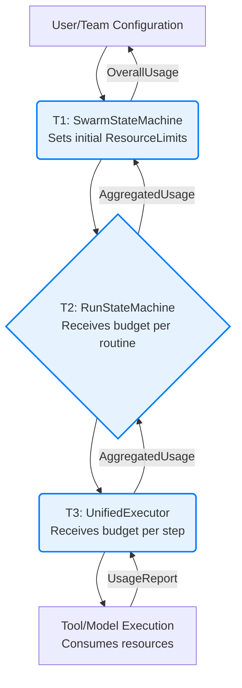

# Resource Coordination and Management

This document is the **authoritative source** for resource allocation, coordination protocols, budget management, and emergency resource procedures across Vrooli's three-tier execution architecture.

**Prerequisites**: 
- Read [Communication Patterns](../communication/communication-patterns.md) to understand resource coordination within each communication pattern
- Review [Types System](../types/core-types.ts) for all resource-related interface definitions
- Understand [Error Propagation](../resilience/error-propagation.md) for resource-related error handling

**All resource management types are defined in the centralized type system** at [types/core-types.ts](../types/core-types.ts). This document focuses on resource allocation protocols, coordination mechanisms, and emergency procedures.

## Hierarchical Resource Management

Vrooli employs a hierarchical model for resource management, where limits are defined at higher levels (e.g., User, Team, Swarm) and propagated downwards. Each tier is responsible for managing resources within the budget allocated by its parent.

- **Tier 1 (Coordination)**: Manages overall swarm/task budgets (`ResourceLimits`). Allocates initial budgets to Tier 2 for routine execution. Monitors aggregate usage.
- **Tier 2 (Process)**: Manages resources for a single routine run, including distributing budgets to parallel branches and sub-routines. Tracks `RunContext` resource usage.
- **Tier 3 (Execution)**: Manages resources at the step level. Monitors exact credit usage for tool calls, model interactions, and code execution. Enforces fine-grained limits.

All relevant types like `ResourceLimits`, `ResourceUsage`, `ResourceRequirements`, and `ResourceLimitOverrides` are defined in [types/core-types.ts](../types/core-types.ts).

## Resource Allocation Flow

1.  **Configuration**: Base resource limits are set at the user, team, or global level.
2.  **Tier 1 Allocation**: `SwarmStateMachine` receives or defines the total budget for a swarm/task and passes `ResourceLimits` to `RunStateMachine` for each top-level routine.
3.  **Tier 2 Allocation**: `RunStateMachine` further subdivides this budget for individual steps or sub-routine calls, passing relevant constraints to `UnifiedExecutor`.
4.  **Tier 3 Enforcement**: `UnifiedExecutor` enforces these limits for each step, tracking `ResourceUsage` (credits, time, memory, tool calls).
5.  **Reporting**: Usage is reported upwards, allowing higher tiers to monitor and adjust if necessary.

## Resource Conflict Resolution

When multiple operations compete for limited resources (e.g., concurrent tool calls under a quota, multiple branches needing credits), conflicts are resolved using the strategies outlined in the [Resource Conflict Resolution Decision Tree](resource-conflict-resolution.md). Key strategies include:
- `FIRST_COME_FIRST_SERVED`
- `PRIORITY_BASED` (using `ExecutionPriority` from [types/core-types.ts](../types/core-types.ts))
- `PROPORTIONAL_SHARING`
- `PREEMPTION_ALLOWED`
- `QUEUE_AND_WAIT`

The `TierResourceManager` components at each tier are responsible for implementing these resolution strategies.

## Error Handling for Resource Issues

Resource-related errors are critical for system stability and are handled by the [Error Propagation and Recovery Framework](../resilience/error-propagation.md). Common resource errors include:
- **`RESOURCE_EXHAUSTED`**: A specific resource (credits, time, memory) has been depleted.
- **`QUOTA_EXCEEDED`**: A rate limit or usage quota for a tool or service has been hit.
- **`RESOURCE_ALLOCATION_FAILED`**: Tier 1 or Tier 2 failed to secure necessary resources for a child operation.

**Severity and Recovery**:
- These errors are typically classified as `ERROR` or `CRITICAL` depending on impact, using the [Error Classification Decision Tree](../resilience/error-classification-severity.md).
- Recovery strategies, selected via the [Recovery Strategy Selection Algorithm](../resilience/recovery-strategy-selection.md), may include:
    - `RETRY_MODIFIED` (e.g., with reduced scope or after a delay).
    - `GRACEFUL_DEGRADATION` (e.g., completing with partial results).
    - `ESCALATE_TO_PARENT` or `ESCALATE_TO_HUMAN` if the budget is truly exhausted or limits are too restrictive.
    - Modifying `ExecutionPriority` to influence future resource contention.

Refer to the [Error Propagation and Recovery Framework](../resilience/error-propagation.md) for the comprehensive approach to handling these errors.

## Emergency Resource Protocols

Resource emergency protocols provide safeguards for resource exhaustion and system overload:

**Emergency Types**: All emergency protocols use [EmergencyResourceProtocol Interface](../types/core-types.ts) from the centralized type system.

**Emergency Integration**: Emergency protocols coordinate with [Emergency Stop Protocols](../resilience/error-propagation.md#emergency-stop-protocols) for system-wide protection.

**Circuit Breaker Integration**: Emergency protocols trigger [Circuit Breaker Activation](../resilience/circuit-breakers.md#circuit-breaker-protocol-and-integration) for resource isolation.

## Related Documentation

- **[Communication Patterns](../communication/communication-patterns.md)** - Resource coordination within each communication pattern
- **[Types System](../types/core-types.ts)** - Complete resource management type definitions
- **[Resource Conflict Resolution](resource-conflict-resolution.md)** - Algorithm for resolving resource conflicts
- **[Error Propagation](../resilience/error-propagation.md)** - Resource-related error handling
- **[Performance Characteristics](../monitoring/_PERFORMANCE_CHARACTERISTICS.md)** - Resource impact on performance
- **[Circuit Breakers](../resilience/circuit-breakers.md)** - Circuit breaker integration with resource management
- **[Event Bus Protocol](../event-driven/event-bus-protocol.md)** - Event-driven resource coordination
- **[State Synchronization](../context-memory/README.md)** - Resource state management
- **[Security Boundaries](../security/security-boundaries.md)** - Security enforcement in resource access
- **[Integration Map](../communication/integration-map.md)** - Resource management validation procedures

This document provides comprehensive resource management for the communication architecture, ensuring optimal resource utilization through systematic allocation, coordination, and emergency procedures. 