# 🏗️ State and Cache Management: Unified Architecture

> **TL;DR**: This document is the **authoritative source** for Vrooli's state management and three-tier caching architecture. It consolidates and replaces the previous separate documentation to eliminate duplication and provide a single source of truth.

---

## 🎯 Unified State Management Overview

Vrooli's state management combines **persistent storage**, **distributed caching**, and **local optimization** through a sophisticated three-tier architecture that ensures both performance and consistency across the distributed execution system.

```mermaid
graph TB
    subgraph "L3: Persistent Storage Layer (PostgreSQL)"
        TeamsDB[(Teams Table<br/>🏢 Team configurations<br/>👥 Member relationships<br/>🎯 Team objectives)]
        BotsDB[(Users Table<br/>🤖 Bot configurations<br/>🧠 Bot personas<br/>⚙️ Capabilities)]
        ChatsDB[(Chats Table<br/>💬 Chat metadata<br/>🐝 Swarm configurations<br/>📊 Conversation state)]
        RoutinesDB[(Routines Table<br/>⚙️ Routine definitions<br/>📋 Step configurations<br/>🔄 Version history)]
        ContextDB[(RunContext Snapshots<br/>💾 Long-running routines<br/>🔄 Recovery points<br/>📊 Execution state)]
    end
    
    subgraph "L2: Distributed Cache Layer (Redis)"
        SwarmL2[Swarm State Cache<br/>🐝 Active swarm states<br/>📊 15-minute TTL<br/>🔄 Cross-server sharing]
        RunL2[Run State Cache<br/>🔄 Active routine runs<br/>💾 Execution context<br/>⚡ Fast retrieval]
        ConfigL2[Config Cache<br/>⚙️ Bot/Team configs<br/>📋 Routine metadata<br/>🚀 Quick lookups]
        HotContextL2[Hot RunContexts Cache<br/>⚡ Active executions<br/>🔄 State snapshots<br/>📊 Performance optimization]
    end
    
    subgraph "L1: Local Cache (In-Memory LRU)"
        subgraph "Server A"
            SwarmL1A[Swarm LRU<br/>🐝 Hot conversations<br/>⚡ Sub-ms access<br/>🎯 1000 entry limit]
            RunL1A[Run LRU<br/>🔄 Active executions<br/>💾 Context state<br/>📊 Real-time updates]
            ConfigL1A[Config LRU<br/>⚙️ Fast config access<br/>📊 Local optimization]
        end
        
        subgraph "Server B" 
            SwarmL1B[Swarm LRU<br/>🐝 Hot conversations<br/>⚡ Sub-ms access<br/>🎯 1000 entry limit]
            RunL1B[Run LRU<br/>🔄 Active executions<br/>💾 Context state<br/>📊 Real-time updates]
            ConfigL1B[Config LRU<br/>⚙️ Fast config access<br/>📊 Local optimization]
        end
    end
    
    subgraph "Cache Coordination & Invalidation"
        EventBus[Event Bus<br/>📡 Change notifications<br/>🔄 Invalidation events<br/>⚡ Real-time sync]
        CacheInvalidator[Cache Invalidator<br/>🔄 Cross-layer sync<br/>📢 Invalidation events<br/>⚡ Consistency maintenance]
    end
    
    %% Data flow connections
    SwarmL1A -.->|"Cache miss"| SwarmL2
    SwarmL1B -.->|"Cache miss"| SwarmL2
    SwarmL2 -.->|"Cache miss"| ChatsDB
    
    RunL1A -.->|"Cache miss"| RunL2
    RunL1B -.->|"Cache miss"| RunL2
    RunL2 -.->|"Cache miss"| RoutinesDB
    
    ConfigL1A -.->|"Cache miss"| ConfigL2
    ConfigL1B -.->|"Cache miss"| ConfigL2
    ConfigL2 -.->|"Cache miss"| TeamsDB
    ConfigL2 -.->|"Cache miss"| BotsDB
    
    HotContextL2 -.->|"Cache miss"| ContextDB
    
    %% Invalidation flow
    ContextDB --> EventBus
    ChatsDB --> EventBus
    TeamsDB --> EventBus
    BotsDB --> EventBus
    RoutinesDB --> EventBus
    
    EventBus --> CacheInvalidator
    CacheInvalidator -.->|"Invalidate L2"| SwarmL2
    CacheInvalidator -.->|"Invalidate L2"| RunL2
    CacheInvalidator -.->|"Invalidate L2"| ConfigL2
    CacheInvalidator -.->|"Invalidate L2"| HotContextL2
    
    SwarmL2 -.->|"Propagate"| SwarmL1A
    SwarmL2 -.->|"Propagate"| SwarmL1B
    RunL2 -.->|"Propagate"| RunL1A
    RunL2 -.->|"Propagate"| RunL1B
    ConfigL2 -.->|"Propagate"| ConfigL1A
    ConfigL2 -.->|"Propagate"| ConfigL1B
    
    classDef database fill:#ffebee,stroke:#c62828,stroke-width:3px
    classDef l2cache fill:#e3f2fd,stroke:#1565c0,stroke-width:2px
    classDef l1cache fill:#e8f5e8,stroke:#2e7d32,stroke-width:2px
    classDef coordinator fill:#fff3e0,stroke:#f57c00,stroke-width:2px
    
    class TeamsDB,BotsDB,ChatsDB,RoutinesDB,ContextDB database
    class SwarmL2,RunL2,ConfigL2,HotContextL2 l2cache
    class SwarmL1A,RunL1A,ConfigL1A,SwarmL1B,RunL1B,ConfigL1B l1cache
    class EventBus,CacheInvalidator coordinator
```



---

## 🏗️ Three-Tier Cache Architecture

### **L1: Local Cache (In-Memory LRU)**
- **Purpose**: Fastest access to very active data
- **Technology**: In-memory LRU cache per server instance
- **Capacity**: ~1000 entries per cache type
- **Latency**: <1ms access time
- **Scope**: Single server instance

```typescript
interface L1CacheConfig {
  swarmCache: {
    maxEntries: 1000;
    evictionPolicy: 'LRU';
    ttl: 300000; // 5 minutes
  };
  runCache: {
    maxEntries: 500;
    evictionPolicy: 'LRU'; 
    ttl: 600000; // 10 minutes
  };
  configCache: {
    maxEntries: 2000;
    evictionPolicy: 'LRU';
    ttl: 900000; // 15 minutes
  };
}
```

### **L2: Distributed Cache (Redis)**
- **Purpose**: Shared cache accessible by all server instances
- **Technology**: Redis cluster with consistent hashing
- **TTL**: 15 minutes for most data types
- **Latency**: ~5ms access time
- **Scope**: All server instances

```typescript
interface L2CacheConfig {
  redis: {
    cluster: true;
    nodes: string[];
    keyPrefix: 'vrooli:';
    ttl: {
      swarmState: 900000;      // 15 minutes
      runContext: 900000;      // 15 minutes
      botConfig: 1800000;      // 30 minutes
      teamConfig: 1800000;     // 30 minutes
      routineMetadata: 3600000; // 60 minutes
    };
  };
  compression: {
    enabled: true;
    algorithm: 'gzip';
    minSize: 1024; // Compress data > 1KB
  };
}
```

### **L3: Persistent Storage (PostgreSQL)**
- **Purpose**: Authoritative source of truth
- **Technology**: PostgreSQL with pgvector
- **Consistency**: ACID transactions
- **Latency**: ~50ms query time
- **Scope**: Permanent storage

```typescript
interface L3StorageConfig {
  postgres: {
    host: string;
    database: string;
    ssl: true;
    poolSize: 20;
    connectionTimeout: 30000;
  };
  tables: {
    teams: 'Teams';
    users: 'User';  // Includes bots
    chats: 'Chat';
    routines: 'Routine';
    runContextSnapshots: 'RunContextSnapshot';
  };
  indexing: {
    vectorSearch: true;
    fullTextSearch: true;
    partitioning: 'monthly';
  };
}
```

---

## 🔄 Cache Miss Resolution Flow

```mermaid
graph TB
    subgraph "Cache Resolution Algorithm"
        Request[Request for State<br/>🎯 Swarm/Run/Config data]
        
        subgraph "L1 - Local LRU Cache"
            L1Check{L1 Cache Hit?}
            L1Return[Return from L1<br/>⚡ <1ms response]
            L1Store[Store in L1<br/>🎯 Evict if full]
        end
        
        subgraph "L2 - Distributed Redis Cache"
            L2Check{L2 Cache Hit?}
            L2Return[Return from L2<br/>⚡ ~5ms response]
            L2Store[Store in L2<br/>⏰ 15min TTL]
        end
        
        subgraph "L3 - PostgreSQL Database"
            L3Query[Query Database<br/>💾 ~50ms response]
            L3Return[Return from DB<br/>📊 Authoritative data]
        end
        
        subgraph "Write-Behind Pattern"
            WriteBuffer[Debounced Write Buffer<br/>⏱️ 2s debounce<br/>📊 Batch updates]
            WriteBack[Async Write-Back<br/>💾 Update L2 & L3<br/>🔄 Eventual consistency]
        end
    end
    
    Request --> L1Check
    L1Check -->|"Hit"| L1Return
    L1Check -->|"Miss"| L2Check
    L2Check -->|"Hit"| L2Return
    L2Return --> L1Store
    L2Check -->|"Miss"| L3Query
    L3Query --> L3Return
    L3Return --> L2Store
    L2Store --> L1Store
    
    %% Write path
    L1Store -.->|"Updates"| WriteBuffer
    WriteBuffer -.->|"Batch"| WriteBack
    WriteBack -.->|"Persist"| L2Store
    WriteBack -.->|"Persist"| L3Query
    
    classDef request fill:#e3f2fd,stroke:#1565c0,stroke-width:3px
    classDef l1 fill:#e8f5e8,stroke:#2e7d32,stroke-width:2px
    classDef l2 fill:#fff3e0,stroke:#f57c00,stroke-width:2px
    classDef l3 fill:#ffebee,stroke:#c62828,stroke-width:2px
    classDef write fill:#f3e5f5,stroke:#7b1fa2,stroke-width:2px
    
    class Request request
    class L1Check,L1Return,L1Store l1
    class L2Check,L2Return,L2Store l2
    class L3Query,L3Return l3
    class WriteBuffer,WriteBack write
```



---

## 💾 RunContext Lifecycle and Management

The `RunContext` (defined in [core-types.ts](../types/core-types.ts)) is central to state management during routine execution:

### **Creation and Propagation**
```typescript
interface RunContext {
  runId: string;
  routineId: string;
  parentRunId?: string;
  
  // State management
  variables: Record<string, ContextVariable>;
  intermediate: Record<string, unknown>;
  exports: Record<string, ExportDeclaration>;
  
  // Hierarchy management
  createChild(inputs: Record<string, unknown>): RunContext;
  inheritFromParent(parentContext: RunContext): void;
  markForExport(key: string, destination: ExportDestination): void;
  
  // Conflict resolution
  resolveVariableConflicts(conflicts: VariableConflict[]): void;
}
```

### **Context State Flow**


---

## 🔄 State Consistency Protocols

### **Eventual Consistency Model**
- **Primary Model**: Updates propagate through cache layers with brief periods of stale reads
- **Acceptable For**: Configuration data, non-critical context, routine metadata
- **Guarantee**: All nodes eventually converge to the same state

### **Read-After-Write Consistency (Scoped)**
- **Scope**: Within a single request or routine execution flow
- **Implementation**: Updates to L1 cache are synchronous, subsequent reads within the same scope see the writes
- **Use Case**: Critical updates within active routine execution

### **Transactional Updates (L3)**
```typescript
interface TransactionalUpdate {
  async updateWithTransaction<T>(
    operation: (tx: Transaction) => Promise<T>
  ): Promise<T> {
    const tx = await this.db.beginTransaction();
    try {
      const result = await operation(tx);
      await tx.commit();
      
      // Emit change event for cache invalidation
      await this.eventBus.publish('state/updated', {
        operation: 'update',
        tables: tx.affectedTables,
        timestamp: Date.now()
      });
      
      return result;
    } catch (error) {
      await tx.rollback();
      throw error;
    }
  }
}
```

### **Conflict Resolution Strategies**
```typescript
enum ConflictResolutionStrategy {
  PARENT_WINS = "parent_wins",     // Parent context overrides child
  CHILD_WINS = "child_wins",       // Child context overrides parent  
  MERGE_OBJECTS = "merge_objects", // Deep merge object values
  KEEP_LATEST = "keep_latest",     // Use most recent timestamp
  MANUAL_REVIEW = "manual_review"  // Escalate to human review
}

interface VariableConflict {
  variableName: string;
  parentValue: unknown;
  childValue: unknown;
  parentTimestamp: Date;
  childTimestamp: Date;
  strategy: ConflictResolutionStrategy;
}
```

---

## 📡 Cache Invalidation Architecture

### **Event-Driven Invalidation**
```typescript
class CacheInvalidator {
  constructor(
    private eventBus: EventBus,
    private l1Cache: L1Cache,
    private l2Cache: L2Cache
  ) {
    this.subscribeToInvalidationEvents();
  }
  
  private subscribeToInvalidationEvents() {
    this.eventBus.subscribe('state/updated', this.handleStateUpdate.bind(this));
    this.eventBus.subscribe('config/changed', this.handleConfigChange.bind(this));
    this.eventBus.subscribe('routine/modified', this.handleRoutineChange.bind(this));
  }
  
  private async handleStateUpdate(event: StateUpdateEvent) {
    const invalidationPattern = this.buildInvalidationPattern(event);
    
    // Invalidate L2 cache
    await this.l2Cache.invalidatePattern(invalidationPattern);
    
    // Propagate to L1 caches on all servers
    await this.eventBus.publish('cache/invalidate_l1', {
      pattern: invalidationPattern,
      reason: event.operation,
      timestamp: Date.now()
    });
  }
}
```

### **Invalidation Patterns**

```mermaid
graph TB
    subgraph "Invalidation Triggers"
        UserUpdate[User Updates<br/>🤖 Bot settings<br/>👥 Team membership<br/>⚙️ Preferences]
        TeamChange[Team Changes<br/>👥 Member additions<br/>🎯 Goal updates<br/>🏗️ Structure changes]
        ConfigUpdate[Swarm Config<br/>📊 Resource limits<br/>🔧 Tool permissions<br/>⚡ Performance settings]
        RoutineUpdate[Routine Changes<br/>⚙️ Step modifications<br/>📊 Version updates<br/>🔄 Strategy changes]
    end
    
    subgraph "Invalidation Processing"
        EventDetection[Event Detection<br/>📡 Database triggers<br/>🔄 Application events<br/>⚡ Real-time monitoring]
        PatternGeneration[Pattern Generation<br/>🎯 Scope calculation<br/>📊 Impact analysis<br/>🔗 Dependency mapping]
        CacheInvalidation[Cache Invalidation<br/>🗑️ L2 key deletion<br/>📢 L1 notifications<br/>⚡ Immediate effect]
    end
    
    UserUpdate --> EventDetection
    TeamChange --> EventDetection
    ConfigUpdate --> EventDetection
    RoutineUpdate --> EventDetection
    
    EventDetection --> PatternGeneration
    PatternGeneration --> CacheInvalidation
    
    classDef trigger fill:#ffebee,stroke:#c62828,stroke-width:2px
    classDef processing fill:#e3f2fd,stroke:#1565c0,stroke-width:2px
    
    class UserUpdate,TeamChange,ConfigUpdate,RoutineUpdate trigger
    class EventDetection,PatternGeneration,CacheInvalidation processing
```


---

## 🚨 Error Handling and Recovery

### **State Corruption Handling**
```typescript
enum StateErrorType {
  CONTEXT_CORRUPTION = "context_corruption",
  STATE_CORRUPTION = "state_corruption", 
  CACHE_FAILURE = "cache_failure",
  TRANSACTION_FAILED = "transaction_failed",
  COMMUNICATION_FAILURE = "communication_failure"
}

interface StateRecoveryStrategy {
  errorType: StateErrorType;
  severity: 'ERROR' | 'CRITICAL';
  recoverySteps: RecoveryStep[];
  fallbackOptions: FallbackOption[];
}

// Recovery procedures
const RECOVERY_STRATEGIES: StateRecoveryStrategy[] = [
  {
    errorType: StateErrorType.CACHE_FAILURE,
    severity: 'ERROR',
    recoverySteps: [
      { action: 'retry_operation', maxAttempts: 3 },
      { action: 'force_reload_from_l3', timeout: 5000 },
      { action: 'invalidate_related_cache', scope: 'pattern' }
    ],
    fallbackOptions: [
      { strategy: 'direct_l3_access', performance_impact: 'high' },
      { strategy: 'read_only_mode', duration: '5_minutes' }
    ]
  },
  {
    errorType: StateErrorType.CONTEXT_CORRUPTION,
    severity: 'CRITICAL',
    recoverySteps: [
      { action: 'terminate_routine', immediate: true },
      { action: 'notify_swarm_leader', urgency: 'high' },
      { action: 'escalate_to_human', timeout: 60000 }
    ],
    fallbackOptions: [
      { strategy: 'restore_last_snapshot', data_loss: 'possible' },
      { strategy: 'emergency_state_rebuild', duration: 'variable' }
    ]
  }
];
```

### **Recovery Flow**


---

## 🎯 Performance Characteristics

### **Performance Targets**

| Cache Layer | Read Latency (P95) | Write Latency (P95) | Throughput | Cache Hit Rate |
|-------------|-------------------|-------------------|------------|----------------|
| **L1 Local** | <1ms | <0.5ms | 50,000 ops/sec | 85-95% |
| **L2 Redis** | ~5ms | ~3ms | 10,000 ops/sec | 70-85% |
| **L3 PostgreSQL** | ~50ms | ~25ms | 1,000 ops/sec | 100% (authoritative) |

### **Optimization Strategies**
- **L1 Optimization**: Aggressive LRU eviction with smart prefetching
- **L2 Optimization**: Redis cluster with consistent hashing and compression
- **L3 Optimization**: Query optimization, connection pooling, read replicas
- **Cross-Layer**: Intelligent cache warming and predictive loading

### **Monitoring Metrics**
```typescript
interface CacheMetrics {
  l1Stats: {
    hitRate: number;
    missRate: number;
    evictionRate: number;
    averageLatency: number;
  };
  l2Stats: {
    hitRate: number;
    missRate: number;
    connectionPoolUtilization: number;
    compressionRatio: number;
  };
  l3Stats: {
    queryLatency: number;
    connectionPoolUtilization: number;
    indexHitRate: number;
    transactionThroughput: number;
  };
  invalidationMetrics: {
    eventsProcessed: number;
    invalidationLatency: number;
    consistencyLag: number;
  };
}
```

---

## 📚 Related Documentation

- **[Context and Memory Architecture](../context-memory/README.md)** - Context flow and layer architecture
- **[Event Bus Protocol](../event-driven/event-bus-protocol.md)** - Cache invalidation events
- **[Error Propagation and Recovery](../resilience/error-propagation.md)** - State error handling procedures
- **[Performance Characteristics](../monitoring/performance-characteristics.md)** - Performance monitoring and optimization
- **[Centralized Type System](../types/core-types.ts)** - State and context type definitions

---

> 💡 **Key Insight**: This unified architecture ensures **performance through aggressive caching**, **consistency through event-driven invalidation**, and **reliability through multi-tier redundancy**. The three-tier design provides the right balance of speed, reliability, and cost for different types of state data.

---

## 🔄 Migration Notes

**This document consolidates and replaces:**
- ❌ `context-memory/state-synchronization.md` (caching architecture moved here)
- ❌ `resource-management/data-management.md` (replaced by this document)

**Context-specific concepts remain in:**
- ✅ `context-memory/README.md` (context flow and layer architecture)

**Cross-references have been updated accordingly.** 