# Security Architecture Overview

This directory contains comprehensive documentation for Vrooli's security architecture, implementation patterns, and enforcement mechanisms across the three-tier execution system.

**Quick Start**: New to security architecture? Start with **[Security Implementation Patterns](security-implementation-patterns.md)** for concrete code examples, then read [Security Boundaries](security-boundaries.md) for validation flows.

## Security Implementation Overview

Vrooli's security architecture implements a multi-layered defense system with strict tier isolation, comprehensive audit trails, and adaptive threat response capabilities. Unlike traditional security frameworks that rely on static permissions, Vrooli's architecture provides dynamic, context-aware security that adapts to the execution environment while maintaining Zero Trust principles.

### **Core Security Principles**

- **Zero Trust Architecture**: Every tier transition requires explicit validation, regardless of previous validation success
- **Least Privilege Access**: Each tier receives only the minimum permissions necessary for its specific operations
- **Defense in Depth**: Multiple security layers with overlapping protections and redundant validation mechanisms
- **Context-Aware Security**: Security decisions consider execution context, user clearance, data sensitivity, and operational requirements
- **AI-Specific Protection**: Specialized defenses against AI-unique threats like prompt injection, hallucination, and bias

### **Implementation Philosophy**

The security architecture follows a **"Security as Code"** approach where all security policies, validation logic, and enforcement mechanisms are expressed as explicit, testable code patterns. This ensures:

1. **Predictable Security**: All security decisions are deterministic and auditable
2. **Scalable Protection**: Security scales automatically with the execution architecture
3. **Adaptive Response**: Security measures adjust based on threat detection and operational context
4. **Comprehensive Coverage**: All execution paths have explicit security validation

## Implementation Reading Order

For new implementers, follow this sequence to understand and build the security architecture:

### **Foundation** (Start Here)
1. **[Security Implementation Patterns](security-implementation-patterns.md)** - Concrete code examples and construction guidance
2. **[Security Boundaries](security-boundaries.md)** - Trust models and tier validation flows
3. **[Types System](../types/core-types.ts)** - Complete security interface definitions

### **Core Components**
4. **[Communication Security](../communication/communication-patterns.md)** - Security integration with communication patterns
5. **[Resource Security](../resource-management/resource-coordination.md)** - Resource allocation and security enforcement
6. **[Error Handling](../resilience/error-propagation.md)** - Security error classification and response

### **Advanced Features**
7. **[Event-Driven Security](../event-driven/event-bus-protocol.md)** - Security event processing and threat response
8. **[Monitoring Integration](../monitoring/performance-characteristics.md)** - Security metrics and performance monitoring
9. **[AI Services Security](../ai-services/README.md)** - AI-specific security protections and validations

## Security Architecture Framework

```mermaid
graph TB
    subgraph "Security Framework Architecture"
        subgraph "Authentication Layer"
            A1[Identity Verification<br/>🔐 Multi-factor authentication<br/>🎫 Token management<br/>⏰ Session lifecycle]
            A2[Credential Management<br/>🔑 API key rotation<br/>🔒 Secret storage<br/>📋 Permission assignment]
        end
        
        subgraph "Authorization Engine"
            B1[Permission Evaluation<br/>📊 Condition checking<br/>🔍 Context validation<br/>⚖️ Policy enforcement]
            B2[Role-Based Access<br/>👥 Team permissions<br/>🎯 Swarm access<br/>📋 Routine authorization]
        end
        
        subgraph "Event-Driven Security"
            C1[Threat Detection<br/>🚨 Real-time monitoring<br/>🔍 Anomaly detection<br/>📊 Risk assessment]
            C2[Automated Response<br/>🛡️ Incident mitigation<br/>🔒 Access restriction<br/>📢 Alert escalation]
        end
        
        subgraph "Execution Security"
            D1[Tier Validation<br/>✅ Context propagation<br/>🔒 Permission narrowing<br/>📋 Audit trail]
            D2[Sandbox Protection<br/>🏖️ Isolation enforcement<br/>🔧 Resource limits<br/>📊 Output validation]
        end
        
        subgraph "Data Protection"
            E1[Sensitivity Classification<br/>🏷️ Data labeling<br/>🔍 Content scanning<br/>⚖️ Access control]
            E2[Encryption & Privacy<br/>🔐 Data encryption<br/>🗑️ Secure deletion<br/>📊 Privacy compliance]
        end
    end

    A1 --> B1
    A2 --> B2
    B1 --> C1
    B2 --> C2
    C1 --> D1
    C2 --> D2
    D1 --> E1
    D2 --> E2

    classDef auth fill:#e3f2fd,stroke:#1565c0,stroke-width:2px
    classDef authz fill:#f3e5f5,stroke:#7b1fa2,stroke-width:2px
    classDef event fill:#fff3e0,stroke:#f57c00,stroke-width:2px
    classDef exec fill:#e8f5e8,stroke:#2e7d32,stroke-width:2px
    classDef data fill:#fce4ec,stroke:#c2185b,stroke-width:2px
    
    class A1,A2 auth
    class B1,B2 authz
    class C1,C2 event
    class D1,D2 exec
    class E1,E2 data
```



## AI-Specific Threat Landscape

Vrooli addresses unique AI security challenges through specialized protection mechanisms:

### **Input Threats**
- **Prompt Injection**: Malicious instructions embedded in user input to manipulate AI behavior
- **Data Poisoning**: Attempts to corrupt AI training data or context through malicious inputs
- **Jailbreaking**: Techniques to bypass AI safety guidelines and restrictions

### **Model Threats**
- **Model Theft**: Unauthorized extraction of AI model parameters or capabilities
- **Model Inversion**: Attempts to reverse-engineer training data from model responses
- **Adversarial Attacks**: Crafted inputs designed to cause model misbehavior

### **Output Threats**
- **Hallucination Exploits**: Leveraging AI-generated false information for malicious purposes
- **Bias Amplification**: Exploiting AI biases to generate discriminatory or harmful content
- **Information Leakage**: AI inadvertently revealing sensitive information from training data

### **System Threats**
- **Resource Exhaustion**: Attacks designed to overwhelm AI processing capabilities
- **Privilege Escalation**: Using AI responses to gain unauthorized system access
- **Supply Chain Attacks**: Compromising AI models or dependencies used in the system

## Security Principles Implementation

### **1. Zero Trust Implementation**

```typescript
// Every tier transition requires explicit validation
class TierSecurityValidator {
    async validateTransition(request: TierTransitionRequest): Promise<ValidationResult> {
        // Never trust previous validations - validate everything
        const validations = await Promise.all([
            this.validateAuthentication(request.credentials),
            this.validateAuthorization(request.permissions),
            this.validateContext(request.securityContext),
            this.validateAIInput(request.aiInput)
        ]);
        
        return this.aggregateValidationResults(validations);
    }
}
```

### **2. Least Privilege Access**

```typescript
// Permissions are constrained when propagating between tiers
class PermissionConstrainer {
    constrainForTier(permissions: Permission[], targetTier: Tier): Permission[] {
        return permissions
            .filter(p => this.isValidForTier(p, targetTier))
            .map(p => this.narrowPermissionScope(p, targetTier));
    }
}
```

### **3. Defense in Depth**

```typescript
// Multiple overlapping security validations
class LayeredSecurityValidator {
    async validateSecurely(input: SecurityInput): Promise<SecurityResult> {
        // Layer 1: Input validation
        await this.validateInput(input);
        
        // Layer 2: Permission checking
        await this.checkPermissions(input);
        
        // Layer 3: AI-specific validation
        await this.validateAIThreats(input);
        
        // Layer 4: Context validation
        await this.validateContext(input);
        
        // Layer 5: Audit and monitoring
        await this.auditValidation(input);
    }
}
```

## Documentation Structure

This security documentation is organized into focused areas for different implementation needs:

### **Core Security Documentation**

- **[Security Implementation Patterns](security-implementation-patterns.md)** - Complete code examples and implementation guidance
- **[Security Boundaries](security-boundaries.md)** - Trust models, tier validation, and context propagation

### **Access Control and Permissions**

- **Permission Engine Implementation** - Dynamic permission evaluation with conditions and policies
- **Role-Based Access Control** - Team and organizational permission management
- **Context-Aware Authorization** - Security decisions based on execution context and data sensitivity

### **Execution Security**

- **Tier Security Guards** - Implementation of tier-specific security validation
- **Sandbox Security** - Isolation and containment for safe execution
- **Resource Security** - Resource allocation limits and consumption monitoring

### **AI Security**

- **Threat Detection** - Prompt injection, bias detection, and content validation
- **Input/Output Sanitization** - Safe processing of AI inputs and outputs
- **Model Security** - Protection against AI-specific attack vectors

### **Data Protection**

- **Sensitivity Classification** - Automated data sensitivity detection and labeling
- **Encryption Standards** - Data protection at rest and in transit
- **Privacy Compliance** - GDPR, CCPA, and other privacy regulation compliance

### **Security Intelligence**

- **Threat Intelligence** - Real-time threat detection and analysis
- **Adaptive Security** - Dynamic security posture adjustment
- **Incident Response** - Automated incident detection and response workflows

### **Monitoring and Audit**

- **Security Metrics** - Key performance indicators for security effectiveness
- **Audit Logging** - Comprehensive audit trail generation and management
- **Compliance Reporting** - Automated compliance monitoring and reporting

### **Emergency Management**

- **Incident Response** - Automated and manual incident response procedures
- **Security Recovery** - Recovery procedures for security incidents
- **Emergency Protocols** - Break-glass procedures and emergency access

## Integration Points

The security architecture integrates with all other execution architecture components:

### **Communication Integration**
- **Message Security**: All inter-tier communication includes security context validation
- **Protocol Security**: MCP and WebSocket connections have integrated security enforcement
- **API Security**: RESTful API endpoints include comprehensive security middleware

### **Resource Management Integration**
- **Resource Authorization**: All resource allocation requires security validation
- **Usage Monitoring**: Resource consumption is monitored for security anomalies
- **Quota Enforcement**: Security policies can include resource consumption limits

### **Event-Driven Integration**
- **Security Events**: All security decisions generate events for monitoring and analysis
- **Threat Response**: Security events trigger automated response workflows
- **Adaptive Security**: Event patterns inform dynamic security policy adjustments

### **Monitoring Integration**
- **Security Metrics**: Security performance is integrated with overall system monitoring
- **Alerting**: Security events integrate with the alerting and notification system
- **Dashboards**: Security status is included in operational dashboards

## Best Practices

### **Development Guidelines**
1. **Security by Design**: Include security considerations in all design decisions
2. **Explicit Validation**: Never assume security - always validate explicitly
3. **Fail Securely**: Security failures should default to denial of access
4. **Audit Everything**: Log all security-relevant decisions and actions

### **Implementation Standards**
1. **Type Safety**: Use TypeScript interfaces for all security-related data structures
2. **Error Handling**: Implement comprehensive error handling for security failures
3. **Testing**: Include security test cases for all components
4. **Documentation**: Document all security assumptions and decisions

### **Operational Excellence**
1. **Monitoring**: Implement comprehensive security monitoring and alerting
2. **Incident Response**: Prepare and test incident response procedures
3. **Regular Review**: Regularly review and update security policies and procedures
4. **Training**: Ensure all team members understand security principles and practices

## Related Documentation

- **[Security Implementation Patterns](security-implementation-patterns.md)** - Concrete implementation guidance and code examples
- **[Security Boundaries](security-boundaries.md)** - Trust models and validation flows
- **[Main Execution Architecture](../README.md)** - Complete architectural overview
- **[Types System](../types/core-types.ts)** - Security interface definitions
- **[Communication Patterns](../communication/communication-patterns.md)** - Security integration with communication
- **[Error Handling](../resilience/error-propagation.md)** - Security error handling and recovery

This comprehensive security architecture ensures that Vrooli maintains the highest levels of protection while enabling flexible, intelligent execution across all tiers of the system. 