# Security Boundaries and Trust Model

This document is the **authoritative source** for security boundaries, trust models, permission validation, and security context propagation across Vrooli's three-tier execution architecture.

**Prerequisites**: 
- Read [Communication Patterns](../communication/communication-patterns.md) to understand security integration within each communication pattern
- Review [Types System](../types/core-types.ts) for all security-related interface definitions
- Understand [Error Propagation](../resilience/error-propagation.md) for security-related error handling

**All security types are defined in the centralized type system** at [types/core-types.ts](../types/core-types.ts). This document focuses on security protocols, trust boundaries, and enforcement mechanisms.

## Security Model Overview

Vrooli employs a multi-layered security model emphasizing strict boundaries between execution tiers and least-privilege access. Key principles include:
- **Tier Isolation**: Each tier operates with distinct security responsibilities and privileges
- **Explicit Permissions**: Operations require explicit permissions defined in the `SecurityContext`
- **Context Propagation**: `SecurityContext` is immutably passed and validated at each tier transition
- **Auditability**: All security-relevant actions are logged for audit purposes
- **AI-Specific Protections**: Specialized defenses against prompt injection, hallucination, and bias

## Trust Boundaries and Security Architecture

```mermaid
graph TB
    subgraph "External Boundary"
        UserInterface[User Interface/API Gateway<br/>🔐 Authentication<br/>🛡️ Rate limiting<br/>📊 Input validation]
    end

    subgraph "Tier 1 Security Boundary"
        T1_Guard[Tier 1 Security Guard<br/>🔒 Swarm permissions<br/>👥 Team authorization<br/>💰 Resource limits]
        T1_Context[T1 Security Context<br/>📋 Swarm-level permissions<br/>🎯 Goal modification rights<br/>👥 Team management access]
    end

    subgraph "Tier 2 Security Boundary"
        T2_Guard[Tier 2 Security Guard<br/>🔒 Routine permissions<br/>📊 Context validation<br/>🔧 Tool access control]
        T2_Context[T2 Security Context<br/>📋 Routine-level permissions<br/>🔄 Subroutine execution<br/>📊 Data sensitivity access]
    end

    subgraph "Tier 3 Security Boundary"
        T3_Guard[Tier 3 Security Guard<br/>🔒 Step-level validation<br/>🏖️ Sandbox enforcement<br/>📊 Output sanitization]
        T3_Context[T3 Security Context<br/>📋 Tool execution permissions<br/>🔧 Resource consumption<br/>📊 Output validation]
    end

    subgraph "AI Security Layer"
        AIValidation[AI Security Validation<br/>🔍 Prompt injection detection<br/>📊 Hallucination validation<br/>⚖️ Bias detection<br/>🧹 Output sanitization]
    end

    UserInterface --> T1_Guard
    T1_Guard --> T1_Context
    T1_Context --> T2_Guard
    T2_Guard --> T2_Context
    T2_Context --> T3_Guard
    T3_Guard --> T3_Context
    
    T1_Guard --> AIValidation
    T2_Guard --> AIValidation
    T3_Guard --> AIValidation

    classDef external fill:#ffebee,stroke:#c62828,stroke-width:3px
    classDef tier1 fill:#e3f2fd,stroke:#1565c0,stroke-width:2px
    classDef tier2 fill:#f3e5f5,stroke:#7b1fa2,stroke-width:2px
    classDef tier3 fill:#e8f5e8,stroke:#2e7d32,stroke-width:2px
    classDef ai fill:#fff3e0,stroke:#f57c00,stroke-width:2px
    
    class UserInterface external
    class T1_Guard,T1_Context tier1
    class T2_Guard,T2_Context tier2
    class T3_Guard,T3_Context tier3
    class AIValidation ai
```



## Security Context Propagation Implementation

### **Security Context Creation and Validation Flow**


### **Security Context Data Structure**

```typescript
/**
 * Complete security context with all validation results
 */
interface SecurityContext {
    // Core identification
    readonly requesterTier: Tier;
    readonly targetTier: Tier;
    readonly operation: string;
    readonly sessionId: string;
    readonly userId?: string;
    readonly timestamp: Date;

    // Security clearance and permissions
    readonly clearanceLevel: SecurityClearance;
    readonly permissions: Permission[];
    readonly effectivePermissions: Permission[]; // After tier constraints

    // Security requirements
    readonly encryptionRequired: boolean;
    readonly signatureRequired: boolean;
    readonly auditLevel: AuditLevel;

    // Audit trail
    readonly auditTrail: AuditEntry[];

    // Tier-specific context
    readonly tier1Context?: Tier1SecurityContext;
    readonly tier2Context?: Tier2SecurityContext;
    readonly tier3Context?: Tier3SecurityContext;

    // AI security context
    readonly aiSecurityContext?: AISecurityContext;
}

interface Tier1SecurityContext {
    readonly swarmId?: string;
    readonly teamId?: string;
    readonly goalId?: string;
    readonly resourceLimits: ResourceLimits;
    readonly teamPermissions: TeamPermission[];
    readonly swarmRole: SwarmRole;
}

interface Tier2SecurityContext {
    readonly routineId?: string;
    readonly subroutineIds: string[];
    readonly contextDataSensitivity: DataSensitivity;
    readonly allowedDataTypes: DataType[];
    readonly executionConstraints: ExecutionConstraint[];
}

interface Tier3SecurityContext {
    readonly allowedTools: string[];
    readonly sandboxConfig: SandboxConfiguration;
    readonly outputValidationLevel: ValidationLevel;
    readonly resourceConsumptionLimits: ResourceConsumptionLimits;
}

interface AISecurityContext {
    readonly inputValidationRequired: boolean;
    readonly outputValidationRequired: boolean;
    readonly promptInjectionThreshold: number;
    readonly hallucinationCheckLevel: HallucinationCheckLevel;
    readonly biasDetectionEnabled: boolean;
    readonly sensitiveDataFiltering: SensitiveDataFilter[];
}
```

## Permission Validation Implementation

### **Permission Evaluation Engine**

```typescript
/**
 * Authorization Engine that evaluates permissions with context awareness
 */
export class AuthorizationEngine {
    private permissionCache: Map<string, PermissionEvaluationResult>;
    private policyEngine: PolicyEngine;

    constructor(config: AuthorizationConfig) {
        this.permissionCache = new Map();
        this.policyEngine = new PolicyEngine(config.policies);
    }

    async checkPermission(request: PermissionCheckRequest): Promise<boolean> {
        const cacheKey = this.createCacheKey(request);
        const cached = this.permissionCache.get(cacheKey);
        
        if (cached && !this.isExpired(cached)) {
            return cached.allowed;
        }

        const result = await this.evaluatePermission(request);
        this.permissionCache.set(cacheKey, result);
        
        return result.allowed;
    }

    private async evaluatePermission(request: PermissionCheckRequest): Promise<PermissionEvaluationResult> {
        const evaluation: PermissionEvaluationResult = {
            allowed: false,
            reason: "",
            timestamp: new Date(),
            evaluationSteps: []
        };

        // 1. Find applicable permissions
        const applicablePermissions = this.findApplicablePermissions(
            request.user.permissions, 
            request.permission
        );

        evaluation.evaluationSteps.push({
            step: "find_applicable_permissions",
            result: `Found ${applicablePermissions.length} applicable permissions`,
            permissions: applicablePermissions.map(p => p.resource)
        });

        if (applicablePermissions.length === 0) {
            evaluation.reason = "No applicable permissions found";
            return evaluation;
        }

        // 2. Evaluate each permission with conditions
        for (const permission of applicablePermissions) {
            const conditionResult = await this.evaluateConditions(permission, request);
            
            evaluation.evaluationSteps.push({
                step: "evaluate_conditions",
                result: conditionResult.passed ? "passed" : "failed",
                permission: permission.resource,
                conditions: conditionResult.evaluatedConditions
            });

            if (permission.effect === PermissionEffect.DENY) {
                evaluation.allowed = false;
                evaluation.reason = `Explicit deny for ${permission.resource}`;
                return evaluation;
            }

            if (permission.effect === PermissionEffect.ALLOW && conditionResult.passed) {
                evaluation.allowed = true;
                evaluation.reason = `Permission granted for ${permission.resource}`;
            }
        }

        // 3. Apply policy-based evaluation
        const policyResult = await this.policyEngine.evaluate(request);
        evaluation.evaluationSteps.push({
            step: "policy_evaluation",
            result: policyResult.decision,
            policies: policyResult.appliedPolicies
        });

        if (policyResult.decision === "deny") {
            evaluation.allowed = false;
            evaluation.reason = `Policy denial: ${policyResult.reason}`;
        }

        return evaluation;
    }

    private findApplicablePermissions(
        userPermissions: Permission[], 
        requestedPermission: Permission
    ): Permission[] {
        return userPermissions.filter(userPerm => 
            this.isPermissionApplicable(userPerm, requestedPermission)
        );
    }

    private isPermissionApplicable(userPerm: Permission, requested: Permission): boolean {
        // Resource matching with wildcard support
        const resourceMatch = this.matchResource(userPerm.resource, requested.resource);
        
        // Action matching with wildcard support
        const actionMatch = userPerm.action === "all" || 
                           userPerm.action === requested.action ||
                           this.matchAction(userPerm.action, requested.action);

        // Scope compatibility
        const scopeMatch = this.isScopeCompatible(userPerm.scope, requested.scope);

        return resourceMatch && actionMatch && scopeMatch;
    }

    private matchResource(userResource: string, requestedResource: string): boolean {
        // Support wildcard matching
        if (userResource.includes("*")) {
            const pattern = userResource.replace(/\*/g, ".*");
            return new RegExp(`^${pattern}$`).test(requestedResource);
        }
        return userResource === requestedResource;
    }

    private matchAction(userAction: string, requestedAction: string): boolean {
        // Action hierarchy matching
        const actionHierarchy: Record<string, string[]> = {
            "read": ["read"],
            "write": ["read", "write"],
            "execute": ["read", "execute"],
            "manage": ["read", "write", "execute", "delete"],
            "admin": ["read", "write", "execute", "delete", "manage"]
        };

        const allowedActions = actionHierarchy[userAction] || [userAction];
        return allowedActions.includes(requestedAction);
    }

    private isScopeCompatible(userScope: string, requestedScope: string): boolean {
        const scopeHierarchy = ["step", "routine", "swarm", "team", "organization"];
        const userLevel = scopeHierarchy.indexOf(userScope);
        const requestedLevel = scopeHierarchy.indexOf(requestedScope);
        
        // User scope must be equal or higher in hierarchy
        return userLevel >= requestedLevel;
    }

    private async evaluateConditions(
        permission: Permission, 
        request: PermissionCheckRequest
    ): Promise<ConditionEvaluationResult> {
        if (!permission.conditions || permission.conditions.length === 0) {
            return { passed: true, evaluatedConditions: [] };
        }

        const results: ConditionResult[] = [];

        for (const condition of permission.conditions) {
            const result = await this.evaluateCondition(condition, request);
            results.push(result);
        }

        // All conditions must pass
        const passed = results.every(r => r.passed);

        return {
            passed,
            evaluatedConditions: results
        };
    }

    private async evaluateCondition(
        condition: PermissionCondition, 
        request: PermissionCheckRequest
    ): Promise<ConditionResult> {
        switch (condition.type) {
            case "time_based":
                return this.evaluateTimeCondition(condition, request);
            case "resource_limit":
                return this.evaluateResourceCondition(condition, request);
            case "ip_address":
                return this.evaluateIPCondition(condition, request);
            case "clearance_level":
                return this.evaluateClearanceCondition(condition, request);
            default:
                return { passed: false, reason: `Unknown condition type: ${condition.type}` };
        }
    }

    private async evaluateTimeCondition(
        condition: PermissionCondition, 
        request: PermissionCheckRequest
    ): Promise<ConditionResult> {
        const now = new Date();
        const timeRange = condition.value as { start: string; end: string };
        
        const start = new Date(timeRange.start);
        const end = new Date(timeRange.end);
        
        const inRange = now >= start && now <= end;
        
        return {
            passed: inRange,
            reason: inRange ? "Within allowed time range" : "Outside allowed time range",
            evaluatedValue: now.toISOString(),
            condition: condition
        };
    }

    private async evaluateResourceCondition(
        condition: PermissionCondition, 
        request: PermissionCheckRequest
    ): Promise<ConditionResult> {
        const limits = condition.value as { maxCredits?: number; maxDuration?: number };
        const requested = request.context?.resourceRequirements;
        
        if (!requested) {
            return { passed: true, reason: "No resource requirements specified" };
        }

        const creditsOk = !limits.maxCredits || 
                         (requested.maxCredits <= limits.maxCredits);
        const durationOk = !limits.maxDuration || 
                          (requested.maxDurationMs <= limits.maxDuration);

        const passed = creditsOk && durationOk;
        
        return {
            passed,
            reason: passed ? "Within resource limits" : "Exceeds resource limits",
            evaluatedValue: { 
                requestedCredits: requested.maxCredits, 
                requestedDuration: requested.maxDurationMs 
            },
            condition: condition
        };
    }

    private async evaluateIPCondition(
        condition: PermissionCondition, 
        request: PermissionCheckRequest
    ): Promise<ConditionResult> {
        const allowedIPs = condition.value as string[];
        const userIP = request.context?.userIP;
        
        if (!userIP) {
            return { passed: false, reason: "No IP address available for validation" };
        }

        const allowed = allowedIPs.some(ip => this.matchIP(userIP, ip));
        
        return {
            passed: allowed,
            reason: allowed ? "IP address allowed" : "IP address not in allowed list",
            evaluatedValue: userIP,
            condition: condition
        };
    }

    private async evaluateClearanceCondition(
        condition: PermissionCondition, 
        request: PermissionCheckRequest
    ): Promise<ConditionResult> {
        const requiredClearance = condition.value as SecurityClearance;
        const userClearance = request.context?.clearanceLevel;
        
        if (!userClearance) {
            return { passed: false, reason: "No clearance level specified" };
        }

        const clearanceLevels = {
            [SecurityClearance.PUBLIC]: 0,
            [SecurityClearance.INTERNAL]: 1,
            [SecurityClearance.CONFIDENTIAL]: 2,
            [SecurityClearance.SECRET]: 3,
            [SecurityClearance.TOP_SECRET]: 4
        };

        const userLevel = clearanceLevels[userClearance];
        const requiredLevel = clearanceLevels[requiredClearance];
        const passed = userLevel >= requiredLevel;
        
        return {
            passed,
            reason: passed ? "Sufficient clearance level" : "Insufficient clearance level",
            evaluatedValue: { userClearance, requiredClearance },
            condition: condition
        };
    }

    private matchIP(userIP: string, allowedIP: string): boolean {
        // Support CIDR notation and exact matching
        if (allowedIP.includes("/")) {
            // CIDR matching logic would go here
            return false; // Simplified for example
        }
        return userIP === allowedIP;
    }

    private createCacheKey(request: PermissionCheckRequest): string {
        return `${request.user.id}:${request.permission.resource}:${request.permission.action}`;
    }

    private isExpired(result: PermissionEvaluationResult): boolean {
        const age = Date.now() - result.timestamp.getTime();
        return age > 60000; // 1 minute cache
    }
}
```

## AI-Specific Security Implementation

### **AI Security Validation Pipeline**


### **Comprehensive AI Security Validation**

```typescript
/**
 * AI Security validation with multiple detection strategies
 */
export class AISecurityValidator {
    private promptInjectionDetector: PromptInjectionDetector;
    private sensitiveDataDetector: SensitiveDataDetector;
    private hallucinationValidator: HallucinationValidator;
    private biasDetector: BiasDetector;
    private auditLogger: AuditLogger;

    constructor(config: AISecurityConfig) {
        this.promptInjectionDetector = new PromptInjectionDetector(config.promptInjection);
        this.sensitiveDataDetector = new SensitiveDataDetector(config.sensitiveData);
        this.hallucinationValidator = new HallucinationValidator(config.hallucination);
        this.biasDetector = new BiasDetector(config.bias);
        this.auditLogger = new AuditLogger(config.audit);
    }

    async validateAIInput(
        input: string,
        context: SecurityContext
    ): Promise<AISecurityValidationResult> {
        const validationId = `ai_input_${Date.now()}`;
        const validationStart = Date.now();

        try {
            // Run all input validations in parallel
            const [promptResult, sensitiveResult, biasResult] = await Promise.all([
                this.promptInjectionDetector.detect(input, context),
                this.sensitiveDataDetector.scan(input, context),
                this.biasDetector.analyzeInput(input, context)
            ]);

            const threats: AIThreat[] = [];
            let sanitizedInput = input;

            // Collect and handle prompt injection threats
            if (promptResult.threatDetected && promptResult.threat) {
                threats.push(promptResult.threat);
                sanitizedInput = await this.sanitizePromptInjection(sanitizedInput, promptResult.threat);
            }

            // Collect and handle sensitive data exposure
            if (sensitiveResult.threatDetected && sensitiveResult.threat) {
                threats.push(sensitiveResult.threat);
                sanitizedInput = await this.sanitizeSensitiveData(sanitizedInput, sensitiveResult.threat);
            }

            // Collect and handle input bias
            if (biasResult.threatDetected && biasResult.threat) {
                threats.push(biasResult.threat);
                // Note bias but don't necessarily block input
            }

            const validationDuration = Date.now() - validationStart;
            const success = threats.filter(t => t.severity === "high").length === 0;

            // Create comprehensive audit entry
            const auditEntry: AuditEntry = {
                timestamp: new Date(),
                tier: context.targetTier,
                operation: "ai_input_validation",
                resource: "ai_input",
                result: success ? "validated" : "threats_detected",
                details: {
                    validationId,
                    inputLength: input.length,
                    sanitizedLength: sanitizedInput.length,
                    threatsDetected: threats.length,
                    threatTypes: threats.map(t => t.type),
                    validationDuration,
                    promptInjectionScore: promptResult.threat?.confidence || 0,
                    sensitiveDataCount: sensitiveResult.threat?.evidence?.detectedCount || 0,
                    biasScore: biasResult.threat?.confidence || 0
                },
                userId: context.userId
            };

            await this.auditLogger.logEntry(auditEntry);

            return {
                success,
                threats,
                sanitizedInput,
                auditEntry,
                validationMetrics: {
                    validationId,
                    duration: validationDuration,
                    threatCount: threats.length,
                    sanitizationApplied: input !== sanitizedInput
                }
            };

        } catch (error) {
            const errorAuditEntry: AuditEntry = {
                timestamp: new Date(),
                tier: context.targetTier,
                operation: "ai_input_validation",
                resource: "ai_input",
                result: "validation_error",
                details: {
                    validationId,
                    error: (error as Error).message,
                    inputLength: input.length
                },
                userId: context.userId
            };

            await this.auditLogger.logEntry(errorAuditEntry);

            return {
                success: false,
                error: `AI input validation failed: ${(error as Error).message}`,
                sanitizedInput: "", // Safe default
                auditEntry: errorAuditEntry
            };
        }
    }

    async validateAIOutput(
        output: string,
        context: SecurityContext,
        originalInput: string,
        processingMetadata?: AIProcessingMetadata
    ): Promise<AISecurityValidationResult> {
        const validationId = `ai_output_${Date.now()}`;
        const validationStart = Date.now();

        try {
            // Run all output validations in parallel
            const [hallucinationResult, biasResult, leakageResult, consistencyResult] = await Promise.all([
                this.hallucinationValidator.validate(output, originalInput, context, processingMetadata),
                this.biasDetector.analyzeOutput(output, context),
                this.sensitiveDataDetector.scanOutput(output, context),
                this.validateOutputConsistency(output, originalInput, context)
            ]);

            const issues: AIIssue[] = [];
            let sanitizedOutput = output;

            // Handle hallucination detection
            if (hallucinationResult.issueDetected && hallucinationResult.issue) {
                issues.push(hallucinationResult.issue);
                sanitizedOutput = await this.addHallucinationWarning(sanitizedOutput, hallucinationResult.issue);
            }

            // Handle output bias detection
            if (biasResult.issueDetected && biasResult.issue) {
                issues.push(biasResult.issue);
                sanitizedOutput = await this.addBiasWarning(sanitizedOutput, biasResult.issue);
            }

            // Handle sensitive data leakage
            if (leakageResult.issueDetected && leakageResult.issue) {
                issues.push(leakageResult.issue);
                sanitizedOutput = await this.redactSensitiveData(sanitizedOutput, leakageResult.issue);
            }

            // Handle consistency issues
            if (consistencyResult.issueDetected && consistencyResult.issue) {
                issues.push(consistencyResult.issue);
                sanitizedOutput = await this.addConsistencyWarning(sanitizedOutput, consistencyResult.issue);
            }

            const validationDuration = Date.now() - validationStart;
            const success = issues.filter(i => i.severity === "high").length === 0;

            const auditEntry: AuditEntry = {
                timestamp: new Date(),
                tier: context.targetTier,
                operation: "ai_output_validation",
                resource: "ai_output",
                result: success ? "validated" : "issues_detected",
                details: {
                    validationId,
                    outputLength: output.length,
                    sanitizedLength: sanitizedOutput.length,
                    issuesDetected: issues.length,
                    issueTypes: issues.map(i => i.type),
                    validationDuration,
                    hallucinationScore: hallucinationResult.issue?.confidence || 0,
                    biasScore: biasResult.issue?.confidence || 0,
                    leakageRisk: leakageResult.issue?.confidence || 0,
                    consistencyScore: consistencyResult.issue?.confidence || 0,
                    processingMetadata
                },
                userId: context.userId
            };

            await this.auditLogger.logEntry(auditEntry);

            return {
                success,
                issues,
                sanitizedOutput,
                auditEntry,
                validationMetrics: {
                    validationId,
                    duration: validationDuration,
                    issueCount: issues.length,
                    sanitizationApplied: output !== sanitizedOutput
                }
            };

        } catch (error) {
            const errorAuditEntry: AuditEntry = {
                timestamp: new Date(),
                tier: context.targetTier,
                operation: "ai_output_validation",
                resource: "ai_output",
                result: "validation_error",
                details: {
                    validationId,
                    error: (error as Error).message,
                    outputLength: output.length
                },
                userId: context.userId
            };

            await this.auditLogger.logEntry(errorAuditEntry);

            return {
                success: false,
                error: `AI output validation failed: ${(error as Error).message}`,
                sanitizedOutput: "[Output validation failed - content blocked for safety]",
                auditEntry: errorAuditEntry
            };
        }
    }

    private async sanitizePromptInjection(input: string, threat: AIThreat): Promise<string> {
        let sanitized = input;
        
        // Remove common injection patterns
        const injectionPatterns = [
            /\b(ignore|forget|disregard)\s+(previous|above|all|instructions)\b/gi,
            /\b(system|admin|root)\s+(prompt|mode|override)\b/gi,
            /[<>{}[\]\\]/g, // Remove potentially dangerous characters
            /```[\s\S]*?```/g // Remove code blocks
        ];

        for (const pattern of injectionPatterns) {
            sanitized = sanitized.replace(pattern, '[FILTERED]');
        }

        return sanitized;
    }

    private async sanitizeSensitiveData(input: string, threat: AIThreat): Promise<string> {
        let sanitized = input;
        
        // Sanitize different types of sensitive data
        const sensitivePatterns = [
            { pattern: /\b\d{3}-\d{2}-\d{4}\b/g, replacement: 'XXX-XX-XXXX' }, // SSN
            { pattern: /\b4[0-9]{12}(?:[0-9]{3})?\b/g, replacement: 'XXXX-XXXX-XXXX-XXXX' }, // Credit card
            { pattern: /\b[A-Za-z0-9._%+-]+@[A-Za-z0-9.-]+\.[A-Z|a-z]{2,}\b/g, replacement: '[EMAIL-REDACTED]' }, // Email
            { pattern: /(?:password|pwd|pass)\s*[:=]\s*\S+/gi, replacement: 'password=[REDACTED]' } // Passwords
        ];

        for (const { pattern, replacement } of sensitivePatterns) {
            sanitized = sanitized.replace(pattern, replacement);
        }

        return sanitized;
    }

    private async addHallucinationWarning(output: string, issue: AIIssue): Promise<string> {
        const warningLevel = issue.confidence! > 0.8 ? "HIGH" : "MEDIUM";
        return `[⚠️ ${warningLevel} CONFIDENCE - Information requires verification] ${output}`;
    }

    private async addBiasWarning(output: string, issue: AIIssue): Promise<string> {
        return `[⚖️ Content reviewed for potential bias - ${issue.description}] ${output}`;
    }

    private async redactSensitiveData(output: string, issue: AIIssue): Promise<string> {
        // Apply the same sanitization patterns as input
        return this.sanitizeSensitiveData(output, { type: "sensitive_data_exposure" } as AIThreat);
    }

    private async addConsistencyWarning(output: string, issue: AIIssue): Promise<string> {
        return `[🔍 Output consistency check - ${issue.description}] ${output}`;
    }

    private async validateOutputConsistency(
        output: string,
        originalInput: string,
        context: SecurityContext
    ): Promise<AIIssueDetectionResult> {
        // Basic consistency validation - in practice this would be more sophisticated
        const inputLength = originalInput.length;
        const outputLength = output.length;
        
        // Check for reasonable output length
        const lengthRatio = outputLength / Math.max(inputLength, 1);
        const unreasonableLength = lengthRatio > 20 || lengthRatio < 0.1;
        
        // Check for output that seems unrelated to input
        const inputWords = new Set(originalInput.toLowerCase().split(/\s+/));
        const outputWords = new Set(output.toLowerCase().split(/\s+/));
        const commonWords = [...inputWords].filter(word => outputWords.has(word));
        const relatedness = commonWords.length / Math.max(inputWords.size, 1);
        
        const consistencyScore = unreasonableLength ? 0.3 : (relatedness > 0.1 ? 0.8 : 0.4);
        const issueDetected = consistencyScore < 0.6;
        
        return {
            issueDetected,
            issue: issueDetected ? {
                type: "output_inconsistency",
                severity: "medium",
                confidence: 1.0 - consistencyScore,
                description: `Output consistency score: ${consistencyScore.toFixed(2)}`
            } : undefined
        };
    }
}
```

## Error Handling for Security Violations

Security violations trigger systematic error handling through the [Error Propagation Framework](../resilience/error-propagation.md):

### **Security Error Classification**

```typescript
/**
 * Security-specific error handling with automatic response
 */
export class SecurityErrorHandler {
    constructor(
        private auditLogger: AuditLogger,
        private incidentManager: SecurityIncidentManager
    ) {}

    async handleSecurityViolation(
        violation: SecurityViolation,
        context: SecurityContext
    ): Promise<SecurityErrorResponse> {
        // Classify the violation severity
        const severity = this.classifyViolationSeverity(violation);
        
        // Create security incident
        const incident: SecurityIncident = {
            id: `sec_${Date.now()}_${Math.random().toString(36).substr(2, 9)}`,
            type: violation.type,
            severity,
            description: violation.description,
            context,
            timestamp: new Date(),
            evidence: violation.evidence,
            source: violation.source
        };

        // Log the incident
        const auditEntry = await this.auditLogger.logSecurityIncident(incident);

        // Determine and execute response
        const response = await this.determineResponse(incident);
        await this.executeResponse(response, incident);

        return {
            incident,
            response,
            auditEntry,
            nextSteps: this.determineNextSteps(incident, response)
        };
    }

    private classifyViolationSeverity(violation: SecurityViolation): SecuritySeverity {
        switch (violation.type) {
            case "prompt_injection":
            case "privilege_escalation":
            case "authentication_bypass":
                return SecuritySeverity.HIGH;
                
            case "unauthorized_access":
            case "permission_violation":
            case "data_exposure":
                return SecuritySeverity.MEDIUM;
                
            case "policy_violation":
            case "rate_limit_exceeded":
                return SecuritySeverity.LOW;
                
            default:
                return SecuritySeverity.MEDIUM;
        }
    }

    private async determineResponse(incident: SecurityIncident): Promise<SecurityResponse> {
        const actions: SecurityAction[] = [];

        switch (incident.severity) {
            case SecuritySeverity.HIGH:
                actions.push(
                    { type: "block_user", immediate: true },
                    { type: "alert_administrators", immediate: true },
                    { type: "invalidate_sessions", immediate: true }
                );
                break;

            case SecuritySeverity.MEDIUM:
                actions.push(
                    { type: "limit_permissions", immediate: true },
                    { type: "increase_monitoring", immediate: false },
                    { type: "alert_security_team", immediate: false }
                );
                break;

            case SecuritySeverity.LOW:
                actions.push(
                    { type: "log_incident", immediate: false },
                    { type: "notify_user", immediate: false }
                );
                break;
        }

        return {
            actions,
            escalation: incident.severity === SecuritySeverity.HIGH,
            containment: incident.severity >= SecuritySeverity.MEDIUM
        };
    }

    private async executeResponse(response: SecurityResponse, incident: SecurityIncident): Promise<void> {
        for (const action of response.actions) {
            try {
                await this.executeSecurityAction(action, incident);
            } catch (error) {
                await this.auditLogger.logError(
                    "security_action_failed",
                    { action, incident },
                    error as Error
                );
            }
        }
    }

    private async executeSecurityAction(action: SecurityAction, incident: SecurityIncident): Promise<void> {
        switch (action.type) {
            case "block_user":
                await this.blockUser(incident.context.userId!);
                break;
            case "alert_administrators":
                await this.alertAdministrators(incident);
                break;
            case "invalidate_sessions":
                await this.invalidateUserSessions(incident.context.userId!);
                break;
            case "limit_permissions":
                await this.limitUserPermissions(incident.context.userId!);
                break;
            case "increase_monitoring":
                await this.increaseMonitoring(incident.context.userId!);
                break;
            // ... other action implementations
        }
    }

    private determineNextSteps(incident: SecurityIncident, response: SecurityResponse): string[] {
        const steps: string[] = [];

        if (response.escalation) {
            steps.push("Manual security review required");
            steps.push("Contact security team for incident analysis");
        }

        if (incident.severity >= SecuritySeverity.MEDIUM) {
            steps.push("Monitor user activity for 24 hours");
            steps.push("Review and update security policies if needed");
        }

        steps.push("Document lessons learned");
        return steps;
    }

    // Implementation methods for security actions
    private async blockUser(userId: string): Promise<void> {
        // Implementation for blocking user
    }

    private async alertAdministrators(incident: SecurityIncident): Promise<void> {
        // Implementation for alerting administrators
    }

    private async invalidateUserSessions(userId: string): Promise<void> {
        // Implementation for invalidating sessions
    }

    private async limitUserPermissions(userId: string): Promise<void> {
        // Implementation for limiting permissions
    }

    private async increaseMonitoring(userId: string): Promise<void> {
        // Implementation for increasing monitoring
    }
}
```

## Related Documentation

- **[Security Overview](README.md)** - Complete security architecture overview
- **[Security Implementation Patterns](security-implementation-patterns.md)** - Concrete implementation guidance and code examples
- **[Types System](../types/core-types.ts)** - Complete security interface definitions
- **[Communication Patterns](../communication/communication-patterns.md)** - Security integration with communication patterns
- **[Error Propagation](../resilience/error-propagation.md)** - Security error handling and recovery
- **[Integration Map](../communication/integration-map.md)** - Security validation procedures
- **[Main Execution Architecture](../README.md)** - Complete architectural overview

This document provides the authoritative implementation guidance for security boundaries and trust models, ensuring comprehensive protection through systematic validation and enforcement mechanisms. 