# 🎭 Strategy Evolution: Emergent Intelligence Through Agent Collaboration

> **TL;DR**: Strategy evolution in Vrooli isn't hard-coded automation—it's emergent intelligence. Event-driven optimization agents analyze routine patterns, identify improvement opportunities, and propose enhanced versions through collaborative pull requests. This creates a self-improving ecosystem where routines naturally evolve based on real usage patterns.

---

## 🌱 The Emergent Evolution Philosophy

Traditional automation platforms hard-code optimization logic, creating rigid improvement paths that can't adapt to unique team needs. Vrooli takes a fundamentally different approach: **strategy evolution emerges from intelligent agents** that observe, learn, and propose improvements based on actual usage patterns.

```mermaid
graph TB
    subgraph "🔄 Emergent Evolution Ecosystem"
        RE[Routine Executions<br/>📊 Performance data<br/>🎯 Success patterns<br/>📈 Usage frequency<br/>⚠️ Failure modes]
        
        EA[Event-Driven Agents<br/>🤖 Pattern analysis agents<br/>🔍 Optimization agents<br/>📊 Quality agents<br/>💰 Cost agents]
        
        AI[Agent Intelligence<br/>🧠 Custom improvement logic<br/>🎯 Team-specific needs<br/>📈 Domain expertise<br/>🔄 Adaptive learning]
        
        PR[Proposed Improvements<br/>📝 New routine versions<br/>🔗 Linked to originals<br/>👥 Collaborative review<br/>✅ Accept/reject workflow]
    end
    
    RE -->|Events| EA
    EA -->|Analysis| AI
    AI -->|Proposals| PR
    PR -.->|Feedback| AI
    
    classDef execution fill:#e8f5e8,stroke:#2e7d32,stroke-width:2px
    classDef agents fill:#e3f2fd,stroke:#1565c0,stroke-width:2px
    classDef intelligence fill:#f3e5f5,stroke:#7b1fa2,stroke-width:2px
    classDef proposals fill:#fff3e0,stroke:#f57c00,stroke-width:2px
    
    class RE execution
    class EA agents
    class AI intelligence
    class PR proposals
```



**The Key Insight**: Evolution emerges from specialized agents that understand your team's unique needs, not from universal optimization algorithms.

---

## 🤖 How Evolution Agents Work

### **1. Event-Driven Pattern Recognition**

Optimization agents subscribe to routine completion events and build understanding over time:

```typescript
// Example: Routine Optimization Agent
class RoutineOptimizationAgent {
  async onRoutineCompleted(event: RoutineCompletionEvent): Promise<void> {
    const { routineId, performance, strategy, quality } = event.payload;
    
    // Track routine performance over time
    await this.trackPerformance(routineId, {
      executionTime: performance.duration,
      cost: performance.creditsUsed,
      quality: quality.score,
      strategy: strategy.type,
      timestamp: event.timestamp
    });
    
    // Analyze patterns after sufficient data
    const executionCount = await this.getExecutionCount(routineId);
    if (executionCount >= this.minimumObservations) {
      await this.analyzeOptimizationOpportunity(routineId);
    }
  }
  
  private async analyzeOptimizationOpportunity(routineId: string): Promise<void> {
    const pattern = await this.getRoutinePattern(routineId);
    
    // Check for deterministic optimization potential
    if (this.isDeterministicCandidate(pattern)) {
      await this.proposeDeterministicVersion(routineId, pattern);
    }
    
    // Check for cost optimization potential  
    if (this.hasCostOptimizationPotential(pattern)) {
      await this.proposeCostOptimizedVersion(routineId, pattern);
    }
    
    // Check for quality improvement potential
    if (this.hasQualityImprovementPotential(pattern)) {
      await this.proposeQualityEnhancedVersion(routineId, pattern);
    }
  }
}
```

### **2. Intelligent Improvement Proposals**

When agents identify optimization opportunities, they create new routine versions:

```typescript
class RoutineEvolutionProposer {
  async proposeDeterministicVersion(
    originalRoutineId: string,
    pattern: RoutinePattern
  ): Promise<void> {
    
    // Analyze the most common execution path
    const optimizedSteps = this.generateDeterministicSteps(pattern);
    
    // Create new routine with optimizations
    const newRoutine = {
      name: `${pattern.originalName} (Optimized)`,
      description: `Deterministic version of ${pattern.originalName} based on ${pattern.executionCount} executions`,
      steps: optimizedSteps,
      strategy: 'deterministic',
      estimatedPerformance: {
        speedImprovement: pattern.deterministic.speedGain,
        costReduction: pattern.deterministic.costSavings,
        qualityTarget: pattern.averageQuality * 0.98 // Slight quality buffer
      }
    };
    
    // Use manage_resource tool to propose the improvement
    await this.mcpTools.call('manage_resource', {
      action: 'create',
      resourceType: 'routine',
      data: newRoutine,
      metadata: {
        rootId: originalRoutineId,  // Links to original for PR creation
        version: await this.getNextVersion(originalRoutineId),
        evolutionType: 'deterministic_optimization',
        confidence: pattern.confidence,
        basedOnExecutions: pattern.executionCount,
        proposedBy: this.agentId,
        reasoning: this.generateEvolutionReasoning(pattern)
      }
    });
    
    // Log the proposal for team review
    await this.notifyTeam({
      type: 'routine_evolution_proposed',
      originalRoutine: originalRoutineId,
      improvementType: 'deterministic_optimization',
      estimatedBenefits: newRoutine.estimatedPerformance,
      confidence: pattern.confidence
    });
  }
  
  private generateDeterministicSteps(pattern: RoutinePattern): RoutineStep[] {
    const steps: RoutineStep[] = [];
    
    // Convert most common decision paths to deterministic logic
    for (const commonPath of pattern.commonExecutionPaths) {
      if (commonPath.frequency > 0.8) { // Used 80%+ of the time
        steps.push({
          type: 'deterministic',
          action: commonPath.action,
          conditions: commonPath.conditions,
          optimizations: this.generateOptimizations(commonPath)
        });
      } else {
        // Keep reasoning for edge cases
        steps.push({
          type: 'reasoning_fallback',
          action: commonPath.action,
          fallbackCondition: `!${commonPath.conditions}`,
          reasoning: 'Handle edge cases with flexible reasoning'
        });
      }
    }
    
    return steps;
  }
}
```

### **3. Collaborative Review Process**

By setting `rootId`, the system automatically creates pull requests for team review:


---

## 🎯 Evolution Strategies by Agent Type

Different specialized agents focus on different types of improvements:

### **Performance Optimization Agents**

```typescript
class PerformanceOptimizationAgent extends EvolutionAgent {
  analysisPatterns = {
    speedOptimization: {
      triggers: ['high_execution_time', 'parallel_opportunities'],
      improvementTypes: ['caching', 'batching', 'parallelization']
    },
    
    costOptimization: {
      triggers: ['high_credit_usage', 'expensive_tool_calls'],
      improvementTypes: ['tool_substitution', 'result_caching', 'batch_processing']
    }
  };
  
  async proposeSpeedOptimization(routineId: string, pattern: RoutinePattern): Promise<void> {
    const optimizations = [];
    
    // Identify caching opportunities
    if (pattern.repeatDataFetching > 0.3) {
      optimizations.push({
        type: 'caching',
        description: 'Cache frequently accessed data',
        estimatedSpeedup: pattern.cachingPotential
      });
    }
    
    // Identify parallelization opportunities
    if (pattern.independentSteps.length > 1) {
      optimizations.push({
        type: 'parallelization', 
        description: 'Execute independent steps in parallel',
        estimatedSpeedup: pattern.parallelizationPotential
      });
    }
    
    if (optimizations.length > 0) {
      await this.proposeOptimizedRoutine(routineId, optimizations);
    }
  }
}
```

### **Quality Enhancement Agents**

```typescript
class QualityEnhancementAgent extends EvolutionAgent {
  analysisPatterns = {
    accuracyImprovement: {
      triggers: ['quality_variance', 'user_corrections'],
      improvementTypes: ['validation_steps', 'quality_checks', 'user_feedback_loops']
    },
    
    reliabilityImprovement: {
      triggers: ['failure_rate', 'retry_patterns'],
      improvementTypes: ['error_handling', 'fallback_strategies', 'health_checks']
    }
  };
  
  async proposeQualityEnhancement(routineId: string, pattern: RoutinePattern): Promise<void> {
    const enhancements = [];
    
    // Add validation steps if quality varies
    if (pattern.qualityVariance > 0.2) {
      enhancements.push({
        type: 'validation',
        description: 'Add output validation steps',
        qualityImprovement: 0.15
      });
    }
    
    // Add error handling if failure rate is high
    if (pattern.failureRate > 0.1) {
      enhancements.push({
        type: 'error_handling',
        description: 'Enhanced error handling and recovery',
        reliabilityImprovement: 0.25
      });
    }
    
    if (enhancements.length > 0) {
      await this.proposeEnhancedRoutine(routineId, enhancements);
    }
  }
}
```

### **Domain-Specific Optimization Agents**

Teams can deploy specialized agents that understand their specific domains:

```typescript
class FinancialOptimizationAgent extends EvolutionAgent {
  domainKnowledge = {
    riskManagement: {
      // Financial-specific optimization patterns
      patterns: ['risk_calculation_optimization', 'compliance_caching'],
      triggers: ['high_risk_computation_time', 'repeated_compliance_checks']
    },
    
    tradingOptimization: {
      patterns: ['market_data_batching', 'decision_tree_optimization'],
      triggers: ['frequent_market_calls', 'decision_latency']
    }
  };
  
  async analyzeTradingRoutine(routineId: string, pattern: RoutinePattern): Promise<void> {
    // Financial domain-specific analysis
    if (pattern.containsMarketDataCalls && pattern.marketDataCallFrequency > 10) {
      await this.proposeBatchedMarketDataRoutine(routineId, pattern);
    }
    
    if (pattern.containsRiskCalculations && pattern.riskComputationTime > 5000) {
      await this.proposeCachedRiskCalculationRoutine(routineId, pattern);
    }
  }
}
```

---

## 📊 Real-World Evolution Examples

### **Example 1: Customer Support Optimization**

A customer support routine evolves through agent observation:

```typescript
// Original conversational routine (simplified representation)
const originalSupportRoutine = {
  name: "customer_support_response",
  strategy: "conversational",
  averageExecutionTime: 120000, // 2 minutes
  averageCost: 450, // credits
  qualityScore: 0.89
};

// After 50+ executions, optimization agent identifies patterns
const observedPattern = {
  commonIssueTypes: {
    "billing_dispute": 0.35,    // 35% of cases
    "account_access": 0.25,     // 25% of cases  
    "feature_question": 0.20,   // 20% of cases
    "technical_issue": 0.20     // 20% of cases
  },
  
  commonResolutions: {
    "billing_dispute": "check_billing_history → calculate_refund → send_apology",
    "account_access": "verify_identity → reset_credentials → send_confirmation"
  },
  
  optimizationPotential: {
    deterministicCandidates: ["billing_dispute", "account_access"], // 60% of cases
    speedImprovement: 0.7,      // 70% faster for common cases
    costReduction: 0.6          // 60% cost reduction
  }
};

// Agent proposes optimized routine
const proposedOptimization = {
  name: "customer_support_response_optimized",
  strategy: "hybrid", // Deterministic for common cases, conversational for edge cases
  steps: [
    {
      type: "classification",
      action: "classify_issue_type",
      implementation: "fast_text_classifier" // Pre-trained on support tickets
    },
    {
      type: "conditional",
      branches: {
        "billing_dispute": {
          type: "deterministic",
          steps: ["fetch_billing_history", "calculate_refund", "generate_response"]
        },
        "account_access": {
          type: "deterministic", 
          steps: ["verify_identity", "reset_credentials", "send_confirmation"]
        },
        "default": {
          type: "conversational",
          fallback: "original_routine_logic"
        }
      }
    }
  ],
  estimatedImprovement: {
    speedImprovement: 0.42, // 42% average improvement (70% * 60% of cases)
    costReduction: 0.36,    // 36% average cost reduction
    qualityMaintenance: 0.97 // Maintain 97% of original quality
  }
};
```

### **Example 2: Market Analysis Evolution**

A financial analysis routine evolves based on usage patterns:

```typescript
// Evolution proposal from FinancialOptimizationAgent
const marketAnalysisEvolution = {
  originalPerformance: {
    executionTime: 240000,  // 4 minutes
    cost: 1250,            // credits
    apiCalls: 15           // Multiple individual calls
  },
  
  identifiedOptimizations: [
    {
      type: "api_batching",
      description: "Batch market data requests into single API call",
      impact: { speedImprovement: 0.6, costReduction: 0.4 }
    },
    {
      type: "indicator_caching",
      description: "Cache common technical indicators for 5 minutes",
      impact: { speedImprovement: 0.3, costReduction: 0.5 }
    },
    {
      type: "decision_tree_optimization",
      description: "Replace reasoning with decision tree for trend analysis",
      impact: { speedImprovement: 0.8, costReduction: 0.7 }
    }
  ],
  
  proposedImplementation: {
    estimatedPerformance: {
      executionTime: 45000,  // 45 seconds (81% improvement)
      cost: 200,            // credits (84% reduction)
      apiCalls: 2           // Batched calls
    },
    confidenceLevel: 0.85,
    basedOnExecutions: 73
  }
};
```

---

## 🔄 The Evolution Lifecycle

```mermaid
graph TB
    subgraph "📊 Observation Phase"
        O1[Routine Executions<br/>📈 Performance tracking<br/>📊 Pattern recognition<br/>🎯 Success analysis]
        O2[Data Collection<br/>⏱️ Timing patterns<br/>💰 Cost patterns<br/>✅ Quality patterns<br/>⚠️ Failure patterns]
    end
    
    subgraph "🧠 Analysis Phase"
        A1[Pattern Analysis<br/>🔍 Common paths<br/>📊 Performance bottlenecks<br/>💡 Optimization opportunities]
        A2[Confidence Assessment<br/>📊 Statistical significance<br/>🎯 Success probability<br/>⚖️ Risk evaluation]
    end
    
    subgraph "🛠️ Proposal Phase"
        P1[Improvement Design<br/>⚙️ Optimization strategy<br/>📋 Implementation plan<br/>📊 Expected benefits]
        P2[Routine Creation<br/>🔨 New routine version<br/>🔗 Link to original<br/>📝 Documentation]
    end
    
    subgraph "👥 Review Phase"
        R1[Automated Review<br/>🤖 Safety checks<br/>✅ Quality validation<br/>📊 Performance simulation]
        R2[Human Review<br/>👥 Team discussion<br/>🎯 Strategic alignment<br/>✅ Final approval]
    end
    
    subgraph "🚀 Deployment Phase"
        D1[Gradual Rollout<br/>📊 A/B testing<br/>📈 Performance monitoring<br/>🔄 Feedback collection]
        D2[Full Adoption<br/>✅ Replace original<br/>📊 Monitor improvements<br/>🔄 Continue evolution]
    end
    
    O1 --> O2 --> A1 --> A2 --> P1 --> P2 --> R1 --> R2 --> D1 --> D2
    D2 -.->|"New patterns"| O1
    
    classDef observation fill:#e8f5e8,stroke:#2e7d32,stroke-width:2px
    classDef analysis fill:#e3f2fd,stroke:#1565c0,stroke-width:2px
    classDef proposal fill:#f3e5f5,stroke:#7b1fa2,stroke-width:2px
    classDef review fill:#fff3e0,stroke:#f57c00,stroke-width:2px
    classDef deployment fill:#ffebee,stroke:#c62828,stroke-width:2px
    
    class O1,O2 observation
    class A1,A2 analysis
    class P1,P2 proposal
    class R1,R2 review
    class D1,D2 deployment
```



---

## 🌟 Benefits of Emergent Evolution

### **1. Team-Specific Intelligence**
Unlike hard-coded optimization, agents learn your team's unique patterns:
- Domain-specific optimization strategies
- Team workflow preferences  
- Quality vs. speed trade-offs
- Cost sensitivity patterns

### **2. Collaborative Improvement**
Evolution happens through collaboration, not automation:
- Transparent improvement proposals
- Human oversight and approval
- Knowledge sharing across team
- Incremental, risk-managed changes

### **3. Adaptive Learning**
Agents improve their optimization strategies over time:
- Learn from successful/rejected proposals
- Adapt to changing team needs
- Incorporate new domain knowledge
- Evolve optimization techniques

### **4. Emergent Specialization**
Teams develop specialized optimization agents:
- Industry-specific optimizations
- Role-specific improvements
- Process-specific enhancements
- Culture-specific adaptations

---

## 🔗 Related Documentation

- **[Optimization Agent Examples](emergent-capabilities/routine-examples/optimization-agents.md)** - Practical agent implementations
- **[Event-Driven Architecture](event-driven/README.md)** - Event subscription patterns for evolution agents
- **[Resource Management](resource-management/README.md)** - Using manage_resource tool for routine evolution
- **[Quality Assurance](quality/README.md)** - Quality validation in the evolution process

---

> 💡 **Remember**: Strategy evolution isn't automatic—it's intelligent. Agents propose, teams decide, and improvements emerge from real usage patterns and collaborative wisdom. 