# 🐝 Swarm Execution Integration: From Configuration to Intelligence

> **TL;DR**: This document explains how swarm configurations (ChatConfigObject) drive and integrate with Vrooli's [three-tier execution architecture](README.md#-architecture-overview-the-three-pillars-of-intelligence). It bridges the gap between swarm state management and the execution engine, showing how conversations, swarms, and routines work together.

---

## 📚 Table of Contents

- [🎯 Overview: Swarm Config as Execution Driver](#-overview-swarm-config-as-execution-driver)
- [🔄 Swarm Lifecycle and Execution States](#-swarm-lifecycle-and-execution-states)
- [🧠 Tier 1: Swarm State Machine Integration](#-tier-1-swarm-state-machine-integration)
- [⚙️ Tier 2: Routine Execution Context](#️-tier-2-routine-execution-context)
- [🛠️ Tier 3: Tool Approval and Resource Management](#️-tier-3-tool-approval-and-resource-management)
- [📊 State Transitions in Practice](#-state-transitions-in-practice)
- [🔧 Configuration Evolution Examples](#-configuration-evolution-examples)

---

## 🎯 Overview: Swarm Config as Execution Driver

The `ChatConfigObject` is more than just configuration—it's the **living state** that drives execution across all three tiers. Every conversation corresponds 1:1 with a swarm, and the swarm's configuration serves as the central coordination mechanism.

> 📝 **Note**: Swarms are initiated through the **[Task Queue System](../core-services/task-queue-system.md)** which handles distributed processing, worker scaling, and integration with the Active Task Registry for long-running swarm operations.

```mermaid
graph TB
    subgraph "🗣️ User Interface Layer"
        Chat["Chat/Conversation\n💬 Messages & history\n🎯 User interactions"]
    end

    subgraph "🧠 Configuration State (ChatConfigObject)"
        Goal["goal: string\n🎯 Current objective"]
        Subtasks["subtasks: SwarmSubTask array\n📋 Task decomposition"]
        Resources["resources: SwarmResource array\n📦 Created/referenced data"]
        Records["records: ToolCallRecord array\n📜 Execution history"]
        Blackboard["blackboard: BlackboardItem array\n📝 Shared scratchpad"]
        Limits["limits: ResourceLimits\n💰 Credits, time, etc."]
        Scheduling["scheduling: ToolScheduling\n⏰ Approval & delays"]
        PendingCalls["pendingToolCalls: PendingToolCallEntry array\n⏳ Awaiting approval"]
    end

    subgraph "🎭 Three-Tier Execution"
        T1["Tier 1: SwarmStateMachine\n🧠 Goal → subtask coordination\n👥 Team formation & leadership"]
        T2["Tier 2: RunStateMachine\n⚙️ Routine execution\n🔄 State management"]
        T3["Tier 3: UnifiedExecutor\n🛠️ Tool calls & resource control\n✅ Approval enforcement"]
    end

    Chat -.->|"1:1 relationship"| Goal
    Goal --> T1
    Subtasks <--> T1
    Resources <--> T1
    Records <--> T1
    Blackboard <--> T1

    T1 -.->|"Routine requests"| T2
    Resources <--> T2
    Records <--> T2

    T2 -.->|"Step execution"| T3
    Limits --> T3
    Scheduling --> T3
    PendingCalls <--> T3

    classDef ui fill:#f9f,stroke:#333,stroke-width:2px
    classDef config fill:#e3f2fd,stroke:#1565c0,stroke-width:2px
    classDef tier1 fill:#e8f5e8,stroke:#2e7d32,stroke-width:2px
    classDef tier2 fill:#f3e5f5,stroke:#7b1fa2,stroke-width:2px
    classDef tier3 fill:#fff3e0,stroke:#f57c00,stroke-width:2px

    class Chat ui
    class Goal,Subtasks,Resources,Records,Blackboard,Limits,Scheduling,PendingCalls config
    class T1 tier1
    class T2 tier2
    class T3 tier3
```



**Key Integration Points:**
- **Goal → Tier 1**: Drives swarm coordination and subtask decomposition
- **Subtasks ↔ Tier 1**: Dynamic task assignment and status updates
- **Resources ↔ Tiers 1&2**: Created assets and execution context
- **Limits → Tier 3**: Resource constraints and enforcement
- **Scheduling → Tier 3**: Tool approval workflows and delays
- **PendingCalls ↔ Tier 3**: User approval queue management

---

## 🔄 Swarm Lifecycle and Execution States

A swarm evolves through distinct phases, with the ChatConfigObject reflecting current state and driving execution behavior:


### **Configuration State at Each Phase:**

**1. Initializing**
```typescript
const initialConfig: ChatConfigObject = {
  __version: "1.0",
  goal: "Follow the user's instructions.",  // Default goal
  subtasks: [],                            // Empty - to be determined
  swarmLeader: undefined,                  // Not yet assigned
  resources: [],                           // None created yet
  records: [],                             // No execution history
  blackboard: [],                          // Empty scratchpad
  stats: ChatConfig.defaultStats(),        // Zero counters
  limits: ChatConfig.defaultLimits(),      // Default resource limits
  scheduling: ChatConfig.defaultScheduling() // Default approval rules
};
```

**2. Goal Setting & Team Formation**
```typescript
const goalSetConfig: ChatConfigObject = {
  __version: "1.0",
  goal: "Create a comprehensive market analysis report for Q1 2024",
  swarmLeader: "market_analysis_lead_bot_123",
  teamId: "market_research_team_456",
  subtasks: [
    {
      id: "T1",
      description: "Collect market data from multiple sources",
      status: "todo",
      assignee_bot_id: "data_collector_bot_789",
      priority: "high",
      created_at: "2024-01-15T10:00:00Z"
    }
  ],
  // ... other fields remain similar to initial
};
```

**3. Active Execution**
```typescript
const activeConfig: ChatConfigObject = {
  // ... previous fields ...
  subtasks: [
    {
      id: "T1", 
      status: "in_progress",  // Status updated
      // ... other fields ...
    },
    {
      id: "T2",
      description: "Analyze trends and patterns",
      status: "todo",
      depends_on: ["T1"],     // Dependency chain
      assignee_bot_id: "analyst_bot_101",
      priority: "medium",
      created_at: "2024-01-15T10:15:00Z"
    }
  ],
  resources: [
    {
      id: "market_data_q1",
      kind: "File",
      mime: "application/json",
      creator_bot_id: "data_collector_bot_789",
      created_at: "2024-01-15T10:30:00Z",
      meta: { size: 1250000, records: 5420 }
    }
  ],
  records: [
    {
      id: "call_001",
      routine_id: "market_data_collection_v3",
      routine_name: "Market Data Collection",
      params: { timeframe: "Q1_2024", sources: ["yahoo", "alpha_vantage"] },
      output_resource_ids: ["market_data_q1"],
      caller_bot_id: "data_collector_bot_789",
      created_at: "2024-01-15T10:30:00Z"
    }
  ],
  blackboard: [
    {
      id: "insight_1",
      value: "Tech sector showing 15% growth trend",
      created_at: "2024-01-15T10:45:00Z"
    }
  ],
  stats: {
    totalToolCalls: 12,
    totalCredits: "4500",
    startedAt: 1705314000000,
    lastProcessingCycleEndedAt: 1705317000000
  }
};
```

---

## 🧠 Tier 1: Swarm State Machine Integration

The SwarmStateMachine directly manipulates the ChatConfigObject through MCP tools, creating a seamless integration between AI reasoning and state management:

### **Goal Management Integration**

```typescript
// Tier 1 agent uses update_swarm_shared_state tool
await mcp.call('update_swarm_shared_state', {
  goal: "Create a comprehensive market analysis with competitive intelligence",
  
  // Decompose into subtasks based on AI reasoning
  subtasks: [
    {
      id: "T1",
      description: "Collect market data from financial APIs and news sources",
      status: "todo",
      assignee_bot_id: "data_specialist_bot_456",
      priority: "high",
      created_at: new Date().toISOString()
    },
    {
      id: "T2", 
      description: "Analyze competitor positioning and pricing strategies",
      status: "todo",
      depends_on: ["T1"],
      assignee_bot_id: "competitive_analyst_bot_789",
      priority: "high",
      created_at: new Date().toISOString()
    },
    {
      id: "T3",
      description: "Generate executive summary with actionable insights",
      status: "todo", 
      depends_on: ["T1", "T2"],
      assignee_bot_id: "report_writer_bot_101",
      priority: "medium",
      created_at: new Date().toISOString()
    }
  ],
  
  // Set up event subscriptions for specialized monitoring
  eventSubscriptions: {
    "tool/approval_required": ["approval_manager_bot_123"],
    "routine/failed": ["recovery_specialist_bot_456"],
    "swarm/resource/exhausted": ["resource_optimizer_bot_789"]
  }
});
```

### **Dynamic Team Formation**


---

## ⚙️ Tier 2: Routine Execution Context

The RunStateMachine inherits context from the swarm configuration and manages routine execution while updating shared state:

### **Context Inheritance Flow**

```typescript
class RunStateMachine {
  async initializeFromSwarmContext(
    swarmConfig: ChatConfigObject,
    routineRequest: RunRequest
  ): Promise<RunContext> {
    
    // Inherit swarm context
    const runContext: RunContext = {
      runId: routineRequest.requestId,
      routineId: routineRequest.routineVersionId,
      
      // Inherit from swarm
      swarmId: swarmConfig.swarmLeader, // Link to parent swarm
      parentContext: {
        goal: swarmConfig.goal,
        teamId: swarmConfig.teamId,
        availableResources: swarmConfig.resources,
        sharedKnowledge: swarmConfig.blackboard,
        executionHistory: swarmConfig.records
      },
      
      // Runtime state
      currentStep: null,
      completedSteps: [],
      context: this.buildInitialContext(routineRequest.inputs),
      
      // Resource constraints from swarm
      resourceLimits: {
        maxCredits: this.inheritCredits(swarmConfig.limits),
        maxDurationMs: this.inheritTimeLimit(swarmConfig.limits),
        maxMemoryMB: swarmConfig.limits?.maxMemoryMB || 512
      },
      
      // Navigation strategy
      navigator: this.selectNavigator(routineRequest.config.navigatorType),
      
      timestamp: new Date()
    };
    
    return runContext;
  }
  
  async exportResultsToSwarm(
    swarmConfig: ChatConfigObject,
    runResult: RoutineExecutionResult
  ): Promise<void> {
    
    // Update swarm state through MCP tools
    await this.mcpTools.call('update_swarm_shared_state', {
      // Add created resources
      resources: [
        ...swarmConfig.resources,
        ...runResult.exports.map(exp => ({
          id: exp.key,
          kind: this.inferResourceKind(exp),
          creator_bot_id: runResult.callerBotId,
          created_at: new Date().toISOString(),
          meta: exp.metadata
        }))
      ],
      
      // Record execution
      records: [
        ...swarmConfig.records,
        {
          id: `record_${runResult.runId}`,
          routine_id: runResult.routineId,
          routine_name: runResult.routineName,
          params: runResult.inputs,
          output_resource_ids: runResult.exports.map(exp => exp.key),
          caller_bot_id: runResult.callerBotId,
          created_at: new Date().toISOString()
        }
      ],
      
      // Update blackboard with key insights
      blackboard: [
        ...swarmConfig.blackboard,
        ...this.extractInsights(runResult.outputs)
      ],
      
      // Update relevant subtask status
      subtasks: swarmConfig.subtasks.map(task => 
        task.id === runResult.subtaskId 
          ? { ...task, status: "done" as const }
          : task
      )
    });
  }
}
```

### **Navigator-Specific Integration**

Different navigator types handle swarm context differently:

```typescript
// Native Vrooli Navigator - Direct context access
class CustomNavigator {
  async executeStep(
    step: RoutineStep,
    runContext: RunContext
  ): Promise<StepExecutionResult> {
    
    // Can directly access swarm context
    const swarmResources = runContext.parentContext.availableResources;
    const sharedKnowledge = runContext.parentContext.sharedKnowledge;
    
    // Use context in step execution
    const enhancedInputs = {
      ...step.inputs,
      availableData: swarmResources,
      priorInsights: sharedKnowledge
    };
    
    return await this.tier3Executor.executeStep({
      ...step,
      inputs: enhancedInputs,
      context: runContext
    });
  }
}

// BPMN Navigator - Context through variables
class BpmnNavigator {
  async executeProcess(
    bpmnDefinition: BpmnProcessDefinition,
    runContext: RunContext
  ): Promise<RoutineExecutionResult> {
    
    // Convert swarm context to BPMN variables
    const processVariables = {
      swarmGoal: runContext.parentContext.goal,
      teamId: runContext.parentContext.teamId,
      availableResources: JSON.stringify(runContext.parentContext.availableResources),
      priorKnowledge: JSON.stringify(runContext.parentContext.sharedKnowledge)
    };
    
    // Execute BPMN with enriched context
    return await this.bpmnEngine.execute(bpmnDefinition, processVariables);
  }
}
```

---

## 🛠️ Tier 3: Tool Approval and Resource Management

Tier 3 enforces the swarm's resource limits and approval policies through direct integration with ChatConfigObject:

### **Resource Limit Enforcement**

```typescript
class UnifiedExecutor {
  async executeStep(
    stepRequest: StepExecutionRequest,
    swarmConfig: ChatConfigObject
  ): Promise<StepExecutionResult> {
    
    // Get effective limits from swarm config
    const limits = this.getEffectiveLimits(swarmConfig.limits);
    const currentStats = swarmConfig.stats;
    
    // Pre-execution validation
    if (currentStats.totalCredits >= limits.maxCredits) {
      throw new ResourceLimitExceededError('Credit limit reached');
    }
    
    if (this.getElapsedTime(currentStats) >= limits.maxDurationMs) {
      throw new ResourceLimitExceededError('Time limit reached');
    }
    
    // Reserve resources
    const estimatedCost = await this.estimateStepCost(stepRequest);
    await this.reserveResources(stepRequest.runId, estimatedCost);
    
    try {
      const result = await this.executeStepInternal(stepRequest);
      
      // Update swarm stats
      await this.updateSwarmStats(swarmConfig, {
        creditsUsed: result.resourcesUsed.credits,
        duration: result.resourcesUsed.durationMs,
        toolCalls: result.resourcesUsed.toolCallsMade
      });
      
      return result;
    } finally {
      await this.releaseReservedResources(stepRequest.runId);
    }
  }
  
  private async updateSwarmStats(
    swarmConfig: ChatConfigObject,
    usage: ResourceUsage
  ): Promise<void> {
    
    const updatedStats = {
      ...swarmConfig.stats,
      totalToolCalls: swarmConfig.stats.totalToolCalls + usage.toolCalls,
      totalCredits: (BigInt(swarmConfig.stats.totalCredits) + BigInt(usage.creditsUsed)).toString(),
      lastProcessingCycleEndedAt: Date.now()
    };
    
    // Update through chat store
    await this.chatStore.updateConfig(swarmConfig.conversationId, {
      ...swarmConfig,
      stats: updatedStats
    });
  }
}
```

### **Tool Approval Integration**

```typescript
class ToolApprovalManager {
  async processToolRequest(
    toolRequest: ToolRequest,
    swarmConfig: ChatConfigObject
  ): Promise<ToolExecutionResult> {
    
    const scheduling = swarmConfig.scheduling || ChatConfig.defaultScheduling();
    const approvalRequired = this.requiresApproval(toolRequest.toolName, scheduling);
    
    if (approvalRequired) {
      // Create pending tool call entry
      const pendingEntry: PendingToolCallEntry = {
        pendingId: nanoid(),
        toolCallId: toolRequest.callId,
        toolName: toolRequest.toolName,
        toolArguments: JSON.stringify(toolRequest.parameters),
        callerBotId: toolRequest.callerBotId,
        conversationId: swarmConfig.conversationId,
        requestedAt: Date.now(),
        status: PendingToolCallStatus.PENDING_APPROVAL,
        approvalTimeoutAt: Date.now() + (scheduling.approvalTimeoutMs || 300000),
        executionAttempts: 0
      };
      
      // Add to swarm config
      const updatedConfig = {
        ...swarmConfig,
        pendingToolCalls: [
          ...(swarmConfig.pendingToolCalls || []),
          pendingEntry
        ]
      };
      
      await this.chatStore.updateConfig(swarmConfig.conversationId, updatedConfig);
      
      // Emit approval required event
      await this.eventBus.publish({
        eventType: "tool/approval_required",
        payload: pendingEntry
      });
      
      // Return pending status
      return {
        status: 'pending_approval',
        pendingId: pendingEntry.pendingId,
        message: `Tool ${toolRequest.toolName} requires approval`
      };
    } else {
      // Execute immediately with scheduling delay if configured
      const delay = this.getToolDelay(toolRequest.toolName, scheduling);
      if (delay > 0) {
        await this.scheduleExecution(toolRequest, delay);
        return {
          status: 'scheduled',
          scheduledFor: Date.now() + delay,
          message: `Tool ${toolRequest.toolName} scheduled for execution`
        };
      } else {
        return await this.executeToolDirectly(toolRequest);
      }
    }
  }
}
```

---

## 📊 State Transitions in Practice

Let's trace how the ChatConfigObject evolves during a real market analysis execution:

### **Phase 1: Initialization**

```typescript
// Initial state when user starts conversation
const phase1Config: ChatConfigObject = {
  __version: "1.0",
  goal: "Follow the user's instructions.",
  subtasks: [],
  swarmLeader: undefined,
  teamId: undefined,
  blackboard: [],
  resources: [],
  records: [],
  stats: {
    totalToolCalls: 0,
    totalCredits: "0",
    startedAt: null,
    lastProcessingCycleEndedAt: null
  },
  limits: ChatConfig.defaultLimits(),
  scheduling: ChatConfig.defaultScheduling(),
  pendingToolCalls: []
};
```

### **Phase 2: Goal Setting & Team Formation**

```typescript
// After user says: "Create a market analysis for the tech sector"
const phase2Config: ChatConfigObject = {
  __version: "1.0",
  goal: "Create a comprehensive market analysis for the tech sector with competitive intelligence and growth projections",
  
  // Swarm leader assigned
  swarmLeader: "market_analysis_leader_bot_abc123",
  teamId: "dynamic_market_team_def456",
  
  // Initial task decomposition
  subtasks: [
    {
      id: "TASK_data_collection",
      description: "Collect tech sector market data from multiple financial APIs",
      status: "todo",
      assignee_bot_id: "financial_data_bot_789",
      priority: "high",
      created_at: "2024-01-15T10:00:00Z"
    },
    {
      id: "TASK_competitor_analysis", 
      description: "Analyze top tech companies and their market positions",
      status: "todo",
      depends_on: ["TASK_data_collection"],
      assignee_bot_id: "competitive_intel_bot_101",
      priority: "high",
      created_at: "2024-01-15T10:00:00Z"
    },
    {
      id: "TASK_trend_analysis",
      description: "Identify growth trends and market opportunities",
      status: "todo", 
      depends_on: ["TASK_data_collection"],
      assignee_bot_id: "trend_analyst_bot_202",
      priority: "medium",
      created_at: "2024-01-15T10:00:00Z"
    },
    {
      id: "TASK_report_generation",
      description: "Generate executive summary with actionable insights",
      status: "todo",
      depends_on: ["TASK_competitor_analysis", "TASK_trend_analysis"],
      assignee_bot_id: "report_writer_bot_303",
      priority: "medium", 
      created_at: "2024-01-15T10:00:00Z"
    }
  ],
  
  // Event subscriptions for specialized monitoring
  eventSubscriptions: {
    "tool/approval_required": ["approval_manager_bot_404"],
    "routine/failed": ["error_recovery_bot_505"],
    "swarm/resource/exhausted": ["resource_optimizer_bot_606"]
  },
  
  stats: {
    totalToolCalls: 0,
    totalCredits: "0",
    startedAt: 1705314000000, // Swarm start time
    lastProcessingCycleEndedAt: null
  },
  
  // Rest unchanged from phase 1
  blackboard: [],
  resources: [],
  records: [],
  limits: ChatConfig.defaultLimits(),
  scheduling: ChatConfig.defaultScheduling(),
  pendingToolCalls: []
};
```

### **Phase 3: Active Execution - Data Collection**

```typescript
// After financial data bot completes market data collection
const phase3Config: ChatConfigObject = {
  // ... previous fields mostly unchanged ...
  
  // First subtask completed
  subtasks: [
    {
      id: "TASK_data_collection",
      description: "Collect tech sector market data from multiple financial APIs",
      status: "done", // ✅ Status updated
      assignee_bot_id: "financial_data_bot_789",
      priority: "high",
      created_at: "2024-01-15T10:00:00Z"
    },
    {
      id: "TASK_competitor_analysis",
      status: "in_progress", // ✅ Dependent task started
      // ... other fields same ...
    },
    {
      id: "TASK_trend_analysis", 
      status: "in_progress", // ✅ Dependent task started
      // ... other fields same ...
    },
    {
      id: "TASK_report_generation",
      status: "todo", // Still waiting for dependencies
      // ... other fields same ...
    }
  ],
  
  // Resources created during execution
  resources: [
    {
      id: "tech_sector_market_data_2024q1",
      kind: "File",
      mime: "application/json",
      creator_bot_id: "financial_data_bot_789",
      created_at: "2024-01-15T10:15:00Z",
      meta: {
        size: 2500000,
        records: 8500,
        sources: ["yahoo_finance", "alpha_vantage", "iex_cloud"],
        data_quality_score: 0.94
      }
    }
  ],
  
  // Execution history
  records: [
    {
      id: "execution_data_collection_001",
      routine_id: "financial_data_collection_v4",
      routine_name: "Tech Sector Data Collection",
      params: {
        sector: "technology",
        timeframe: "2024_Q1",
        metrics: ["market_cap", "revenue", "growth_rate", "pe_ratio"]
      },
      output_resource_ids: ["tech_sector_market_data_2024q1"],
      caller_bot_id: "financial_data_bot_789",
      created_at: "2024-01-15T10:15:00Z"
    }
  ],
  
  // Shared insights on blackboard
  blackboard: [
    {
      id: "insight_market_size",
      value: "Tech sector total market cap: $12.4T, up 8.5% from Q4 2023",
      created_at: "2024-01-15T10:16:00Z"
    },
    {
      id: "insight_top_performers",
      value: "Top growth companies: CloudFlare (+25%), Nvidia (+18%), ServiceNow (+14%)",
      created_at: "2024-01-15T10:17:00Z"
    }
  ],
  
  // Updated resource usage
  stats: {
    totalToolCalls: 15,
    totalCredits: "2450",
    startedAt: 1705314000000,
    lastProcessingCycleEndedAt: 1705314900000
  }
};
```

### **Phase 4: Tool Approval Required**

```typescript
// When competitor analysis bot needs expensive premium API access
const phase4Config: ChatConfigObject = {
  // ... previous fields mostly unchanged ...
  
  // Pending tool call added
  pendingToolCalls: [
    {
      pendingId: "pending_premium_analysis_xyz789",
      toolCallId: "call_competitor_deep_dive_001",
      toolName: "premium_competitive_intelligence",
      toolArguments: JSON.stringify({
        companies: ["AAPL", "MSFT", "GOOGL", "AMZN", "META"],
        analysis_depth: "comprehensive",
        include_financials: true,
        include_patents: true,
        include_hiring_trends: true
      }),
      callerBotId: "competitive_intel_bot_101",
      conversationId: "conv_market_analysis_456",
      requestedAt: 1705314950000,
      status: PendingToolCallStatus.PENDING_APPROVAL,
      approvalTimeoutAt: 1705315250000, // 5 minutes from request
      executionAttempts: 0,
      userIdToApprove: "user_analyst_789"
    }
  ],
  
  // Stats show tool call attempt (not yet executed)
  stats: {
    totalToolCalls: 15, // Unchanged - pending call not counted yet
    totalCredits: "2450", // Unchanged - pending call not charged yet
    startedAt: 1705314000000,
    lastProcessingCycleEndedAt: 1705314950000
  }
};
```

### **Phase 5: Completion**

```typescript
// After all subtasks completed and final report generated
const phase5Config: ChatConfigObject = {
  goal: "Create a comprehensive market analysis for the tech sector with competitive intelligence and growth projections",
  
  // All subtasks completed
  subtasks: [
    {
      id: "TASK_data_collection",
      status: "done",
      // ... other fields ...
    },
    {
      id: "TASK_competitor_analysis",
      status: "done", // ✅ Completed
      // ... other fields ...
    },
    {
      id: "TASK_trend_analysis",
      status: "done", // ✅ Completed
      // ... other fields ...
    },
    {
      id: "TASK_report_generation", 
      status: "done", // ✅ Completed
      // ... other fields ...
    }
  ],
  
  // Final resources
  resources: [
    // ... previous resources plus:
    {
      id: "competitor_analysis_report_2024q1",
      kind: "File",
      mime: "application/pdf",
      creator_bot_id: "competitive_intel_bot_101",
      created_at: "2024-01-15T11:30:00Z",
      meta: { 
        size: 1200000,
        pages: 25,
        companies_analyzed: 15
      }
    },
    {
      id: "tech_trends_forecast_2024",
      kind: "File", 
      mime: "application/json",
      creator_bot_id: "trend_analyst_bot_202",
      created_at: "2024-01-15T11:45:00Z",
      meta: {
        forecasting_accuracy: 0.87,
        trends_identified: 8,
        opportunities_flagged: 12
      }
    },
    {
      id: "executive_summary_tech_analysis_2024q1",
      kind: "File",
      mime: "application/pdf", 
      creator_bot_id: "report_writer_bot_303",
      created_at: "2024-01-15T12:15:00Z",
      meta: {
        size: 850000,
        pages: 8,
        recommendations: 6,
        executive_readiness: 0.95
      }
    }
  ],
  
  // Complete execution history
  records: [
    // ... previous records plus:
    {
      id: "execution_competitor_analysis_002",
      routine_id: "competitive_intelligence_v2",
      routine_name: "Comprehensive Competitor Analysis",
      params: {
        companies: ["AAPL", "MSFT", "GOOGL", "AMZN", "META"],
        analysis_type: "deep_dive"
      },
      output_resource_ids: ["competitor_analysis_report_2024q1"],
      caller_bot_id: "competitive_intel_bot_101",
      created_at: "2024-01-15T11:30:00Z"
    },
    {
      id: "execution_trend_analysis_003",
      routine_id: "market_trend_forecasting_v3",
      routine_name: "Technology Trend Analysis & Forecasting",
      params: {
        sector: "technology",
        forecast_horizon: "12_months"
      },
      output_resource_ids: ["tech_trends_forecast_2024"],
      caller_bot_id: "trend_analyst_bot_202", 
      created_at: "2024-01-15T11:45:00Z"
    },
    {
      id: "execution_report_generation_004",
      routine_id: "executive_report_generator_v5",
      routine_name: "Executive Summary Generator",
      params: {
        input_resources: [
          "tech_sector_market_data_2024q1",
          "competitor_analysis_report_2024q1", 
          "tech_trends_forecast_2024"
        ],
        target_audience: "executive_leadership",
        format: "concise_actionable"
      },
      output_resource_ids: ["executive_summary_tech_analysis_2024q1"],
      caller_bot_id: "report_writer_bot_303",
      created_at: "2024-01-15T12:15:00Z"
    }
  ],
  
  // Final insights accumulated
  blackboard: [
    // ... previous insights plus:
    {
      id: "key_finding_1",
      value: "AI/ML sector shows strongest growth potential (35% projected), led by enterprise adoption",
      created_at: "2024-01-15T11:50:00Z"
    },
    {
      id: "key_finding_2", 
      value: "Cloud infrastructure consolidation trend: 3 major players control 65% market share",
      created_at: "2024-01-15T11:52:00Z"
    },
    {
      id: "actionable_recommendation",
      value: "Recommend immediate focus on AI startups in healthcare and fintech verticals",
      created_at: "2024-01-15T12:10:00Z"
    }
  ],
  
  // Final resource usage
  stats: {
    totalToolCalls: 47,
    totalCredits: "8750",
    startedAt: 1705314000000,
    lastProcessingCycleEndedAt: 1705319700000 // 95 minutes total
  },
  
  pendingToolCalls: [] // All approved and executed
};
```

---

## 🔧 Configuration Evolution Examples

### **Resource Limit Adjustments**

```typescript
// Swarm hits credit limits and requests expansion
const resourceOptimizationFlow = {
  
  // 1. Limit reached triggers event
  limitReachedEvent: {
    eventType: "swarm/resource/exhausted",
    payload: {
      swarmId: "swarm_market_analysis_123",
      resourceType: "credits",
      limit: "5000",
      used: "5000",
      requestedAmount: "2500", // Additional credits needed
      urgency: "high"
    }
  },
  
  // 2. Resource optimizer agent evaluates request
  optimizerDecision: {
    approved: true,
    newLimit: "8000", // Increased from 5000
    reasoning: "High-value analysis with executive deliverable, ROI justifies expansion",
    conditions: ["complete within 2 hours", "generate cost breakdown"]
  },
  
  // 3. Configuration updated
  updatedLimits: {
    maxCredits: "8000",        // Increased
    maxDurationMs: 7200000,    // 2 hours max
    maxToolCallsPerBotResponse: 15,
    maxDurationPerBotResponseMs: 300000
  }
};
```

### **Scheduling Policy Evolution**

```typescript
// Team learns from tool approval patterns and adjusts policies
const schedulingEvolution = {
  
  // Initial conservative policy
  initialScheduling: {
    requiresApprovalTools: ["premium_api", "expensive_analysis", "external_purchase"],
    approvalTimeoutMs: 300000, // 5 minutes
    autoRejectOnTimeout: true,
    defaultDelayMs: 0
  },
  
  // After team gains trust in certain tools
  evolvedScheduling: {
    requiresApprovalTools: ["external_purchase"], // Reduced list
    approvalTimeoutMs: 600000, // 10 minutes - more time for consideration
    autoRejectOnTimeout: false, // Manual review instead of auto-reject
    defaultDelayMs: 30000, // 30 second delay for cost-effectiveness
    toolSpecificDelays: {
      "premium_api": 0,           // No delay - pre-approved
      "data_collection": 0,       // No delay - routine operation
      "report_generation": 60000  // 1 minute delay - batch for efficiency
    }
  }
};
```

### **Event Subscription Refinement**

```typescript
// Swarm optimizes its event monitoring based on experience
const eventSubscriptionEvolution = {
  
  // Initial broad monitoring
  initialSubscriptions: {
    "tool/*": ["general_monitor_bot"],
    "routine/*": ["general_monitor_bot"],
    "swarm/*": ["general_monitor_bot"]
  },
  
  // Evolved specialized monitoring
  evolvedSubscriptions: {
    // Specialized financial monitoring
    "tool/called/financial_api": ["financial_compliance_bot", "cost_optimizer_bot"],
    "tool/failed/financial_api": ["financial_fallback_bot"],
    
    // Quality assurance for reports
    "routine/completed/report_generation": ["quality_reviewer_bot", "executive_formatter_bot"],
    
    // Resource management
    "swarm/resource/allocated": ["budget_tracker_bot"],
    "swarm/resource/exhausted": ["emergency_resource_bot", "escalation_bot"],
    
    // Strategic coordination
    "swarm/goal/updated": ["strategy_alignment_bot"],
    "swarm/team/member_added": ["onboarding_coordinator_bot"]
  }
};
```

---

## 🎯 Key Integration Principles

### **1. Configuration as Single Source of Truth**
The ChatConfigObject serves as the authoritative state for swarm execution. All three tiers read from and write to this configuration, ensuring consistency across the system.

### **2. Event-Driven State Updates**
Configuration changes trigger events that specialized agents can subscribe to, enabling reactive optimizations and monitoring without hard-coded logic.

### **3. Hierarchical Resource Management**
Resource limits flow down from swarm to routine to step execution, with proper inheritance and enforcement at each tier.

### **4. Context Inheritance with Security Boundaries**
Lower tiers inherit appropriate context from higher tiers while respecting data sensitivity and access permissions.

### **5. Emergent Configuration Evolution**
The configuration evolves based on execution patterns and agent recommendations, creating a self-improving coordination system.

---

This integration model ensures that swarm intelligence drives execution at all levels while maintaining proper resource control, security boundaries, and optimization opportunities. The ChatConfigObject becomes the **living brain** of the swarm, evolving as the swarm learns and grows more capable. 