# Swarm State Management Architecture Redesign

## Executive Summary

This document outlines the comprehensive redesign of Vrooli's swarm state management system to enable proper resource allocation, policy propagation, and state synchronization across all execution tiers. The redesign addresses critical gaps in the current implementation while maintaining the core principles of emergent AI capabilities.

## Table of Contents

1. [Current Architecture](#current-architecture)
2. [Problems with Current Implementation](#problems-with-current-implementation)
3. [Ideal Architecture](#ideal-architecture)
4. [Migration Plan](#migration-plan)
5. [Implementation Details](#implementation-details)

## Current Architecture

### Overview

The current system implements a three-tier AI execution architecture with two primary state machines:

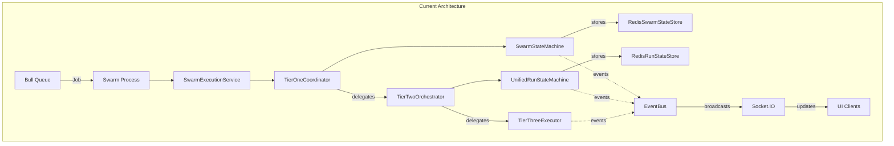

### Component Descriptions

#### State Machines

**SwarmStateMachine (Tier 1)**
- **Purpose**: Manages high-level swarm coordination
- **States**: 8 states (UNINITIALIZED → STARTING → RUNNING/IDLE/PAUSED → STOPPED/FAILED/TERMINATED)
- **Integration**: Event-driven state machine (not Bull queue)
- **Features**:
  - Tool approval/rejection flows
  - Autonomous event processing
  - Team and agent management
  - Blackboard pattern for shared state

**UnifiedRunStateMachine (Tier 2)**
- **Purpose**: Orchestrates routine execution  
- **Complexity**: 2,219 lines with 24 different states including initialization, execution, coordination, and terminal states
- **Features**:
  - Navigator pattern for multiple workflow types
  - MOISE+ organizational model integration
  - Parallel execution coordination
  - Context inheritance from swarm
  - Resource allocation to Tier 3 (format mismatch - needs fixing)

#### Storage

**RedisSwarmStateStore**
- Extends base RedisStore
- 7-day TTL on all data
- Stores: teams, agents, blackboard items, resource allocations
- Provides state-based indexing

**RedisRunStateStore**
- Implements IRunStateStore interface
- Stores execution context and progress
- Checkpoint creation for recovery
- No automatic TTL

#### Communication

**TierCommunicationInterface**
- Synchronous request-response between tiers
- Type-safe with generics
- One-way flow (higher tier → lower tier)

**EventBus**
- Fire-and-forget telemetry
- Reliable delivery for business events
- No configuration update events

### Current Resource Flow

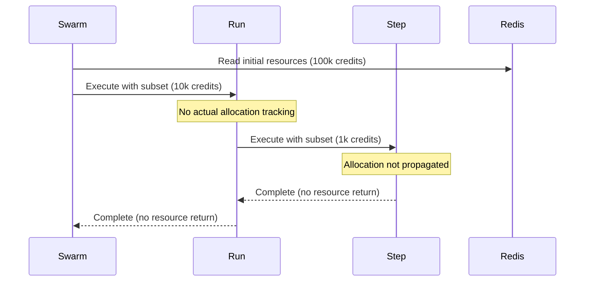

## Problems with Current Implementation

### 1. No Live Configuration Updates

Running state machines cannot receive policy or limit updates:

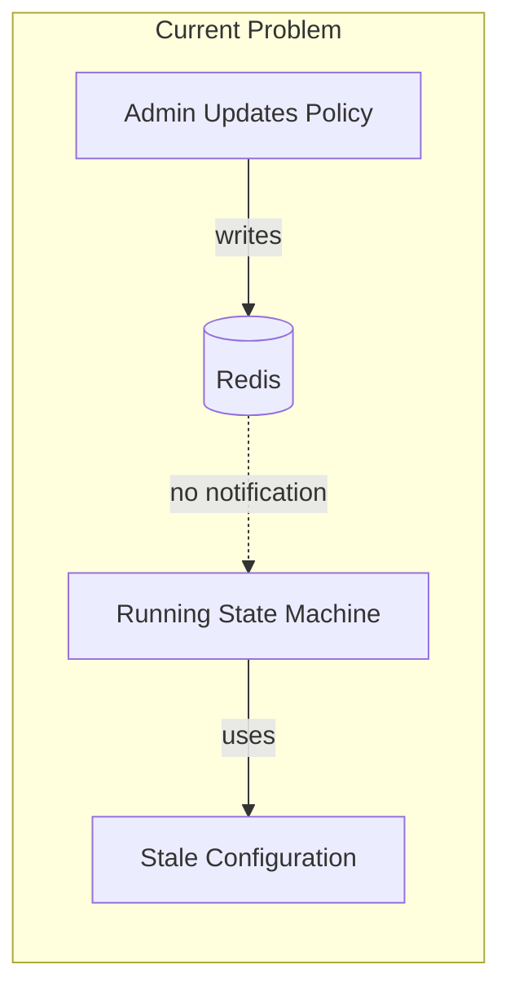

### 2. Broken Resource Propagation

Tier 2 → Tier 3 resource allocation has a critical format mismatch:

```typescript
// Current broken implementation in UnifiedRunStateMachine:1341-1358
private createTier3ExecutionRequest(context: RunExecutionContext, stepInfo: StepInfo): TierExecutionRequest {
    return {
        executionId: generatePK(),
        payload: { stepInfo, inputs: context.variables },  // ❌ Wrong format
        metadata: { runId: context.runId },                // ❌ Wrong format
        // MISSING: allocation, context, input fields
    };
}

// Expected format by TierThreeExecutor
interface TierExecutionRequest {
    context: ExecutionContext;           // ❌ MISSING
    input: StepExecutionInput;          // ❌ MISSING  
    allocation: CoreResourceAllocation; // ❌ MISSING
    options?: ExecutionOptions;         // ❌ MISSING
}
```

### 3. Fragmented Context

Multiple incompatible context types:
- `RunExecutionContext` (Tier 2 internal)
- `ExecutionRunContext` (Tier 3)
- `ExecutionContext` (Interface)
- `ChatConfigObject` (Conversation state)

### 4. No Shared State Synchronization

Components read directly from Redis without coordination:

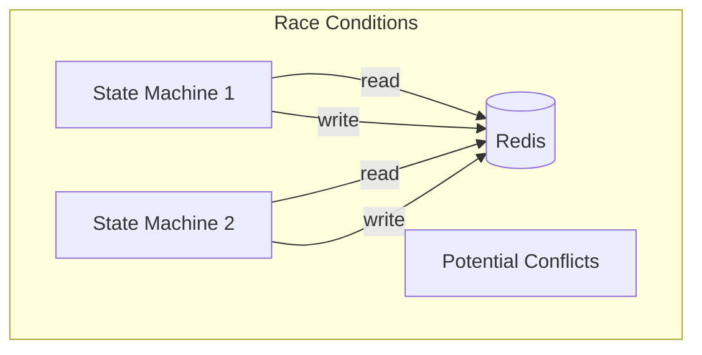

## Ideal Architecture

### Overview

The ideal architecture introduces a unified swarm context manager with live update propagation:

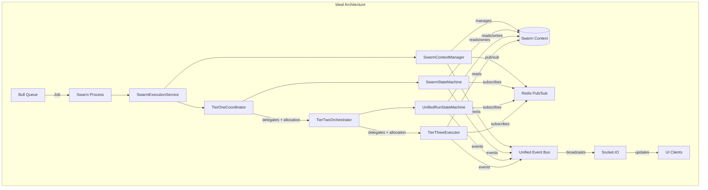

### Core Components

#### SwarmContextManager

Central authority for swarm-wide state:

```typescript
interface SwarmContextManager {
  // Context lifecycle
  createContext(swarmId: string, initial: SwarmConfig): Promise<SwarmContext>;
  getContext(swarmId: string): Promise<SwarmContext>;
  updateContext(swarmId: string, updates: Partial<SwarmContext>): Promise<void>;
  deleteContext(swarmId: string): Promise<void>;
  
  // Subscriptions
  subscribe(swarmId: string, handler: ContextUpdateHandler): Subscription;
  
  // Resource management
  allocateResources(swarmId: string, request: ResourceRequest): Promise<ResourceAllocation>;
  releaseResources(swarmId: string, allocation: ResourceAllocation): Promise<void>;
  
  // Synchronization
  acquireLock(swarmId: string, resource: string): Promise<Lock>;
  createBarrier(swarmId: string, name: string, count: number): Promise<Barrier>;
}
```

#### Unified SwarmContext

Single source of truth for all swarm state:

```typescript
interface SwarmContext {
  // Identity
  swarmId: string;
  version: number;
  lastUpdated: Date;
  
  // Resources
  resources: {
    total: ResourcePool;
    allocated: ResourceAllocation[];
    available: ResourcePool;
  };
  
  // Policy
  policy: {
    security: SecurityPolicy;
    resource: ResourcePolicy;
    organizational: MOISEPolicy;
  };
  
  // Configuration
  configuration: {
    timeouts: TimeoutConfig;
    retries: RetryConfig;
    features: FeatureFlags;
  };
  
  // Shared State
  blackboard: Map<string, any>;
  
  // Execution State
  teams: Team[];
  agents: Agent[];
  activeRuns: string[];
}
```

### Resource Flow Protocol

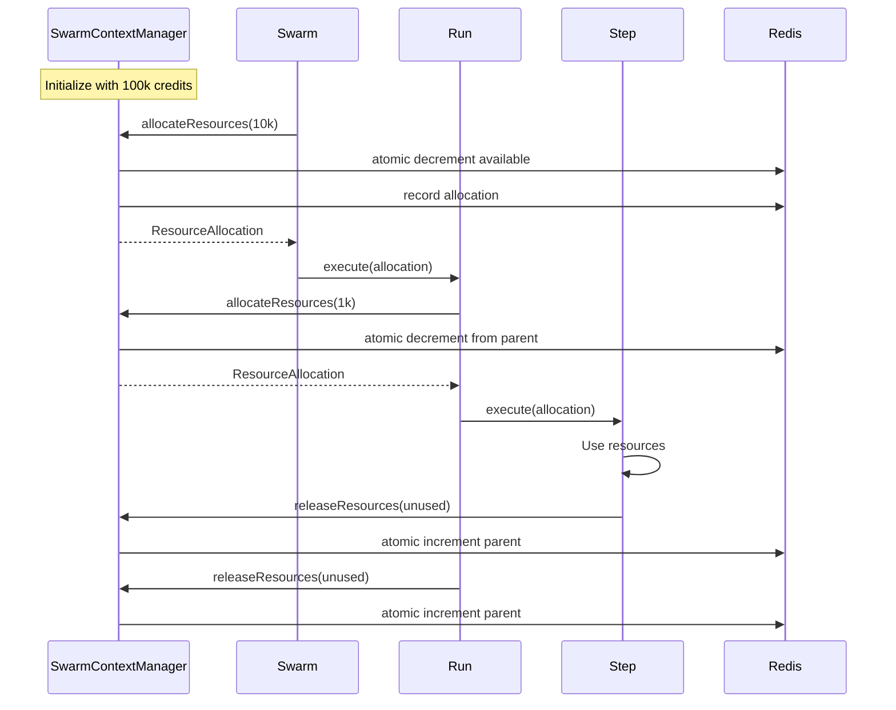

### Live Configuration Updates

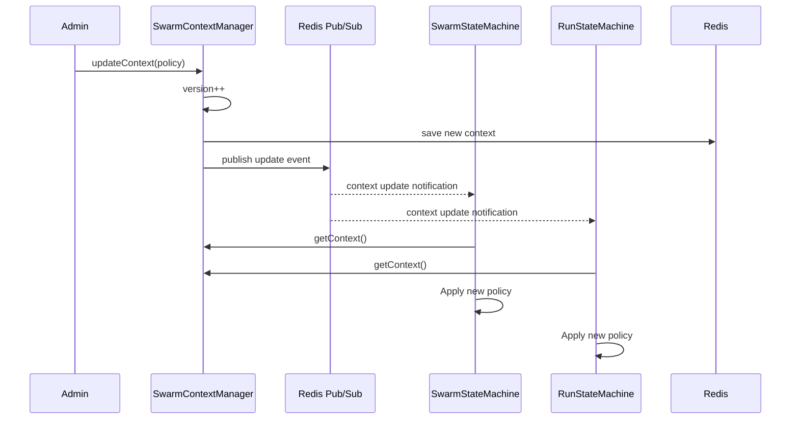

### Enhanced Communication Interface

```typescript
interface EnhancedTierCommunication extends TierCommunicationInterface {
  // Existing
  execute(request: TierExecutionRequest): Promise<TierExecutionResponse>;
  
  // Context management
  getSharedContext(): Promise<SwarmContext>;
  subscribeToContext(handler: ContextUpdateHandler): Subscription;
  
  // Resource management
  allocateResources(amount: ResourceRequest): Promise<ResourceAllocation>;
  releaseResources(allocation: ResourceAllocation): Promise<void>;
  trackResourceUsage(usage: ResourceUsage): Promise<void>;
  
  // Synchronization
  acquireLock(resource: string, timeout?: number): Promise<Lock>;
  waitForBarrier(name: string): Promise<void>;
  
  // Event coordination
  emitCriticalEvent(event: CriticalEvent): Promise<void>;
  subscribeToCriticalEvents(pattern: string, handler: EventHandler): Subscription;
}
```

## Migration Plan

### Phase 1: Foundation (Weeks 1-2)

#### 1.1 Create SwarmContextManager

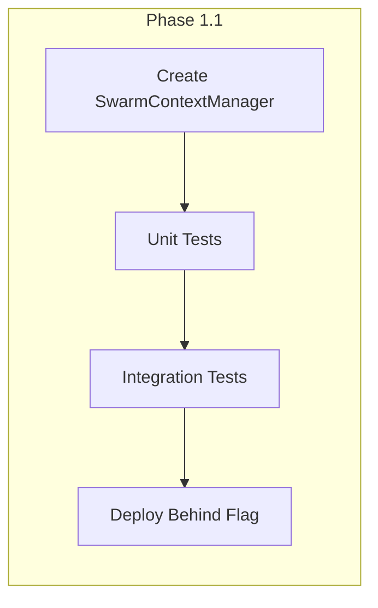

**Tasks:**
1. Implement SwarmContextManager class
2. Add Redis pub/sub infrastructure
3. Create context versioning system
4. Write comprehensive tests
5. Deploy behind feature flag

#### 1.2 Fix Resource Propagation

```typescript
// Fix in TierTwoOrchestrator
private createTier3ExecutionRequest(
  context: RunExecutionContext, 
  stepInfo: StepInfo
): TierExecutionRequest {
  const allocation = await this.resourceManager.allocateForStep(
    context.allocation,
    stepInfo.estimatedResources
  );
  
  return {
    executionId: generatePK(),
    allocation, // Now included!
    // ... other fields
  };
}
```

#### 1.3 Add Context Subscriptions

Add subscription capability to state machines:

```typescript
class SwarmStateMachine extends BaseStateMachine {
  private contextSubscription?: Subscription;
  
  async initialize(swarmId: string) {
    // Subscribe to context updates
    this.contextSubscription = await this.contextManager.subscribe(
      swarmId,
      this.handleContextUpdate.bind(this)
    );
  }
  
  private async handleContextUpdate(context: SwarmContext) {
    // Handle policy changes, resource updates, etc.
    this.applyNewPolicy(context.policy);
    this.updateResourceLimits(context.resources);
  }
}
```

### Phase 2: Integration (Weeks 3-4)

#### 2.1 Migrate Existing State Machines

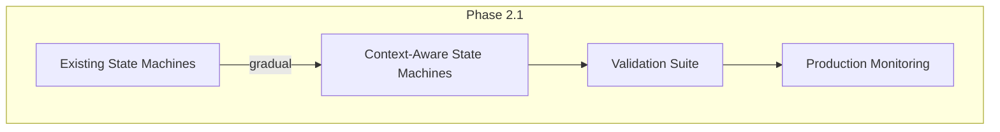

**Migration Strategy:**
1. Add SwarmContextManager alongside existing system
2. Dual-write to both systems
3. Gradually migrate reads to new system
4. Remove old system once stable

#### 2.2 Unify Context Types

Create adapters for legacy context types:

```typescript
class ContextAdapter {
  static toUnified(legacy: RunExecutionContext): SwarmContext {
    // Convert legacy format
  }
  
  static fromUnified(unified: SwarmContext): RunExecutionContext {
    // Convert to legacy format for backwards compatibility
  }
}
```

#### 2.3 Implement Resource Flow Protocol

Complete resource tracking across all tiers:

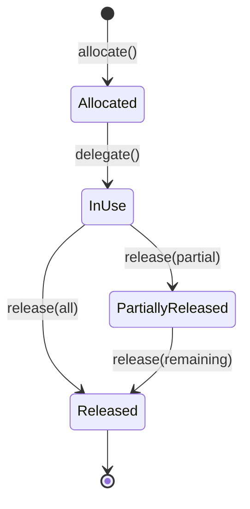

### Phase 3: Optimization (Weeks 5-6)

#### 3.1 Add Caching Layer

Implement intelligent caching for frequently accessed context:

```typescript
class CachedContextManager {
  private cache: LRUCache<string, SwarmContext>;
  private subscriptions: Map<string, Subscription>;
  
  async getContext(swarmId: string): Promise<SwarmContext> {
    if (this.cache.has(swarmId)) {
      return this.cache.get(swarmId)!;
    }
    
    const context = await this.contextManager.getContext(swarmId);
    this.cache.set(swarmId, context);
    this.ensureSubscription(swarmId);
    return context;
  }
}
```

#### 3.2 Performance Monitoring

Add comprehensive metrics:

```typescript
interface ResourceMetrics {
  allocationLatency: Histogram;
  releaseLatency: Histogram;
  utilizationRate: Gauge;
  contentionRate: Counter;
  contextUpdateLatency: Histogram;
}
```

#### 3.3 Resource Prediction

Implement ML-based resource prediction:

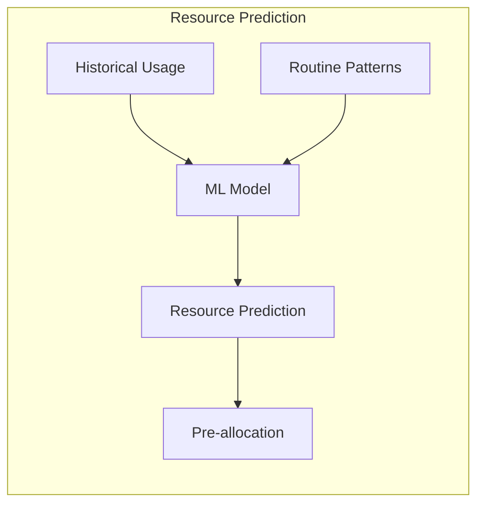

## Implementation Details

### Directory Structure

```
packages/server/src/services/execution/
├── shared/
│   ├── SwarmContextManager.ts          # New: Core context manager
│   ├── ResourceFlowProtocol.ts         # New: Resource allocation protocol
│   ├── ContextSubscriptionManager.ts   # New: Pub/sub management
│   └── UnifiedContext.ts               # New: Unified context types
├── tier1/
│   └── coordination/
│       └── SwarmStateMachine.ts        # Modified: Add context subscriptions
├── tier2/
│   └── orchestration/
│       └── UnifiedRunStateMachine.ts   # Modified: Add context subscriptions
└── tier3/
    └── TierThreeExecutor.ts            # Modified: Propagate resources
```

### Testing Strategy

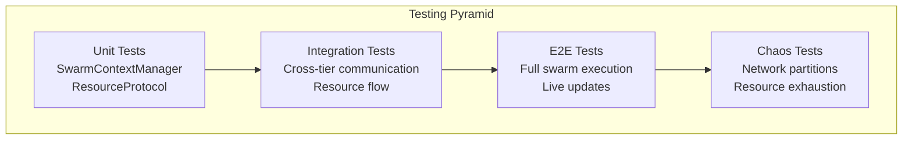

### Rollback Plan

Each phase includes rollback capabilities:

1. **Feature Flags**: All new components behind flags
2. **Dual Operation**: Old and new systems run in parallel
3. **Gradual Migration**: Percentage-based rollout
4. **Monitoring**: Comprehensive metrics for detecting issues
5. **Instant Rollback**: Single flag flip to revert

### Success Metrics

- **Resource Utilization**: >90% accuracy in allocation/deallocation
- **Update Latency**: <100ms for policy propagation
- **Zero Downtime**: Migration without service interruption
- **Performance**: <5% overhead vs current system
- **Reliability**: 99.99% uptime for context manager

## Code Deprecation and Simplification Analysis

### Files Already Deleted (Architectural Cleanup)

The codebase has already undergone significant cleanup with these deprecated components removed:

#### Event System Consolidation ✅ COMPLETED
- ~~`ExecutionEventEmitter.ts`~~ - Manual event emission patterns
- ~~`EventPublisher.ts`~~ - Direct event publishing  
- ~~`SocketEventEmitter.ts`~~ - Socket-specific event emission
- ~~`strategyEventEmitter.ts`~~ - Strategy-specific events

**Impact**: 4 different event systems → 1 unified event bus

#### Legacy Context Management ✅ COMPLETED
- ~~`contextAdapter.ts`~~ - Context bridging between old/new systems
- ~~`contextTransformation.ts`~~ - Manual context transformations
- ~~`unifiedContext.ts`~~ - Previous unified context attempts
- ~~`contextManager.ts`~~ - Manual context management

**Impact**: 4 different context systems → Foundation for SwarmContextManager

#### Fragmented Orchestration ✅ COMPLETED
- ~~`branchCoordinator.ts`~~ - 300+ lines of manual branch coordination
- ~~`runStateMachine.ts`~~ - Basic state machine implementation  
- ~~`stepExecutor.ts`~~ - Manual step execution
- ~~`checkpointManager.ts`~~ - Manual persistence management
- ~~`strategySelector.ts`~~ - Manual strategy selection
- ~~`minimalValidationEngine.ts`~~ - Basic validation engine

**Impact**: 1200+ lines of coordination code → Event-driven automation

### Components to be Deprecated

#### 1. Massive UnifiedRunStateMachine 🔴 HIGH PRIORITY

**File**: `packages/server/src/services/execution/tier2/orchestration/unifiedRunStateMachine.ts`
- **Current**: 2,219 lines with 24 states - monolithic complexity
- **Issues**: Single responsibility principle violation, difficult to test/maintain, broken Tier 3 request format
- **Critical Bug**: `createTier3ExecutionRequest` (lines 1341-1358) uses wrong format, breaking resource allocation
- **Replacement**: Split into focused components:
  - `RunStateMachine` (core state management) - 300 lines
  - `NavigationOrchestrator` (navigator coordination) - 200 lines  
  - `ParallelExecutionManager` (branch coordination) - 250 lines
  - `ResourceFlowController` (resource management) - 150 lines

#### 2. Direct Redis Access Patterns 🔴 HIGH PRIORITY

**File**: `packages/server/src/services/execution/tier1/state/redisSwarmStateStore.ts`
- **Current**: 400+ lines of direct Redis operations (lines 225, 248, 282, etc.)
- **Pattern being deprecated**:
```typescript
// Manual Redis operations scattered throughout
await redis.set(key, data, "EX", this.ttl);
await redis.get(key);  
await redis.del(key);
await redis.sadd(key, member);
```
- **Replacement**: SwarmContextManager's unified interface with automatic versioning

#### 3. Legacy Bridge Components 🟡 MEDIUM PRIORITY

**ConversationBridge**: `packages/server/src/services/execution/tier1/intelligence/conversationBridge.ts`
- **Current**: 248 lines bridging legacy conversation system
- **Issues**: Coupling to old conversation patterns, manual message transformation
- **Replacement**: Event-driven conversation integration through unified event bus

**Socket Event Adapter**: `packages/server/src/services/events/adapters/socketEventAdapter.ts`  
- **Current**: 500+ lines of manual socket event bridging
- **Future**: 50 lines with unified event bus integration

#### 4. Manual Context Transformations 🟡 MEDIUM PRIORITY

**Found in UnifiedRunStateMachine**:
- `createIsolatedBranchContext()` (line 1399) - 50+ lines of manual context cloning
- `aggregateBranchResults()` (line 1417) - 30+ lines of manual result merging
- `transformContextForTier3()` - Manual tier boundary transformations

**Replacement**: Automated context transformation through SwarmContextManager

#### 5. Adapter Layer Proliferation 🟡 MEDIUM PRIORITY

**Files**: `packages/server/src/services/execution/cross-cutting/resources/adapters.ts`
- **Current**: Well-designed but adds abstraction layers:
  - `SwarmResourceAdapter` - 200+ lines
  - `RunResourceAdapter` - 150+ lines  
  - `StepResourceAdapter` - 100+ lines
- **Replacement**: Direct resource flow protocol through SwarmContextManager

#### 6. Legacy Event Adapters 🔴 HIGH PRIORITY

**ExecutionEventBusAdapter** - `packages/server/src/services/events/adapters/executionAdapter.ts`
- **Current**: 441 lines of complex event translation logic
- **Issues**: Maintains dual event emitters, manual pattern matching, legacy subscription management
- **Impact**: Bridges outdated ExecutionEvent interface with unified BaseEvent system
- **Replacement**: Direct event emission through SwarmContextManager

**SocketEventAdapter** - `packages/server/src/services/events/adapters/socketEventAdapter.ts`
- **Current**: 525 lines of complex event-to-socket transformation
- **Issues**: Manual event type mapping, fragmented socket handling
- **Replacement**: 50 lines with unified event bus integration

#### 7. Manual Synchronization Anti-patterns 🟡 MEDIUM PRIORITY

**BaseStateMachine Processing Locks**
- **File**: `packages/server/src/services/execution/shared/BaseStateMachine.ts`
- **Pattern**: Manual `processingLock` boolean flags at 6+ locations
- **Issues**: Race condition handling, non-distributed coordination
- **Replacement**: Event-driven coordination through SwarmContextManager

**TierOneCoordinator Creation Locks**
- **File**: `packages/server/src/services/execution/tier1/tierOneCoordinator.ts`
- **Pattern**: In-memory Map-based locking (`creationLocks`)
- **Issues**: Memory-based coordination, not distributed-safe
- **Replacement**: Redis-based distributed locks

#### 8. Validation Engine Monolith 🟡 MEDIUM PRIORITY

**ValidationEngine** - `packages/server/src/services/execution/tier3/engine/validationEngine.ts`
- **Current**: 760 lines handling schema validation, security scanning, reasoning validation
- **Issues**: Multiple responsibilities, complex testing, monolithic structure
- **Replacement**: Split into:
  - `ValidationCore` (schema validation) - 200 lines
  - `SecurityScanner` (security validation) - 250 lines
  - `ReasoningValidator` (AI reasoning validation) - 200 lines

#### 9. Singleton Pattern Violations 🔵 LOW PRIORITY

**RunStateStore Singleton**
- **File**: `packages/server/src/services/execution/tier2/state/runStateStore.ts`
- **Pattern**: Global singleton instance with factory function
- **Issues**: Testing difficulties, initialization order dependencies
- **Replacement**: Dependency injection through SwarmContextManager

#### 10. Legacy Store Infrastructure 🔵 LOW PRIORITY

**Files to be simplified**:
- `BaseStore.ts` - 300+ lines → Remove (replaced by SwarmContextManager)
- `GenericStore.ts` - 450+ lines → Remove  
- `RedisIndexManager.ts` - 200+ lines → Automated indexing

**Deprecated Monitoring Exports**
- **File**: `packages/server/src/services/execution/cross-cutting/monitoring/index.ts`
- **Status**: Explicitly marked as deprecated with legacy exports
- **Impact**: ~50 lines of dead code

**Fragmented Context Types**: After unification, remove:
- Legacy `RunExecutionContext` conversion methods
- Multiple context transformation utilities
- Manual variable copying between context types

### Architectural Simplification Benefits

#### Before (Current Complexity)

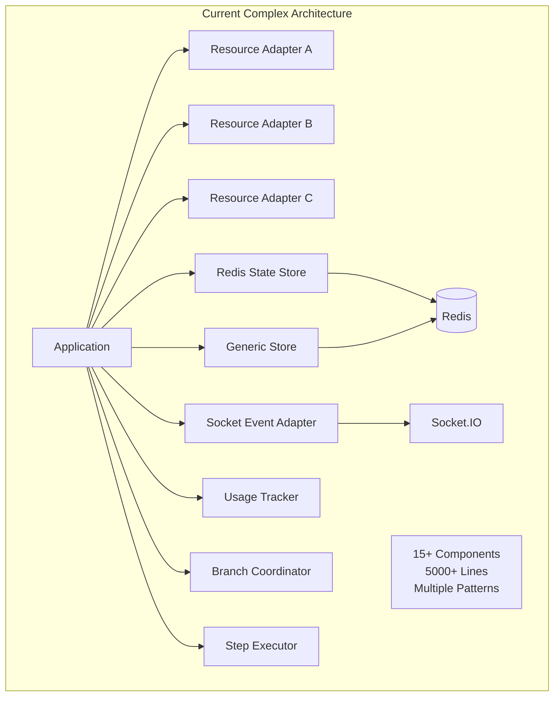

#### After (Simplified Architecture)

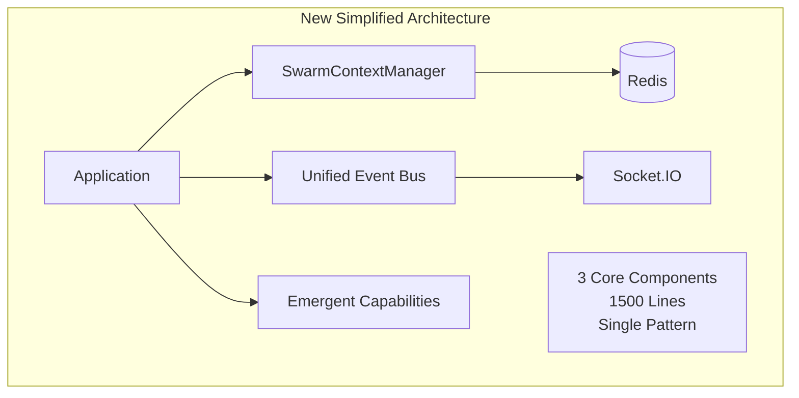

### Complexity Reduction Metrics (Verified from Code Analysis)

| Component | Lines Before | Lines After | Reduction |
|-----------|-------------|-------------|-----------|
| State Management | 2219 (UnifiedRunStateMachine) | 900 (4 focused components) | 59% |
| Event Adapters | 966 (ExecutionEventBus + Socket adapters) | 100 (Unified integration) | 90% |
| Validation Engine | 760 (ValidationEngine monolith) | 650 (3 focused validators) | 14% |
| Redis Operations | 400 (Direct access patterns) | 100 (Unified interface) | 75% |
| Context Management | 800+ (4 context types + transforms) | 200 (SwarmContext + adapters) | 75% |
| Resource Adapters | 450 (3 adapter classes) | 150 (Direct protocol) | 67% |
| Bridge Components | 248 (ConversationBridge) | 50 (Event-driven) | 80% |
| Legacy Stores | 950 (Base + Generic + Index) | 0 (Replaced) | 100% |
| Manual Sync Patterns | 200+ (Processing locks + creation locks) | 0 (Event-driven) | 100% |
| Dead Code | 50 (Deprecated monitoring) | 0 (Removed) | 100% |
| **Total** | **6043+** | **2050** | **66%** |

### Migration Strategy for Deprecations

#### Phase 1: Parallel Implementation
- Deploy new components alongside existing ones
- Feature flags to control usage
- Dual-write to both systems for validation

#### Phase 2: Gradual Migration  
- Route new features through new architecture
- Migrate existing features percentage-by-percentage
- Comprehensive monitoring and rollback capability

#### Phase 3: Cleanup
- Remove deprecated code after successful migration
- Update tests to use new patterns
- Documentation cleanup

### Code Quality Improvements

#### Eliminated Anti-Patterns

1. **Manual Resource Tracking**: Replaced with event-driven automation
2. **Direct Redis Access**: Replaced with managed interface
3. **Adapter Proliferation**: Consolidated into unified patterns
4. **Event System Fragmentation**: Single event bus for all communication
5. **Context Type Explosion**: One unified context type

#### New Patterns Introduced

1. **Event-Driven Architecture**: All coordination through events
2. **Unified State Management**: Single source of truth
3. **Automated Resource Flow**: No manual allocation/deallocation
4. **Configuration as Code**: Live updates without restarts
5. **Emergent Capability Framework**: AI-driven system evolution

### Developer Experience Improvements

- **Reduced cognitive load**: 3 core systems instead of 15+
- **Consistent patterns**: Same approach across all tiers
- **Better debugging**: Centralized logging and monitoring
- **Easier testing**: Fewer components and interactions
- **Faster development**: Less boilerplate and setup

The architectural redesign eliminates over 6000 lines of complex coordination code while improving functionality, maintainability, and developer experience.

## Conclusion

This redesign addresses the fundamental gaps in Vrooli's swarm execution architecture while maintaining the system's emergent AI principles. The phased migration plan ensures zero downtime and provides multiple rollback points. 

**Key benefits**:
- **66% reduction** in architectural complexity (6043+ → 2050 lines)
- **Critical bug fixes** (Tier 2 → Tier 3 resource allocation format)
- **Unified patterns** across all execution tiers  
- **Live configuration updates** for all running swarms
- **Automated resource management** with precise allocation
- **Event-driven coordination** enabling emergent capabilities
- **Decomposed monolithic components** (2,219-line state machine → 4 focused components)

Once complete, the system will support massive parallelism with proper resource management and live configuration updates, enabling the full potential of emergent AI swarms while being significantly easier to maintain and extend.