# Inter-Tier Communication Architecture

This directory contains the comprehensive documentation for communication between Vrooli's three-tier execution architecture. This README serves as the navigation hub for understanding and implementing the communication system. All types, interfaces, and enums referenced throughout this documentation are centrally defined in [types/core-types.ts](types/core-types.ts).

**Quick Start**: New to the architecture? Start with the [Visual Architecture Overview](#visual-architecture-overview) below, then follow the [Implementation Reading Order](#implementation-reading-order).

## Visual Architecture Overview

```mermaid
graph TB
    subgraph "Tier 1: Coordination Intelligence"
        T1[SwarmStateMachine<br/>🐝 Natural language reasoning<br/>👥 Team coordination<br/>🎯 Goal decomposition]
    end
    
    subgraph "Tier 2: Process Intelligence" 
        T2[RunStateMachine<br/>🔄 Routine orchestration<br/>📊 State management<br/>⚡ Parallel coordination]
    end
    
    subgraph "Tier 3: Execution Intelligence"
        T3[UnifiedExecutor<br/>🤖 Strategy-aware execution<br/>🔧 Tool integration<br/>💰 Resource management]
    end
    
    subgraph "Communication Framework"
        ToolRouting[Tool Routing Communication<br/>🎯 T1→T2 coordination<br/>🔧 CompositeToolRunner dispatch]
        
        Direct[Direct Service Interface<br/>⚡ T2→T3 execution<br/>📊 High-performance calls]
        
        Events[Event-Driven Messaging<br/>📡 Cross-tier coordination<br/>🔄 Asynchronous communication]
        
        State[State Synchronization<br/>💾 Context management<br/>🔄 Distributed consistency]
    end
    
    %% Primary communication flows
    T1 -->|Tool Routing| ToolRouting
    ToolRouting --> T2
    T2 -->|Direct Calls| Direct
    Direct --> T3
    
    %% Cross-tier coordination
    Events -.->|Monitor & Coordinate| T1
    Events -.->|Monitor & Coordinate| T2  
    Events -.->|Monitor & Coordinate| T3
    
    State -.->|Context Sharing| T1
    State -.->|Context Sharing| T2
    State -.->|Context Sharing| T3
    
    classDef tier fill:#e3f2fd,stroke:#1565c0,stroke-width:3px
    classDef pattern fill:#e8f5e8,stroke:#2e7d32,stroke-width:2px
    
    class T1,T2,T3 tier
    class ToolRouting,Direct,Events,State pattern
```

## Implementation Reading Order

**Prerequisites**: Read [Main Execution Architecture](../../README.md) for complete architectural context.

### **Phase 1: Foundation (Must Read First)**
1. **[Centralized Type System](types/core-types.ts)** - Single source of truth for all interfaces
2. **[Communication Patterns](communication-patterns.md)** - Detailed definitions, selection framework, and coordination examples for the four primary communication patterns: MCP Tool Communication, Direct Service Interface, Event-Driven Messaging, and State Synchronization.
3. **[Tier Interface Contracts](tier-interfaces.md)** - Interface contracts between tiers

### **Phase 2: Core Decision Support Systems**
4. **[Error Classification Algorithm](decision-trees/error-classification-severity.md)** - Systematic error classification
5. **[Recovery Strategy Selection](decision-trees/recovery-strategy-selection.md)** - Recovery strategy algorithms
6. **[Resource Conflict Resolution](decision-trees/resource-conflict-resolution.md)** - Resource conflict algorithms

### **Phase 3: Core Communication Implementation Details**
7. **[MCP Tool Integration](implementation/mcp-integration.md)** - T1→T2 MCP tool bridge and `CompositeToolRunner` details.
8. **[Event Communication Protocol](event-bus-protocol.md)** - Asynchronous messaging, event ordering, barrier synchronization, subscription, and routing.
9. **[State Synchronization](state-synchronization.md)** - Context management, inheritance, caching, and consistency protocols.

### **Phase 4: Cross-Cutting Concerns**
10. **[Security Boundaries and Context Propagation](security-boundaries.md)** - Security model, permission framework, and context propagation.
11. **[Resource Coordination](resource-coordination.md)** - Hierarchical resource management, allocation, and conflict resolution.
12. **[Performance Characteristics and Optimization](performance-characteristics.md)** - Performance targets, monitoring, and optimization strategies.
13. **[Error Propagation and Recovery Framework](error-propagation.md)** - Comprehensive error handling, propagation, and recovery procedures.

### **Phase 5: Integration & Validation**
- **[Circuit Breaker Integration](implementation/circuit-breakers.md)** - Fault isolation patterns and integration.
- **[Integration Map and Validation](integration-map.md)** - Complete end-to-end flows, validation framework, and troubleshooting.
- **[Failure Scenarios and Recovery Procedures](failure-scenarios/README.md)** - Analysis of critical failure modes and detailed recovery steps.

## Communication Architecture Principles

The communication architecture is built upon four primary patterns, detailed in [Communication Patterns](communication-patterns.md), and guided by key design principles:
1. **🎯 Automatic Tool Routing**: T1 uses tool routing that seamlessly handles OpenAI and MCP tools.
2. **⚖️ Hierarchical Resource Management**: Clear resource ownership and budget inheritance, detailed in [Resource Coordination](resource-coordination.md).
3. **🔄 Event-Driven Intelligence**: Capabilities emerge from specialized agents, not hard-coded logic, as described in [Event Bus Protocol](event-bus-protocol.md).
4. **🛡️ Security by Design**: Trust boundaries enforced at every tier transition, outlined in [Security Boundaries](security-boundaries.md).
5. **📊 Graceful Degradation**: System continues operation through intelligent failure recovery, managed by the [Error Propagation Framework](error-propagation.md) and detailed in [Failure Scenarios](failure-scenarios/README.md).
6. **🔍 Observable by Default**: Comprehensive monitoring and audit trails, specified in [Performance Characteristics](performance-characteristics.md).

## Documentation Structure

This documentation is structured to guide developers from foundational concepts to specific implementation details and validation procedures. Key areas include:

- **Core Patterns**: [Communication Patterns](communication-patterns.md)
- **Interfaces**: [Tier Interfaces](tier-interfaces.md) and the [Centralized Type System](types/core-types.ts)
- **Cross-Cutting Concerns**:
    - [Error Propagation](error-propagation.md)
    - [Resource Coordination](resource-coordination.md)
    - [State Synchronization](state-synchronization.md)
    - [Security Boundaries](security-boundaries.md)
    - [Performance Characteristics](performance-characteristics.md)
- **Implementation Details**:
    - [MCP Tool Integration](implementation/mcp-integration.md)
    - [Circuit Breakers](implementation/circuit-breakers.md)
- **Decision Support**:
    - [Error Classification](decision-trees/error-classification-severity.md)
    - [Recovery Strategy Selection](decision-trees/recovery-strategy-selection.md)
    - [Resource Conflict Resolution](decision-trees/resource-conflict-resolution.md)
- **Validation and Failure Handling**:
    - [Integration Map](integration-map.md)
    - [Critical Component Failures](failure-scenarios/critical-component-failures.md)

## Usage Guidelines

### **For New Implementation**
1. **Start with Prerequisites**: Read [Main Execution Architecture](../../README.md) for context.
2. **Follow Reading Order**: Use the systematic reading order above.
3. **Apply Decision Support**: Use decision trees for systematic problem solving.
4. **Validate Implementation**: Use [Integration Map](integration-map.md) for comprehensive validation.

### **For Understanding Architecture**
1. **Core Patterns**: Understand the [Communication Patterns](communication-patterns.md).
2. **Interface Contracts**: Review [Tier Interfaces](tier-interfaces.md).
3. **Cross-Cutting Concerns**: Study security, resources, performance, and error handling integration by referring to their respective authoritative documents.

### **For Troubleshooting**
1. **Use Integration Map**: The [Integration Map](integration-map.md) provides the primary troubleshooting framework.
2. **Apply Decision Trees**: Use systematic algorithms for error classification and recovery.
3. **Review Failure Scenarios**: Consult [Critical Component Failures](failure-scenarios/critical-component-failures.md) for specific issues.

## Related Documentation

- **[Main Execution Architecture](../../README.md)** - Complete three-tier execution architecture overview
- **[Individual Tier Documents](../tier1-coordination-intelligence.md)** - Tier-specific implementation details

This communication architecture ensures optimal operation across all tiers while providing comprehensive integration capabilities and robust error handling for systematic implementation from scratch.