# Error Severity Classification Decision Tree

This document provides a decision tree to guide the classification of error severity within the Vrooli execution architecture. Accurate severity classification is crucial for selecting appropriate recovery and escalation strategies.

## Severity Decision Tree

This flowchart helps determine the severity of a detected error based on its impact on the system and data.

```mermaid
flowchart TD
    Start[Error Detected] --> SystemCheck{System Still<br/>Functional?}
    
    SystemCheck -->|No| Fatal[FATAL<br/>🔴 System failure<br/>Initiate emergency stop<br/>Alert administrators immediately]
    SystemCheck -->|Yes| ImpactCheck{Multiple Components<br/>or Runs Affected?}
    
    ImpactCheck -->|Yes| CriticalCheck{Data Loss, Corruption,<br/>or Security Risk?}
    ImpactCheck -->|No| SingleOperationCheck{Single Operation<br/>or Step Failed?}
    
    CriticalCheck -->|Yes| Critical[CRITICAL<br/>🟠 Significant impact<br/>Immediate attention required<br/>Attempt automated recovery<br/>Escalate if recovery fails]
    CriticalCheck -->|No| HighError[ERROR<br/>🟡 Multiple non-critical failures<br/>Attempt automated recovery<br/>Monitor closely, escalate on pattern]
    
    SingleOperationCheck -->|Yes| RecoverableCheck{Error Type<br/>Known & Recoverable?}
    SingleOperationCheck -->|No| UnclearImpactError[ERROR<br/>🟡 Uncertain impact<br/>Investigate and classify further<br/>Attempt safe recovery if possible]

    RecoverableCheck -->|Yes| StandardError[ERROR<br/>🟢 Standard recoverable error<br/>Attempt automated recovery<br/>Log for monitoring]
    RecoverableCheck -->|No| Warning[WARNING<br/>🔵 Minor, unexpected issue<br/>Log for analysis<br/>Monitor for recurrence]

    classDef fatal fill:#ffebee,stroke:#c62828,color:#c62828,stroke-width:2px;
    classDef critical fill:#fff3e0,stroke:#f57c00,color:#f57c00,stroke-width:2px;
    classDef error fill:#fffde7,stroke:#fbc02d,color:#fbc02d,stroke-width:2px;
    classDef warning fill:#e3f2fd,stroke:#1565c0,color:#1565c0,stroke-width:2px;

    class Start,SystemCheck,ImpactCheck,CriticalCheck,SingleOperationCheck,RecoverableCheck,UnclearImpactError,HighError,StandardError,Warning default
    class Fatal fatal
    class Critical critical
    class HighError error
    class UnclearImpactError error
    class StandardError error
    class Warning warning
```

## Severity Levels Defined

*   **FATAL (🔴)**: Complete system failure or imminent catastrophic risk. Requires immediate system-wide halt and manual intervention. No automated recovery is typically possible at this stage.
*   **CRITICAL (🟠)**: Severe error with significant impact, such as potential data loss, security breach, or failure of a major component affecting multiple runs/swarms. Requires immediate attention, robust automated recovery attempts, and escalation if recovery is not swift.
*   **ERROR (🟡)**: A failure that has occurred, impacting functionality but not (yet) critical or fatal. This could be a single significant operation failure, multiple related non-critical failures, or an error whose full impact is initially unclear. Automated recovery is the primary response.
*   **WARNING (🔵)**: A minor, unexpected issue or a deviation from normal behavior that does not immediately impact functionality but could lead to problems if unaddressed. Typically logged for monitoring and analysis; may trigger alerts if patterns emerge.
*   **INFO (⚪️)**: (Not explicitly in the tree but a common level) Informational messages about system operation, not indicative of a problem.

## Usage

This decision tree should be used by error handling protocols (see `error-propagation.md`) to consistently classify the severity of runtime errors. The output of this classification (`ErrorSeverity` enum) then drives the selection of appropriate `RecoveryStrategy` and escalation procedures. 