# MCP Integration Implementation

This document provides comprehensive implementation guidance for integrating the Model Context Protocol (MCP) to enable natural communication between Tier 1 agents and Tier 2 services using the actual Vrooli implementation architecture.

**Prerequisites**:
- Read [Communication Patterns](../communication-patterns.md#mcp-tool-communication) to understand MCP tool communication paradigm
- Review [Tier Interfaces](../tier-interfaces.md#tier-1--tier-2-interface) for tier communication contracts
- Study [Types System](../types/core-types.ts) for MCP-related interface definitions

**All MCP integration types are defined in the centralized type system** at [types/core-types.ts](types/core-types.ts).

## Tool Execution Architecture

The MCP integration uses a layered routing architecture that automatically determines whether agent tool calls should be handled by OpenAI built-in services or Vrooli's internal MCP tools.

### **Tool Routing Flow**

```mermaid
graph TB
    subgraph "Agent Tool Call"
        Agent[AI Agent<br/>🤖 Natural language reasoning<br/>📋 Tool selection<br/>🔧 Parameter generation]
    end

    subgraph "Tool Routing Layer"
        CompositeRunner[CompositeToolRunner<br/>🔄 Route based on tool type<br/>📊 Unified tool interface<br/>⚡ Seamless switching]
        
        OpenAIRunner[OpenAIToolRunner<br/>🎨 DALL-E image generation<br/>🔍 Web search<br/>📄 File search]
        
        McpRunner[McpToolRunner<br/>🔧 run_routine<br/>📨 send_message<br/>💾 resource_manage<br/>🐝 spawn_swarm]
    end

    subgraph "MCP Tool Execution"
        BuiltInTools[BuiltInTools<br/>✅ Schema validation<br/>🔄 Parameter conversion<br/>⚡ Action execution]
        
        SwarmTools[SwarmTools<br/>🔄 update_swarm_shared_state<br/>🛑 end_swarm<br/>📊 Swarm state management]
    end

    subgraph "Execution Results"
        ToolResponse[ToolResponse<br/>📊 Structured results<br/>💰 Credit tracking<br/>🔄 Error handling]
    end

    Agent --> CompositeRunner
    CompositeRunner -->|OpenAI Tools| OpenAIRunner
    CompositeRunner -->|MCP Tools| McpRunner
    
    McpRunner -->|McpToolName| BuiltInTools
    McpRunner -->|McpSwarmToolName| SwarmTools
    
    BuiltInTools --> ToolResponse
    SwarmTools --> ToolResponse
    OpenAIRunner --> ToolResponse
    
    ToolResponse --> Agent

    classDef agent fill:#e3f2fd,stroke:#1565c0,stroke-width:3px
    classDef routing fill:#fff3e0,stroke:#f57c00,stroke-width:2px
    classDef mcp fill:#e8f5e8,stroke:#2e7d32,stroke-width:2px
    classDef result fill:#f3e5f5,stroke:#7b1fa2,stroke-width:2px

    class Agent agent
    class CompositeRunner,OpenAIRunner,McpRunner routing
    class BuiltInTools,SwarmTools mcp
    class ToolResponse result
```



### **Tool Type Classification**

Tools are automatically classified and routed based on their names:

```typescript
// From toolRunner.ts - Automatic tool routing
export class CompositeToolRunner extends ToolRunner {
    async run(name: string, args: unknown, meta: ToolMeta): Promise<OkErr<ToolCallResult>> {
        // Route to MCP tools if tool name matches MCP enums
        if (
            Object.values(McpToolName).includes(name as McpToolName) ||
            Object.values(McpSwarmToolName).includes(name as McpSwarmToolName)
        ) {
            return this.mcpRunner.run(name, args, meta);
        }
        // Otherwise route to OpenAI built-in tools
        return this.openaiRunner.run(name, args, meta);
    }
}
```

**Tool Categories**:
- **OpenAI Built-in Tools**: `web_search`, `file_search`, `dall_e_image_generation`, etc.
- **MCP Core Tools**: `run_routine`, `send_message`, `resource_manage`, `spawn_swarm`, `define_tool`
- **MCP Swarm Tools**: `update_swarm_shared_state`, `end_swarm`

## MCP Tool Implementation

### **Core MCP Tools via BuiltInTools**

The `BuiltInTools` class handles the primary MCP tools that enable agent-to-system interaction:

```typescript
// From tools.ts - BuiltInTools handles core MCP functionality
export class BuiltInTools {
    private readonly user: SessionUser;
    private readonly logger: Logger;
    private readonly req: RequestService;

    constructor(user: SessionUser, logger: Logger, req?: RequestService) {
        // Initialize with user context and request handling
    }

    // Core MCP tool implementations
    async defineTool(args: DefineToolParams): Promise<ToolResponse>;
    async sendMessage(args: SendMessageParams): Promise<ToolResponse>;
    async resourceManage(args: ResourceManageParams): Promise<ToolResponse>;
    async runRoutine(args: RunRoutineParams): Promise<ToolResponse>;
    async spawnSwarm(args: SpawnSwarmParams): Promise<ToolResponse>;
}
```

### **The `run_routine` MCP Tool Implementation**

The `run_routine` tool is the core bridge between Tier 1 and Tier 2:

```typescript
// From tools.ts - run_routine implementation
async runRoutine(args: RunRoutineParams): Promise<ToolResponse> {
    this.logger.info(`runRoutine called with args: ${JSON.stringify(args)}`);
    
    // Type guard to handle different routine operations
    if (isRunRoutineStart(args)) {
        // Handle routine start operation
        return {
            isError: false,
            content: [{ 
                type: "text", 
                text: `runRoutine operation '${args.action}' for routine '${args.routineId}' not implemented yet.` 
            }],
        };
    } else {
        // Handle routine management operations (pause, resume, stop, status)
        return {
            isError: false,
            content: [{ 
                type: "text", 
                text: `runRoutine operation '${args.action}' for run '${args.runId}' not implemented yet.` 
            }],
        };
    }
}
```

**Current Implementation Status**: The `run_routine` tool is currently a placeholder that returns "not implemented yet" messages. The actual Tier 2 integration with RunStateMachine will be implemented here.

### **Schema Validation and Dynamic Tool Definition**

The `define_tool` MCP tool provides dynamic schema generation for other tools:

```typescript
// From tools.ts - Dynamic schema generation
async defineTool(args: DefineToolParams): Promise<ToolResponse> {
    const { variant, op, toolName } = args;

    // Validate supported tool
    const supportedToolNames = [McpToolName.ResourceManage];
    if (!supportedToolNames.includes(toolName)) {
        return {
            isError: true,
            content: [{ type: "text", text: `Error: defineTool only supports ${supportedToolNames.join(", ")}, but received ${toolName}.` }],
        };
    }

    // Load base schema and customize for variant/operation
    const toolDef = defineToolSchema as ToolSchema;
    const schemaOptions = toolDef.inputSchema.anyOf || toolDef.inputSchema.oneOf || [];
    
    // Find operation-specific schema template
    const opSchemaTemplate = schemaOptions.find(
        (s: SchemaDefinition) => s.properties?.op?.const === op,
    );

    // Customize schema based on variant and operation
    const finalSchema: SchemaDefinition = JSON.parse(JSON.stringify(opSchemaTemplate));
    
    // Apply variant-specific customizations
    switch (op) {
        case "find":
            this.addFilterSchemaForVariant(finalSchema, variant, currentDirPath);
            break;
        case "add":
            this.addAttributeSchemaForVariant(finalSchema, variant, currentDirPath, "add");
            break;
        case "update":
            this.addAttributeSchemaForVariant(finalSchema, variant, currentDirPath, "update");
            break;
    }

    return {
        isError: false,
        content: [{ type: "text", text: JSON.stringify(finalSchema, null, 2) }],
    };
}
```

### **Resource Management Implementation**

The `resource_manage` tool provides CRUD operations for all system resources:

```typescript
// From tools.ts - Resource management with type guards
async resourceManage(args: ResourceManageParams): Promise<ToolResponse> {
    this.logger.info(`resourceManage called with args: ${JSON.stringify(args)}`);
    
    try {
        let result;
        
        if (isResourceManageFindParams(args)) {
            const input = this._mapFindToInput(args.resource_type, args.filters || {});
            result = await readManyHelper({ 
                info: {}, 
                input, 
                objectType: "ResourceVersion", 
                req: this.req 
            });
        } else if (isResourceManageAddParams(args)) {
            const createInput = this._mapAddToInput(args.resource_type, args.attributes);
            result = await createOneHelper({ 
                info: {}, 
                input: createInput, 
                objectType: "ResourceVersion", 
                req: this.req 
            });
        } else if (isResourceManageUpdateParams(args)) {
            const updateInput = this._mapUpdateToInput(args.id, args.resource_type, args.attributes);
            result = await updateOneHelper({ 
                info: {}, 
                input: updateInput, 
                objectType: "ResourceVersion", 
                req: this.req 
            });
        } else if (isResourceManageDeleteParams(args)) {
            result = await deleteOneHelper({ 
                input: { id: args.id, objectType: DeleteType.ResourceVersion }, 
                req: this.req 
            });
        }

        return { 
            isError: false, 
            content: [{ type: "text", text: JSON.stringify(result) }] 
        };
    } catch (error) {
        this.logger.error("Error in resourceManage:", error);
        return { 
            isError: true, 
            content: [{ type: "text", text: (error as Error).message }] 
        };
    }
}
```

## Swarm-Specific MCP Tools

### **SwarmTools Implementation**

Swarm-specific tools are handled by the `SwarmTools` class:

```typescript
// From tools.ts - Swarm-specific MCP tools
export class SwarmTools {
    private logger: Logger;
    private conversationStore: ConversationStateStore;

    constructor(logger: Logger, conversationStore: ConversationStateStore) {
        this.logger = logger;
        this.conversationStore = conversationStore;
    }

    async updateSwarmSharedState(
        conversationId: string,
        args: UpdateSwarmSharedStateParams,
        user?: SessionUser,
    ): Promise<{
        success: boolean;
        message?: string;
        updatedSubTasks?: SwarmSubTask[];
        updatedSharedScratchpad?: Record<string, unknown>;
        updatedTeamConfig?: TeamConfigObject;
        error?: string;
    }>;

    async endSwarm(
        conversationId: string,
        args: EndSwarmParams,
        user: SessionUser,
    ): Promise<{
        success: boolean;
        message?: string;
        finalState?: SwarmFinalState;
        error?: string;
    }>;
}
```

### **Swarm State Management**

The `update_swarm_shared_state` tool enables dynamic swarm coordination:

```typescript
// From tools.ts - Swarm state updates with validation
async updateSwarmSharedState(
    conversationId: string,
    args: UpdateSwarmSharedStateParams,
    user?: SessionUser,
): Promise<SwarmStateUpdateResult> {
    // Get current conversation state
    const convoState = await this.conversationStore.get(conversationId);
    
    // Validate state exists
    if (!convoState?.config) {
        return { 
            success: false, 
            message: "Conversation state not found", 
            error: "CONVERSATION_STATE_NOT_FOUND" 
        };
    }

    // Deep clone to avoid mutating cached state
    let currentSubTasks: SwarmSubTask[] = structuredClone(convoState.config.subtasks || []);
    const currentScratchpad: Record<string, unknown> = {};

    // Convert BlackboardItem[] to Record<string, unknown>
    if (convoState.config.blackboard) {
        for (const item of convoState.config.blackboard) {
            currentScratchpad[item.id] = item.value;
        }
    }

    // Apply subTasks operations
    if (args.subTasks) {
        const now = new Date().toISOString();
        
        // Add/Update tasks
        if (args.subTasks.set) {
            for (const taskToSet of args.subTasks.set) {
                const taskIndex = currentSubTasks.findIndex(t => t.id === taskToSet.id);
                if (taskIndex !== -1) {
                    // Update existing task
                    currentSubTasks[taskIndex] = { 
                        ...currentSubTasks[taskIndex], 
                        ...taskToSet,
                        created_at: currentSubTasks[taskIndex].created_at 
                    };
                } else {
                    // Add new task
                    currentSubTasks.push({ 
                        ...taskToSet, 
                        created_at: taskToSet.created_at || now 
                    });
                }
            }
        }
        
        // Remove tasks
        if (args.subTasks.delete) {
            currentSubTasks = currentSubTasks.filter(
                t => !args.subTasks?.delete?.includes(t.id)
            );
        }
    }

    // Apply blackboard operations
    if (args.blackboard) {
        if (args.blackboard.set) {
            for (const item of args.blackboard.set) {
                currentScratchpad[item.id] = item.value;
            }
        }
        if (args.blackboard.delete) {
            for (const keyToRemove of args.blackboard.delete) {
                delete currentScratchpad[keyToRemove];
            }
        }
    }

    return {
        success: true,
        updatedSubTasks: currentSubTasks,
        updatedSharedScratchpad: currentScratchpad,
    };
}
```

## Tool Validation and Error Handling

### **Type-Safe Parameter Validation**

The implementation uses comprehensive type guards for parameter validation:

```typescript
// From tools.ts - Type guards for parameter validation
function isResourceManageFindParams(params: ResourceManageParams): params is Extract<ResourceManageParams, { op: "find" }> {
    return params.op === "find";
}

function isResourceManageAddParams(params: ResourceManageParams): params is Extract<ResourceManageParams, { op: "add" }> {
    return params.op === "add";
}

function isRunRoutineStart(params: RunRoutineParams): params is Extract<RunRoutineParams, { action: "start" }> {
    return params.action === "start";
}

function isSpawnSwarmSimple(params: SpawnSwarmParams): params is Extract<SpawnSwarmParams, { kind: "simple" }> {
    return params.kind === "simple";
}
```

### **Tool Execution Error Handling**

```typescript
// From toolRunner.ts - Comprehensive error handling
async run(name: string, args: unknown, meta: ToolMeta): Promise<OkErr<ToolCallResult>> {
    try {
        // Route to appropriate tool handler
        if (Object.values(McpToolName).includes(name as McpToolName)) {
            const builtInTools = new BuiltInTools(meta.sessionUser, this.logger, undefined);
            
            switch (name as McpToolName) {
                case McpToolName.RunRoutine:
                    toolExecuteResponse = await builtInTools.runRoutine(args as RunRoutineParams);
                    break;
                case McpToolName.ResourceManage:
                    toolExecuteResponse = await builtInTools.resourceManage(args as ResourceManageParams);
                    break;
                // ... other tool cases
            }
        }

        // Handle execution results
        if (toolExecuteResponse?.isError) {
            return { 
                ok: false, 
                error: { 
                    code: "TOOL_EXECUTION_FAILED", 
                    message: toolExecuteResponse.content?.[0]?.text || `Tool "${name}" failed.`,
                    creditsUsed: toolExecuteResponse.creditsUsed || "0"
                } 
            };
        }

        return { 
            ok: true, 
            data: { 
                output: toolExecuteResponse.content?.[0]?.text,
                creditsUsed: toolExecuteResponse.creditsUsed || "0"
            } 
        };

    } catch (error) {
        this.logger.error(`Tool execution exception for ${name}:`, error);
        return { 
            ok: false, 
            error: { 
                code: "TOOL_RUNNER_EXCEPTION", 
                message: `Exception for tool "${name}": ${(error as Error).message}`,
                creditsUsed: "0"
            } 
        };
    }
}
```

## Integration with Execution Architecture

### **Tier 1 → Tier 2 Bridge via run_routine**

The `run_routine` tool serves as the primary bridge between Tier 1 coordination and Tier 2 execution:


**Current Implementation**: The `run_routine` tool currently returns placeholder responses. The actual integration with Tier 2 RunStateMachine will be implemented as part of the complete execution architecture.

### **Resource Management Integration**

The `resource_manage` tool provides comprehensive CRUD operations:

```typescript
// From tools.ts - Resource type mapping
_mapFindToInput(resourceType: string, filters: Record<string, unknown>): Record<string, unknown> {
    const mappedFilters = { ...filters };

    // Map resource types to internal structure
    switch (resourceType) {
        case ResourceType.Note:
            mappedFilters.rootResourceType = ResourceType.Note;
            break;
        case ResourceType.Routine:
            mappedFilters.rootResourceType = ResourceType.Routine;
            break;
        case ResourceSubType.RoutineMultiStep:
            mappedFilters.rootResourceType = ResourceType.Routine;
            mappedFilters.resourceSubType = ResourceSubType.RoutineMultiStep;
            break;
        // ... additional resource type mappings
    }
    
    return mappedFilters;
}
```

## Performance and Monitoring

### **Credit Tracking**

All tool executions include credit tracking for resource management:

```typescript
// From toolRunner.ts - Credit tracking integration
interface ToolCallResult {
    output: unknown;
    creditsUsed: string; // stringified BigInt
}

// Tool execution with credit tracking
const actualCreditsUsed = toolExecuteResponse.creditsUsed || BigInt(0).toString();
return { 
    ok: true, 
    data: { 
        output: toolExecuteResponse.content?.[0]?.text,
        creditsUsed: actualCreditsUsed
    } 
};
```

### **Logging and Monitoring**

Comprehensive logging is integrated throughout the tool execution pipeline:

```typescript
// From tools.ts - Comprehensive logging
this.logger.info(`runRoutine called with args: ${JSON.stringify(args)}`);
this.logger.info(`resourceManage called with args: ${JSON.stringify(args)}`);
this.logger.error("Error in resourceManage:", error);
```

## Implementation Status and Roadmap

### **Current Implementation**
✅ **Complete**: Tool routing architecture via `CompositeToolRunner`  
✅ **Complete**: MCP tool validation and parameter handling  
✅ **Complete**: `resource_manage` CRUD operations  
✅ **Complete**: `send_message` implementation  
✅ **Complete**: Swarm state management tools  
✅ **Complete**: Error handling and credit tracking  

### **In Development**
🚧 **Partial**: `run_routine` tool (placeholder implementation)  
🚧 **Partial**: `spawn_swarm` tool (placeholder implementation)  

### **Future Integration**
📋 **Planned**: Complete `run_routine` integration with Tier 2 RunStateMachine  
📋 **Planned**: Performance optimization and caching  
📋 **Planned**: Advanced error recovery strategies  

## Related Documentation

- **[Communication Patterns](../communication-patterns.md#mcp-tool-communication)** - MCP tool communication paradigm and usage patterns
- **[Tier Interfaces](../tier-interfaces.md#tier-1--tier-2-interface)** - Complete Tier 1 → Tier 2 interface definition
- **[Error Propagation](../error-propagation.md#error-handling-across-patterns)** - Error handling and recovery in MCP context
- **[Security Boundaries](../security-boundaries.md#trust-model-and-privilege-hierarchy)** - Security validation and context propagation
- **[State Synchronization](../state-synchronization.md#context-inheritance-and-conflict-resolution)** - Context inheritance and management
- **[Performance Characteristics](../performance-characteristics.md#performance-requirements-by-communication-pattern)** - Performance requirements and optimization
- **[Types System](../types/core-types.ts)** - Complete MCP integration type definitions

This MCP integration provides a robust, type-safe bridge between Tier 1 agent reasoning and Tier 2 routine execution through a well-structured tool routing architecture that seamlessly handles both OpenAI built-in tools and Vrooli's internal MCP tools. 