# Inter-Tier Communication Protocol

This document defines the comprehensive communication protocol between Vrooli's three-tier execution architecture, addressing error propagation, resource management, context synchronization, event ordering, and transaction boundaries.

## Architecture Overview

```mermaid
graph TB
    subgraph "Tier 1: Coordination Intelligence"
        T1[SwarmStateMachine<br/>🎯 Dynamic team coordination<br/>📋 Natural language planning<br/>💰 Resource allocation]
    end

    subgraph "Tier 2: Process Intelligence"
        T2[RunStateMachine<br/>📊 Universal routine orchestrator<br/>🔄 Parallel coordination<br/>⚡ State management]
    end

    subgraph "Tier 3: Execution Intelligence"
        T3[UnifiedExecutor<br/>🤖 Strategy-aware execution<br/>🔧 Tool integration<br/>📊 Resource tracking]
    end

    subgraph "Cross-Cutting Concerns"
        Events[Event Bus<br/>📢 Async messaging<br/>🔄 State synchronization<br/>⚡ Error propagation]
        Security[Security Guard-Rails<br/>🔒 Trust boundaries<br/>🛡️ Access control<br/>🚨 Emergency stops]
        State[State Management<br/>💾 Distributed caching<br/>🔄 Consistency guarantees<br/>📊 Transaction boundaries]
    end

    T1 <-->|Direct Interface| T2
    T2 <-->|Direct Interface| T3
    T1 -.->|Async Events| Events
    T2 -.->|Async Events| Events
    T3 -.->|Async Events| Events

    Security --> T1
    Security --> T2
    Security --> T3

    T1 <--> State
    T2 <--> State
    T3 <--> State

    classDef tier1 fill:#e3f2fd,stroke:#1565c0,stroke-width:3px
    classDef tier2 fill:#f3e5f5,stroke:#7b1fa2,stroke-width:3px
    classDef tier3 fill:#e8f5e8,stroke:#2e7d32,stroke-width:3px
    classDef cross fill:#fff3e0,stroke:#f57c00,stroke-width:2px

    class T1 tier1
    class T2 tier2
    class T3 tier3
    class Events,Security,State cross
```

## Communication Patterns

### 1. **Synchronous Request-Response (Direct Interface)**
- **Purpose**: Primary execution flow and immediate feedback
- **Characteristics**: Blocking, transactional, error propagation
- **Use Cases**: Routine execution, state queries, resource allocation

### 2. **Asynchronous Event Messaging (Event Bus)**
- **Purpose**: Cross-cutting concerns and loose coupling
- **Characteristics**: Non-blocking, eventual consistency, pub-sub
- **Use Cases**: Monitoring, optimization, security alerts

### 3. **State Synchronization (Distributed Cache)**
- **Purpose**: Shared state management and consistency
- **Characteristics**: Eventual consistency, write-behind, invalidation
- **Use Cases**: Context sharing, configuration updates


## Core Communication Interfaces

### **Tier 1 → Tier 2 Interface**

```typescript
/**
 * Tier 1 communicates with Tier 2 through MCP tool calls that trigger routine execution.
 * This maintains the prompt-based coordination approach while enabling systematic execution.
 */

interface SwarmToRunInterface {
    // Primary execution interface
    executeRoutine(request: RoutineExecutionRequest): Promise<RoutineExecutionResult>;
    
    // State management
    queryRunState(runId: string): Promise<RunStateSnapshot>;
    updateRunLimits(runId: string, limits: ResourceLimits): Promise<void>;
    
    // Control operations
    pauseRun(runId: string, reason: string): Promise<void>;
    resumeRun(runId: string): Promise<void>;
    cancelRun(runId: string, reason: string): Promise<void>;
}

interface RoutineExecutionRequest {
    // Identity and routing
    readonly routineId: string;
    readonly requestId: string;            // For request tracking
    readonly conversationId: string;       // Swarm context
    readonly initiatingAgent: string;      // Which agent initiated
    
    // Execution context
    readonly inputs: Record<string, unknown>;
    readonly parentRunId?: string;         // For nested routines
    readonly strategy?: ExecutionStrategy; // Strategy override
    
    // Resource allocation
    readonly resourceLimits: ResourceLimits;
    readonly priority: ExecutionPriority;
    readonly timeoutMs?: number;
    
    // Security and permissions
    readonly permissions: Permission[];
    readonly sensitivityLevel: DataSensitivity;
    readonly approvalConfig: ApprovalConfig;
}

interface RoutineExecutionResult {
    // Identity
    readonly runId: string;
    readonly requestId: string;
    readonly status: RunStatus;
    
    // Results
    readonly outputs: Record<string, unknown>;
    readonly exports: ExportDeclaration[];  // Data to export to parent/blackboard
    readonly errors: ExecutionError[];      // Any non-fatal errors
    
    // Metrics
    readonly resourceUsage: ResourceUsage;
    readonly executionMetrics: ExecutionMetrics;
    readonly strategyEvolution: StrategyEvolutionReport;
    
    // State for resumption
    readonly finalState?: RunState;
    readonly checkpoints: Checkpoint[];
}

// Resource limits with hierarchical enforcement
interface ResourceLimits {
    readonly maxCredits: number;           // AI model costs
    readonly maxDurationMs: number;        // Wall clock time
    readonly maxConcurrentBranches: number; // Parallel execution
    readonly maxMemoryMB: number;          // Memory usage
    readonly maxToolCalls: number;         // Tool invocation limit
}

// Error types for proper categorization
enum ExecutionErrorType {
    // Recoverable errors
    RESOURCE_EXHAUSTED = "resource_exhausted",
    TIMEOUT = "timeout", 
    RATE_LIMITED = "rate_limited",
    DEPENDENCY_UNAVAILABLE = "dependency_unavailable",
    
    // Strategy errors
    STRATEGY_FAILED = "strategy_failed",
    QUALITY_DEGRADED = "quality_degraded",
    CONTEXT_OVERFLOW = "context_overflow",
    
    // System errors
    SECURITY_VIOLATION = "security_violation",
    PERMISSION_DENIED = "permission_denied",
    STATE_CORRUPTION = "state_corruption",
    FATAL_ERROR = "fatal_error"
}
```

### **Tier 2 → Tier 3 Interface**

```typescript
/**
 * Tier 2 orchestrates individual step execution through Tier 3.
 * This interface handles strategy selection, context management, and resource tracking.
 */

interface RunToExecutionInterface {
    // Primary execution interface
    executeStep(request: StepExecutionRequest): Promise<StepExecutionResult>;
    
    // Strategy management
    selectOptimalStrategy(context: StrategySelectionContext): Promise<ExecutionStrategy>;
    validateStrategyCompatibility(strategy: ExecutionStrategy, step: RoutineStep): Promise<boolean>;
    
    // Resource management
    estimateResourceUsage(request: StepExecutionRequest): Promise<ResourceEstimate>;
    reserveResources(estimate: ResourceEstimate): Promise<ResourceReservation>;
    releaseResources(reservation: ResourceReservation): Promise<void>;
}

interface StepExecutionRequest {
    // Step identity
    readonly stepId: string;
    readonly runId: string;
    readonly routineId: string;
    readonly stepType: StepType;
    
    // Execution context
    readonly context: RunContext;
    readonly strategy: ExecutionStrategy;
    readonly inputData: unknown;
    
    // Navigator information
    readonly navigatorType: NavigatorType;
    readonly platformSpecificConfig?: Record<string, unknown>;
    
    // Constraints and validation
    readonly validationRules: ValidationRule[];
    readonly outputSchema?: JsonSchema;
    readonly timeoutMs: number;
    
    // Resource allocation (inherited from parent)
    readonly availableCredits: number;
    readonly availableTime: number;
    readonly concurrencyBudget: number;
}

interface StepExecutionResult {
    // Identity and status
    readonly stepId: string;
    readonly runId: string;
    readonly status: StepStatus;
    readonly strategyUsed: ExecutionStrategy;
    
    // Results
    readonly output: unknown;
    readonly intermediateResults: IntermediateResult[];
    readonly contextUpdates: ContextUpdate[];
    
    // Quality metrics
    readonly qualityScore: number;         // 0.0 - 1.0
    readonly confidenceLevel: number;      // 0.0 - 1.0
    readonly validationResults: ValidationResult[];
    
    // Resource tracking
    readonly resourceUsage: StepResourceUsage;
    readonly performanceMetrics: StepPerformanceMetrics;
    
    // Error handling
    readonly warnings: ExecutionWarning[];
    readonly recoverableErrors: RecoverableError[];
    
    // Strategy evolution data
    readonly evolutionRecommendations: EvolutionRecommendation[];
}

// Comprehensive context management
interface RunContext {
    // Static context (immutable for duration of run)
    readonly runId: string;
    readonly parentRunId?: string;
    readonly routineManifest: RoutineManifest;
    readonly permissions: Permission[];
    readonly resourceLimits: ResourceLimits;
    
    // Dynamic variables (mutable)
    variables: Map<string, ContextVariable>;
    intermediate: Map<string, unknown>;      // Temporary step results
    exports: ExportDeclaration[];           // Declared outputs
    
    // Sensitivity tracking
    sensitivityMap: Map<string, DataSensitivity>;
    
    // Hierarchy management
    createChild(overrides?: Partial<RunContextInit>): RunContext;
    inheritFromParent(parentContext: RunContext): void;
    resolveVariableConflicts(conflicts: VariableConflict[]): Resolution[];
    markForExport(key: string, destination: ExportDestination): void;
}

interface ContextVariable {
    readonly key: string;
    readonly value: unknown;
    readonly source: VariableSource;       // parent, step, user, system
    readonly timestamp: Date;
    readonly sensitivity: DataSensitivity;
    readonly mutable: boolean;
}

// Variable conflict resolution
enum ConflictResolutionStrategy {
    PARENT_WINS = "parent_wins",           // Parent value takes precedence
    CHILD_WINS = "child_wins",             // Child value takes precedence  
    MERGE_OBJECTS = "merge_objects",       // Deep merge for objects
    ARRAY_CONCAT = "array_concat",         // Concatenate arrays
    TIMESTAMP_LATEST = "timestamp_latest", // Most recent value wins
    EXPLICIT_MAPPING = "explicit_mapping"  // Use provided mapping
}
```

### **Cross-Tier Error Propagation Protocol**

```typescript
/**
 * Comprehensive error handling that ensures proper error propagation,
 * recovery strategies, and system stability across all tiers.
 */

interface ErrorPropagationProtocol {
    // Error classification and routing
    classifyError(error: Error, context: ExecutionContext): ErrorClassification;
    routeError(classification: ErrorClassification): ErrorRoute;
    
    // Recovery strategy selection
    selectRecoveryStrategy(error: ClassifiedError): RecoveryStrategy;
    executeRecovery(strategy: RecoveryStrategy, context: RecoveryContext): Promise<RecoveryResult>;
    
    // Escalation management
    shouldEscalate(error: ClassifiedError, attemptCount: number): boolean;
    escalateError(error: ClassifiedError, targetTier: Tier): Promise<void>;
}

interface ErrorClassification {
    readonly type: ExecutionErrorType;
    readonly severity: ErrorSeverity;
    readonly category: ErrorCategory;
    readonly recoverability: Recoverability;
    readonly affectedScope: AffectedScope;     // step, run, swarm, system
    readonly retryable: boolean;
    readonly escalationRequired: boolean;
}

enum ErrorSeverity {
    INFO = "info",           // Informational, no action needed
    WARNING = "warning",     // Potential issue, monitor
    ERROR = "error",         // Error occurred, retry possible
    CRITICAL = "critical",   // Critical error, immediate attention
    FATAL = "fatal"          // System failure, emergency protocols
}

enum ErrorCategory {
    TRANSIENT = "transient",         // Temporary issues (network, rate limits)
    RESOURCE = "resource",           // Resource exhaustion (credits, memory)
    CONFIGURATION = "configuration", // Setup or configuration issues
    SECURITY = "security",           // Security violations or threats
    LOGIC = "logic",                 // Business logic or data issues
    SYSTEM = "system"                // Infrastructure or platform issues
}

// Recovery strategies by error type
interface RecoveryStrategy {
    readonly strategyType: RecoveryType;
    readonly maxAttempts: number;
    readonly backoffStrategy: BackoffStrategy;
    readonly fallbackActions: FallbackAction[];
    
    execute(context: RecoveryContext): Promise<RecoveryResult>;
}

enum RecoveryType {
    // Immediate recovery
    RETRY_SAME = "retry_same",               // Retry with same parameters
    RETRY_MODIFIED = "retry_modified",       // Retry with modifications
    
    // Strategy adaptation
    FALLBACK_STRATEGY = "fallback_strategy", // Switch to simpler strategy
    FALLBACK_MODEL = "fallback_model",       // Switch to different AI model
    
    // Resource management
    REDUCE_SCOPE = "reduce_scope",           // Reduce resource requirements
    WAIT_AND_RETRY = "wait_and_retry",       // Wait for resources/cooldown
    
    // Escalation
    ESCALATE_TO_PARENT = "escalate_to_parent", // Let parent handle
    ESCALATE_TO_HUMAN = "escalate_to_human",   // Require human intervention
    
    // Emergency
    GRACEFUL_DEGRADATION = "graceful_degradation", // Partial success
    EMERGENCY_STOP = "emergency_stop"              // Stop everything safely
}

// Error propagation flows
interface ErrorPropagationFlow {
    // Tier 3 → Tier 2 error handling
    handleStepError(error: StepError, context: StepContext): Promise<StepErrorResult>;
    
    // Tier 2 → Tier 1 error handling  
    handleRunError(error: RunError, context: RunContext): Promise<RunErrorResult>;
    
    // Cross-tier emergency protocols
    triggerEmergencyStop(reason: EmergencyReason, scope: EmergencyScope): Promise<void>;
}

interface StepErrorResult {
    readonly action: ErrorAction;
    readonly retryStrategy?: RetryStrategy;
    readonly fallbackStep?: RoutineStep;
    readonly contextUpdates: ContextUpdate[];
    readonly escalateToRun: boolean;
}

interface RunErrorResult {
    readonly action: ErrorAction;
    readonly recoveryPlan?: RecoveryPlan;
    readonly alternativeRoute?: ExecutionPath;
    readonly resourceAdjustments: ResourceAdjustment[];
    readonly escalateToSwarm: boolean;
}

enum ErrorAction {
    CONTINUE = "continue",                   // Continue with modifications
    RETRY = "retry",                         // Retry the operation
    SKIP = "skip",                           // Skip and continue
    FALLBACK = "fallback",                   // Use fallback approach
    PAUSE = "pause",                         // Pause for manual intervention
    ABORT = "abort",                         // Stop this execution branch
    EMERGENCY_STOP = "emergency_stop"        // Stop everything immediately
}
```

#### **Error Propagation Flow Diagram**

```mermaid
graph TB
    subgraph "Tier 3: Step Execution"
        T3Error[Step Error Occurs<br/>🚨 Tool failure, timeout, etc.]
        T3Classify[Classify Error<br/>📋 Type, severity, category]
        T3Recovery[Select Recovery Strategy<br/>🔄 Retry, fallback, etc.]
        T3Escalate{Escalate to<br/>Tier 2?}
    end
    
    subgraph "Tier 2: Run Management"
        T2Receive[Receive Error<br/>from Tier 3]
        T2Analyze[Analyze Impact<br/>📊 Affect other steps?]
        T2Strategy[Recovery Strategy<br/>🎯 Route, fallback, pause]
        T2Escalate{Escalate to<br/>Tier 1?}
    end
    
    subgraph "Tier 1: Swarm Coordination"
        T1Receive[Receive Error<br/>from Tier 2]
        T1Impact[Assess Swarm Impact<br/>👥 Affect other agents?]
        T1Response[Swarm Response<br/>🚨 Replan, reallocate, stop]
    end
    
    subgraph "Recovery Actions"
        RetryAction[Retry Same<br/>🔄 Same parameters]
        FallbackAction[Strategy Fallback<br/>⬇️ Simpler approach]
        ResourceAction[Resource Adjust<br/>💰 More credits/time]
        EscalationAction[Human Escalation<br/>👤 Manual intervention]
        EmergencyAction[Emergency Stop<br/>🛑 System-wide halt]
    end
    
    T3Error --> T3Classify
    T3Classify --> T3Recovery
    T3Recovery --> T3Escalate
    T3Escalate -->|No| RetryAction
    T3Escalate -->|Yes| T2Receive
    
    T2Receive --> T2Analyze
    T2Analyze --> T2Strategy
    T2Strategy --> T2Escalate
    T2Escalate -->|No| FallbackAction
    T2Escalate -->|Yes| T1Receive
    
    T1Receive --> T1Impact
    T1Impact --> T1Response
    T1Response --> ResourceAction
    
    %% Recovery action flows
    RetryAction -.->|Success| T3Recovery
    RetryAction -.->|Fail| T3Escalate
    FallbackAction -.->|Success| T2Strategy
    FallbackAction -.->|Fail| T2Escalate
    ResourceAction -.->|Success| T1Response
    ResourceAction -.->|Fail| EscalationAction
    
    %% Emergency conditions
    T3Classify -.->|Fatal Error| EmergencyAction
    T2Analyze -.->|System Risk| EmergencyAction
    T1Impact -.->|Swarm Failure| EmergencyAction
    
    classDef tier3 fill:#e8f5e8,stroke:#2e7d32,stroke-width:2px
    classDef tier2 fill:#f3e5f5,stroke:#7b1fa2,stroke-width:2px
    classDef tier1 fill:#e3f2fd,stroke:#1565c0,stroke-width:2px
    classDef recovery fill:#fff3e0,stroke:#f57c00,stroke-width:2px
    classDef emergency fill:#ffebee,stroke:#c62828,stroke-width:2px
    
    class T3Error,T3Classify,T3Recovery,T3Escalate tier3
    class T2Receive,T2Analyze,T2Strategy,T2Escalate tier2
    class T1Receive,T1Impact,T1Response tier1
    class RetryAction,FallbackAction,ResourceAction,EscalationAction recovery
    class EmergencyAction emergency
```

#### **Error Classification and Recovery Matrix**

```mermaid
graph LR
    subgraph "Error Types"
        Transient[Transient<br/>🌐 Network, Rate Limits]
        Resource[Resource<br/>💰 Credits, Memory]
        Security[Security<br/>🔒 Permissions, Threats]
        Logic[Logic<br/>📊 Data, Business Rules]
        System[System<br/>⚙️ Infrastructure]
    end
    
    subgraph "Recovery Strategies"
        RetryStrategies[Retry Strategies<br/>🔄 Same, Modified, Wait]
        FallbackStrategies[Fallback Strategies<br/>⬇️ Strategy, Model, Scope]
        EscalationStrategies[Escalation Strategies<br/>⬆️ Parent, Human]
        EmergencyStrategies[Emergency Strategies<br/>🚨 Degradation, Stop]
    end
    
    subgraph "Recovery Actions"
        Continue[Continue<br/>✅ With modifications]
        Retry[Retry<br/>🔄 Operation]
        Skip[Skip<br/>➡️ Continue without]
        Fallback[Fallback<br/>⬇️ Alternative approach]
        Pause[Pause<br/>⏸️ Manual intervention]
        Abort[Abort<br/>❌ Stop branch]
        Emergency[Emergency Stop<br/>🛑 System halt]
    end
    
    %% Error type to strategy mapping
    Transient --> RetryStrategies
    Resource --> FallbackStrategies
    Security --> EscalationStrategies
    Logic --> FallbackStrategies
    System --> EmergencyStrategies
    
    %% Strategy to action mapping
    RetryStrategies --> Retry
    RetryStrategies --> Continue
    FallbackStrategies --> Fallback
    FallbackStrategies --> Skip
    EscalationStrategies --> Pause
    EscalationStrategies --> Abort
    EmergencyStrategies --> Emergency
    
    classDef errorType fill:#ffebee,stroke:#c62828,stroke-width:2px
    classDef strategy fill:#e3f2fd,stroke:#1565c0,stroke-width:2px
    classDef action fill:#e8f5e8,stroke:#2e7d32,stroke-width:2px
    
    class Transient,Resource,Security,Logic,System errorType
    class RetryStrategies,FallbackStrategies,EscalationStrategies,EmergencyStrategies strategy
    class Continue,Retry,Skip,Fallback,Pause,Abort,Emergency action
```

### **Resource Management Protocol**

```typescript
/**
 * Hierarchical resource management with clear ownership and conflict resolution.
 * Each tier has specific responsibilities while maintaining overall system limits.
 */

interface ResourceManagementProtocol {
    // Allocation hierarchy: Swarm → Run → Step
    allocateResources(request: ResourceAllocationRequest): Promise<ResourceAllocation>;
    releaseResources(allocation: ResourceAllocation): Promise<void>;
    transferResources(from: ResourceHolder, to: ResourceHolder, amount: ResourceAmount): Promise<void>;
    
    // Monitoring and enforcement
    trackUsage(allocation: ResourceAllocation, usage: ResourceUsage): void;
    enforceConstraints(allocation: ResourceAllocation): Promise<ConstraintViolation[]>;
    optimizeAllocation(scope: ResourceScope): Promise<OptimizationResult>;
}

// Three-tier resource management
interface TierResourceManager {
    // Tier 1: Swarm-level resource management
    swarmResourceManager: {
        totalBudget: ResourceBudget;
        activeAllocations: Map<string, ResourceAllocation>;
        childSwarmAllocations: Map<string, ResourceAllocation>;
        
        allocateToRun(runId: string, request: ResourceRequest): Promise<ResourceAllocation>;
        reallocateResources(optimizationPlan: OptimizationPlan): Promise<void>;
        handleResourceExhaustion(violation: ResourceViolation): Promise<EmergencyAction>;
    };
    
    // Tier 2: Run-level resource management
    runResourceManager: {
        inheritedBudget: ResourceBudget;
        stepAllocations: Map<string, ResourceAllocation>;
        parallelBranchBudgets: Map<string, ResourceBudget>;
        
        allocateToStep(stepId: string, estimate: ResourceEstimate): Promise<ResourceAllocation>;
        balanceBranches(branches: BranchExecution[]): Promise<ResourceRebalancing>;
        handleStepOverrun(stepId: string, overrun: ResourceOverrun): Promise<OverrunAction>;
    };
    
    // Tier 3: Step-level resource management
    stepResourceManager: {
        stepBudget: ResourceBudget;
        realTimeUsage: ResourceUsage;
        toolCallTracking: Map<string, ResourceCost>;
        
        reserveForTool(toolName: string, estimate: ResourceEstimate): Promise<ResourceReservation>;
        trackRealTimeUsage(usage: ResourceUsage): void;
        enforceRealTimeLimits(): Promise<LimitEnforcement>;
    };
}

// Resource types and tracking
interface ResourceBudget {
    readonly credits: CreditBudget;        // AI model costs
    readonly time: TimeBudget;             // Execution time limits
    readonly compute: ComputeBudget;       // CPU/memory limits
    readonly concurrency: ConcurrencyBudget; // Parallel execution limits
    readonly tools: ToolBudget;            // Tool usage limits
}

interface CreditBudget {
    readonly total: number;                // Total credits allocated
    readonly reserved: number;             // Reserved for critical operations
    readonly available: number;            // Currently available
    readonly minimumThreshold: number;     // Emergency stop threshold
}

// Resource conflict resolution
enum ResourceConflictResolution {
    FIRST_COME_FIRST_SERVED = "fcfs",      // Allocation order priority
    PRIORITY_BASED = "priority",           // Higher priority wins
    PROPORTIONAL_SHARING = "proportional", // Divide proportionally
    PREEMPTION_ALLOWED = "preemption",     // Can reclaim from lower priority
    QUEUE_AND_WAIT = "queue"               // Queue requests for resources
}
```

#### **Hierarchical Resource Management Architecture**

```mermaid
graph TB
    subgraph "Tier 1: Swarm Resource Management"
        SwarmBudget[Swarm Total Budget<br/>💰 10,000 credits<br/>⏰ 2 hours<br/>🧠 16 GB RAM]
        SwarmManager[Swarm Resource Manager<br/>📊 Track allocations<br/>🎯 Optimize distribution<br/>🚨 Handle exhaustion]
        SwarmAllocations[Active Allocations<br/>🔄 Run-1: 3,000 credits<br/>🔄 Run-2: 2,500 credits<br/>🔄 Child-Swarm: 1,500 credits]
    end

    subgraph "Tier 2: Run Resource Management"
        RunBudget[Run Inherited Budget<br/>💰 3,000 credits<br/>⏰ 30 minutes<br/>🧠 4 GB RAM]
        RunManager[Run Resource Manager<br/>⚖️ Balance branches<br/>📊 Track step usage<br/>🔄 Handle overruns]
        StepAllocations[Step Allocations<br/>📝 Step-A: 500 credits<br/>📝 Step-B: 800 credits<br/>📝 Step-C: 300 credits]
        BranchBudgets[Parallel Branch Budgets<br/>🌿 Branch-1: 1,000 credits<br/>🌿 Branch-2: 700 credits]
    end

    subgraph "Tier 3: Step Resource Management"
        StepBudget[Step Budget<br/>💰 500 credits<br/>⏰ 5 minutes<br/>🧠 512 MB RAM]
        StepManager[Step Resource Manager<br/>🔧 Reserve for tools<br/>📊 Real-time tracking<br/>⚠️ Enforce limits]
        ToolReservations[Tool Reservations<br/>🌐 Web Search: 50 credits<br/>🤖 AI Call: 200 credits<br/>📱 API Call: 25 credits]
    end

    %% Allocation flow
    SwarmBudget --> RunBudget
    SwarmManager --> RunManager
    SwarmAllocations --> StepAllocations

    RunBudget --> StepBudget
    RunManager --> StepManager
    StepAllocations --> ToolReservations
    BranchBudgets --> StepBudget

    %% Monitoring and feedback
    StepManager -.->|Usage Reports| RunManager
    RunManager -.->|Aggregate Reports| SwarmManager

    %% Emergency flows
    StepManager -.->|Overrun Alert| RunManager
    RunManager -.->|Budget Crisis| SwarmManager

    classDef tier1 fill:#e3f2fd,stroke:#1565c0,stroke-width:3px
    classDef tier2 fill:#f3e5f5,stroke:#7b1fa2,stroke-width:2px
    classDef tier3 fill:#e8f5e8,stroke:#2e7d32,stroke-width:2px
    classDef data fill:#fff3e0,stroke:#f57c00,stroke-width:1px

    class SwarmBudget,SwarmManager tier1
    class RunBudget,RunManager tier2
    class StepBudget,StepManager tier3
    class SwarmAllocations,StepAllocations,BranchBudgets,ToolReservations data
```

#### **Resource Allocation Flow Diagram**


#### **Resource Conflict Resolution Mechanisms**

```mermaid
graph TB
    subgraph "Resource Conflict Scenarios"
        CompetingRequests[Competing Requests<br/>🔄 Multiple steps need same resource<br/>⏰ Deadline pressure<br/>💰 Limited budget]
        
        OverAllocation[Over-Allocation<br/>📊 Total requests > available<br/>🎯 Priority conflicts<br/>⚖️ Fairness concerns]
        
        EmergencyNeeds[Emergency Needs<br/>🚨 Critical operation needs resources<br/>⏸️ Running operations must yield<br/>🎯 Preemption required]
    end
    
    subgraph "Resolution Strategies"
        FCFS[First-Come First-Served<br/>⏰ Time-based priority<br/>✅ Simple and fair<br/>❌ Ignores importance]
        
        Priority[Priority-Based<br/>🎯 Importance ranking<br/>✅ Critical tasks first<br/>❌ Starvation risk]
        
        Proportional[Proportional Sharing<br/>⚖️ Divide based on need<br/>✅ Everyone gets something<br/>❌ May not meet minimums]
        
        Preemption[Preemption Allowed<br/>🔄 Reclaim from lower priority<br/>✅ Handles emergencies<br/>❌ Disrupts ongoing work]
        
        Queue[Queue and Wait<br/>📋 Wait for resources<br/>✅ Eventually fair<br/>❌ May cause delays]
    end
    
    subgraph "Resolution Outcomes"
        Grant[Grant Request<br/>✅ Full allocation<br/>📊 Update tracking<br/>🎯 Continue execution]
        
        PartialGrant[Partial Grant<br/>⚖️ Reduced allocation<br/>📉 Lower quality mode<br/>🔄 Retry later option]
        
        Deny[Deny Request<br/>❌ No allocation<br/>📋 Queue for later<br/>⏰ Retry after timeout]
        
        Preempt[Preempt Others<br/>🔄 Reclaim resources<br/>⏸️ Pause lower priority<br/>🎯 Serve critical need]
    end
    
    %% Scenario to strategy mapping
    CompetingRequests --> FCFS
    CompetingRequests --> Priority
    OverAllocation --> Proportional
    OverAllocation --> Queue
    EmergencyNeeds --> Preemption
    
    %% Strategy to outcome mapping
    FCFS --> Grant
    FCFS --> Deny
    Priority --> Grant
    Priority --> Deny
    Proportional --> PartialGrant
    Queue --> Deny
    Preemption --> Preempt
    
    %% Emergency flows
    EmergencyNeeds -.->|Critical Path| Grant
    Priority -.->|High Priority| Grant
    Proportional -.->|Fair Share| PartialGrant
    
    classDef scenario fill:#ffebee,stroke:#c62828,stroke-width:2px
    classDef strategy fill:#e3f2fd,stroke:#1565c0,stroke-width:2px
    classDef outcome fill:#e8f5e8,stroke:#2e7d32,stroke-width:2px
    
    class CompetingRequests,OverAllocation,EmergencyNeeds scenario
    class FCFS,Priority,Proportional,Preemption,Queue strategy
    class Grant,PartialGrant,Deny,Preempt outcome
```

### **Transaction and Consistency Protocol**

```typescript
/**
 * Transaction boundaries and consistency guarantees for operations
 * that span multiple tiers and require coordinated state changes.
 */

interface TransactionProtocol {
    // Transaction lifecycle
    beginTransaction(scope: TransactionScope): Promise<Transaction>;
    commitTransaction(transaction: Transaction): Promise<CommitResult>;
    rollbackTransaction(transaction: Transaction, reason: string): Promise<RollbackResult>;
    
    // Distributed coordination
    coordinateDistributedTransaction(participants: TransactionParticipant[]): Promise<DistributedTransaction>;
    handlePartitionedTransaction(transaction: PartitionedTransaction): Promise<PartitionResolution>;
}

interface Transaction {
    readonly id: string;
    readonly scope: TransactionScope;
    readonly participants: TransactionParticipant[];
    readonly startTime: Date;
    readonly timeoutMs: number;
    
    // State management
    readonly initialState: StateSnapshot;
    readonly pendingChanges: StateChange[];
    readonly compensationActions: CompensationAction[];
    
    // Operations
    addParticipant(participant: TransactionParticipant): void;
    recordChange(change: StateChange): void;
    addCompensation(action: CompensationAction): void;
}

enum TransactionScope {
    STEP_LOCAL = "step_local",           // Single step execution
    RUN_LOCAL = "run_local",             // Single routine run
    SWARM_LOCAL = "swarm_local",         // Single swarm operations
    CROSS_SWARM = "cross_swarm",         // Multiple swarms
    SYSTEM_WIDE = "system_wide"          // Global system changes
}

// Two-phase commit for distributed operations
interface TwoPhaseCommitProtocol {
    // Phase 1: Prepare
    sendPrepareRequests(participants: TransactionParticipant[]): Promise<PrepareResponse[]>;
    waitForPrepareResponses(timeout: number): Promise<PrepareResult>;
    
    // Phase 2: Commit/Abort
    sendCommitRequests(participants: TransactionParticipant[]): Promise<void>;
    sendAbortRequests(participants: TransactionParticipant[]): Promise<void>;
    
    // Recovery
    recoverIncompleteTransaction(transactionId: string): Promise<RecoveryAction>;
}

// Eventual consistency for non-critical operations
interface EventualConsistencyProtocol {
    // Async state propagation
    propagateStateChange(change: StateChange, scope: PropagationScope): Promise<void>;
    
    // Conflict resolution
    detectConflicts(changes: StateChange[]): Conflict[];
    resolveConflicts(conflicts: Conflict[]): Resolution[];
    
    // Convergence guarantees
    ensureConvergence(scope: ConvergenceScope, timeout: number): Promise<ConvergenceResult>;
}
```

#### **Transaction Lifecycle and Coordination**


#### **Distributed Transaction Flow (Two-Phase Commit)**


#### **Context Inheritance and Conflict Resolution**

```mermaid
graph TB
    subgraph "Context Hierarchy"
        SwarmContext[Swarm Context<br/>🐝 Global variables<br/>🎯 Team configuration<br/>🔒 Security settings]
        
        RunContext[Run Context<br/>🔄 Routine variables<br/>📊 Execution state<br/>⏰ Timestamps]
        
        StepContext[Step Context<br/>📝 Local variables<br/>🔧 Tool results<br/>💾 Intermediate data]
    end
    
    subgraph "Variable Sources"
        ParentVars[Parent Variables<br/>📤 Inherited from above<br/>🔒 Read-only by default<br/>⏰ Earlier timestamp]
        
        LocalVars[Local Variables<br/>📝 Created in current context<br/>✏️ Fully mutable<br/>⏰ Current timestamp]
        
        UserVars[User Variables<br/>👤 Provided by user<br/>🎯 High priority<br/>⏰ Input timestamp]
        
        SystemVars[System Variables<br/>⚙️ Runtime generated<br/>🔐 Security controlled<br/>⏰ System timestamp]
    end
    
    subgraph "Conflict Resolution Strategies"
        ParentWins[Parent Wins<br/>⬆️ Higher level precedence<br/>🔒 Maintain consistency<br/>⚠️ May lose local changes]
        
        ChildWins[Child Wins<br/>⬇️ Local context precedence<br/>✏️ Preserve local work<br/>⚠️ May break inheritance]
        
        MergeObjects[Merge Objects<br/>🔄 Deep merge strategy<br/>📊 Combine properties<br/>⚠️ Complex conflicts possible]
        
        TimestampLatest[Timestamp Latest<br/>⏰ Most recent wins<br/>🎯 Temporal consistency<br/>⚠️ May lose important data]
        
        ExplicitMapping[Explicit Mapping<br/>📋 Manual resolution<br/>🎯 Precise control<br/>⚠️ Requires user input]
    end
    
    %% Context hierarchy
    SwarmContext --> RunContext
    RunContext --> StepContext
    
    %% Variable source flows
    ParentVars --> SwarmContext
    LocalVars --> RunContext
    UserVars --> StepContext
    SystemVars --> SwarmContext
    
    %% Conflict resolution application
    SwarmContext -.->|Variable Conflicts| ParentWins
    RunContext -.->|Object Conflicts| MergeObjects
    StepContext -.->|Time Conflicts| TimestampLatest
    
    %% Resolution outcomes
    ParentWins --> SwarmContext
    ChildWins --> RunContext
    MergeObjects --> RunContext
    TimestampLatest --> StepContext
    ExplicitMapping --> StepContext
    
    classDef context fill:#e3f2fd,stroke:#1565c0,stroke-width:2px
    classDef source fill:#fff3e0,stroke:#f57c00,stroke-width:2px
    classDef strategy fill:#e8f5e8,stroke:#2e7d32,stroke-width:2px
    
    class SwarmContext,RunContext,StepContext context
    class ParentVars,LocalVars,UserVars,SystemVars source
    class ParentWins,ChildWins,MergeObjects,TimestampLatest,ExplicitMapping strategy
```

#### **Context Export and Data Flow**


### **Event-Driven Communication Protocol**

```typescript
/**
 * Event bus integration for async communication, monitoring, and coordination.
 * Ensures ordered delivery where needed and handles event-driven workflows.
 */

interface EventCommunicationProtocol {
    // Event publishing
    publishEvent(event: ExecutionEvent): Promise<void>;
    publishBatch(events: ExecutionEvent[]): Promise<void>;
    
    // Event subscription
    subscribeToEvents(patterns: EventPattern[], handler: EventHandler): Promise<Subscription>;
    unsubscribe(subscription: Subscription): Promise<void>;
    
    // Barrier events for critical coordination
    publishBarrierEvent(event: BarrierEvent): Promise<BarrierResult>;
    awaitBarrier(eventId: string, timeout: number): Promise<BarrierResponse[]>;
}

interface ExecutionEvent {
    readonly id: string;
    readonly type: EventType;
    readonly source: EventSource;
    readonly timestamp: Date;
    readonly sequenceNumber: number;       // For ordering guarantees
    readonly correlationId?: string;       // For request correlation
    readonly payload: Record<string, unknown>;
    readonly metadata: EventMetadata;
}

// Event types for inter-tier communication
enum EventType {
    // Tier 1 events
    SWARM_STARTED = "swarm/started",
    SWARM_GOAL_UPDATED = "swarm/goal_updated", 
    SWARM_RESOURCE_ALLOCATED = "swarm/resource_allocated",
    SWARM_STOPPED = "swarm/stopped",
    
    // Tier 2 events
    RUN_STARTED = "run/started",
    RUN_STEP_COMPLETED = "run/step_completed",
    RUN_BRANCH_SYNCHRONIZED = "run/branch_synchronized",
    RUN_COMPLETED = "run/completed",
    RUN_FAILED = "run/failed",
    
    // Tier 3 events
    STEP_STARTED = "step/started",
    STEP_STRATEGY_SELECTED = "step/strategy_selected",
    STEP_TOOL_CALLED = "step/tool_called",
    STEP_OUTPUT_VALIDATED = "step/output_validated",
    STEP_COMPLETED = "step/completed",
    
    // Cross-tier events
    RESOURCE_EXHAUSTED = "resource/exhausted",
    ERROR_ESCALATED = "error/escalated",
    EMERGENCY_STOP = "emergency/stop",
    
    // Performance events
    PERFORMANCE_DEGRADATION = "perf/degradation",
    PERFORMANCE_OPTIMIZATION = "perf/optimization",
    
    // Security events
    SECURITY_VIOLATION = "security/violation",
    PERMISSION_DENIED = "security/permission_denied"
}

// Event ordering and delivery guarantees
interface EventOrderingProtocol {
    // Ordering guarantees
    ensureSequentialOrdering(scope: OrderingScope): Promise<void>;
    ensureCausalOrdering(dependencies: EventDependency[]): Promise<void>;
    
    // Delivery guarantees
    ensureAtLeastOnceDelivery(event: ExecutionEvent): Promise<DeliveryConfirmation>;
    ensureExactlyOnceDelivery(event: ExecutionEvent): Promise<DeliveryConfirmation>;
    
    // Event replay and recovery
    replayEvents(fromSequence: number, toSequence: number): Promise<ReplayResult>;
    buildEventSnapshot(scope: SnapshotScope): Promise<EventSnapshot>;
}
```

#### **Event Ordering and Delivery Guarantees**

```mermaid
graph TB
    subgraph "Event Sources"
        T1Source[Tier 1 Events<br/>🐝 Swarm lifecycle<br/>🎯 Goal updates<br/>💰 Resource allocation]
        T2Source[Tier 2 Events<br/>🔄 Run progress<br/>🌿 Branch completion<br/>⚠️ Execution errors]
        T3Source[Tier 3 Events<br/>📝 Step completion<br/>🔧 Tool usage<br/>📊 Quality metrics]
    end
    
    subgraph "Event Bus Processing"
        Sequencer[Event Sequencer<br/>🔢 Assign sequence numbers<br/>⏰ Timestamp ordering<br/>🎯 Causal relationships]
        
        Router[Event Router<br/>📍 Topic matching<br/>🎯 Subscriber routing<br/>⚖️ Load balancing]
        
        Persister[Event Persister<br/>💾 Durable storage<br/>🔄 Event replay<br/>📊 Audit trail]
    end
    
    subgraph "Delivery Mechanisms"
        AtMostOnce[At-Most-Once<br/>⚡ Fire and forget<br/>🎯 Performance events<br/>❌ No guarantees]
        
        AtLeastOnce[At-Least-Once<br/>🔄 Retry on failure<br/>📊 Business events<br/>✅ Delivery guaranteed]
        
        ExactlyOnce[Exactly-Once<br/>🔒 Deduplication<br/>💰 Financial events<br/>✅ No duplicates]
        
        BarrierSync[Barrier Synchronization<br/>🚧 Consensus required<br/>🔒 Safety events<br/>⏱️ Timeout handling]
    end
    
    subgraph "Event Consumers"
        MonitoringAgents[Monitoring Agents<br/>📊 Performance tracking<br/>📈 Trend analysis]
        SecurityAgents[Security Agents<br/>🔒 Threat detection<br/>🚨 Incident response]
        OptimizationAgents[Optimization Agents<br/>🎯 Pattern recognition<br/>🔄 System tuning]
    end
    
    %% Event flow
    T1Source --> Sequencer
    T2Source --> Sequencer  
    T3Source --> Sequencer
    
    Sequencer --> Router
    Router --> Persister
    
    %% Delivery paths
    Router --> AtMostOnce
    Router --> AtLeastOnce
    Router --> ExactlyOnce
    Router --> BarrierSync
    
    %% Consumer connections
    AtMostOnce --> MonitoringAgents
    AtLeastOnce --> SecurityAgents
    ExactlyOnce --> OptimizationAgents
    BarrierSync --> SecurityAgents
    
    classDef source fill:#fff3e0,stroke:#f57c00,stroke-width:2px
    classDef processing fill:#e3f2fd,stroke:#1565c0,stroke-width:2px
    classDef delivery fill:#e8f5e8,stroke:#2e7d32,stroke-width:2px
    classDef consumer fill:#f3e5f5,stroke:#7b1fa2,stroke-width:2px
    
    class T1Source,T2Source,T3Source source
    class Sequencer,Router,Persister processing
    class AtMostOnce,AtLeastOnce,ExactlyOnce,BarrierSync delivery
    class MonitoringAgents,SecurityAgents,OptimizationAgents consumer
```

#### **Barrier Event Coordination Flow**


#### **Event Sequence and Causality**

```mermaid
graph LR
    subgraph "Event Sequence Example"
        E1[E1: swarm/started<br/>seq=1001<br/>⏰ T1]
        E2[E2: run/started<br/>seq=1002<br/>⏰ T2<br/>depends: E1]
        E3[E3: step/started<br/>seq=1003<br/>⏰ T3<br/>depends: E2]
        E4[E4: step/tool_called<br/>seq=1004<br/>⏰ T4<br/>depends: E3]
        E5[E5: step/completed<br/>seq=1005<br/>⏰ T5<br/>depends: E4]
        E6[E6: run/completed<br/>seq=1006<br/>⏰ T6<br/>depends: E5]
    end
    
    subgraph "Causal Dependencies"
        CD1[Causal Dependency<br/>🔗 E2 caused by E1<br/>📊 Swarm → Run]
        CD2[Causal Dependency<br/>🔗 E3 caused by E2<br/>📊 Run → Step]
        CD3[Causal Dependency<br/>🔗 E6 caused by E5<br/>📊 Step → Run]
    end
    
    subgraph "Ordering Guarantees"
        Sequential[Sequential Ordering<br/>🔢 Sequence numbers<br/>⏰ Timestamp ordering<br/>🎯 Total order]
        
        Causal[Causal Ordering<br/>🔗 Dependency tracking<br/>📊 Partial order<br/>🎯 Logical causality]
        
        Concurrent[Concurrent Events<br/>⚡ No dependencies<br/>🔄 Can reorder<br/>📊 Parallel processing]
    end
    
    %% Sequence flow
    E1 --> E2 --> E3 --> E4 --> E5 --> E6
    
    %% Causal relationships
    E1 -.->|causes| CD1
    E2 -.->|causes| CD2
    E5 -.->|causes| CD3
    
    %% Ordering application
    E1 --> Sequential
    CD1 --> Causal
    E4 --> Concurrent
    
    classDef event fill:#e3f2fd,stroke:#1565c0,stroke-width:2px
    classDef dependency fill:#fff3e0,stroke:#f57c00,stroke-width:2px
    classDef ordering fill:#e8f5e8,stroke:#2e7d32,stroke-width:2px
    
    class E1,E2,E3,E4,E5,E6 event
    class CD1,CD2,CD3 dependency
    class Sequential,Causal,Concurrent ordering
```

### **Security and Trust Boundaries**

```
interface SecurityContext {
    readonly requesterTier: Tier;
    readonly targetTier: Tier;
    readonly operation: string;
    readonly clearanceLevel: SecurityClearance;
    readonly permissions: Permission[];
    readonly auditTrail: AuditEntry[];
    readonly encryptionRequired: boolean;
    readonly signatureRequired: boolean;
}
```

#### **Security Trust Model and Privilege Hierarchy**

```mermaid
graph TB
    subgraph "Tier 1: Highest Privileges"
        T1Privileges[Tier 1 Privileges<br/>👑 Full system control<br/>💰 Resource allocation<br/>🚨 Emergency override<br/>🔐 Security bypass<br/>📊 Complete context access]
        T1Operations[Allowed Operations<br/>⚙️ Allocate resources to lower tiers<br/>📊 Modify resource limits<br/>🛑 Trigger emergency stops<br/>🔍 Access all context data<br/>🔓 Override security &#40;emergency only&#41;]
    end

    subgraph "Tier 2: Medium Privileges"
        T2Privileges[Tier 2 Privileges<br/>🔄 Routine execution<br/>📊 State management<br/>🎯 Step context access<br/>✅ Output validation<br/>🔧 Recovery triggers]
        T2Operations[Allowed Operations<br/>⚙️ Execute routine steps<br/>💾 Manage execution state<br/>📋 Access step-level context<br/>✅ Validate step outputs<br/>🔄 Trigger recovery procedures]
    end

    subgraph "Tier 3: Lowest Privileges"
        T3Privileges[Tier 3 Privileges<br/>🔧 Tool execution<br/>📥 Input access only<br/>📤 Output generation<br/>📊 Usage reporting<br/>🆘 Help requests]
        T3Operations[Allowed Operations<br/>🔧 Call external tools<br/>📋 Access step inputs only<br/>📤 Generate step outputs<br/>📊 Report resource usage<br/>🆘 Request higher-tier assistance]
    end

    subgraph "Security Boundaries"
        T1Boundary[Tier 1 Security Boundary<br/>🔒 Full trust<br/>🛡️ All operations allowed<br/>🚨 Emergency powers]
        T2Boundary[Tier 2 Security Boundary<br/>⚖️ Limited trust<br/>🔍 Execution scope only<br/>📊 State management rights]
        T3Boundary[Tier 3 Security Boundary<br/>🔒 Minimal trust<br/>📝 Step scope only<br/>🔧 Tool calling rights]
    end

    %% Privilege hierarchy
    T1Privileges --> T2Privileges
    T2Privileges --> T3Privileges

    %% Operations mapping
    T1Privileges --> T1Operations
    T2Privileges --> T2Operations
    T3Privileges --> T3Operations

    %% Security boundary enforcement
    T1Operations --> T1Boundary
    T2Operations --> T2Boundary
    T3Operations --> T3Boundary

    %% Trust inheritance (limited)
    T1Boundary -.->|Delegates limited authority| T2Boundary
    T2Boundary -.->|Delegates minimal authority| T3Boundary

    classDef tier1 fill:#e3f2fd,stroke:#1565c0,stroke-width:3px
    classDef tier2 fill:#f3e5f5,stroke:#7b1fa2,stroke-width:2px
    classDef tier3 fill:#e8f5e8,stroke:#2e7d32,stroke-width:2px
    classDef security fill:#ffebee,stroke:#c62828,stroke-width:2px

    class T1Privileges,T1Operations tier1
    class T2Privileges,T2Operations tier2
    class T3Privileges,T3Operations tier3
    class T1Boundary,T2Boundary,T3Boundary security
```

#### **Security Context Propagation Flow**


#### **Permission Validation Matrix**

```mermaid
graph LR
    subgraph "Operation Types"
        ResourceOp[Resource Operations<br/>💰 Allocate credits<br/>⏰ Set timeouts<br/>🧠 Reserve memory]
        
        ExecutionOp[Execution Operations<br/>🔄 Run routines<br/>📝 Execute steps<br/>🔧 Call tools]
        
        StateOp[State Operations<br/>📊 Read context<br/>💾 Update state<br/>📤 Export data]
        
        SecurityOp[Security Operations<br/>🔐 Override policies<br/>🚨 Emergency stop<br/>🔍 Access audit logs]
    end
    
    subgraph "Tier Permissions"
        T1Perms[Tier 1 Permissions<br/>✅ All resource ops<br/>✅ All execution ops<br/>✅ All state ops<br/>✅ Emergency security ops]
        
        T2Perms[Tier 2 Permissions<br/>❌ Resource allocation<br/>✅ Routine execution<br/>✅ Limited state ops<br/>❌ Security overrides]
        
        T3Perms[Tier 3 Permissions<br/>❌ Resource operations<br/>✅ Step execution only<br/>✅ Minimal state ops<br/>❌ Security operations]
    end
    
    subgraph "Validation Results"
        Allow[Allow<br/>✅ Operation permitted<br/>📊 Log successful access<br/>🎯 Continue execution]
        
        Deny[Deny<br/>❌ Operation blocked<br/>🚨 Log security violation<br/>📢 Alert administrators]
        
        Escalate[Escalate<br/>⬆️ Request higher privileges<br/>👤 Human intervention<br/>⏸️ Pause execution]
    end
    
    %% Permission mappings
    ResourceOp --> T1Perms
    ExecutionOp --> T2Perms
    StateOp --> T3Perms
    SecurityOp --> T1Perms
    
    %% Validation outcomes
    T1Perms --> Allow
    T2Perms --> Allow
    T2Perms --> Deny
    T3Perms --> Deny
    T3Perms --> Escalate
    
    %% Cross-tier requests
    ResourceOp -.->|T2/T3 request| Escalate
    SecurityOp -.->|T2/T3 request| Deny
    
    classDef operation fill:#fff3e0,stroke:#f57c00,stroke-width:2px
    classDef permission fill:#e3f2fd,stroke:#1565c0,stroke-width:2px
    classDef result fill:#e8f5e8,stroke:#2e7d32,stroke-width:2px
    
    class ResourceOp,ExecutionOp,StateOp,SecurityOp operation
    class T1Perms,T2Perms,T3Perms permission
    class Allow,Deny,Escalate result
```

## Performance Characteristics

### **End-to-End Execution Flow**


### **Performance and Latency Visualization**

```mermaid
graph TB
    subgraph "Communication Latency Targets"
        T1T2[Tier 1 → Tier 2<br/>🎯 Target: <50ms<br/>⚠️ Max: <200ms<br/>⏰ Timeout: 5s]
        
        T2T3[Tier 2 → Tier 3<br/>🎯 Target: <10ms<br/>⚠️ Max: <50ms<br/>⏰ Timeout: 30s]
        
        ErrorProp[Error Propagation<br/>🎯 Target: <5ms<br/>⚠️ Max: <20ms<br/>⏰ Timeout: 1s]
        
        EventBus[Event Bus<br/>🎯 Target: <5ms<br/>⚠️ Max: <25ms<br/>⏰ No timeout]
        
        Emergency[Emergency Stop<br/>🎯 Target: <1ms<br/>⚠️ Max: <5ms<br/>⏰ Timeout: 100ms]
    end
    
    subgraph "Throughput Capabilities"
        RoutineExec[Routine Executions<br/>🎯 Target: 1,000/sec<br/>📈 Burst: 5,000/sec<br/>🔄 Sustained: 500/sec]
        
        StepExec[Step Executions<br/>🎯 Target: 10,000/sec<br/>📈 Burst: 50,000/sec<br/>🔄 Sustained: 5,000/sec]
        
        EventMsg[Event Messages<br/>🎯 Target: 100,000/sec<br/>📈 Burst: 500,000/sec<br/>🔄 Sustained: 50,000/sec]
        
        StateUpdates[State Updates<br/>🎯 Target: 5,000/sec<br/>📈 Burst: 25,000/sec<br/>🔄 Sustained: 2,500/sec]
    end
    
    subgraph "Reliability Standards"
        MessageDelivery[Message Delivery<br/>✅ 99.99% success<br/>📊 Lost messages tracked<br/>🔄 Automatic retry]
        
        ErrorRecovery[Error Recovery<br/>⚡ <1s average<br/>📊 Time to recovery<br/>🎯 Automated healing]
        
        StateConsistency[State Consistency<br/>✅ 99.999% accurate<br/>📊 Conflict detection<br/>🔄 Automatic resolution]
        
        SecurityEnforcement[Security Enforcement<br/>✅ 100% compliance<br/>🚨 Zero violations<br/>📊 Complete audit trail]
    end
    
    %% Performance relationships
    T1T2 -.->|Supports| RoutineExec
    T2T3 -.->|Supports| StepExec
    EventBus -.->|Supports| EventMsg
    
    %% Reliability relationships
    ErrorProp -.->|Enables| ErrorRecovery
    Emergency -.->|Ensures| SecurityEnforcement
    
    classDef latency fill:#e3f2fd,stroke:#1565c0,stroke-width:2px
    classDef throughput fill:#e8f5e8,stroke:#2e7d32,stroke-width:2px
    classDef reliability fill:#fff3e0,stroke:#f57c00,stroke-width:2px
    
    class T1T2,T2T3,ErrorProp,EventBus,Emergency latency
    class RoutineExec,StepExec,EventMsg,StateUpdates throughput
    class MessageDelivery,ErrorRecovery,StateConsistency,SecurityEnforcement reliability
```

### **Comprehensive Communication Architecture Summary**

```mermaid
graph TB
    subgraph "Tier 1: Coordination Intelligence"
        T1Core[SwarmStateMachine<br/>🎯 Goal orchestration<br/>👥 Team coordination<br/>💰 Resource allocation]
        T1Resources[Resource Manager<br/>💰 Budget: 10,000 credits<br/>⏰ Time: 2 hours<br/>🔄 Child allocation]
        T1Security[Security Context<br/>🔒 Full privileges<br/>🚨 Emergency powers<br/>👑 System override]
    end

    subgraph "Tier 2: Process Intelligence"
        T2Core[RunStateMachine<br/>📊 Routine orchestration<br/>🌿 Parallel coordination<br/>🔄 State management]
        T2Resources[Run Resource Manager<br/>💰 Budget: 3,000 credits<br/>⏰ Time: 30 minutes<br/>📊 Step allocation]
        T2Security[Security Context<br/>⚖️ Limited privileges<br/>🔍 Execution scope<br/>📊 State management]
    end

    subgraph "Tier 3: Execution Intelligence"
        T3Core[UnifiedExecutor<br/>🤖 Strategy execution<br/>🔧 Tool integration<br/>📊 Quality validation]
        T3Resources[Step Resource Manager<br/>💰 Budget: 500 credits<br/>⏰ Time: 5 minutes<br/>🔧 Tool allocation]
        T3Security[Security Context<br/>🔒 Minimal privileges<br/>📝 Step scope only<br/>🔧 Tool execution]
    end

    subgraph "Cross-Cutting Communication Layer"
        EventBus[Event Bus<br/>📢 Async messaging<br/>🔄 Event sourcing<br/>📊 Pub-sub patterns]
        StateCache[Distributed State<br/>💾 L1: LRU Cache<br/>💾 L2: Redis<br/>💾 L3: PostgreSQL]
        SecurityAuditor[Security Auditor<br/>🔍 Trust validation<br/>📊 Permission checking<br/>📝 Audit logging]
        TransactionCoord[Transaction Coordinator<br/>🔄 2PC protocol<br/>🎯 ACID guarantees<br/>📊 State consistency]
    end

    subgraph "Communication Protocols"
        SyncComm[Synchronous Communication<br/>⚡ Direct interfaces<br/>🔄 Request-response<br/>🚨 Error propagation]
        AsyncComm[Asynchronous Communication<br/>📢 Event publishing<br/>🔔 Event subscription<br/>📊 Monitoring integration]
        StateSync[State Synchronization<br/>💾 Context sharing<br/>🔄 Cache invalidation<br/>📊 Consistency guarantees]
        SecurityFlow[Security Flow<br/>🔒 Context propagation<br/>🎯 Permission validation<br/>📝 Audit trails]
    end

    %% Core communication flows
    T1Core <-->|SyncComm| T2Core
    T2Core <-->|SyncComm| T3Core

    %% Resource management hierarchy
    T1Resources -->|ResourceAllocation| T2Resources
    T2Resources -->|ResourceAllocation| T3Resources

    %% Security context flow
    T1Security -->|SecurityContext| T2Security
    T2Security -->|SecurityContext| T3Security

    %% Cross-cutting integrations
    T1Core -.->|AsyncComm| EventBus
    T2Core -.->|AsyncComm| EventBus
    T3Core -.->|AsyncComm| EventBus

    T1Core <-->|StateSync| StateCache
    T2Core <-->|StateSync| StateCache
    T3Core <-->|StateSync| StateCache

    T1Security -->|SecurityFlow| SecurityAuditor
    T2Security -->|SecurityFlow| SecurityAuditor
    T3Security -->|SecurityFlow| SecurityAuditor

    %% Transaction coordination
    StateCache <-->|ACID| TransactionCoord
    SecurityAuditor -->|Validation| TransactionCoord

    %% Error and recovery flows
    T3Core -.->|Error Escalation| T2Core
    T2Core -.->|Error Escalation| T1Core
    T1Core -.->|Emergency Stop| T3Core
    T1Core -.->|Emergency Stop| T2Core

    %% Event monitoring
    EventBus -->|Monitoring| SecurityAuditor
    EventBus -->|Coordination| TransactionCoord

    classDef tier1 fill:#e3f2fd,stroke:#1565c0,stroke-width:3px
    classDef tier2 fill:#f3e5f5,stroke:#7b1fa2,stroke-width:2px
    classDef tier3 fill:#e8f5e8,stroke:#2e7d32,stroke-width:2px
    classDef crossCutting fill:#fff3e0,stroke:#f57c00,stroke-width:2px
    classDef protocols fill:#ffebee,stroke:#c62828,stroke-width:2px

    class T1Core,T1Resources,T1Security tier1
    class T2Core,T2Resources,T2Security tier2
    class T3Core,T3Resources,T3Security tier3
    class EventBus,StateCache,SecurityAuditor,TransactionCoord crossCutting
    class SyncComm,AsyncComm,StateSync,SecurityFlow protocols
```