# Tier 1: Coordination Intelligence

**Purpose**: Dynamic swarm coordination through AI metacognition and prompt-based reasoning

Unlike traditional multi-agent systems with rigid coordination services, Vrooli's Tier 1 leverages **AI metacognition** - the ability for agents to reason about their own thinking and coordinate dynamically through natural language understanding. This creates an infinitely flexible coordination layer that evolves with AI capabilities.

```mermaid
graph TB
    subgraph "Tier 1: Prompt-Based Coordination Intelligence"
        SwarmStateMachine[SwarmStateMachine<br/>🎯 Swarm lifecycle management<br/>📋 State persistence<br/>🔄 Event routing]
        
        subgraph "Metacognitive Framework"
            PromptEngine[Prompt Engine<br/>🧠 Role-aware system prompts<br/>📊 Dynamic context injection<br/>🎯 Goal framing]
            
            MoiseSerializer[MOISE+ Serializer<br/>📦 Inject roles / missions / norms<br/>⬇️ Into leader prompt]
            
            MCPTools[MCP Tool Suite<br/>🔧 update_swarm_shared_state<br/>📋 manage_subtasks<br/>👥 delegate_roles<br/>📢 subscribe_to_events]
            
            SwarmContext[Swarm Context<br/>📊 Current state<br/>🎯 Goals & subtasks<br/>👥 Team structure<br/>📝 Execution history]
        end
        
        subgraph "Dynamic Capabilities (via Prompting)"
            RecruitmentLogic[Recruitment Logic<br/>🔍 Look for suitable team<br/>👥 Create new team if needed<br/>🎯 Domain expertise matching]
            
            TaskDecomposition[Task Decomposition<br/>📋 Break down complex goals<br/>🔗 Identify dependencies<br/>⏱️ Estimate effort]
            
            ResourceAllocation[Resource Allocation<br/>💰 Track credit usage<br/>⏱️ Monitor time limits<br/>🎯 Optimize allocation]
            
            EventCoordination[Event Coordination<br/>📢 Route events to specialists<br/>🔔 Subscribe to topics<br/>🔄 Handle async callbacks]
        end
        
        subgraph "Team Organization (MOISE+)"
            TeamConfig[Team Config<br/>🏗️ Organizational structure<br/>👥 Role definitions<br/>🔗 Authority relations<br/>📋 Norms & obligations]
        end
    end
    
    %% Connections
    SwarmStateMachine --> PromptEngine
    SwarmStateMachine --> SwarmContext
    PromptEngine --> MoiseSerializer
    PromptEngine --> MCPTools
    MCPTools --> SwarmContext
    
    %% Dynamic capabilities emerge from prompting
    PromptEngine -.->|"Enables reasoning about"| RecruitmentLogic
    PromptEngine -.->|"Enables reasoning about"| TaskDecomposition
    PromptEngine -.->|"Enables reasoning about"| ResourceAllocation
    PromptEngine -.->|"Enables reasoning about"| EventCoordination
    
    TeamConfig --> SwarmContext
    TeamConfig -.->|"Informs role behavior"| PromptEngine
    
    classDef orchestrator fill:#e3f2fd,stroke:#1565c0,stroke-width:3px
    classDef framework fill:#f3e5f5,stroke:#7b1fa2,stroke-width:2px
    classDef dynamic fill:#e8f5e8,stroke:#2e7d32,stroke-width:2px,stroke-dasharray:5 5
    classDef team fill:#fff3e0,stroke:#f57c00,stroke-width:2px
    
    class SwarmStateMachine orchestrator
    class PromptEngine,MoiseSerializer,MCPTools,SwarmContext framework
    class RecruitmentLogic,TaskDecomposition,ResourceAllocation,EventCoordination dynamic
    class TeamConfig team
```



## **The Metacognitive Advantage**

Traditional multi-agent systems hard-code coordination logic into separate services. Vrooli takes a radically different approach: **coordination emerges from AI reasoning**. Here's how:

**1. Dynamic Role Understanding**
```typescript
// Instead of hard-coded role behaviors, agents understand their role through prompting
const systemPrompt = `
You are the {{ROLE}} of an autonomous agent swarm.
GOAL: {{GOAL}}

{{ROLE_SPECIFIC_INSTRUCTIONS}}
`;

// Leaders get recruitment instructions
if (role === "leader") {
    instructions = RECRUITMENT_RULE_PROMPT; // Multi-step team building
}
```

**2. MOISE+ Organizational Modeling**  

*MOISE+* gives us a formal grammar for describing who **may/must/must-not do** any piece of work.  Instead of relying on an LLM’s best guess, we feed the agents an explicit organization specification consisting of three linked dimensions:

| Dimension | What it captures | In-doc symbols | Runtime effect |
|-----------|------------------|---------------|----------------|
| **Structural** | Roles, groups, inheritance, social links | `role`, `group`, `link` | Who *can* be assigned to a task |
| **Functional** | Goals, missions, plans (decomposition) | `mission`, `plan`, `goal` | Which steps exist & in what order |
| **Deontic** | Permissions, obligations, prohibitions | `permission`, `obligation`, `prohibition` | Who *must / may / must-not* act |

In Vrooli we serialise the MOISE+ spec to JSON and inject it into the **SwarmContext**; every tier then enforces the relevant dimension deterministically:
1. Tier 1 (Leader agent) — uses structural & deontic info to pick assignees.  
2. Tier 2 (RunStateMachine) — validates each sub-routine call against deontic rules.  
3. Tier 3 (Guard-Rails) — blocks or barriers high-risk steps based on norms.

**3. Flexible Coordination Patterns**
Agents can invent new coordination strategies on the fly:
- **Hierarchical**: Leader delegates to specialists
- **Peer-to-peer**: Agents collaborate directly via events
- **Emergent**: Patterns evolve based on task success
- **Hybrid**: Mix strategies as needed

**4. Tool-Mediated Actions**
Instead of API calls to coordination services, agents use MCP tools that feel natural:
```typescript
// Agent naturally expresses coordination intent
await update_swarm_shared_state({
    subtasks: [
        { id: "T1", description: "Analyze market trends", status: "todo" },
        { id: "T2", description: "Generate report", status: "todo", depends_on: ["T1"] }
    ],
    subtaskLeaders: { "T1": "analyst_bot_123" }
});
```

## **Implementation Architecture**

```mermaid
graph TB
    subgraph "Coordination Implementation"
        subgraph "Core Components"
            SwarmStateMachine[SwarmStateMachine<br/>📊 Lifecycle management<br/>🔄 Event processing<br/>⏸️ Pause/resume control]
            
            CompletionService[CompletionService<br/>🧠 Response generation<br/>👥 Multi-bot coordination<br/>💬 Context building]
            
            PromptTemplate[Prompt Templates<br/>📄 prompt.txt<br/>🎭 Role-specific variants<br/>🔄 Hot-reloadable]
        end
        
        subgraph "State Management"
            ConversationState[ConversationState<br/>💬 Chat metadata<br/>👥 Participants<br/>🔧 Available tools]
            
            ChatConfig[ChatConfig<br/>🎯 Goal & subtasks<br/>👥 Team assignments<br/>📊 Resource limits<br/>📝 Execution records]
            
            TeamConfig[TeamConfig<br/>🏗️ MOISE+ structure<br/>👥 Role definitions<br/>📋 Team knowledge]
        end
        
        subgraph "Event System"
            EventBus[Event Bus<br/>📢 Pub/sub messaging<br/>🔄 Topic routing<br/>⏱️ Async handling]
            
            EventTypes[Event Types<br/>🚀 swarm_started<br/>💬 external_message<br/>🔧 tool_approval<br/>📊 subtask_update]
        end
        
        subgraph "Dynamic Enhancement"
            PromptInjection[Context Injection<br/>📊 Current state<br/>⏰ Timestamps<br/>🔧 Tool schemas<br/>📈 Performance metrics]
            
            BestPractices[Best Practices<br/>📚 Shared routines<br/>🎯 Success patterns<br/>🔄 Team learnings]
            
            RLOptimization[RL Optimization<br/>📊 Outcome tracking<br/>🎯 Strategy scoring<br/>🔄 Policy updates]
        end
    end
    
    %% Main flow
    SwarmStateMachine --> CompletionService
    CompletionService --> PromptTemplate
    PromptTemplate --> PromptInjection
    
    %% State connections
    ConversationState --> CompletionService
    ChatConfig --> ConversationState
    TeamConfig --> ConversationState
    
    %% Event flow
    EventBus --> SwarmStateMachine
    SwarmStateMachine --> EventTypes
    
    %% Enhancement flow
    BestPractices --> PromptInjection
    RLOptimization --> BestPractices
    ChatConfig -.->|"Records outcomes"| RLOptimization
    
    classDef core fill:#e3f2fd,stroke:#1565c0,stroke-width:3px
    classDef state fill:#f3e5f5,stroke:#7b1fa2,stroke-width:2px
    classDef event fill:#e8f5e8,stroke:#2e7d32,stroke-width:2px
    classDef enhance fill:#fff3e0,stroke:#f57c00,stroke-width:2px
    
    class SwarmStateMachine,CompletionService,PromptTemplate core
    class ConversationState,ChatConfig,TeamConfig state
    class EventBus,EventTypes event
    class PromptInjection,BestPractices,RLOptimization enhance
```



## **Key Design Principles**

**1. Prompt as Configuration**
The system prompt *is* the coordination logic. Changes to coordination behavior are as simple as updating prompts:
```typescript
// Easy to experiment with new coordination strategies
const promptVariants = {
    "hierarchical": "You must route all decisions through the team leader...",
    "autonomous": "You have full autonomy to complete your assigned subtasks...",
    "collaborative": "Seek consensus with team members before major decisions..."
};
```

**2. State as Context**
All coordination state lives in the conversation context, making it naturally accessible to LLM reasoning:
```typescript
interface SwarmState {
    goal: string;                    // What we're trying to achieve
    subtasks: SwarmSubTask[];        // Broken down work items  
    subtaskLeaders: Record<string, string>;  // Who owns what
    blackboard: BlackboardItem[];    // Shared working memory
    resources: SwarmResource[];      // Created artifacts
    records: ToolCallRecord[];       // Audit trail
}
```

**3. Events as Natural Communication**
Agents communicate through an event system that maps to natural concepts:
- `swarm/user` - "The user said something"
- `swarm/subtask` - "A subtask was updated"  
- `swarm/role/analyst` - "Message for analysts"

**4. Tools as Capabilities**
MCP tools provide structured ways to modify swarm state while maintaining consistency:
- `update_swarm_shared_state` - Modify any aspect of shared state
- `find_resources` - Search for existing routines/artifacts
- `start_routine` - Execute reusable workflows
- `subscribe_to_events` - Dynamically adjust event routing

#### **Dynamic Upgradeability**

This architecture is designed for continuous improvement:

**1. Prompt Evolution**
- A/B test different prompt strategies
- Learn from successful swarm patterns
- Incorporate new coordination research

**2. Tool Expansion**
- Add new MCP tools as needs emerge
- No code changes required in core engine
- Backwards compatible with existing swarms

**3. Reinforcement Learning**


The system tracks:
- Task completion rates by strategy
- Credit efficiency per approach  
- Time to completion metrics
- User satisfaction scores

This data feeds back into prompt templates and best practice recommendations.

#### **MOISE+ Organizational Modeling**

Teams can define rich organizational structures using MOISE+ notation:

```moise
structure DataAnalysisTeam {
    group ResearchGroup {
        role leader cardinality 1..1
        role data_analyst cardinality 2..4  
        role ml_engineer cardinality 1..2
        role reporter cardinality 1..1
        
        link leader > data_analyst
        link leader > ml_engineer
        link data_analyst > reporter
    }
}

functional DataAnalysisScheme {
    mission m1 "Analyze customer data" {
        goal g1 "Extract insights"
        goal g2 "Build predictive model"
        goal g3 "Generate report"
    }
    
    goal g1 { plan: analyze_trends, identify_patterns }
    goal g2 { plan: prepare_data, train_model, validate }
    goal g3 { plan: summarize_findings, create_visuals }
}

normative DataAnalysisNorms {
    norm n1: leader obliged g1
    norm n2: data_analyst permitted g1  
    norm n3: ml_engineer obliged g2
    norm n4: reporter obliged g3
}
```

This structure informs agent behavior through the prompt, creating sophisticated coordination without hard-coding.

## **Code Component Integration**

The actual implementation consists of several key classes that work together to create the coordination intelligence:


**Key Components:**

1. **SwarmStateMachine**: Manages the swarm lifecycle and event processing
   - Maintains event queue for sequential processing
   - Handles pause/resume/stop operations
   - Manages tool approval/rejection flows
   - Implements configurable delays between processing cycles

2. **CompletionService**: High-level coordination of AI responses
   - Builds role-specific system prompts
   - Selects appropriate responders via AgentGraph
   - Manages conversation and team configuration
   - Tracks resource usage and enforces limits

3. **ReasoningEngine**: Low-level execution of AI reasoning loops
   - Streams LLM responses with proper context
   - Executes tool calls (immediate or deferred)
   - Manages abort signals for cancellation
   - Tracks credits and tool call counts

4. **ToolRunner**: Executes MCP and custom tools
   - Routes tool calls to appropriate handlers
   - Manages sandboxed execution environments
   - Returns structured results with cost tracking

5. **State Management**: Multi-layer caching system
   - L1: Local LRU cache for hot conversations
   - L2: Redis for distributed state sharing
   - L3: PostgreSQL for persistent storage
   - Write-behind pattern with debouncing

**Event-Driven Coordination Flow:**

```typescript
// 1. User message triggers swarm processing
await swarmStateMachine.start(conversationId, goal, user);

// 2. System builds metacognitive context
const systemMessage = await completion.generateSystemMessageForBot(
    goal, 
    bot, 
    conversationConfig,
    teamConfig // MOISE+ structure
);

// 3. Agents reason about coordination
const response = await reasoningEngine.runLoop({
    startMessage: { id: messageId },
    systemMessageContent: systemMessage, // Includes role instructions
    availableTools: mcpTools,           // update_swarm_shared_state, etc.
    bot: responder,
    // ... limits and context
});

// 4. Tool calls modify swarm state
await update_swarm_shared_state({
    subtasks: [/* new subtasks */],
    eventSubscriptions: {
        "swarm/role/monitor": ["monitor_bot_456"]
    }
});

// 5. Events propagate to subscribed agents
BusService.publish({
    type: "swarm/role/monitor",
    payload: { anomaly: "resource_spike" }
});
```

**Dynamic Behavior Examples:**

```typescript
// Leader recognizes need for expertise
if (goal.includes("complex") || estimatedHours > 2) {
    // Prompt includes RECRUITMENT_RULE_PROMPT
    // Agent will naturally create team-building subtasks
}

// Specialist subscribes to relevant events
await update_swarm_shared_state({
    eventSubscriptions: {
        ...current,
        "swarm/ext/github": ["devops_bot_789"],
        "swarm/subtask": ["coordinator_bot_123"]
    }
});

// Role-based tool access (future enhancement)
const toolsForRole = {
    "leader": ["*"], // All tools
    "analyst": ["find_resources", "start_routine"],
    "monitor": ["subscribe_to_events", "read_blackboard"]
};
```

This implementation achieves true metacognitive coordination - agents understand their purpose and coordinate naturally through language, while the underlying infrastructure ensures reliability, state consistency, and resource management.

## **SwarmStateMachine Architecture**

The following diagram shows how the swarm state machine is architected to support proactive subtask management and autonomous event generation:


## **Key Features for Autonomous Operation**

The SwarmStateMachine supports the following critical features:

**1. Autonomous Task Progression**
```typescript
interface AutonomedSubtaskManager {
    // Continuously monitor for incomplete work
    checkPendingSubtasks(): Promise<SubtaskAnalysis>;
    
    // Select next highest priority task
    selectNextTask(availableSubtasks: SwarmSubTask[]): SwarmSubTask | null;
    
    // Generate internal events to drive progress
    generateTaskAssignmentEvent(task: SwarmSubTask, assignee: string): SwarmEvent;
    
    // Monitor task progress and escalate stalls
    monitorTaskProgress(taskId: string): Promise<ProgressAssessment>;
}
```

**2. Proactive Event Generation**
```typescript
interface SwarmEventGenerator {
    // Generate events when no external stimulus exists
    generatePeriodicCheckEvent(): SwarmEvent;
    
    // Create subtask assignment events
    generateSubtaskDelegationEvent(taskId: string, assigneeId: string): SwarmEvent;
    
    // Generate goal decomposition requests
    generatePlanningRequestEvent(currentGoal: string): SwarmEvent;
    
    // Create progress reminder events
    generateProgressReminderEvent(stalledTaskId: string): SwarmEvent;
}
```

**3. Intelligent Task Assignment**
```typescript
interface TaskAssignmentStrategy {
    // Analyze agent capabilities vs task requirements
    findBestAssignee(task: SwarmSubTask, availableAgents: BotParticipant[]): string;
    
    // Handle load balancing across agents
    redistributeWorkload(currentAssignments: Record<string, string[]>): void;
    
    // Escalate stalled tasks to leaders
    escalateStallToLeader(stalledTask: SwarmSubTask): SwarmEvent;
}
```

**4. Progress Monitoring and Intervention**
```typescript
interface ProgressMonitor {
    // Track time since last meaningful progress
    getTimeSinceLastProgress(taskId: string): number;
    
    // Detect when tasks are stalled
    detectStalledTasks(): string[];
    
    // Generate intervention events
    createInterventionEvent(taskId: string, intervention: InterventionType): SwarmEvent;
}
```

## **Autonomous Event Generation Workflow**

The swarm state machine implements several autonomous behaviors:


## **Event-Driven Architecture Integration**

The SwarmStateMachine integrates seamlessly with the execution event system:

```typescript
// Event types for autonomous operation
type SwarmEvent = 
    | ExternalMessageEvent
    | ToolApprovalEvent  
    | SubtaskAssignmentEvent      // Autonomous task delegation
    | ProgressReminderEvent       // Stall prevention
    | PlanningRequestEvent        // Goal decomposition
    | TaskCompletionEvent         // Progress tracking
    | InterventionRequiredEvent;  // Escalation handling

// Autonomous event generation
class SwarmStateMachine {
    private autonomousMonitor: AutonomousMonitor;
    private eventGenerator: SwarmEventGenerator;
    private progressMonitor: ProgressMonitor;
    
    // Main monitoring loop that runs when IDLE
    private async autonomousMonitoringLoop(): Promise<void> {
        while (this.state === SwarmState.IDLE) {
            // Check for pending work
            const analysis = await this.autonomousMonitor.checkPendingSubtasks();
            
            if (analysis.hasPendingTasks) {
                const nextTask = await this.autonomousMonitor.selectNextTask(analysis.pendingTasks);
                if (nextTask) {
                    const assignmentEvent = this.eventGenerator.generateTaskAssignmentEvent(
                        nextTask, 
                        nextTask.assignedTo || await this.findBestAssignee(nextTask)
                    );
                    await this.handleEvent(assignmentEvent);
                }
            } else if (analysis.needsMorePlanning) {
                const planningEvent = this.eventGenerator.generatePlanningRequestEvent(this.currentGoal);
                await this.handleEvent(planningEvent);
            }
            
            // Check for stalled tasks
            const stalledTasks = await this.progressMonitor.detectStalledTasks();
            for (const taskId of stalledTasks) {
                const reminderEvent = this.eventGenerator.generateProgressReminderEvent(taskId);
                await this.handleEvent(reminderEvent);
            }
            
            // Wait before next monitoring cycle
            await this.waitForMonitoringInterval();
        }
    }
}
```

This architecture ensures that swarms remain active and productive even when no external events are occurring, solving the critical "idle swarm" problem.

#### **Why Prompt-Based Metacognition Wins**

The prompt-based approach to coordination intelligence offers several decisive advantages over traditional hard-coded multi-agent systems:

**1. 🚀 Infinite Flexibility**
- No need to anticipate every coordination pattern
- Agents can invent new strategies on demand
- Adapts to novel situations without code changes

**2. 🧠 Leverages AI Evolution**
- As LLMs improve, coordination improves automatically
- Benefits from advances in reasoning capabilities
- No architectural changes needed for new AI models

**3. 📚 Natural Knowledge Transfer**
- Best practices shared through prompt libraries
- Success patterns expressed in natural language
- Easy for humans to understand and modify

**4. 🔧 Simplified Architecture**
- Fewer moving parts = higher reliability
- Single prompt update vs. multiple service changes
- Easier to debug natural language than distributed systems

**5. 🎯 Domain Adaptability**
- Same infrastructure works for any domain
- Teams customize through MOISE+ models and prompts
- No domain-specific code required

**6. 📈 Continuous Improvement Path**
- RL can optimize prompts based on outcomes
- A/B testing coordination strategies is trivial
- Community can share successful patterns

This design philosophy - **"coordination through understanding"** rather than "coordination through programming" - represents a fundamental shift in how we build multi-agent systems. It's not just more elegant; it's more capable, more adaptable, and more aligned with how intelligence actually works.
