# Tier 1: Coordination Intelligence

**Purpose**: Dynamic swarm coordination through AI metacognition and prompt-based reasoning

Unlike traditional multi-agent systems with rigid coordination services, Vrooli's Tier 1 leverages **AI metacognition** - the ability for agents to reason about their own thinking and coordinate dynamically through natural language understanding. This creates an infinitely flexible coordination layer that evolves with AI capabilities.

---

## 📋 Quick Navigation

| **Core Concepts** | **Implementation Details** | **Advanced Topics** |
|-------------------|---------------------------|---------------------|
| **[🧠 Metacognitive Framework](metacognitive-framework.md)** - The foundational coordination approach | **[🏗️ Implementation Architecture](implementation-architecture.md)** - Technical components and integration | **[🤖 Autonomous Operations](autonomous-operations.md)** - Self-directed task management |
| **[🔧 MCP Tools Reference](mcp-tools-reference.md)** - **🆕 Complete tool documentation** | **[⚙️ SwarmStateMachine](swarm-state-machine.md)** - State management and lifecycle | **[📚 MOISE+ Comprehensive Guide](moise-comprehensive-guide.md)** - Organizational modeling |
| **[🎯 Why This Approach](why-prompt-based-coordination.md)** - Advantages over traditional systems | | |

---

## 🧠 Core Architecture Overview

```mermaid
graph TB
    subgraph "Tier 1: Prompt-Based Coordination Intelligence"
        SwarmStateMachine[SwarmStateMachine<br/>🎯 Swarm lifecycle management<br/>📋 State persistence<br/>🔄 Event routing]
        
        subgraph "Metacognitive Framework"
            PromptEngine[Prompt Engine<br/>🧠 Role-aware system prompts<br/>📊 Dynamic context injection<br/>🎯 Goal framing]
            
            MoiseSerializer[MOISE+ Serializer<br/>📦 Inject roles / missions / norms<br/>⬇️ Into leader prompt]
            
            MCPTools[MCP Tool Suite<br/>🔧 update_swarm_shared_state<br/>📊 resource_manage<br/>⚙️ run_routine<br/>💬 send_message]
            
            SwarmContext[Swarm Context<br/>📊 Current state<br/>🎯 Goals & subtasks<br/>👥 Team structure<br/>📝 Execution history]
        end
        
        subgraph "Dynamic Capabilities (via Prompting)"
            RecruitmentLogic[Recruitment Logic<br/>🔍 Look for suitable team<br/>👥 Create new team if needed<br/>🎯 Domain expertise matching]
            
            TaskDecomposition[Task Decomposition<br/>📋 Break down complex goals<br/>🔗 Identify dependencies<br/>⏱️ Estimate effort]
            
            ResourceAllocation[Resource Allocation<br/>💰 Track credit usage<br/>⏱️ Monitor time limits<br/>🎯 Optimize allocation]
            
            EventCoordination[Event Coordination<br/>📢 Route events to specialists<br/>🔔 Subscribe to topics<br/>🔄 Handle async callbacks]
        end
        
        subgraph "Team Organization (MOISE+)"
            TeamConfig[Team Config<br/>🏗️ Organizational structure<br/>👥 Role definitions<br/>🔗 Authority relations<br/>📋 Norms & obligations]
        end
    end
    
    %% Connections
    SwarmStateMachine --> PromptEngine
    SwarmStateMachine --> SwarmContext
    PromptEngine --> MoiseSerializer
    PromptEngine --> MCPTools
    MCPTools --> SwarmContext
    
    %% Dynamic capabilities emerge from prompting
    PromptEngine -.->|"Enables reasoning about"| RecruitmentLogic
    PromptEngine -.->|"Enables reasoning about"| TaskDecomposition
    PromptEngine -.->|"Enables reasoning about"| ResourceAllocation
    PromptEngine -.->|"Enables reasoning about"| EventCoordination
    
    TeamConfig --> SwarmContext
    TeamConfig -.->|"Informs role behavior"| PromptEngine
    
    classDef orchestrator fill:#e3f2fd,stroke:#1565c0,stroke-width:3px
    classDef framework fill:#f3e5f5,stroke:#7b1fa2,stroke-width:2px
    classDef dynamic fill:#e8f5e8,stroke:#2e7d32,stroke-width:2px,stroke-dasharray:5 5
    classDef team fill:#fff3e0,stroke:#f57c00,stroke-width:2px
    
    class SwarmStateMachine orchestrator
    class PromptEngine,MoiseSerializer,MCPTools,SwarmContext framework
    class RecruitmentLogic,TaskDecomposition,ResourceAllocation,EventCoordination dynamic
    class TeamConfig team
```



---

## 🎯 Key Concepts

### **Metacognitive Coordination**
Traditional multi-agent systems hard-code coordination logic into separate services. Vrooli takes a radically different approach: **coordination emerges from AI reasoning**. Agents understand their roles, analyze situations, and coordinate naturally through prompts.

> 📖 **Learn More**: [Metacognitive Framework](metacognitive-framework.md) explains how agents reason about coordination

### **MOISE+ Organizational Modeling**
Teams define rich organizational structures using MOISE+ notation, providing a formal grammar for describing who **may/must/must-not** do any piece of work. This creates sophisticated coordination without hard-coding.

> 📖 **Learn More**: [MOISE+ Comprehensive Guide](moise-comprehensive-guide.md) covers complete implementation across all tiers

### **Tool-Mediated Coordination**
Instead of API calls to coordination services, agents use MCP tools that feel natural and map to coordination concepts:

```typescript
await update_swarm_shared_state({
    subTasks: {
        set: [
            { id: "T1", description: "Analyze market trends", status: "todo" },
            { id: "T2", description: "Generate report", status: "todo", depends_on: ["T1"] }
        ]
    }
});
```

> 📖 **Learn More**: [MCP Tools Reference](mcp-tools-reference.md) provides complete tool documentation

### **Autonomous Operations**
The system maintains productivity without continuous supervision through intelligent monitoring, stall detection, and proactive task management.

> 📖 **Learn More**: [Autonomous Operations](autonomous-operations.md) covers self-directed coordination

---

## 🚀 Dynamic Capabilities

All coordination behaviors emerge from prompting rather than hard-coded logic:

- **🔄 Hierarchical**: Leader delegates to specialists based on role analysis
- **👥 Peer-to-peer**: Agents collaborate directly via intelligent event routing  
- **🌱 Emergent**: Coordination patterns evolve based on task success metrics
- **🔀 Hybrid**: Mix strategies dynamically as situations require

This flexibility allows teams to invent coordination strategies that traditional systems cannot anticipate.

---

## 🏗️ Implementation Highlights

### **State Management Integration**
- **L1 Cache**: Hot conversations in memory for immediate access
- **L2 Cache**: Redis for distributed state sharing  
- **L3 Storage**: PostgreSQL for durability and auditability
- **Event Integration**: Real-time coordination through pub/sub messaging

### **Tool Routing Architecture**
- **CompositeToolRunner**: Automatic routing between OpenAI and MCP tools
- **Natural Interfaces**: Tools designed for AI agent reasoning patterns
- **Consistent Error Handling**: Unified error management across all coordination tools

### **Metacognitive Prompting**
- **Role-Aware Prompts**: System messages adapted to agent responsibilities
- **Context Injection**: Dynamic integration of team structure and current state
- **Strategy Selection**: Agents choose coordination approaches based on situation analysis

> 📖 **Learn More**: [Implementation Architecture](implementation-architecture.md) covers technical details

---

## 📊 Performance & Benefits

| **Aspect** | **Traditional Multi-Agent** | **Prompt-Based Coordination** |
|------------|------------------------------|-------------------------------|
| **Development Time** | Months per domain | Hours per domain |
| **Coordination Flexibility** | Fixed patterns only | Infinite adaptability |
| **Maintenance Overhead** | High - multiple services | Low - prompt updates |
| **AI Model Compatibility** | Requires API changes | Works with any LLM |
| **Knowledge Transfer** | Code documentation | Natural language patterns |

> 📖 **Learn More**: [Why This Approach](why-prompt-based-coordination.md) provides detailed comparison

---

## 🔧 Getting Started

### **For Understanding Concepts**
1. **[🧠 Metacognitive Framework](metacognitive-framework.md)** - Start here to understand the foundational approach
2. **[🔧 MCP Tools Reference](mcp-tools-reference.md)** - Explore available coordination capabilities
3. **[🎯 Why This Approach](why-prompt-based-coordination.md)** - Understand advantages over traditional systems

### **For Implementation**
1. **[🏗️ Implementation Architecture](implementation-architecture.md)** - Technical components and integration patterns  
2. **[⚙️ SwarmStateMachine](swarm-state-machine.md)** - State management and lifecycle details
3. **[📚 MOISE+ Comprehensive Guide](moise-comprehensive-guide.md)** - Organizational constraint implementation

### **For Advanced Usage**
1. **[🤖 Autonomous Operations](autonomous-operations.md)** - Self-directed coordination capabilities
2. **[Event-Driven Architecture](../../event-driven/README.md)** - Cross-tier coordination patterns
3. **[Communication Protocols](../../communication/tier-communication-protocols.md)** - Inter-tier integration 