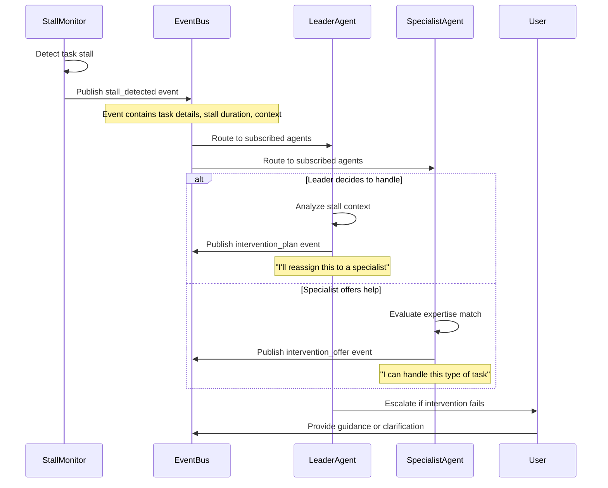
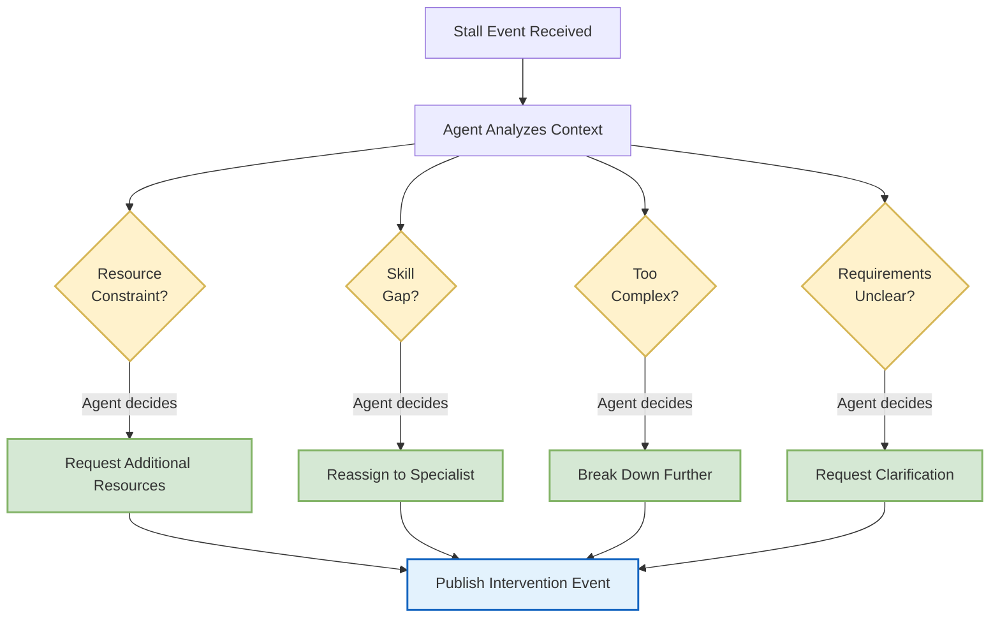

# 🤖 Autonomous Operations: Self-Directed Coordination

> **TL;DR**: The autonomous operations layer enables swarms to maintain productivity and forward progress without continuous external supervision. This system solves the critical "idle swarm" problem by implementing proactive task management and intelligent monitoring.

---

## 🤖 Self-Directed Task Management

### **Autonomous Subtask Progression**

The system continuously monitors for incomplete work and automatically drives progress:

```typescript
interface AutonomousSubtaskManager {
    // Continuously monitor for incomplete work
    checkPendingSubtasks(): Promise<SubtaskAnalysis>;
    
    // Select next highest priority task
    selectNextTask(availableSubtasks: SwarmSubTask[]): SwarmSubTask | null;
    
    // Generate internal events to drive progress
    generateTaskAssignmentEvent(task: SwarmSubTask, assignee: string): SwarmEvent;
    
    // Monitor task progress and escalate stalls
    monitorTaskProgress(taskId: string): Promise<ProgressAssessment>;
}
```

### **Task Priority and Selection**

The autonomous system evaluates tasks using multiple criteria:

```typescript
interface TaskPriorityAnalysis {
    priority: "HIGH" | "MEDIUM" | "LOW";
    estimatedEffort: number;        // In hours
    dependencies: string[];         // Blocking task IDs
    skillsRequired: string[];       // Required expertise
    stalledDuration: number;        // How long without progress
    businessImpact: number;         // 1-10 scale
}

class TaskSelector {
    selectNextTask(tasks: SwarmSubTask[]): SwarmSubTask | null {
        return tasks
            .filter(task => task.status === "todo" && this.dependenciesMet(task))
            .sort((a, b) => this.calculatePriority(b) - this.calculatePriority(a))
            [0] || null;
    }
    
    private calculatePriority(task: SwarmSubTask): number {
        let score = 0;
        
        // Base priority weight
        score += task.priority === "HIGH" ? 100 : 
                 task.priority === "MEDIUM" ? 50 : 25;
        
        // Stall penalty (encourages completion of abandoned tasks)
        score += Math.min(task.stalledDuration * 10, 50);
        
        // Business impact multiplier
        score *= (task.businessImpact || 5) / 5;
        
        // Effort adjustment (prefer quick wins when possible)
        score /= Math.max(task.estimatedEffort, 0.5);
        
        return score;
    }
}
```

---

## 📊 Progress Monitoring and Intervention

### **Stall Detection**

The system identifies when tasks are not making meaningful progress:

```typescript
interface ProgressMonitor {
    // Track time since last meaningful progress
    getTimeSinceLastProgress(taskId: string): number;
    
    // Detect when tasks are stalled
    detectStalledTasks(): string[];
    
    // Generate intervention events
    createInterventionEvent(taskId: string, intervention: InterventionType): SwarmEvent;
}

class ProgressTracker {
    detectStalledTasks(): string[] {
        const stalledThreshold = 30 * 60 * 1000; // 30 minutes
        const now = Date.now();
        
        return this.activeTasks
            .filter(task => {
                const lastActivity = this.getLastMeaningfulActivity(task.id);
                return now - lastActivity > stalledThreshold;
            })
            .map(task => task.id);
    }
    
    private getLastMeaningfulActivity(taskId: string): number {
        const activities = this.getTaskActivities(taskId);
        
        // Filter for meaningful activities
        const meaningfulActivities = activities.filter(activity => 
            activity.type === "status_change" ||
            activity.type === "deliverable_created" ||
            activity.type === "milestone_reached"
        );
        
        return meaningfulActivities.length > 0 
            ? Math.max(...meaningfulActivities.map(a => a.timestamp))
            : this.getTaskCreationTime(taskId);
    }
}
```

### **Intervention Strategies**

When stalls are detected, the system publishes stall events that agents can subscribe to and respond to autonomously:



**Example Agent Response Pattern** (what an agent *might* decide to do):



**Key Principles**:
- **Event-Driven**: Stalls trigger events rather than direct function calls
- **Agent Autonomy**: Each agent decides how to respond based on their role and capabilities  
- **Flexible Subscription**: Agents can subscribe to stall events for specific task types or domains
- **Default Routing**: If no specialists subscribe, events route to the team leader
- **Collaborative Resolution**: Multiple agents can contribute to solving a stall

---

## 🔄 Proactive Event Generation

### **Event Types for Autonomous Operation**

```typescript
type AutonomousEvent = 
    | SubtaskAssignmentEvent      // Autonomous task delegation
    | ProgressReminderEvent       // Stall prevention
    | PlanningRequestEvent        // Goal decomposition
    | TaskCompletionEvent         // Progress tracking
    | InterventionRequiredEvent   // Escalation handling
    | ResourceRequestEvent        // Resource allocation
    | SkillGapIdentifiedEvent;    // Expertise needed

interface SwarmEventGenerator {
    // Generate events when no external stimulus exists
    generatePeriodicCheckEvent(): SwarmEvent;
    
    // Create subtask assignment events
    generateSubtaskDelegationEvent(taskId: string, assigneeId: string): SwarmEvent;
    
    // Generate goal decomposition requests
    generatePlanningRequestEvent(currentGoal: string): SwarmEvent;
    
    // Create progress reminder events
    generateProgressReminderEvent(stalledTaskId: string): SwarmEvent;
    
    // Request additional planning when work runs out
    generateWorkGenerationEvent(completedTasks: string[]): SwarmEvent;
}
```

### **Autonomous Monitoring Loop**

The core monitoring loop that runs continuously:

```typescript
class AutonomousMonitor {
    private readonly monitoringInterval = 5 * 60 * 1000; // 5 minutes
    
    async startMonitoring(): Promise<void> {
        while (this.isActive) {
            try {
                await this.performMonitoringCycle();
                await this.sleep(this.monitoringInterval);
            } catch (error) {
                console.error("Monitoring cycle failed:", error);
                await this.sleep(this.monitoringInterval); // Continue monitoring
            }
        }
    }
    
    private async performMonitoringCycle(): Promise<void> {
        // 1. Check for pending work
        const pendingAnalysis = await this.checkPendingSubtasks();
        
        if (pendingAnalysis.hasPendingTasks) {
            const nextTask = this.selectNextTask(pendingAnalysis.pendingTasks);
            if (nextTask) {
                await this.delegateTask(nextTask);
            }
        } else if (pendingAnalysis.needsMorePlanning) {
            await this.requestMoreWork();
        }
        
        // 2. Monitor progress and detect stalls
        const stalledTasks = await this.detectStalledTasks();
        for (const taskId of stalledTasks) {
            await this.handleStalledTask(taskId);
        }
        
        // 3. Check resource utilization
        const resourceAnalysis = await this.analyzeResourceUtilization();
        if (resourceAnalysis.needsAttention) {
            await this.optimizeResourceAllocation(resourceAnalysis);
        }
        
        // 4. Evaluate team performance
        const teamHealth = await this.assessTeamHealth();
        if (teamHealth.needsIntervention) {
            await this.suggestTeamOptimizations(teamHealth);
        }
    }
}
```

---

## 📈 Intelligent Resource Management

### **Dynamic Resource Allocation**

The system monitors and optimizes resource usage:

```typescript
interface ResourceAnalyzer {
    analyzeResourceUtilization(): Promise<ResourceAnalysis>;
    optimizeAllocation(currentState: SwarmState): ResourceOptimization;
    predictResourceNeeds(upcomingTasks: SwarmSubTask[]): ResourcePrediction;
}

interface ResourceAnalysis {
    creditUsageRate: number;        // Credits per hour
    timeRemaining: number;          // Hours until limits hit
    inefficientTasks: string[];     // Tasks with poor credit efficiency
    underutilizedAgents: string[];  // Agents not at capacity
    bottleneckAreas: string[];      // Resource constraints
    needsAttention: boolean;
}

class ResourceOptimizer {
    async optimizeResourceAllocation(analysis: ResourceAnalysis): Promise<void> {
        // Redistribute work from inefficient tasks
        for (const taskId of analysis.inefficientTasks) {
            await this.analyzeTaskEfficiency(taskId);
        }
        
        // Assign more work to underutilized agents
        for (const agentId of analysis.underutilizedAgents) {
            await this.findAdditionalWork(agentId);
        }
        
        // Address bottlenecks
        for (const bottleneck of analysis.bottleneckAreas) {
            await this.addressBottleneck(bottleneck);
        }
    }
}
```

### **Performance Metrics and Optimization**

```typescript
interface PerformanceTracker {
    trackTaskCompletion(task: SwarmSubTask, outcome: TaskOutcome): void;
    calculateTeamEfficiency(): TeamEfficiencyMetrics;
    identifyImprovementOpportunities(): ImprovementSuggestion[];
}

interface TeamEfficiencyMetrics {
    tasksCompletedPerHour: number;
    averageTaskCompletionTime: number;
    creditEfficiency: number;           // Tasks per credit
    collaborationIndex: number;         // How well team works together
    expertiseUtilization: number;       // How well skills are matched
}

interface ImprovementSuggestion {
    area: "task_assignment" | "skill_matching" | "resource_allocation" | "communication";
    description: string;
    estimatedImpact: number;            // Percentage improvement
    implementationEffort: "LOW" | "MEDIUM" | "HIGH";
}
```

---

## 🔧 Tool Integration for Autonomous Operation

The autonomous system uses MCP tools to modify swarm state and coordinate activities:

```typescript
// Autonomous task delegation using update_swarm_shared_state
await update_swarm_shared_state({
    subTasks: {
        set: [
            {
                id: `auto_task_${Date.now()}`,
                description: "Review and optimize current approach",
                status: "todo",
                priority: "MEDIUM",
                assignee_bot_id: bestAvailableAgent,
                created_at: new Date().toISOString()
            }
        ]
    }
});

// Dynamic blackboard updates for team coordination
await update_swarm_shared_state({
    blackboard: {
        set: [
            {
                id: `insight_${Date.now()}`,
                value: {
                    type: "performance_insight",
                    content: "Task decomposition strategy showing 40% efficiency improvement",
                    visibility: "team",
                    priority: "HIGH"
                }
            }
        ]
    }
});

// Communication using send_message
await send_message({
    recipient: { kind: "chat", chatId: currentChatId },
    content: "Autonomous monitoring detected efficiency opportunity. Implementing optimization strategy.",
    metadata: {
        mcpLlmModel: "gpt-4",
        messageConfig: {
            __version: "1.0",
            resources: [],
            role: "assistant"
        }
    }
});
```

> 📖 **Learn More**: [MCP Tools Reference](mcp-tools-reference.md) provides comprehensive documentation for all coordination tools

---

## 🎯 Benefits of Autonomous Operations

This autonomous operation layer ensures that swarms:

- **🔄 Maintain Productivity**: Continuous forward progress without supervision
- **📊 Self-Optimize**: Learn from patterns and improve efficiency over time
- **🚨 Proactive Recovery**: Detect and resolve stalls before they impact delivery
- **📈 Adaptive Resource Use**: Dynamically optimize resource allocation
- **👥 Intelligent Delegation**: Match tasks to the best available expertise

The result is a coordination system that becomes more effective through use, reducing the need for manual intervention while maintaining high-quality outputs.

---

## 🔗 Related Documentation

- **[MCP Tools Reference](mcp-tools-reference.md)** - Complete coordination tool documentation
- **[Metacognitive Framework](metacognitive-framework.md)** - How agents reason about coordination
- **[SwarmStateMachine](swarm-state-machine.md)** - State management and lifecycle
- **[Implementation Architecture](implementation-architecture.md)** - Technical components and integration

---

> 💡 **Next Steps**: Explore the [MCP Tools Reference](mcp-tools-reference.md) to understand the coordination capabilities that enable autonomous operations, or see [SwarmStateMachine](swarm-state-machine.md) for state management details. 