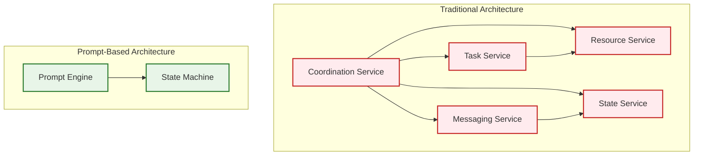

# Why Prompt-Based Metacognition Wins

The prompt-based approach to coordination intelligence offers several decisive advantages over traditional hard-coded multi-agent systems, representing a fundamental paradigm shift in how we build intelligent systems.

## 🚀 Decisive Advantages

### 1. Infinite Flexibility
- **No Anticipation Required**: No need to anticipate every coordination pattern
- **On-Demand Innovation**: Agents can invent new strategies dynamically
- **Zero Code Changes**: Adapts to novel situations without architectural modifications
- **Emergent Behavior**: Complex coordination patterns emerge naturally from simple prompts

**Example**: When faced with a novel data analysis task requiring both machine learning expertise and regulatory compliance knowledge, agents can autonomously decide to:
- Create hybrid peer-to-peer/hierarchical coordination
- Establish domain-specific communication channels
- Implement custom validation workflows
- All without any pre-programmed coordination logic

### 2. AI Evolution Alignment
- **Automatic Improvement**: As LLMs improve, coordination improves automatically
- **Reasoning Advances**: Benefits from advances in AI reasoning capabilities
- **Model Agnostic**: Works with any sufficiently capable language model
- **Future Proof**: No architectural changes needed for new AI models

```typescript
// Same coordination code works with different AI models
const coordinationPrompt = `
You are coordinating a ${teamSize}-agent swarm for ${goalType}.
Available agents: ${agentCapabilities}
Current context: ${swarmState}

Coordinate efficiently to achieve: ${goal}
`;

// Works with GPT-4, Claude, future models, etc.
const coordination = await anyLLM.complete(coordinationPrompt, context);
```

### 3. Natural Knowledge Transfer
- **Human-Readable Patterns**: Best practices shared through natural language
- **Living Documentation**: Successful patterns become part of prompt libraries
- **Community Learning**: Success patterns can be shared across organizations
- **Intuitive Debugging**: Coordination issues are visible in natural language

**Prompt Library Example**:
```typescript
const coordinationPatterns = {
    "crisis_response": `
        Prioritize safety and speed over perfect coordination.
        Establish clear command structure with single decision maker.
        Parallel execution where possible, sequential for dependencies.
    `,
    "research_deep_dive": `
        Form specialist teams around research domains.
        Implement peer review between teams.
        Maintain shared knowledge repository.
        Schedule regular cross-team synthesis sessions.
    `,
    "rapid_prototyping": `
        Favor speed over perfection in initial phases.
        Parallel exploration of multiple approaches.
        Quick feedback loops with stakeholders.
        Rapid iteration based on learning.
    `
};
```

### 4. Simplified Architecture
- **Fewer Moving Parts**: Higher reliability through reduced complexity
- **Single Update Point**: One prompt update vs. multiple service changes
- **Natural Debugging**: Easier to debug natural language than distributed systems
- **Reduced Maintenance**: Less code to maintain and update

**Traditional Multi-Agent vs. Prompt-Based**:



### 5. Domain Adaptability
- **Universal Infrastructure**: Same infrastructure works for any domain
- **Custom Specialization**: Teams customize through MOISE+ models and prompts
- **No Domain Code**: No domain-specific coordination code required
- **Rapid Deployment**: New domains can be supported in hours, not months

**Domain Adaptation Examples**:
```typescript
// Healthcare coordination
const healthcarePrompt = `
You coordinate medical AI agents following HIPAA compliance.
Patient safety is the absolute priority.
All decisions must be auditable and explainable.
Specialist consultation required for high-risk scenarios.
`;

// Financial trading coordination  
const financialPrompt = `
You coordinate trading agents with strict risk management.
All trades must comply with regulatory requirements.
Real-time risk monitoring is mandatory.
Escalate unusual market conditions immediately.
`;

// Scientific research coordination
const researchPrompt = `
You coordinate research agents following scientific method.
Reproducibility and peer review are essential.
Hypothesis-driven investigation with clear documentation.
Cross-validation of results across multiple approaches.
`;
```

### 6. Continuous Improvement Path
- **A/B Testing**: Trivial to A/B test coordination strategies
- **RL Optimization**: Can optimize prompts based on outcomes
- **Community Sharing**: Successful patterns can be shared globally
- **Rapid Iteration**: New strategies can be tested in minutes

```typescript
// A/B testing different coordination strategies
const strategies = {
    "hierarchical_v1": loadPrompt("hierarchical_delegation.txt"),
    "peer_to_peer_v2": loadPrompt("peer_collaboration.txt"),
    "hybrid_v3": loadPrompt("adaptive_hybrid.txt")
};

// Automatically select best performing strategy
const bestStrategy = await optimizationEngine.selectBest(strategies, {
    metrics: ["task_completion_rate", "credit_efficiency", "user_satisfaction"],
    testDuration: "7 days",
    trafficSplit: "33/33/34"
});
```

## 🧠 The Metacognitive Revolution

This design philosophy represents **"coordination through understanding"** rather than **"coordination through programming"**. It's not just more elegant; it's fundamentally more capable because:

### Intelligence Mirrors Biology
Just as human teams coordinate through communication and understanding rather than hard-coded procedures, AI teams should coordinate through reasoning and natural language.

### Emergent Complexity
Complex coordination behaviors emerge from simple, flexible rules rather than complicated, rigid systems.

### Adaptable by Design
The system adapts to new situations by understanding them, not by being pre-programmed for them.

## 📊 Performance Comparison

| Aspect | Traditional Multi-Agent | Prompt-Based Coordination |
|--------|------------------------|---------------------------|
| **Development Time** | Months per domain | Hours per domain |
| **Coordination Flexibility** | Fixed patterns only | Infinite adaptability |
| **Maintenance Overhead** | High - multiple services | Low - prompt updates |
| **Debugging Complexity** | Distributed system debugging | Natural language analysis |
| **AI Model Compatibility** | Requires API changes | Works with any LLM |
| **Knowledge Transfer** | Code documentation | Natural language patterns |
| **Community Sharing** | Complex integration | Copy-paste prompts |
| **Performance Optimization** | Code refactoring | Prompt refinement |

## 🔮 Future Implications

This approach opens entirely new possibilities:

### Self-Improving Coordination
Swarms can analyze their own coordination patterns and suggest improvements:
```typescript
const selfAnalysis = await swarm.analyzeCoordinationEffectiveness();
const improvements = await swarm.suggestCoordinationOptimizations(selfAnalysis);
const newPrompts = await swarm.generateImprovedPrompts(improvements);
```

### Cross-Domain Learning
Coordination patterns from one domain can inspire solutions in completely different domains:
```typescript
// Military logistics patterns applied to supply chain
const militaryPattern = loadPattern("military_logistics_v3");
const adaptedPattern = await adaptToContext(militaryPattern, "civilian_supply_chain");
```

### Collective Intelligence Evolution
As more organizations adopt this approach, a collective intelligence of coordination patterns emerges, continuously improving global AI coordination capabilities.

## 🎯 Conclusion

Prompt-based metacognitive coordination represents the natural evolution of multi-agent systems. By leveraging AI's ability to understand and reason rather than forcing it into rigid programming patterns, we create systems that are:

- **More intelligent**: They understand rather than just execute
- **More adaptable**: They reason about new situations
- **More maintainable**: They use natural language instead of code
- **More scalable**: They share knowledge through communication
- **More future-proof**: They evolve with AI capabilities

This isn't just a better way to build multi-agent systems—it's the way intelligent systems naturally want to work.

---

**Return to**: [Main Documentation](./README.md) | **Explore**: [Implementation Architecture](./implementation-architecture.md) 