# Implementation Architecture

## 🏗️ Architecture Overview

```mermaid
graph TB
    subgraph "Coordination Implementation"
        subgraph "Core Components"
            SwarmStateMachine[SwarmStateMachine<br/>📊 Lifecycle management<br/>🔄 Event processing<br/>⏸️ Pause/resume control]
            
            CompletionService[CompletionService<br/>🧠 Response generation<br/>👥 Multi-bot coordination<br/>💬 Context building]
            
            PromptTemplate[Prompt Templates<br/>📄 prompt.txt<br/>🎭 Role-specific variants<br/>🔄 Hot-reloadable]
        end
        
        subgraph "State Management"
            ConversationState[ConversationState<br/>💬 Chat metadata<br/>👥 Participants<br/>🔧 Available tools]
            
            ChatConfig[ChatConfig<br/>🎯 Goal & subtasks<br/>👥 Team assignments<br/>📊 Resource limits<br/>📝 Execution records]
            
            TeamConfig[TeamConfig<br/>🏗️ MOISE+ structure<br/>👥 Role definitions<br/>📋 Team knowledge]
        end
        
        subgraph "Event System"
            EventBus[Event Bus<br/>📢 Pub/sub messaging<br/>🔄 Topic routing<br/>⏱️ Async handling]
            
            EventTypes[Event Types<br/>🚀 swarm_started<br/>💬 external_message<br/>🔧 tool_approval<br/>📊 subtask_update]
        end
        
        subgraph "Dynamic Enhancement"
            PromptInjection[Context Injection<br/>📊 Current state<br/>⏰ Timestamps<br/>🔧 Tool schemas<br/>📈 Performance metrics]
            
            BestPractices[Best Practices<br/>📚 Shared routines<br/>🎯 Success patterns<br/>🔄 Team learnings]
            
            RLOptimization[RL Optimization<br/>📊 Outcome tracking<br/>🎯 Strategy scoring<br/>🔄 Policy updates]
        end
    end
    
    %% Main flow
    SwarmStateMachine --> CompletionService
    CompletionService --> PromptTemplate
    PromptTemplate --> PromptInjection
    
    %% State connections
    ConversationState --> CompletionService
    ChatConfig --> ConversationState
    TeamConfig --> ConversationState
    
    %% Event flow
    EventBus --> SwarmStateMachine
    SwarmStateMachine --> EventTypes
    
    %% Enhancement flow
    BestPractices --> PromptInjection
    RLOptimization --> BestPractices
    ChatConfig -.->|"Records outcomes"| RLOptimization
    
    classDef core fill:#e3f2fd,stroke:#1565c0,stroke-width:3px
    classDef state fill:#f3e5f5,stroke:#7b1fa2,stroke-width:2px
    classDef event fill:#e8f5e8,stroke:#2e7d32,stroke-width:2px
    classDef enhance fill:#fff3e0,stroke:#f57c00,stroke-width:2px
    
    class SwarmStateMachine,CompletionService,PromptTemplate core
    class ConversationState,ChatConfig,TeamConfig state
    class EventBus,EventTypes event
    class PromptInjection,BestPractices,RLOptimization enhance
```



## 🔧 Code Component Integration

The actual implementation consists of several key classes that work together to create the coordination intelligence:


## 🎯 Key Components

### 1. SwarmStateMachine
Manages the swarm lifecycle and event processing:
- Maintains event queue for sequential processing
- Handles pause/resume/stop operations
- Manages tool approval/rejection flows
- Implements configurable delays between processing cycles

### 2. CompletionService
High-level coordination of AI responses:
- Builds role-specific system prompts
- Selects appropriate responders via AgentGraph
- Manages conversation and team configuration
- Tracks resource usage and enforces limits

### 3. ReasoningEngine
Low-level execution of AI reasoning loops:
- Streams LLM responses with proper context
- Executes tool calls (immediate or deferred)
- Manages abort signals for cancellation
- Tracks credits and tool call counts

### 4. ToolRunner
Executes MCP and custom tools:
- Routes tool calls to appropriate handlers
- Manages sandboxed execution environments
- Returns structured results with cost tracking

### 5. State Management
Multi-layer caching system:
- L1: Local LRU cache for hot conversations
- L2: Redis for distributed state sharing
- L3: PostgreSQL for persistent storage
- Write-behind pattern with debouncing

## 📊 Event-Driven Coordination Flow

```typescript
// 1. User message triggers swarm processing
await swarmStateMachine.start(conversationId, goal, user);

// 2. System builds metacognitive context
const systemMessage = await completion.generateSystemMessageForBot(
    goal, 
    bot, 
    conversationConfig,
    teamConfig // MOISE+ structure
);

// 3. Agents reason about coordination
const response = await reasoningEngine.runLoop({
    startMessage: { id: messageId },
    systemMessageContent: systemMessage, // Includes role instructions
    availableTools: mcpTools,           // update_swarm_shared_state, etc.
    bot: responder,
    // ... limits and context
});

// 4. Tool calls modify swarm state
await update_swarm_shared_state({
    subtasks: [/* new subtasks */],
    eventSubscriptions: {
        "swarm/role/monitor": ["monitor_bot_456"]
    }
});

// 5. Events propagate to subscribed agents
BusService.publish({
    type: "swarm/role/monitor",
    payload: { anomaly: "resource_spike" }
});
```

## 🔄 Dynamic Behavior Examples

### Leadership Recognition
```typescript
// Leader recognizes need for expertise
if (goal.includes("complex") || estimatedHours > 2) {
    // Prompt includes RECRUITMENT_RULE_PROMPT
    // Agent will naturally create team-building subtasks
}
```

### Event Subscription
```typescript
// Specialist subscribes to relevant events
await update_swarm_shared_state({
    eventSubscriptions: {
        ...current,
        "swarm/ext/github": ["devops_bot_789"],
        "swarm/subtask": ["coordinator_bot_123"]
    }
});
```

### Role-Based Tool Access
```typescript
// Future enhancement: Role-based tool access
const toolsForRole = {
    "leader": ["*"], // All tools
    "analyst": ["find_resources", "start_routine"],
    "monitor": ["subscribe_to_events", "read_blackboard"]
};
```

## ⚙️ State Management Architecture

The state management system provides multiple layers of caching and persistence for optimal performance and consistency. For complete details on state synchronization, caching strategies, and consistency protocols, see **[State Synchronization and Context Management](../../context-memory/state-synchronization.md)**.

Key features include:
- **L1 Cache**: Hot conversations stay in memory for immediate access
- **L2 Cache**: Redis provides distributed state sharing across instances  
- **L3 Storage**: PostgreSQL ensures durability and queryability
- **Consistency Guarantees**: Write-through for critical changes, write-behind with debouncing for high-frequency updates
- **Event-driven Invalidation**: Maintains consistency across distributed instances

This implementation achieves true metacognitive coordination - agents understand their purpose and coordinate naturally through language, while the underlying infrastructure ensures reliability, state consistency, and resource management.

---

**Next**: [SwarmStateMachine](./swarm-state-machine.md) - Deep dive into the state machine architecture. 