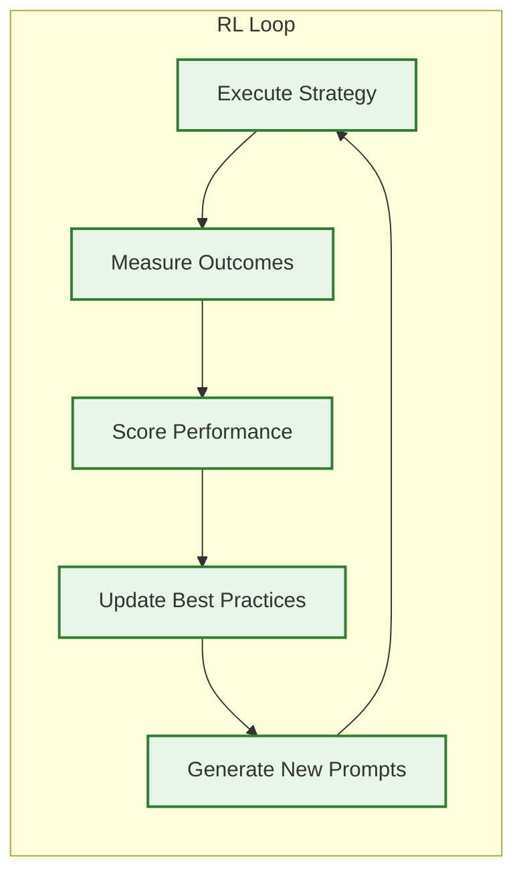

# 🧠 Metacognitive Framework: Coordination Through Understanding

> **TL;DR**: Vrooli's metacognitive framework enables AI agents to coordinate through reasoning about coordination itself, rather than following hard-coded coordination logic. This creates infinitely flexible coordination that evolves with AI capabilities.

---

## 🎯 The Metacognitive Advantage

Traditional multi-agent systems hard-code coordination logic into separate services. Vrooli takes a radically different approach: **coordination emerges from AI reasoning**. Agents understand their roles, analyze situations, and coordinate naturally through intelligence rather than programming.

### **1. Dynamic Role Understanding**
```typescript
// Instead of hard-coded role behaviors, agents understand their role through prompting
const systemPrompt = `
You are the {{ROLE}} of an autonomous agent swarm.
GOAL: {{GOAL}}

{{ROLE_SPECIFIC_INSTRUCTIONS}}
`;

// Leaders get recruitment instructions
if (role === "leader") {
    instructions = RECRUITMENT_RULE_PROMPT; // Multi-step team building
}
```

### **2. MOISE+ Organizational Context**

Instead of relying on an LLM's best guess about coordination, we provide explicit organizational specifications. MOISE+ gives us a formal grammar for describing who **may/must/must-not do** any piece of work across three dimensions:

| Dimension | What it captures | Runtime effect |
|-----------|------------------|----------------|
| **Structural** | Roles, groups, inheritance, social links | Who *can* be assigned to a task |
| **Functional** | Goals, missions, plans (decomposition) | Which steps exist & in what order |
| **Deontic** | Permissions, obligations, prohibitions | Who *must / may / must-not* act |

We serialize the MOISE+ spec to JSON and inject it into the **SwarmContext**; every tier then enforces the relevant dimension deterministically.

> 📖 **Learn More**: [MOISE+ Comprehensive Guide](moise-comprehensive-guide.md) covers complete implementation across all tiers

### **3. Flexible Coordination Patterns**
Agents can dynamically select and even invent coordination strategies:
- **🔄 Hierarchical**: Leader delegates to specialists
- **👥 Peer-to-peer**: Agents collaborate directly via events
- **🌱 Emergent**: Patterns evolve based on task success
- **🔀 Hybrid**: Mix strategies as needed

### **4. Tool-Mediated Actions**
Instead of API calls to coordination services, agents use MCP tools that feel natural:
```typescript
// Agent naturally expresses coordination intent
await update_swarm_shared_state({
    subtasks: [
        { id: "T1", description: "Analyze market trends", status: "todo" },
        { id: "T2", description: "Generate report", status: "todo", depends_on: ["T1"] }
    ],
    subtaskLeaders: { "T1": "analyst_bot_123" }
});
```

> 📖 **Learn More**: [MCP Tools Reference](mcp-tools-reference.md) provides comprehensive tool documentation

---

## 🎯 Key Design Principles

### **1. Prompt as Configuration**
The system prompt *is* the coordination logic. Changes to coordination behavior are as simple as updating prompts:
```typescript
// Easy to experiment with new coordination strategies
const promptVariants = {
    "hierarchical": "You must route all decisions through the team leader...",
    "autonomous": "You have full autonomy to complete your assigned subtasks...",
    "collaborative": "Seek consensus with team members before major decisions..."
};
```

### **2. State as Context**
All coordination state lives in the conversation context, making it naturally accessible to LLM reasoning:
```typescript
interface SwarmState {
    goal: string;                    // What we're trying to achieve
    subtasks: SwarmSubTask[];        // Broken down work items  
    subtaskLeaders: Record<string, string>;  // Who owns what
    blackboard: BlackboardItem[];    // Shared working memory
    resources: SwarmResource[];      // Created artifacts
    records: ToolCallRecord[];       // Audit trail
}
```

### **3. Events as Natural Communication**
Agents communicate through an event system that maps to natural concepts:
- `swarm/user` - "The user said something"
- `swarm/subtask` - "A subtask was updated"  
- `swarm/role/analyst` - "Message for analysts"

### **4. Tools as Capabilities**
MCP tools provide structured ways to modify swarm state while maintaining consistency:
- `update_swarm_shared_state` - Modify swarm state including subtasks and blackboard
- `resource_manage` - Search for and manage existing routines/artifacts
- `run_routine` - Execute reusable workflows
- `send_message` - Communicate with users and other agents

---

## 📈 Dynamic Upgradeability

This architecture is designed for continuous improvement:

### **1. Prompt Evolution**
- A/B test different prompt strategies
- Learn from successful swarm patterns
- Incorporate new coordination research

### **2. Tool Expansion**
- Add new MCP tools as needs emerge
- No code changes required in core engine
- Backwards compatible with existing swarms

### **3. Reinforcement Learning**


The system tracks:
- Task completion rates by strategy
- Credit efficiency per approach  
- Time to completion metrics
- User satisfaction scores

This data feeds back into prompt templates and best practice recommendations.

---

## 🏗️ Example: MOISE+ Organizational Structure

Teams can define rich organizational structures using MOISE+ notation:

```moise
structure DataAnalysisTeam {
    group ResearchGroup {
        role leader cardinality 1..1
        role data_analyst cardinality 2..4  
        role ml_engineer cardinality 1..2
        role reporter cardinality 1..1
        
        link leader > data_analyst
        link leader > ml_engineer
        link data_analyst > reporter
    }
}

functional DataAnalysisScheme {
    mission m1 "Analyze customer data" {
        goal g1 "Extract insights"
        goal g2 "Build predictive model"
        goal g3 "Generate report"
    }
    
    goal g1 { plan: analyze_trends, identify_patterns }
    goal g2 { plan: prepare_data, train_model, validate }
    goal g3 { plan: summarize_findings, create_visuals }
}

normative DataAnalysisNorms {
    norm n1: leader obliged g1
    norm n2: data_analyst permitted g1  
    norm n3: ml_engineer obliged g2
    norm n4: reporter obliged g3
}
```

This structure informs agent behavior through the prompt, creating sophisticated coordination without hard-coding.

---

## 🚀 Benefits of This Approach

Unlike traditional multi-agent systems, the metacognitive approach provides:

- **🔄 Infinite Flexibility**: Agents can invent new coordination strategies on-demand
- **🧠 AI Evolution Alignment**: Automatically improves as LLMs become more capable
- **📝 Natural Knowledge Transfer**: Best practices shared through human-readable prompts
- **🏗️ Simplified Architecture**: Fewer moving parts, easier maintenance
- **🎯 Domain Adaptability**: Same infrastructure works across all domains

> 📖 **Learn More**: [Why Prompt-Based Coordination](why-prompt-based-coordination.md) provides detailed comparison with traditional approaches

---

## 🔗 Related Documentation

- **[Implementation Architecture](implementation-architecture.md)** - Technical components and integration patterns
- **[MCP Tools Reference](mcp-tools-reference.md)** - Complete coordination tool documentation
- **[Autonomous Operations](autonomous-operations.md)** - Self-directed coordination capabilities
- **[SwarmStateMachine](swarm-state-machine.md)** - State management and lifecycle
- **[Why Prompt-Based Coordination](why-prompt-based-coordination.md)** - Advantages over traditional systems

---

> 💡 **Next Steps**: Understand the technical implementation in [Implementation Architecture](implementation-architecture.md), or explore the available coordination tools in [MCP Tools Reference](mcp-tools-reference.md). 