# 🏗️ MOISE+ Organizational Modeling: Complete Implementation Guide

> **TL;DR**: MOISE+ provides the formal organizational grammar that enables sophisticated AI agent coordination without hard-coding. This guide covers how MOISE+ is implemented, enforced, and utilized across all three execution tiers.

---

## 🎯 What is MOISE+ and Why It Matters

MOISE+ (Model of Organization for Multi-Agent Systems) is a formal specification language that defines:
- **Who** can do what (roles and permissions)
- **How** work should be organized (hierarchies and structures)  
- **When** actions are required/prohibited (temporal norms)
- **Why** certain patterns exist (organizational rationale)

Instead of hard-coding coordination logic, MOISE+ gives us a **declarative organizational model** that AI agents can reason about and enforce dynamically.

```mermaid
graph TB
    subgraph "🏛️ MOISE+ Organizational Dimensions"
        Structural["Structural Specification<br>👥 Roles &amp; hierarchies<br>🔗 Authority relationships<br>📊 Cardinality constraints<br>🎯 Capability mappings"]
        Functional["Functional Specification<br>📋 Mission decomposition<br>🔄 Workflow dependencies<br>⏱️ Temporal constraints<br>🎯 Goal achievement criteria"]
        Deontic["Deontic Specification<br>✅ Permissions (may do)<br>❌ Prohibitions (must not do)<br>🔴 Obligations (must do)<br>⚖️ Norm enforcement"]
    end

    subgraph "🎯 Tier Integration"
        T1["Tier 1: Prompt Injection<br>🧠 Role-aware reasoning<br>📋 Mission understanding<br>👥 Team formation logic"]
        T2["Tier 2: Workflow Constraints<br>🔄 Step authorization<br>📊 Dependency validation<br>⏱️ Temporal enforcement"]
        T3["Tier 3: Action Authorization<br>✅ Permission checking<br>🔒 Norm enforcement<br>🚫 Prohibition blocking"]
    end

    Structural --> T1
    Functional --> T2
    Deontic --> T3

    T1 -.->|"Organizational context"| T2
    T2 -.->|"Action constraints"| T3
    T3 -.->|"Execution feedback"| T1

    classDef specification fill:#e3f2fd,stroke:#1565c0,stroke-width:2px
    classDef tier fill:#e8f5e8,stroke:#2e7d32,stroke-width:2px

    class Structural,Functional,Deontic specification
    class T1,T2,T3 tier
```



---

## 📋 MOISE+ Specification Structure

### **Complete MOISE+ Example: Financial Trading Team**

```json
{
  "organizationSpec": {
    "__moise_version": "3.0",
    "team_id": "financial_trading_team",
    "created_at": "2024-01-15T10:00:00Z",
    
    "structural_specification": {
      "roles": {
        "portfolio_manager": {
          "description": "Oversees trading strategy and risk management",
          "capabilities": ["strategic_planning", "risk_assessment", "team_coordination"],
          "authority_level": 5,
          "can_delegate_to": ["senior_trader", "risk_analyst"],
          "reports_to": null,
          "cardinality": { "min": 1, "max": 1 }
        },
        
        "senior_trader": {
          "description": "Executes high-value trades and mentors junior traders",
          "capabilities": ["high_value_trading", "market_analysis", "mentoring"],
          "authority_level": 4,
          "can_delegate_to": ["junior_trader", "market_analyst"],
          "reports_to": "portfolio_manager",
          "cardinality": { "min": 2, "max": 4 }
        },
        
        "junior_trader": {
          "description": "Executes routine trades under supervision",
          "capabilities": ["basic_trading", "order_execution", "data_collection"],
          "authority_level": 2,
          "can_delegate_to": [],
          "reports_to": "senior_trader",
          "cardinality": { "min": 1, "max": 8 }
        },
        
        "risk_analyst": {
          "description": "Monitors and analyzes trading risks",
          "capabilities": ["risk_modeling", "compliance_checking", "alert_generation"],
          "authority_level": 3,
          "can_delegate_to": ["data_analyst"],
          "reports_to": "portfolio_manager",
          "cardinality": { "min": 1, "max": 2 }
        },
        
        "compliance_officer": {
          "description": "Ensures regulatory compliance",
          "capabilities": ["regulatory_monitoring", "audit_trail", "violation_detection"],
          "authority_level": 4,
          "can_delegate_to": [],
          "reports_to": null,
          "cardinality": { "min": 1, "max": 1 }
        }
      },
      
      "groups": {
        "execution_team": {
          "roles": ["senior_trader", "junior_trader"],
          "coordination_pattern": "hierarchical",
          "communication_rules": ["must_report_large_trades", "daily_performance_summary"]
        },
        
        "oversight_team": {
          "roles": ["portfolio_manager", "risk_analyst", "compliance_officer"],
          "coordination_pattern": "collaborative", 
          "communication_rules": ["real_time_risk_alerts", "weekly_strategy_review"]
        }
      }
    },
    
    "functional_specification": {
      "missions": {
        "execute_trading_strategy": {
          "description": "Execute daily trading operations according to strategy",
          "goal": "maximize_returns_within_risk_limits",
          "responsible_roles": ["portfolio_manager"],
          "participating_roles": ["senior_trader", "junior_trader", "risk_analyst"],
          
          "sub_missions": {
            "market_analysis": {
              "description": "Analyze market conditions and opportunities",
              "responsible_roles": ["senior_trader"],
              "temporal_constraints": {
                "frequency": "every_4_hours",
                "deadline": "15_minutes_from_start"
              }
            },
            
            "trade_execution": {
              "description": "Execute approved trades",
              "responsible_roles": ["senior_trader", "junior_trader"],
              "depends_on": ["market_analysis", "risk_assessment"],
              "temporal_constraints": {
                "frequency": "continuous",
                "max_response_time": "30_seconds"
              }
            },
            
            "risk_monitoring": {
              "description": "Continuous risk assessment and monitoring",
              "responsible_roles": ["risk_analyst"],
              "temporal_constraints": {
                "frequency": "real_time",
                "alert_threshold": "immediate"
              }
            }
          }
        },
        
        "compliance_monitoring": {
          "description": "Ensure all trading activities comply with regulations",
          "goal": "zero_regulatory_violations",
          "responsible_roles": ["compliance_officer"],
          "participating_roles": ["all"],
          
          "sub_missions": {
            "pre_trade_compliance": {
              "description": "Validate trades before execution",
              "responsible_roles": ["compliance_officer"],
              "temporal_constraints": {
                "max_response_time": "5_seconds",
                "blocking": true
              }
            },
            
            "post_trade_audit": {
              "description": "Audit completed trades for compliance",
              "responsible_roles": ["compliance_officer"],
              "temporal_constraints": {
                "frequency": "after_each_trade",
                "deadline": "1_hour_from_completion"
              }
            }
          }
        }
      }
    },
    
    "deontic_specification": {
      "permissions": {
        "execute_large_trade": {
          "description": "Permission to execute trades over $100K",
          "granted_to": ["portfolio_manager", "senior_trader"],
          "conditions": ["risk_assessment_approved", "compliance_check_passed"],
          "scope": "trades_over_100k"
        },
        
        "modify_risk_limits": {
          "description": "Permission to adjust risk parameters",
          "granted_to": ["portfolio_manager"],
          "conditions": ["market_volatility_analysis_complete"],
          "scope": "risk_parameters"
        },
        
        "halt_trading": {
          "description": "Emergency permission to stop all trading",
          "granted_to": ["portfolio_manager", "risk_analyst", "compliance_officer"],
          "conditions": ["emergency_situation_detected"],
          "scope": "all_trading_activities"
        }
      },
      
      "obligations": {
        "report_large_trades": {
          "description": "Must report trades over $50K within 1 hour",
          "applies_to": ["senior_trader", "junior_trader"],
          "trigger": "trade_execution_over_50k",
          "deadline": "1_hour",
          "consequence": "warning_first_time_suspension_repeat"
        },
        
        "daily_risk_report": {
          "description": "Must provide daily risk assessment",
          "applies_to": ["risk_analyst"],
          "trigger": "end_of_trading_day",
          "deadline": "30_minutes_after_market_close",
          "consequence": "escalation_to_portfolio_manager"
        },
        
        "compliance_pre_check": {
          "description": "Must verify compliance before large trades",
          "applies_to": ["compliance_officer"],
          "trigger": "large_trade_requested",
          "deadline": "5_seconds",
          "consequence": "trade_auto_blocked"
        }
      },
      
      "prohibitions": {
        "unauthorized_external_transfer": {
          "description": "Cannot transfer funds to unauthorized external accounts",
          "applies_to": ["all"],
          "scope": "external_transfers",
          "exceptions": ["portfolio_manager_with_board_approval"]
        },
        
        "trade_during_blackout": {
          "description": "Cannot execute trades during compliance blackout periods",
          "applies_to": ["all"],
          "scope": "trade_execution",
          "temporal_scope": "blackout_periods"
        },
        
        "exceed_individual_limits": {
          "description": "Cannot exceed individual daily trading limits",
          "applies_to": ["junior_trader"],
          "scope": "daily_trade_volume",
          "limit": "$500K_per_day"
        }
      }
    }
  }
}
```

---

## 🎯 Tier 1: MOISE+ in Coordination Intelligence

### **How Tier 1 Uses MOISE+**

Tier 1 injects MOISE+ organizational context into AI agent prompts, enabling intelligent role-based reasoning:

```typescript
// SwarmStateMachine prompt generation
class MoisePromptEngine {
  generateSwarmLeaderPrompt(moiseSpec: MoiseSpecification, context: SwarmContext): string {
    const { roles, missions, norms } = moiseSpec;
    const myRole = roles[context.agentRole];
    
    return `
# Your Organizational Context

## Your Role: ${myRole.description}
You are acting as a **${context.agentRole}** with the following:

**Authority Level**: ${myRole.authority_level}/5
**Can Delegate To**: ${myRole.can_delegate_to.join(', ')}
**Reports To**: ${myRole.reports_to || 'No one (top-level role)'}

## Current Mission: ${context.currentMission}
${missions[context.currentMission]?.description}

**You are responsible for**: ${missions[context.currentMission]?.responsible_roles.includes(context.agentRole) ? 'LEADING this mission' : 'SUPPORTING this mission'}

## Team Structure
${this.formatTeamHierarchy(roles, context.teamMembers)}

## Your Obligations
${this.formatObligations(norms.obligations, context.agentRole)}

## Your Permissions  
${this.formatPermissions(norms.permissions, context.agentRole)}

## Prohibitions (What you MUST NOT do)
${this.formatProhibitions(norms.prohibitions, context.agentRole)}

Based on this organizational context, coordinate the swarm to achieve the mission while respecting all organizational constraints.
    `;
  }
  
  formatTeamHierarchy(roles: MoiseRoles, teamMembers: TeamMember[]): string {
    return teamMembers.map(member => {
      const role = roles[member.role];
      const hierarchy = role.reports_to ? `└─ Reports to: ${role.reports_to}` : '👑 Top-level role';
      const delegates = role.can_delegate_to.length > 0 ? `\n   ├─ Can delegate to: ${role.can_delegate_to.join(', ')}` : '';
      
      return `**${member.name}** (${member.role})\n   ${hierarchy}${delegates}`;
    }).join('\n\n');
  }
}
```

### **Example Tier 1 Reasoning with MOISE+**

```typescript
// Agent reasoning with MOISE+ context
const swarmLeaderResponse = await aiModel.generateResponse({
  prompt: moisePromptEngine.generateSwarmLeaderPrompt(teamMoiseSpec, swarmContext),
  userMessage: "We need to execute a $2M trade in Tesla stock",
  
  context: {
    currentRole: "portfolio_manager",
    teamMembers: activeTradingTeam,
    availableTools: mcpTools,
    swarmState: currentSwarmState
  }
});

// Expected AI reasoning output:
// "As portfolio_manager, I have authority to approve this $2M trade. However:
// 1. Per MOISE+ obligations, I must ensure risk_assessment is completed first
// 2. Compliance_officer must perform pre-trade compliance check  
// 3. I can delegate execution to senior_trader once approvals are obtained
// 
// Let me coordinate this workflow:
// - Assign risk assessment to risk_analyst Sarah
// - Request compliance pre-check from compliance_officer Mike  
// - Once both approve, delegate execution to senior_trader John"
```

---

## ⚙️ Tier 2: MOISE+ in Process Intelligence

### **How Tier 2 Uses MOISE+**

Tier 2 enforces MOISE+ functional specifications (missions, workflows, dependencies) during routine orchestration:

```typescript
// RunStateMachine with MOISE+ validation
class MoiseWorkflowValidator {
  async validateStepExecution(
    step: RoutineStep, 
    executingAgent: Agent, 
    moiseSpec: MoiseSpecification
  ): Promise<ValidationResult> {
    
    // Check if agent's role can perform this step
    const mission = this.findMissionForStep(step, moiseSpec.functional_specification);
    const agentRole = executingAgent.role;
    
    if (!mission.responsible_roles.includes(agentRole) && 
        !mission.participating_roles.includes(agentRole)) {
      return {
        valid: false,
        reason: `Role '${agentRole}' is not authorized for mission '${mission.id}'`,
        requiredRoles: mission.responsible_roles
      };
    }
    
    // Check temporal constraints
    const temporalCheck = await this.validateTemporalConstraints(step, mission);
    if (!temporalCheck.valid) {
      return temporalCheck;
    }
    
    // Check dependencies  
    const dependencyCheck = await this.validateDependencies(step, mission, moiseSpec);
    if (!dependencyCheck.valid) {
      return dependencyCheck;
    }
    
    return { valid: true };
  }
  
  async validateTemporalConstraints(
    step: RoutineStep, 
    mission: MoiseMission
  ): Promise<ValidationResult> {
    const constraints = mission.temporal_constraints;
    
    if (constraints?.deadline) {
      const timeRemaining = constraints.deadline - Date.now();
      if (timeRemaining <= 0) {
        return {
          valid: false,
          reason: `Mission deadline exceeded. Deadline was ${constraints.deadline}`,
          action: "escalate_to_supervisor"
        };
      }
    }
    
    if (constraints?.frequency) {
      const lastExecution = await this.getLastExecutionTime(mission.id);
      const timeSinceLastExecution = Date.now() - lastExecution;
      const minimumInterval = this.parseFrequency(constraints.frequency);
      
      if (timeSinceLastExecution < minimumInterval) {
        return {
          valid: false,
          reason: `Frequency constraint violated. Must wait ${minimumInterval - timeSinceLastExecution}ms`,
          action: "schedule_for_later"
        };
      }
    }
    
    return { valid: true };
  }
}
```

### **Example Tier 2 Workflow Enforcement**

```typescript
// Routine step execution with MOISE+ constraints
async function executeRoutineStep(
  stepId: string, 
  routineContext: RoutineContext
): Promise<StepResult> {
  
  const step = routineContext.steps[stepId];
  const executingAgent = routineContext.currentAgent;
  const moiseSpec = routineContext.teamConfig.moiseSpecification;
  
  // MOISE+ validation before execution
  const validation = await moiseValidator.validateStepExecution(step, executingAgent, moiseSpec);
  
  if (!validation.valid) {
    // Handle MOISE+ constraint violations
    switch (validation.action) {
      case "escalate_to_supervisor":
        await escalateToSupervisor(step, validation.reason);
        break;
        
      case "schedule_for_later":
        await scheduleForLater(step, validation.scheduledTime);
        break;
        
      case "delegate_to_authorized_role":
        const authorizedAgent = await findAgentWithRole(validation.requiredRoles[0]);
        await delegateStep(step, authorizedAgent);
        break;
        
      default:
        throw new MoiseConstraintViolationError(validation.reason);
    }
    
    return { status: "deferred", reason: validation.reason };
  }
  
  // Execute step if MOISE+ validation passes
  const result = await executeStep(step, executingAgent);
  
  // Log MOISE+ compliance
  await logMoiseCompliance({
    stepId: step.id,
    agentRole: executingAgent.role,
    mission: validation.mission,
    complianceStatus: "validated_and_executed"
  });
  
  return result;
}
```

---

## 🛠️ Tier 3: MOISE+ in Execution Intelligence

### **How Tier 3 Uses MOISE+**

Tier 3 enforces MOISE+ deontic specifications (permissions, obligations, prohibitions) at the individual action level:

```typescript
// UnifiedExecutor with MOISE+ deontic enforcement
class MoiseDeonticValidator {
  async validateActionExecution(
    action: ExecutionAction,
    executingAgent: Agent,
    moiseSpec: MoiseSpecification
  ): Promise<DeonticValidationResult> {
    
    const { permissions, prohibitions, obligations } = moiseSpec.deontic_specification;
    const agentRole = executingAgent.role;
    
    // Check permissions
    const permissionCheck = this.checkPermissions(action, agentRole, permissions);
    if (!permissionCheck.granted) {
      return {
        allowed: false,
        violationType: "permission_denied",
        reason: permissionCheck.reason,
        requiredRoles: permissionCheck.requiredRoles
      };
    }
    
    // Check prohibitions
    const prohibitionCheck = this.checkProhibitions(action, agentRole, prohibitions);
    if (prohibitionCheck.prohibited) {
      return {
        allowed: false,
        violationType: "prohibition_violated",
        reason: prohibitionCheck.reason,
        consequence: prohibitionCheck.consequence
      };
    }
    
    // Check obligations (what MUST be done before/after)
    const obligationCheck = await this.checkObligations(action, agentRole, obligations);
    if (!obligationCheck.fulfilled) {
      return {
        allowed: false,
        violationType: "obligation_unfulfilled", 
        reason: obligationCheck.reason,
        requiredActions: obligationCheck.requiredActions
      };
    }
    
    return { allowed: true };
  }
  
  checkPermissions(
    action: ExecutionAction,
    agentRole: string,
    permissions: MoisePermissions
  ): PermissionCheckResult {
    
    for (const [permissionId, permission] of Object.entries(permissions)) {
      if (this.actionRequiresPermission(action, permission)) {
        
        if (!permission.granted_to.includes(agentRole)) {
          return {
            granted: false,
            reason: `Role '${agentRole}' lacks permission '${permissionId}' required for action '${action.type}'`,
            requiredRoles: permission.granted_to
          };
        }
        
        // Check permission conditions
        const conditionsCheck = await this.validatePermissionConditions(action, permission.conditions);
        if (!conditionsCheck.met) {
          return {
            granted: false,
            reason: `Permission conditions not met: ${conditionsCheck.failedConditions.join(', ')}`,
            requiredConditions: permission.conditions
          };
        }
      }
    }
    
    return { granted: true };
  }
  
  checkProhibitions(
    action: ExecutionAction,
    agentRole: string,
    prohibitions: MoiseProhibitions
  ): ProhibitionCheckResult {
    
    for (const [prohibitionId, prohibition] of Object.entries(prohibitions)) {
      if (prohibition.applies_to.includes(agentRole) || prohibition.applies_to.includes("all")) {
        
        if (this.actionViolatesProhibition(action, prohibition)) {
          
          // Check for exceptions
          const hasException = prohibition.exceptions?.some(exception => 
            this.agentHasException(agentRole, exception)
          );
          
          if (!hasException) {
            return {
              prohibited: true,
              reason: `Action '${action.type}' violates prohibition '${prohibitionId}' for role '${agentRole}'`,
              consequence: prohibition.consequence || "action_blocked"
            };
          }
        }
      }
    }
    
    return { prohibited: false };
  }
}
```

### **Example Tier 3 Action Enforcement**

```typescript
// Step execution with MOISE+ deontic enforcement
async function executeAction(
  action: ExecutionAction,
  executionContext: ExecutionContext
): Promise<ActionResult> {
  
  const executingAgent = executionContext.agent;
  const moiseSpec = executionContext.teamConfig.moiseSpecification;
  
  // MOISE+ deontic validation
  const deonticValidation = await moiseDeonticValidator.validateActionExecution(
    action, 
    executingAgent, 
    moiseSpec
  );
  
  if (!deonticValidation.allowed) {
    // Handle deontic violations
    switch (deonticValidation.violationType) {
      case "permission_denied":
        await requestPermissionEscalation(action, deonticValidation.requiredRoles);
        break;
        
      case "prohibition_violated":
        await blockActionAndLog(action, deonticValidation.reason);
        await notifyComplianceOfficer(deonticValidation);
        break;
        
      case "obligation_unfulfilled":
        await fulfillObligations(deonticValidation.requiredActions);
        // Retry action after obligations fulfilled
        return await executeAction(action, executionContext);
        
      default:
        throw new MoiseDeonticViolationError(deonticValidation.reason);
    }
    
    return { 
      status: "blocked", 
      reason: deonticValidation.reason,
      violationType: deonticValidation.violationType
    };
  }
  
  // Execute action if deontic validation passes
  const result = await performAction(action, executionContext);
  
  // Log deontic compliance
  await logDeonticCompliance({
    actionId: action.id,
    actionType: action.type,
    agentRole: executingAgent.role,
    validationPassed: true,
    timestamp: Date.now()
  });
  
  return result;
}
```

---

## 🔄 Cross-Tier MOISE+ Integration

### **MOISE+ Flow Across All Tiers**


### **MOISE+ Violation Handling**

```typescript
// Centralized MOISE+ violation handling
class MoiseViolationHandler {
  async handleViolation(
    violation: MoiseViolation,
    context: ExecutionContext
  ): Promise<ViolationResolution> {
    
    switch (violation.type) {
      case "structural_violation":
        // Handle role/hierarchy violations
        return await this.handleStructuralViolation(violation, context);
        
      case "functional_violation":  
        // Handle mission/workflow violations
        return await this.handleFunctionalViolation(violation, context);
        
      case "deontic_violation":
        // Handle permission/obligation/prohibition violations
        return await this.handleDeonticViolation(violation, context);
        
      default:
        throw new UnknownViolationTypeError(violation.type);
    }
  }
  
  async handleDeonticViolation(
    violation: DeonticViolation,
    context: ExecutionContext
  ): Promise<ViolationResolution> {
    
    if (violation.subtype === "permission_denied") {
      // Find agents with required permissions
      const authorizedAgents = await findAgentsWithPermission(
        violation.requiredPermission,
        context.teamMembers
      );
      
      if (authorizedAgents.length > 0) {
        return {
          strategy: "delegate_to_authorized_agent",
          targetAgent: authorizedAgents[0],
          reason: `Delegating to ${authorizedAgents[0].role} who has ${violation.requiredPermission} permission`
        };
      } else {
        return {
          strategy: "escalate_for_approval",
          escalationTarget: "team_supervisor",
          reason: "No team members have required permission - supervisor approval needed"
        };
      }
    }
    
    if (violation.subtype === "prohibition_violated") {
      return {
        strategy: "block_and_log",
        consequence: violation.consequence,
        reason: `Action prohibited by MOISE+ rule: ${violation.rule}`
      };
    }
    
    if (violation.subtype === "obligation_unfulfilled") {
      return {
        strategy: "fulfill_obligations_first",
        requiredActions: violation.requiredActions,
        reason: "Must complete obligations before proceeding"
      };
    }
  }
}
```

---

## 📊 MOISE+ Analytics and Evolution

### **Organizational Effectiveness Monitoring**

```typescript
// MOISE+ analytics for organizational optimization
class MoiseAnalytics {
  async analyzeOrganizationalEffectiveness(
    teamId: string,
    timeRange: TimeRange
  ): Promise<OrganizationalAnalysis> {
    
    const events = await getTeamEvents(teamId, timeRange);
    const moiseSpec = await getTeamMoiseSpec(teamId);
    
    const analysis = {
      roleEffectiveness: await this.analyzeRolePerformance(events, moiseSpec),
      workflowBottlenecks: await this.identifyWorkflowBottlenecks(events),
      normViolations: await this.analyzeNormViolations(events),
      organizationalHealth: await this.calculateOrganizationalHealth(events),
      improvementRecommendations: []
    };
    
    // Generate improvement recommendations
    if (analysis.roleEffectiveness.underutilizedRoles.length > 0) {
      analysis.improvementRecommendations.push({
        type: "role_redistribution",
        description: "Some roles are underutilized while others are overloaded",
        suggestedActions: ["rebalance_responsibilities", "add_delegation_paths"]
      });
    }
    
    if (analysis.workflowBottlenecks.criticalPath.length > 3) {
      analysis.improvementRecommendations.push({
        type: "workflow_parallelization",
        description: "Critical path is too long - opportunities for parallelization",
        suggestedActions: ["identify_parallel_tasks", "reduce_dependencies"]
      });
    }
    
    return analysis;
  }
  
  async suggestMoiseUpdates(
    currentSpec: MoiseSpecification,
    performanceData: PerformanceData
  ): Promise<MoiseUpdateSuggestions> {
    
    const suggestions = {
      structuralChanges: [],
      functionalChanges: [],
      deonticChanges: []
    };
    
    // Analyze role performance
    const roleAnalysis = performanceData.rolePerformance;
    for (const [role, performance] of Object.entries(roleAnalysis)) {
      if (performance.overloadFactor > 1.5) {
        suggestions.structuralChanges.push({
          type: "increase_role_cardinality",
          role: role,
          suggestion: `Increase max cardinality for ${role} from ${currentSpec.structural_specification.roles[role].cardinality.max} to ${Math.ceil(currentSpec.structural_specification.roles[role].cardinality.max * 1.5)}`,
          reasoning: `Role is overloaded with ${performance.overloadFactor}x normal capacity`
        });
      }
    }
    
    // Analyze workflow efficiency
    const workflowAnalysis = performanceData.workflowEfficiency;
    for (const [mission, efficiency] of Object.entries(workflowAnalysis)) {
      if (efficiency.bottleneckScore > 0.7) {
        suggestions.functionalChanges.push({
          type: "reduce_mission_dependencies",
          mission: mission,
          suggestion: `Identify opportunities to parallelize sub-missions in ${mission}`,
          reasoning: `Mission has high bottleneck score: ${efficiency.bottleneckScore}`
        });
      }
    }
    
    return suggestions;
  }
}
```

---

## 🔧 Implementation Best Practices

### **MOISE+ Specification Design**

1. **Start Simple, Evolve Complex**
   ```json
   // Begin with basic roles and simple hierarchies
   {
     "roles": {
       "leader": { "authority_level": 3, "can_delegate_to": ["worker"] },
       "worker": { "authority_level": 1, "reports_to": "leader" }
     }
   }
   // Gradually add complexity as patterns emerge
   ```

2. **Clear Authority Levels**
   ```json
   // Use consistent authority level scale (1-5)
   {
     "authority_levels": {
       "1": "Individual contributor",
       "2": "Senior individual contributor", 
       "3": "Team lead",
       "4": "Manager",
       "5": "Director/VP"
     }
   }
   ```

3. **Specific, Actionable Norms**
   ```json
   // Bad: Vague obligations
   { "obligation": "be responsible" }
   
   // Good: Specific, measurable obligations
   {
     "obligation": "report_trades_over_50k",
     "trigger": "trade_execution_over_50k",
     "deadline": "1_hour",
     "consequence": "escalation_to_manager"
   }
   ```

### **Testing MOISE+ Specifications**

```typescript
// MOISE+ specification testing framework
class MoiseSpecTester {
  async testSpecification(spec: MoiseSpecification): Promise<TestResults> {
    const results = {
      structuralTests: await this.testStructuralConsistency(spec),
      functionalTests: await this.testFunctionalCompleteness(spec),
      deonticTests: await this.testDeonticCoherence(spec),
      scenarioTests: await this.testScenarios(spec)
    };
    
    return results;
  }
  
  async testStructuralConsistency(spec: MoiseSpecification): Promise<StructuralTestResults> {
    const issues = [];
    
    // Test role hierarchy consistency
    for (const [roleName, role] of Object.entries(spec.structural_specification.roles)) {
      if (role.reports_to && !spec.structural_specification.roles[role.reports_to]) {
        issues.push(`Role ${roleName} reports to non-existent role ${role.reports_to}`);
      }
      
      for (const delegateRole of role.can_delegate_to) {
        if (!spec.structural_specification.roles[delegateRole]) {
          issues.push(`Role ${roleName} can delegate to non-existent role ${delegateRole}`);
        }
      }
    }
    
    return { passed: issues.length === 0, issues };
  }
  
  async testScenarios(spec: MoiseSpecification): Promise<ScenarioTestResults> {
    const scenarios = [
      {
        name: "Emergency Stop",
        description: "Test emergency stop authorization",
        actions: [
          { type: "emergency_stop", actor: "junior_trader" },
          { type: "emergency_stop", actor: "portfolio_manager" }
        ],
        expectedResults: [
          { allowed: false, reason: "insufficient_authority" },
          { allowed: true, reason: "authorized_role" }
        ]
      }
    ];
    
    const results = [];
    for (const scenario of scenarios) {
      const scenarioResult = await this.runScenario(scenario, spec);
      results.push(scenarioResult);
    }
    
    return { scenarios: results };
  }
}
```

---

## 🔗 Related Documentation

- **[Tier 1: Coordination Intelligence](README.md)** - How MOISE+ enables prompt-based coordination
- **[Tier 2: Process Intelligence](../tier2-process-intelligence/README.md)** - MOISE+ workflow constraint enforcement
- **[Tier 3: Execution Intelligence](../tier3-execution-intelligence/README.md)** - MOISE+ deontic norm enforcement
- **[Event-Driven Architecture](../../event-driven/README.md)** - Events that trigger MOISE+ validations
- **[Security Architecture](../../security/README.md)** - How MOISE+ supports security boundaries

---

> ℹ️ **MOISE+ is living organizational DNA** - it evolves as teams learn what organizational patterns work best for their specific domains and challenges. The three-tier enforcement ensures that organizational intelligence is both flexible and reliable. 