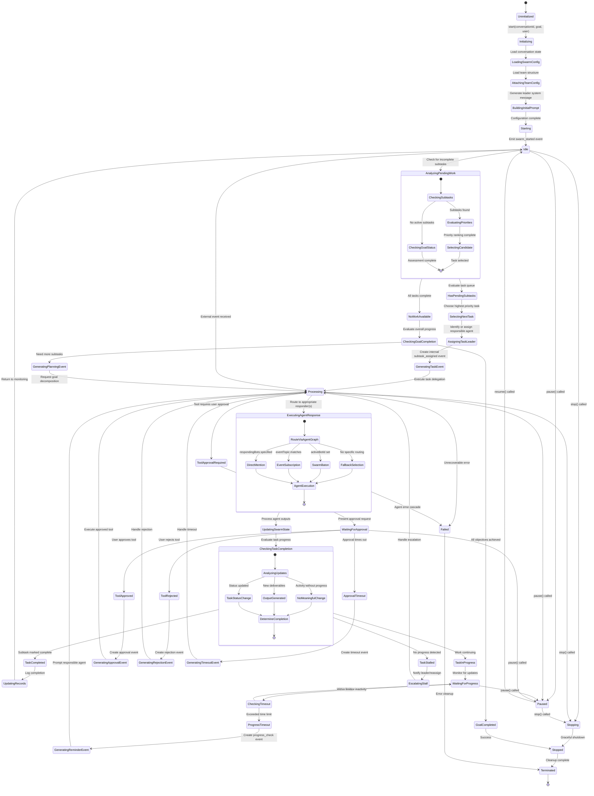
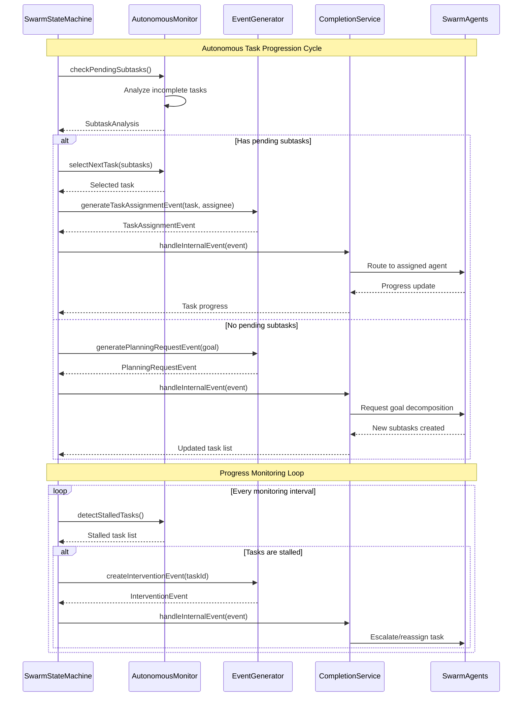

# SwarmStateMachine Architecture

The SwarmStateMachine is the central orchestrator for swarm coordination, managing the complete lifecycle from initialization through autonomous operation to graceful shutdown.

## 🔄 State Machine Overview

The following diagram shows how the swarm state machine is architected to support proactive subtask management and autonomous event generation:



## 🎯 Key Features for Autonomous Operation

The SwarmStateMachine supports the following critical features:

### 1. Autonomous Task Progression
```typescript
interface AutonomousSubtaskManager {
    // Continuously monitor for incomplete work
    checkPendingSubtasks(): Promise<SubtaskAnalysis>;
    
    // Select next highest priority task
    selectNextTask(availableSubtasks: SwarmSubTask[]): SwarmSubTask | null;
    
    // Generate internal events to drive progress
    generateTaskAssignmentEvent(task: SwarmSubTask, assignee: string): SwarmEvent;
    
    // Monitor task progress and escalate stalls
    monitorTaskProgress(taskId: string): Promise<ProgressAssessment>;
}
```

### 2. Proactive Event Generation
```typescript
interface SwarmEventGenerator {
    // Generate events when no external stimulus exists
    generatePeriodicCheckEvent(): SwarmEvent;
    
    // Create subtask assignment events
    generateSubtaskDelegationEvent(taskId: string, assigneeId: string): SwarmEvent;
    
    // Generate goal decomposition requests
    generatePlanningRequestEvent(currentGoal: string): SwarmEvent;
    
    // Create progress reminder events
    generateProgressReminderEvent(stalledTaskId: string): SwarmEvent;
}
```

### 3. Intelligent Task Assignment
```typescript
interface TaskAssignmentStrategy {
    // Analyze agent capabilities vs task requirements
    findBestAssignee(task: SwarmSubTask, availableAgents: BotParticipant[]): string;
    
    // Handle load balancing across agents
    redistributeWorkload(currentAssignments: Record<string, string[]>): void;
    
    // Escalate stalled tasks to leaders
    escalateStallToLeader(stalledTask: SwarmSubTask): SwarmEvent;
}
```

### 4. Progress Monitoring and Intervention
```typescript
interface ProgressMonitor {
    // Track time since last meaningful progress
    getTimeSinceLastProgress(taskId: string): number;
    
    // Detect when tasks are stalled
    detectStalledTasks(): string[];
    
    // Generate intervention events
    createInterventionEvent(taskId: string, intervention: InterventionType): SwarmEvent;
}
```

## 🔄 Autonomous Event Generation Workflow

The swarm state machine implements several autonomous behaviors:



## 📊 Event-Driven Architecture Integration

The SwarmStateMachine integrates seamlessly with the execution event system:

```typescript
// Event types for autonomous operation
type SwarmEvent = 
    | ExternalMessageEvent
    | ToolApprovalEvent  
    | SubtaskAssignmentEvent      // Autonomous task delegation
    | ProgressReminderEvent       // Stall prevention
    | PlanningRequestEvent        // Goal decomposition
    | TaskCompletionEvent         // Progress tracking
    | InterventionRequiredEvent;  // Escalation handling

// Autonomous event generation
class SwarmStateMachine {
    private autonomousMonitor: AutonomousMonitor;
    private eventGenerator: SwarmEventGenerator;
    private progressMonitor: ProgressMonitor;
    
    // Main monitoring loop that runs when IDLE
    private async autonomousMonitoringLoop(): Promise<void> {
        while (this.state === SwarmState.IDLE) {
            // Check for pending work
            const analysis = await this.autonomousMonitor.checkPendingSubtasks();
            
            if (analysis.hasPendingTasks) {
                const nextTask = await this.autonomousMonitor.selectNextTask(analysis.pendingTasks);
                if (nextTask) {
                    const assignmentEvent = this.eventGenerator.generateTaskAssignmentEvent(
                        nextTask, 
                        nextTask.assignedTo || await this.findBestAssignee(nextTask)
                    );
                    await this.handleEvent(assignmentEvent);
                }
            } else if (analysis.needsMorePlanning) {
                const planningEvent = this.eventGenerator.generatePlanningRequestEvent(this.currentGoal);
                await this.handleEvent(planningEvent);
            }
            
            // Check for stalled tasks
            const stalledTasks = await this.progressMonitor.detectStalledTasks();
            for (const taskId of stalledTasks) {
                const reminderEvent = this.eventGenerator.generateProgressReminderEvent(taskId);
                await this.handleEvent(reminderEvent);
            }
            
            // Wait before next monitoring cycle
            await this.waitForMonitoringInterval();
        }
    }
}
```

## ⚙️ Lifecycle Management

### Initialization Phase
1. **Load Configuration**: Retrieve conversation and team configuration
2. **Build Context**: Generate initial system prompts with MOISE+ structure
3. **Initialize Monitoring**: Set up autonomous monitoring loops
4. **Emit Start Event**: Signal that swarm is ready for operation

### Operational Phase
1. **Event Processing**: Handle external and internal events sequentially
2. **Agent Coordination**: Route events to appropriate responders
3. **Progress Tracking**: Monitor task completion and identify stalls
4. **Autonomous Actions**: Generate events to maintain forward progress

### Shutdown Phase
1. **Graceful Stop**: Complete current processing before stopping
2. **State Persistence**: Save current state for potential resumption
3. **Resource Cleanup**: Release resources and close connections

This architecture ensures that swarms remain active and productive even when no external events are occurring, solving the critical "idle swarm" problem.

---

**Next**: [Autonomous Operations](./autonomous-operations.md) - Detailed autonomous features and monitoring capabilities. 