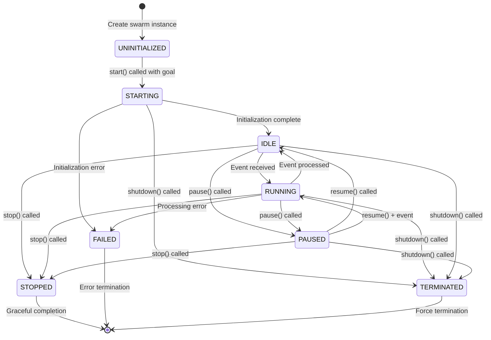
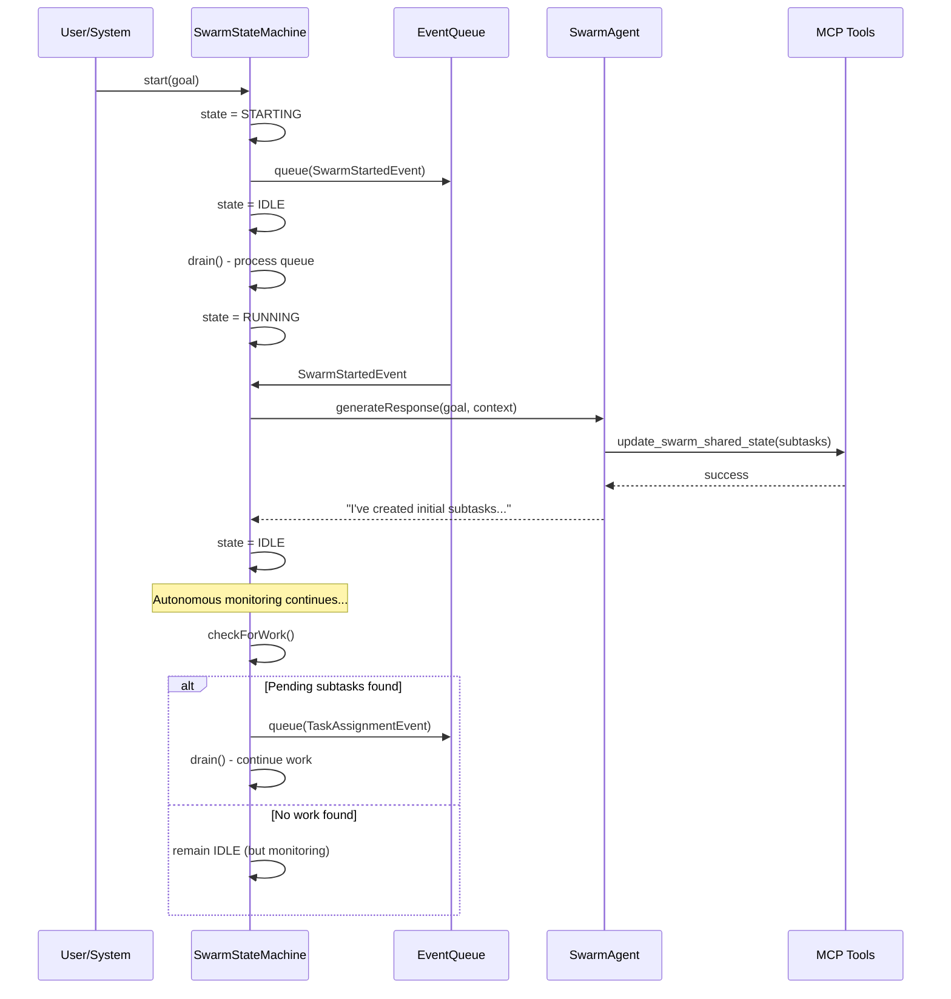

# 🧠 SwarmStateMachine: Elegant Autonomous Coordination

> **TL;DR**: The SwarmStateMachine provides simple, event-driven autonomous coordination through 8 operational states. Complex behaviors like goal setting, team formation, and task decomposition emerge from agent decisions rather than being hard-coded as states. This creates a more flexible and maintainable system.

---

## 🎯 Design Philosophy

The SwarmStateMachine embodies a key insight: **operational states should be separate from behavioral states**. Instead of prescriptive states for every possible coordination activity, we provide a simple operational framework and let intelligent agents decide what to do.

**Key Innovation**: Complex coordination behaviors emerge from AI agent decisions using available tools, rather than being encoded as rigid state transitions.

---

## 🔄 Actual State Machine (Operational States Only)



### **State Descriptions**

| State | Purpose | Transitions |
|-------|---------|-------------|
| **UNINITIALIZED** | Swarm instance created but not started | → STARTING |
| **STARTING** | Initializing with goal, creating leader, setting up | → IDLE, FAILED, TERMINATED |
| **RUNNING** | Actively processing events from queue | → IDLE, PAUSED, STOPPED, FAILED, TERMINATED |
| **IDLE** | Waiting for events (but monitoring for work) | → RUNNING, PAUSED, STOPPED, TERMINATED |
| **PAUSED** | Temporarily suspended by user/system | → IDLE, RUNNING, STOPPED, TERMINATED |
| **STOPPED** | Gracefully ended with statistics | → [*] |
| **FAILED** | Error occurred during operation | → [*] |
| **TERMINATED** | Force shutdown/emergency stop | → [*] |

---

## 🤖 How Complex Behaviors Emerge

Instead of hard-coded states for goal setting, team formation, etc., these behaviors emerge from agent tool usage:

### **Goal Setting & Decomposition**
```typescript
// Agent decides to break down the goal
{
    tool: "update_swarm_shared_state",
    args: {
        subtasks: [
            { id: "T1", description: "Research user requirements", status: "todo" },
            { id: "T2", description: "Design architecture", status: "todo" },
            { id: "T3", description: "Implement core features", status: "todo" }
        ]
    }
}
```

### **Team Formation**
```typescript
// Agent decides team is needed
{
    tool: "resource_manage",
    args: {
        op: "find",
        resource_type: "Team",
        filters: { capabilities: ["frontend", "backend", "design"] }
    }
}

// Or create a new team
{
    tool: "resource_manage",
    args: {
        op: "add",
        resource_type: "Team",
        attributes: {
            name: "Web Development Team",
            members: ["frontend_specialist", "backend_specialist"]
        }
    }
}
```

### **Routine Discovery & Execution**
```typescript
// Agent finds suitable routine
{
    tool: "resource_manage",
    args: {
        op: "find",
        resource_type: "RoutineMultiStep",
        filters: { tags: ["web_development"], complexity: "medium" }
    }
}

// Execute the routine
{
    tool: "run_routine",
    args: {
        action: "start",
        routine_id: "web_dev_workflow_v2",
        inputs: { framework: "react", backend: "node" }
    }
}
```

### **Child Swarm Creation**
```typescript
// Agent spawns specialized swarm for complex subtask
{
    tool: "spawn_swarm",
    args: {
        kind: "simple",
        goal: "Design and implement user authentication system",
        team_id: "security_team_id"
    }
}
```

---

## 📊 Event-Driven Autonomous Operation

The SwarmStateMachine operates through an **event queue** with **autonomous draining**:



### **Key Autonomous Features**

1. **Event Queue Processing**: Events are queued and processed sequentially
2. **Autonomous Monitoring**: System checks for pending work even when idle
3. **Tool-Based Actions**: All coordination happens through tool calls
4. **Natural Language Reasoning**: Agents decide what to do based on context

---

## 🛠️ Agent Tools for Coordination

Agents use these MCP tools to coordinate the swarm:

| Tool | Purpose | Example Usage |
|------|---------|---------------|
| **update_swarm_shared_state** | Manage subtasks, team, resources | Add/update subtasks, assign leaders |
| **resource_manage** | Find/create teams, routines, data | Search for existing solutions |
| **run_routine** | Execute discovered workflows | Start multi-step processes |
| **spawn_swarm** | Create child swarms | Delegate complex subtasks |
| **send_message** | Communicate with users/agents | Request clarification, report progress |

---

## 🎯 Benefits of This Approach

### **Simplicity**
- 8 operational states vs. 15+ behavioral states
- Clear separation of concerns
- Easier to debug and maintain

### **Flexibility**
- Agents decide when to form teams, not the state machine
- Goal evolution happens naturally through agent decisions
- New coordination patterns emerge without code changes

### **Robustness**
- Fewer state transitions = fewer edge cases
- Event queue ensures no work is lost
- Graceful error handling at the operational level

### **Emergent Intelligence**
- Complex behaviors arise from simple rules
- Agents learn and adapt coordination strategies
- System improves through experience

---

## 🔄 Comparison with Complex State Machines

| Aspect | **Simple States (Current)** | **Complex States (Alternative)** |
|--------|----------------------------|---------------------------------|
| States | 8 operational states | 15+ behavioral states |
| Transitions | Clear operational flow | Complex coordination logic |
| Agent Autonomy | High - agents decide what to do | Low - state machine prescribes behavior |
| Flexibility | Emergent behaviors | Hard-coded behaviors |
| Maintenance | Simple operational logic | Complex state transition rules |
| Testing | Test operational states + agent decisions | Test all state combinations |
| Evolution | Agents propose new patterns | Requires code changes |

---

## 📝 Implementation Notes

### **Event Queue**
- Events processed sequentially to maintain consistency
- Configurable delay between processing cycles
- Graceful handling of processing errors

### **Tool Integration**
- All tools available through standardized MCP interface
- Role-based tool access (leaders get all tools, others get subset)
- Tool calls integrated into conversation flow

### **State Persistence**
- Swarm state stored in Redis or in-memory store
- Conversation state includes goal, subtasks, team, resources
- Recovery possible from any operational state

### **Monitoring & Observability**
- All events published to event bus for monitoring agents
- State transitions logged with context
- Performance metrics tracked automatically

---

## 🚀 Getting Started

### **Starting a Swarm**
```typescript
const swarmStateMachine = new SwarmStateMachine(logger, eventBus, stateStore, conversationBridge);
await swarmStateMachine.start(conversationId, "Build a task management app", user);
```

### **Monitoring Progress**
```typescript
// Check operational state
const status = swarmStateMachine.getState(); // "RUNNING", "IDLE", etc.

// Monitor events
eventBus.on("swarm.events", (event) => {
    console.log(`Swarm event: ${event.type}`, event.metadata);
});
```

### **Graceful Shutdown**
```typescript
const result = await swarmStateMachine.stop("graceful", "Task completed");
console.log(result.finalState); // Statistics and completion info
```

---

## 📚 Related Documentation

- **[Agent Examples](../../emergent-capabilities/agent-examples/README.md)** - How specialized agents emerge
- **[MCP Tools Reference](../mcp-tools-reference.md)** - Available coordination tools
- **[Event-Driven Architecture](../../event-driven/README.md)** - Event system details
- **[Emergent Capabilities](../../emergent-capabilities/README.md)** - How intelligence emerges

> **💡 Key Insight**: The most elegant coordination systems don't prescribe behavior—they provide tools and context, then let intelligence emerge. This SwarmStateMachine proves that simple operational states + intelligent agents = sophisticated coordination capabilities.