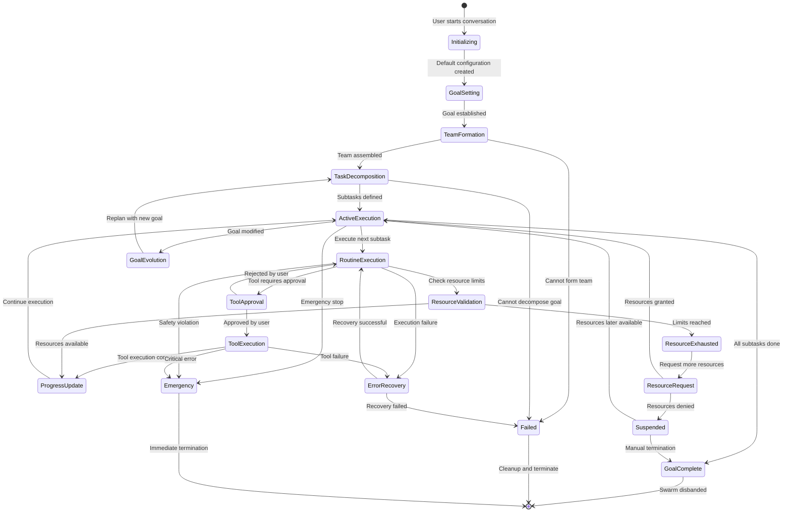
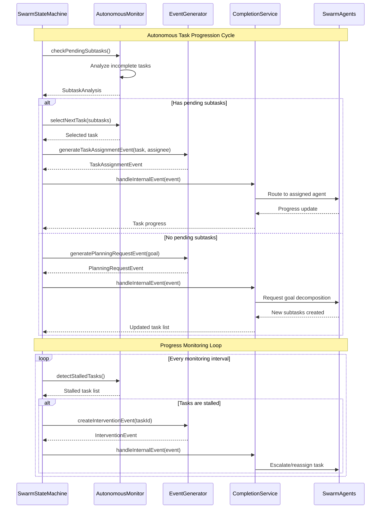

# 🧠 SwarmStateMachine: Complete Architecture & Lifecycle Management

> **TL;DR**: The SwarmStateMachine is the central orchestrator for swarm coordination, managing the complete lifecycle from initialization through autonomous operation to graceful shutdown. This document provides both the architectural overview and the definitive state diagram with all possible states, transitions, and autonomous behaviors.

---

## 🎯 SwarmStateMachine Overview

The SwarmStateMachine represents Vrooli's core innovation in AI coordination: **autonomous swarm management** that solves the critical "idle swarm" problem. Unlike traditional multi-agent systems that require constant external stimulus, the SwarmStateMachine proactively generates events, monitors progress, and drives tasks forward through intelligent reasoning.

**Key Innovation**: The SwarmStateMachine ensures swarms remain **active and productive** even when no external events are occurring, creating truly autonomous AI coordination.

---

## 🔄 Complete State Machine Lifecycle

The following diagram shows the complete SwarmStateMachine lifecycle with clear, readable state transitions:



---

## 🤖 Autonomous Operation Architecture

### **The Autonomous Monitoring Loop**

Within the `ActiveExecution` state, the SwarmStateMachine runs an intelligent monitoring loop that ensures continuous progress:



### **Key Autonomous Capabilities**

The SwarmStateMachine provides four critical autonomous capabilities:

#### 1. **Autonomous Task Progression**
```typescript
interface AutonomousSubtaskManager {
    // Continuously monitor for incomplete work
    checkPendingSubtasks(): Promise<SubtaskAnalysis>;
    
    // Select next highest priority task
    selectNextTask(availableSubtasks: SwarmSubTask[]): SwarmSubTask | null;
    
    // Generate internal events to drive progress
    generateTaskAssignmentEvent(task: SwarmSubTask, assignee: string): SwarmEvent;
    
    // Monitor task progress and escalate stalls
    monitorTaskProgress(taskId: string): Promise<ProgressAssessment>;
}
```

#### 2. **Proactive Event Generation**
```typescript
interface SwarmEventGenerator {
    // Generate events when no external stimulus exists
    generatePeriodicCheckEvent(): SwarmEvent;
    
    // Create subtask assignment events
    generateSubtaskDelegationEvent(taskId: string, assigneeId: string): SwarmEvent;
    
    // Generate goal decomposition requests
    generatePlanningRequestEvent(currentGoal: string): SwarmEvent;
    
    // Create progress reminder events
    generateProgressReminderEvent(stalledTaskId: string): SwarmEvent;
}
```

#### 3. **Intelligent Task Assignment**
```typescript
interface TaskAssignmentStrategy {
    // Analyze agent capabilities vs task requirements
    findBestAssignee(task: SwarmSubTask, availableAgents: BotParticipant[]): string;
    
    // Handle load balancing across agents
    redistributeWorkload(currentAssignments: Record<string, string[]>): void;
    
    // Escalate stalled tasks to leaders
    escalateStallToLeader(stalledTask: SwarmSubTask): SwarmEvent;
}
```

#### 4. **Progress Monitoring and Intervention**
```typescript
interface ProgressMonitor {
    // Track time since last meaningful progress
    getTimeSinceLastProgress(taskId: string): number;
    
    // Detect when tasks are stalled
    detectStalledTasks(): string[];
    
    // Generate intervention events
    createInterventionEvent(taskId: string, intervention: InterventionType): SwarmEvent;
}
```

---

## 📋 Detailed State Definitions

### **🚀 Initialization States**

#### **Initializing**
- **Purpose**: Set up default swarm configuration and prepare for goal definition
- **Duration**: 1-5 seconds
- **ChatConfigObject Updates**:
  ```typescript
  {
    __version: "1.0",
    goal: "Follow the user's instructions.", // Default
    subtasks: [],
    resources: [],
    blackboard: [],
    stats: { totalToolCalls: 0, totalCredits: "0", startedAt: null },
    limits: getDefaultLimits()
  }
  ```
- **Autonomous Behaviors**: Initialize monitoring loops and event generation systems
- **Exit Conditions**: Configuration successfully created

#### **GoalSetting**
- **Purpose**: Establish the primary objective for the swarm through natural language understanding
- **Duration**: Variable (user interaction dependent)
- **ChatConfigObject Updates**:
  ```typescript
  {
    goal: "Create comprehensive market analysis for Q1 2024",
    stats: { startedAt: Date.now() }
  }
  ```
- **Autonomous Behaviors**: Parse and validate goal feasibility, estimate resource requirements
- **Exit Conditions**: Clear, actionable goal established

#### **TeamFormation**
- **Purpose**: Recruit and organize the appropriate AI agents for the goal using MOISE+ organizational modeling
- **Duration**: 5-30 seconds
- **ChatConfigObject Updates**:
  ```typescript
  {
    swarmLeader: "market_analysis_lead_bot_123",
    teamId: "market_research_team_456",
    eventSubscriptions: {
      "tool/approval_required": ["approval_manager_bot"],
      "routine/failed": ["recovery_specialist_bot"]
    }
  }
  ```
- **Autonomous Behaviors**: 
  - Search for existing suitable teams
  - Recruit specialized agents based on goal analysis
  - Set up event subscriptions for autonomous coordination
- **Exit Conditions**: Team successfully assembled with all required capabilities

#### **TaskDecomposition**
- **Purpose**: Break down the goal into manageable, assignable subtasks through AI reasoning
- **Duration**: 10-60 seconds
- **ChatConfigObject Updates**:
  ```typescript
  {
    subtasks: [
      {
        id: "T1",
        description: "Collect market data from financial APIs",
        status: "todo",
        assignee_bot_id: "data_collector_bot_789",
        priority: "high",
        depends_on: [],
        created_at: "2024-01-15T10:00:00Z"
      },
      {
        id: "T2", 
        description: "Analyze trends and competitive landscape",
        status: "todo",
        assignee_bot_id: "analyst_bot_101",
        priority: "medium",
        depends_on: ["T1"],
        created_at: "2024-01-15T10:00:30Z"
      }
    ]
  }
  ```
- **Autonomous Behaviors**: Use AI reasoning to identify dependencies, assign priorities, and allocate tasks
- **Exit Conditions**: All subtasks defined with clear dependencies and assignments

### **⚡ Execution States**

#### **ActiveExecution**
- **Purpose**: Coordinate ongoing subtask execution and autonomous progress monitoring
- **Duration**: Variable (minutes to hours)
- **State Characteristics**:
  - **Persistent**: Swarm remains in this state during most of its active lifecycle
  - **Autonomous**: Continuously monitors and generates events to drive progress
  - **Intelligent**: Makes decisions about task priority and resource allocation
- **Internal Autonomous Logic**:
  ```typescript
  async function autonomousExecutionLoop() {
    while (this.state === SwarmState.ACTIVE_EXECUTION) {
      // Check for pending work
      const analysis = await this.autonomousMonitor.checkPendingSubtasks();
      
      if (analysis.hasPendingTasks) {
        const nextTask = await this.autonomousMonitor.selectNextTask(analysis.pendingTasks);
        if (nextTask && await this.canExecuteWithinLimits(nextTask)) {
          await this.transitionTo('RoutineExecution', nextTask);
        } else if (nextTask) {
          await this.transitionTo('ResourceValidation', nextTask);
        }
      } else if (analysis.needsMorePlanning) {
        const planningEvent = this.eventGenerator.generatePlanningRequestEvent(this.currentGoal);
        await this.handleInternalEvent(planningEvent);
      }
      
      // Monitor for stalled tasks
      const stalledTasks = await this.progressMonitor.detectStalledTasks();
      for (const taskId of stalledTasks) {
        const reminderEvent = this.eventGenerator.generateProgressReminderEvent(taskId);
        await this.handleInternalEvent(reminderEvent);
      }
      
      await this.waitForMonitoringInterval(); // 1-second coordination cycle
    }
  }
  ```
- **Exit Conditions**: 
  - All subtasks completed → GoalComplete
  - Goal modified by user → GoalEvolution
  - Resource limits exceeded → ResourceValidation
  - Emergency situation → Emergency

#### **RoutineExecution**
- **Purpose**: Execute a specific subtask through T2 routine execution with autonomous monitoring
- **Duration**: 30 seconds to 30 minutes per routine
- **ChatConfigObject Updates**:
  ```typescript
  {
    subtasks: [/* updated status: "in_progress" */],
    records: [
      {
        id: "record_001",
        routine_id: "market_data_collection_v3",
        routine_name: "Market Data Collection",
        caller_bot_id: "data_collector_bot_789",
        created_at: "2024-01-15T10:30:00Z"
      }
    ]
  }
  ```
- **Autonomous Behaviors**: Monitor routine progress and automatically detect failures or stalls
- **Exit Conditions**:
  - Routine completes successfully → ProgressUpdate
  - Tool requires user approval → ToolApproval
  - Resource limits approached → ResourceValidation
  - Routine fails → ErrorRecovery

### **🔧 Resource & Approval States**

#### **ToolApproval**
- **Purpose**: Handle user approval workflow for potentially risky or expensive tools
- **Duration**: Seconds to hours (user-dependent)
- **ChatConfigObject Updates**:
  ```typescript
  {
    pendingToolCalls: [
      {
        pendingId: "pending_abc123",
        toolCallId: "call_def456",
        toolName: "execute_financial_trade",
        status: "PENDING_APPROVAL",
        requestedAt: 1705323600000,
        approvalTimeoutAt: 1705323900000,
        callerBotId: "trading_bot_001"
      }
    ]
  }
  ```
- **Autonomous Behaviors**: Set approval timeouts and automatically handle timeout scenarios
- **Exit Conditions**:
  - User approves → ToolExecution
  - User rejects → RoutineExecution (with fallback)
  - Timeout expires → RoutineExecution (auto-reject)

#### **ResourceValidation**
- **Purpose**: Check and manage resource constraints before proceeding
- **Duration**: 1-10 seconds
- **Autonomous Validation Logic**:
  ```typescript
  function validateResources(task: SubTask, limits: ResourceLimits): ValidationResult {
    const currentStats = getCurrentStats();
    const estimatedCost = this.autonomousMonitor.estimateTaskCost(task);
    
    // Credit validation
    if (BigInt(currentStats.totalCredits) + BigInt(estimatedCost) > BigInt(limits.maxCredits)) {
      return { valid: false, reason: 'credit_limit_exceeded' };
    }
    
    // Time validation with intelligent estimation
    const elapsed = Date.now() - currentStats.startedAt;
    const estimatedDuration = this.autonomousMonitor.estimateTaskDuration(task);
    if (elapsed + estimatedDuration > limits.maxDurationMs) {
      return { valid: false, reason: 'time_limit_exceeded' };
    }
    
    return { valid: true };
  }
  ```
- **Exit Conditions**:
  - Resources available → ProgressUpdate
  - Resources exhausted → ResourceExhausted

### **📊 Progress & Completion States**

#### **ProgressUpdate**
- **Purpose**: Update swarm state with completed work and assess next steps autonomously
- **Duration**: 1-5 seconds
- **ChatConfigObject Updates**:
  ```typescript
  {
    subtasks: [/* status updated to "done" */],
    resources: [
      {
        id: "market_data_q1",
        kind: "File",
        creator_bot_id: "data_collector_bot_789",
        created_at: "2024-01-15T10:45:00Z"
      }
    ],
    blackboard: [
      {
        id: "insight_1",
        value: "Tech sector showing 15% growth trend",
        created_at: "2024-01-15T10:45:00Z"
      }
    ]
  }
  ```
- **Autonomous Behaviors**: 
  - Automatically check dependency chains for newly unblocked tasks
  - Update shared knowledge base
  - Trigger planning events if more work is needed
- **Exit Conditions**: Return to ActiveExecution for next autonomous coordination cycle

#### **GoalEvolution**
- **Purpose**: Handle goal modifications and replan accordingly through autonomous reasoning
- **Duration**: 10-120 seconds
- **Autonomous Behaviors**:
  - Analyze goal changes and impact on existing work
  - Intelligently identify obsolete subtasks
  - Generate new subtasks for additional requirements
  - Automatically reassign resources and priorities
- **Exit Conditions**: Return to TaskDecomposition with updated goal

### **🚨 Error & Emergency States**

#### **ErrorRecovery**
- **Purpose**: Handle routine failures and attempt autonomous recovery
- **Duration**: 5-60 seconds
- **Autonomous Recovery Strategies**:
  ```typescript
  enum RecoveryStrategy {
    RETRY_WITH_SAME_PARAMS = "retry_same",
    RETRY_WITH_MODIFIED_PARAMS = "retry_modified", 
    FALLBACK_TO_ALTERNATIVE = "fallback",
    ESCALATE_TO_HUMAN = "escalate",
    SKIP_OPTIONAL_TASK = "skip"
  }
  
  async function autonomousRecovery(error: ExecutionError): Promise<RecoveryResult> {
    // Analyze failure cause autonomously
    const failureAnalysis = await this.autonomousMonitor.analyzeFailure(error);
    
    // Select appropriate recovery strategy
    const strategy = this.selectRecoveryStrategy(failureAnalysis);
    
    // Attempt recovery with learning
    const result = await this.attemptRecovery(strategy, failureAnalysis);
    
    // Update learning data for future failures
    await this.updateRecoveryLearning(error, strategy, result);
    
    return result;
  }
  ```
- **Exit Conditions**:
  - Recovery successful → RoutineExecution
  - Recovery failed after max attempts → Failed

---

## 📊 Event-Driven Architecture Integration

The SwarmStateMachine integrates seamlessly with Vrooli's event-driven architecture, both consuming external events and generating internal events for autonomous operation:

```typescript
// Event types for autonomous operation
type SwarmEvent = 
    | ExternalMessageEvent        // User inputs, external triggers
    | ToolApprovalEvent          // User approval/rejection responses
    | SubtaskAssignmentEvent     // Autonomous task delegation
    | ProgressReminderEvent      // Autonomous stall prevention
    | PlanningRequestEvent       // Autonomous goal decomposition
    | TaskCompletionEvent        // Progress tracking updates
    | InterventionRequiredEvent; // Autonomous escalation handling

// Main autonomous event generation class
class SwarmStateMachine {
    private autonomousMonitor: AutonomousMonitor;
    private eventGenerator: SwarmEventGenerator;
    private progressMonitor: ProgressMonitor;
    
    // Main autonomous monitoring loop that solves the "idle swarm" problem
    private async autonomousMonitoringLoop(): Promise<void> {
        while (this.state === SwarmState.ACTIVE_EXECUTION) {
            try {
                // Check for pending work and generate events to drive progress
                await this.checkAndDriveProgress();
                
                // Monitor for stalls and generate intervention events
                await this.monitorAndInterventStalls();
                
                // Generate planning events if more decomposition needed
                await this.checkAndRequestMorePlanning();
                
                // Wait before next monitoring cycle
                await this.waitForMonitoringInterval();
            } catch (error) {
                await this.handleAutonomousError(error);
            }
        }
    }
    
    private async checkAndDriveProgress(): Promise<void> {
        const analysis = await this.autonomousMonitor.checkPendingSubtasks();
        
        if (analysis.hasPendingTasks) {
            const nextTask = await this.autonomousMonitor.selectNextTask(analysis.pendingTasks);
            if (nextTask) {
                const assignmentEvent = this.eventGenerator.generateTaskAssignmentEvent(
                    nextTask, 
                    nextTask.assignedTo || await this.findBestAssignee(nextTask)
                );
                await this.handleEvent(assignmentEvent);
            }
        }
    }
}
```

---

## 🔄 State Transition Matrix

| From State | To State | Trigger | Duration | Autonomous Capability |
|------------|----------|---------|----------|----------------------|
| `Initializing` | `GoalSetting` | Configuration ready | ~2s | Initialize monitoring systems |
| `GoalSetting` | `TeamFormation` | Goal established | Variable | Parse and validate goal |
| `TeamFormation` | `TaskDecomposition` | Team assembled | ~15s | Auto-recruit and organize |
| `TaskDecomposition` | `ActiveExecution` | Subtasks defined | ~30s | AI-driven decomposition |
| `ActiveExecution` | `RoutineExecution` | Subtask ready | ~1s | **Autonomous task selection** |
| `ActiveExecution` | `GoalComplete` | All tasks done | ~5s | **Autonomous completion detection** |
| `ActiveExecution` | `GoalEvolution` | Goal modified | ~2s | **Autonomous replanning** |
| `RoutineExecution` | `ToolApproval` | Approval needed | ~1s | Auto-detect approval requirements |
| `RoutineExecution` | `ProgressUpdate` | Routine complete | ~2s | **Autonomous progress tracking** |
| `RoutineExecution` | `ErrorRecovery` | Execution failed | ~1s | **Autonomous failure detection** |
| `ErrorRecovery` | `RoutineExecution` | Recovery success | ~10s | **Autonomous recovery strategies** |
| `ProgressUpdate` | `ActiveExecution` | Updates applied | ~3s | **Autonomous work continuation** |

---

## 📊 Performance Metrics & Autonomous Monitoring

### **Autonomous Operation Metrics**
```typescript
interface AutonomousOperationMetrics {
  // Task progression metrics
  averageTaskSelectionTime: number;           // How quickly we select next tasks
  taskAssignmentAccuracy: number;             // How often we assign to right agents
  stallDetectionLatency: number;              // How quickly we detect stalls
  
  // Event generation metrics
  autonomousEventsGenerated: number;          // Events created without external stimulus
  planningRequestEffectiveness: number;       // Success rate of planning requests
  interventionSuccessRate: number;            // Success rate of stall interventions
  
  // Resource optimization metrics
  resourceUtilizationEfficiency: number;     // How well we use available resources
  costOptimizationSavings: number;           // Savings from intelligent allocation
  
  // Learning and adaptation metrics
  recoveryStrategyImprovement: number;       // How recovery gets better over time
  taskEstimationAccuracy: number;            // How accurate our estimates become
}
```

### **Autonomous Health Monitoring**
- **Stall Detection**: Alert if any task remains inactive beyond threshold
- **Event Generation Health**: Monitor internal event creation patterns
- **Resource Efficiency**: Track autonomous resource allocation effectiveness
- **Learning Progress**: Monitor improvement in autonomous decision making

---

## ⚙️ Lifecycle Management & Implementation

### **Initialization Phase**
1. **Load Configuration**: Retrieve conversation and team configuration
2. **Build Context**: Generate initial system prompts with MOISE+ structure
3. **Initialize Autonomous Systems**: Set up monitoring loops and event generation
4. **Emit Start Event**: Signal that swarm is ready for autonomous operation

### **Operational Phase**
1. **Event Processing**: Handle external and internal events sequentially
2. **Agent Coordination**: Route events to appropriate responders using intelligent routing
3. **Autonomous Progress Tracking**: Continuously monitor task completion and identify stalls
4. **Proactive Actions**: Generate events to maintain forward progress without external stimulus

### **Shutdown Phase**
1. **Graceful Stop**: Complete current processing before stopping
2. **State Persistence**: Save current state for potential resumption
3. **Autonomous System Cleanup**: Properly shutdown monitoring loops and event generation
4. **Resource Cleanup**: Release resources and close connections

### **Implementation Guidelines**

```typescript
class SwarmStateMachine {
  private currentState: string = 'initializing';
  private swarmContext: SwarmContext;
  private autonomousMonitor: AutonomousMonitor;
  private eventGenerator: SwarmEventGenerator;
  private progressMonitor: ProgressMonitor;
  private stateHistory: StateTransition[] = [];
  
  async transitionTo(newState: string, data?: unknown): Promise<void> {
    const isValidTransition = this.validateTransition(this.currentState, newState);
    if (!isValidTransition) {
      throw new InvalidStateTransitionError(this.currentState, newState);
    }
    
    await this.exitCurrentState();
    const previousState = this.currentState;
    this.currentState = newState;
    
    // Track state history for autonomous learning
    this.stateHistory.push({
      from: previousState,
      to: newState,
      timestamp: Date.now(),
      data: data,
      autonomouslyTriggered: this.wasAutonomousTransition(newState, data)
    });
    
    await this.enterNewState(data);
    
    // Start autonomous monitoring if entering ActiveExecution
    if (newState === 'ActiveExecution') {
      this.startAutonomousMonitoring();
    }
  }
  
  private async startAutonomousMonitoring(): Promise<void> {
    // This is the key method that solves the "idle swarm" problem
    this.autonomousMonitoringLoop();
  }
}
```

---

## 🚀 Why This Architecture Solves the "Idle Swarm" Problem

Traditional multi-agent systems become idle when there are no external events. The SwarmStateMachine **solves this fundamental problem** through:

1. **Proactive Event Generation**: Creates internal events to drive progress
2. **Autonomous Task Selection**: Intelligently chooses next actions
3. **Progress Monitoring**: Detects and intervenes when work stalls
4. **Resource Optimization**: Continuously optimizes allocation and usage
5. **Learning Integration**: Improves decision making through experience

**The Result**: Swarms that remain **continuously productive** and **autonomously intelligent**, creating compound capabilities that grow more effective over time.

---

## 📚 Related Documentation

- **[SwarmStateMachine State Diagram](swarm-state-machine-diagram.md)** - **🆕 Alternative comprehensive state lifecycle view**
- **[Autonomous Operations](autonomous-operations.md)** - Detailed autonomous features and monitoring capabilities
- **[Tier 1 Architecture](README.md)** - Complete coordination intelligence overview
- **[ChatConfigObject Integration](../../swarm-execution-integration.md)** - State persistence patterns
- **[Event-Driven Coordination](../../event-driven/README.md)** - Event triggers for state transitions
- **[Error Handling](../../resilience/README.md)** - Error recovery and failure management

---

> 💡 **Key Insight**: The SwarmStateMachine provides **deterministic coordination** for **non-deterministic AI agents** while maintaining **autonomous intelligence** that solves the idle swarm problem. This creates AI systems that are both reliable and continuously productive, representing a fundamental advancement in multi-agent coordination. 