# Tier 2: Process Intelligence - RunStateMachine

**Purpose**: Navigator-agnostic routine execution with parallel coordination and state management

The `RunStateMachine` is at the heart of Vrooli's ability to execute diverse automation routines. The following diagram visualizes its lifecycle and the various states it transitions through while managing routine execution:


## **Plug-and-Play Routine Architecture**
The RunStateMachine represents Vrooli's core innovation: a **universal routine execution engine** that's completely agnostic to the underlying automation platform. This creates an unprecedented **universal automation ecosystem**:

- **BPMN 2.0** support out of the box for enterprise-grade process modeling
- Designed for **interoperability** with other workflow standards:
  - [Langchain](https://langchain.com/) graphs and chains
  - [Temporal](https://temporal.io/) workflows
  - [Apache Airflow](https://airflow.apache.org/) DAGs
  - [n8n](https://n8n.io/) workflows
  - Future support for any graph-based automation standard

This means swarms from different platforms can share and execute each other's routines, creating a **universal automation ecosystem** where the best automation workflows can be used anywhere, regardless of their original platform.

## **Universal Navigator Interface**

The RunStateMachine achieves platform independence through a standardized `IRoutineStepNavigator` interface:

```typescript
interface IRoutineStepNavigator {
    supportsParallelExecution: boolean;
    
    getAvailableStartLocations<Config>(params: StartLocationParams<Config>): Promise<NavigationDecision>;
    getAvailableNextLocations<Config>(params: NextLocationParams<Config>): Promise<NavigationDecision>;
    getTriggeredBoundaryEvents<Config>(params: BoundaryEventParams<Config>): Promise<NavigationDecision>;
    getIONamesPassedIntoNode<Config>(params: IOParams<Config>): Promise<IOMapping>;
}
```

**Any workflow platform** can be integrated by implementing this interface, enabling:
- **Cross-Platform Routine Sharing**: A routine created in n8n can be executed in Temporal
- **Best-of-Breed Workflows**: Use the best tool for each task within a single automation
- **Platform Migration**: Easily move routines between platforms as needs evolve
- **Ecosystem Network Effects**: Every new navigator benefits all existing routines

## **Single-Step vs Multi-Step Routine Architecture**

The RunStateMachine orchestrates two fundamental types of routines, each serving different purposes in the automation ecosystem:

```mermaid
graph TB
    subgraph "Routine Execution Architecture"
        RSM[RunStateMachine<br/>🎯 Universal routine orchestrator<br/>📊 Context management<br/>⚡ Strategy selection]
        
        subgraph "Multi-Step Routines"
            MSR[Multi-Step Routine<br/>📋 BPMN/Workflow graphs<br/>🔄 Orchestration logic<br/>🌿 Parallel execution]
            
            MSRExamples[Examples:<br/>📊 Business processes<br/>🔄 Complex workflows<br/>🎯 Strategic operations]
        end
        
        subgraph "Single-Step Routines"
            SSR[Single-Step Routine<br/>⚙️ Atomic actions<br/>🔧 Direct execution<br/>✅ Immediate results]
            
            SSRTypes[Action Types:<br/>🌐 Web Search<br/>📱 API Calls<br/>💻 Code Execution<br/>🤖 AI Generation<br/>📝 Data Processing<br/>🔧 Internal Actions]
        end
        
        subgraph "Recursive Composition"
            RC[Any routine can contain<br/>other routines as subroutines<br/>🔄 Unlimited nesting<br/>📊 Context inheritance]
        end
    end
    
    RSM --> MSR
    RSM --> SSR
    MSR -.->|"Can contain"| MSR
    MSR -.->|"Can contain"| SSR
    SSR -.->|"Used within"| MSR
    
    RC -.->|"Enables"| MSR
    RC -.->|"Enables"| SSR
    
    classDef rsm fill:#e3f2fd,stroke:#1565c0,stroke-width:3px
    classDef multi fill:#f3e5f5,stroke:#7b1fa2,stroke-width:2px
    classDef single fill:#e8f5e8,stroke:#2e7d32,stroke-width:2px
    classDef composition fill:#fff3e0,stroke:#f57c00,stroke-width:2px
    
    class RSM rsm
    class MSR,MSRExamples multi
    class SSR,SSRTypes single
    class RC composition
```



## **Key Responsibilities**

- **Universal Execution**: Execute routines from any supported platform using the same engine
- **Recursive Composition**: Support unlimited nesting of multi-step and single-step routines  
- **Context Management**: Maintain hierarchical execution contexts with proper data flow
- **Sensitivity Handling**: Enforce data sensitivity rules throughout execution
- **Parallel Coordination**: Manage complex branching and synchronization across routine types
- **State Management**: Maintain execution state with recovery and audit capabilities across platforms
- **Intelligent Navigation**: Optimize execution paths while preserving platform-specific semantics
- **Strategy Evolution**: Enable gradual transformation from conversational to deterministic execution
- **Resource Management**: Track credits, time, and computational resources across execution tiers

## **Current & Planned Navigator Support**

**Currently Implemented**:
- **BPMN Navigator**: Full BPMN 2.0 support with gateways, events, and parallel execution

**Planned Navigators**:
- **Langchain Navigator**: Execute LangGraph chains and AI agent workflows
- **Temporal Navigator**: Support for durable execution and long-running workflows  
- **Apache Airflow Navigator**: Execute data pipeline DAGs and ETL workflows
- **n8n Navigator**: Support for low-code automation workflows
- **Custom Navigator**: Framework for domain-specific workflow standards

This architecture makes Vrooli the **universal execution layer** for automation - like how Kubernetes became the universal orchestration layer for containers, Vrooli becomes the universal orchestration layer for intelligent workflows.
