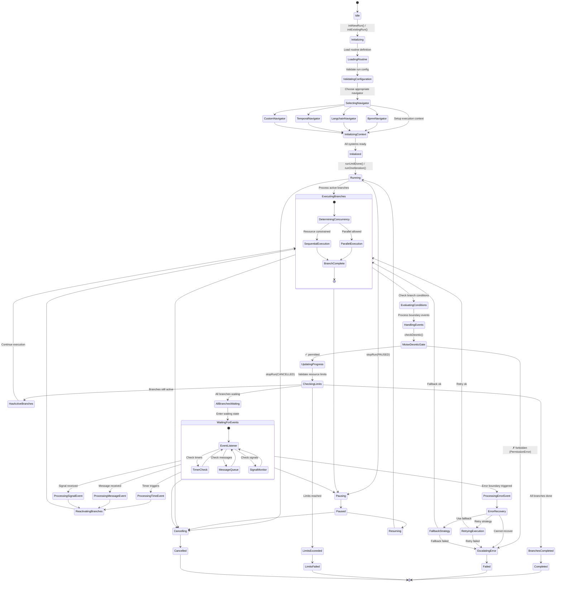

# Tier 2: Process Intelligence - RunStateMachine

**Purpose**: Navigator-agnostic routine execution with parallel coordination and state management

## 📋 Table of Contents

- [🏗️ Architecture Overview](./architecture.md) - Universal automation ecosystem and plug-and-play design
- [🧭 Navigator System](./navigators.md) - Universal interface and platform support
- [⚙️ Routine Types](./routine-types.md) - Single-step vs multi-step execution patterns
- [🎯 Core Responsibilities](./responsibilities.md) - Key capabilities and functions
- [📚 Routine Examples](./routine-examples/README.md) - Comprehensive collection of multi-step routine examples

## 🎯 Overview

The `RunStateMachine` is at the heart of Vrooli's ability to execute diverse automation routines. It represents Vrooli's core innovation: a **universal routine execution engine** that's completely agnostic to the underlying automation platform.

This creates an unprecedented **universal automation ecosystem** where workflows from different platforms can share and execute each other's routines, enabling the best automation workflows to be used anywhere, regardless of their original platform.

## 🔄 State Machine Lifecycle

The following diagram visualizes the RunStateMachine's lifecycle and the various states it transitions through while managing routine execution:

## 🚀 Next Steps

Explore the detailed documentation in the sections above to understand:

- How the universal architecture enables cross-platform automation
- The navigator interface that makes any workflow platform compatible
- The different types of routines and their execution patterns
- The comprehensive responsibilities handled by the RunStateMachine

This modular design makes Vrooli the **universal execution layer** for automation - like how Kubernetes became the universal orchestration layer for containers, Vrooli becomes the universal orchestration layer for intelligent workflows. 