# 🏗️ Plug-and-Play Routine Architecture

The RunStateMachine represents Vrooli's core innovation: a **universal routine execution engine** that's completely agnostic to the underlying automation platform. This creates an unprecedented **universal automation ecosystem**.

## 🌐 Universal Automation Ecosystem

The architecture enables **interoperability** with multiple workflow standards and platforms:

- **[BPMN 2.0](https://www.omg.org/spec/BPMN/2.0/)** support out of the box for enterprise-grade process modeling
- **[Langchain](https://langchain.com/)** graphs and chains for AI-driven workflows
- **[Temporal](https://temporal.io/)** workflows for durable execution
- **[Apache Airflow](https://airflow.apache.org/)** DAGs for data pipeline orchestration
- **[n8n](https://n8n.io/)** workflows for low-code automation
- **Future support** for any graph-based automation standard

## 🔄 Cross-Platform Benefits

This universal approach enables:

- **Cross-Platform Routine Sharing**: A routine created in n8n can be executed in Temporal
- **Best-of-Breed Workflows**: Use the best tool for each task within a single automation
- **Platform Migration**: Easily move routines between platforms as needs evolve
- **Ecosystem Network Effects**: Every new navigator benefits all existing routines

## 🎯 Universal Execution Layer

This architecture makes Vrooli the **universal execution layer** for automation:

```mermaid
graph TB
    subgraph "Universal Automation Ecosystem"
        subgraph "Supported Platforms"
            BPMN[🏢 BPMN 2.0<br/>Enterprise processes]
            LC[🤖 Langchain<br/>AI workflows]
            TEMP[⏰ Temporal<br/>Durable execution]
            AF[📊 Apache Airflow<br/>Data pipelines]
            N8N[🔧 n8n<br/>Low-code automation]
            CUSTOM[⚙️ Custom<br/>Domain-specific]
        end
        
        subgraph "Vrooli Universal Layer"
            RSM[🎯 RunStateMachine<br/>Universal execution engine]
            NAV[🧭 Navigator Interface<br/>Platform abstraction]
        end
        
        subgraph "Shared Capabilities"
            SHARE[🔄 Cross-platform sharing]
            MIGRATE[📦 Easy migration]
            COMPOSE[🧩 Workflow composition]
            NETWORK[🌐 Network effects]
        end
    end
    
    BPMN --> NAV
    LC --> NAV
    TEMP --> NAV
    AF --> NAV
    N8N --> NAV
    CUSTOM --> NAV
    
    NAV --> RSM
    
    RSM --> SHARE
    RSM --> MIGRATE
    RSM --> COMPOSE
    RSM --> NETWORK
    
    classDef platform fill:#e3f2fd,stroke:#1565c0,stroke-width:2px
    classDef universal fill:#f3e5f5,stroke:#7b1fa2,stroke-width:3px
    classDef capability fill:#e8f5e8,stroke:#2e7d32,stroke-width:2px
    
    class BPMN,LC,TEMP,AF,N8N,CUSTOM platform
    class RSM,NAV universal
    class SHARE,MIGRATE,COMPOSE,NETWORK capability
```

## 🔧 Implementation Benefits

### Platform Independence
- **Single codebase** handles all workflow types
- **Consistent behavior** across different platforms
- **Unified monitoring** and management interface

### Ecosystem Growth  
- **New platforms** can be added without changing existing routines
- **Best practices** can be shared across all platforms
- **Innovation** in one area benefits the entire ecosystem

### Business Value
- **Reduced vendor lock-in** across automation platforms
- **Faster time-to-market** for new automation solutions
- **Lower maintenance costs** through unified architecture

Like how **Kubernetes** became the universal orchestration layer for containers, **Vrooli** becomes the universal orchestration layer for intelligent workflows.

## 🚀 Future Vision

This architecture positions Vrooli to become the **standard execution layer** for the automation industry, enabling:

- **Universal workflow marketplaces** where any routine can run anywhere
- **Cross-platform AI agent collaboration** between different automation systems  
- **Seamless integration** of emerging workflow technologies
- **Industry-wide standardization** of automation execution patterns 