# 🧭 Universal Navigator Interface

The RunStateMachine achieves platform independence through a standardized `IRoutineStepNavigator` interface. This interface enables **any workflow platform** to be integrated into Vrooli's universal execution engine.

## 🔌 Navigator Interface Design

```typescript
interface IRoutineStepNavigator {
    supportsParallelExecution: boolean;
    
    getAvailableStartLocations<Config>(params: StartLocationParams<Config>): Promise<NavigationDecision>;
    getAvailableNextLocations<Config>(params: NextLocationParams<Config>): Promise<NavigationDecision>;
    getTriggeredBoundaryEvents<Config>(params: BoundaryEventParams<Config>): Promise<NavigationDecision>;
    getIONamesPassedIntoNode<Config>(params: IOParams<Config>): Promise<IOMapping>;
}
```

## 🎯 Interface Capabilities

The standardized interface enables:

### Core Navigation Functions
- **`getAvailableStartLocations`**: Determine valid entry points for routine execution
- **`getAvailableNextLocations`**: Calculate possible next steps based on current state
- **`getTriggeredBoundaryEvents`**: Handle interrupts, errors, and timing events
- **`getIONamesPassedIntoNode`**: Manage data flow between routine steps

### Execution Control
- **`supportsParallelExecution`**: Declare platform's concurrency capabilities
- **Platform-specific optimizations** while maintaining universal behavior
- **Resource management** tailored to each platform's strengths

## 🏗️ Implementation Architecture

```mermaid
graph TB
    subgraph "Navigator Ecosystem"
        subgraph "Universal Interface"
            INT[🔌 IRoutineStepNavigator<br/>Standard interface<br/>Platform abstraction]
        end
        
        subgraph "Platform Navigators"
            CUSTOM[🏠 Vrooli Native Navigator<br/>✅ Currently implemented<br/>Clean, reliable fallback<br/>Sequential workflows]
            BPMN[🏢 BPMN Navigator<br/>✅ Currently implemented<br/>Full BPMN 2.0 support<br/>Complex branching & events]
            LC[🤖 Langchain Navigator<br/>🚧 Planned<br/>LangGraph execution]
            TEMP[⏰ Temporal Navigator<br/>🚧 Planned<br/>Durable workflows]
            AF[📊 Airflow Navigator<br/>🚧 Planned<br/>DAG execution]
            N8N[🔧 n8n Navigator<br/>🚧 Planned<br/>Low-code workflows]
        end
        
        subgraph "RunStateMachine Integration"
            RSM[🎯 RunStateMachine<br/>Universal orchestrator<br/>Context management]
        end
    end
    
    INT --> CUSTOM
    INT --> BPMN
    INT --> LC
    INT --> TEMP
    INT --> AF
    INT --> N8N
    
    CUSTOM --> RSM
    BPMN --> RSM
    LC --> RSM
    TEMP --> RSM
    AF --> RSM
    N8N --> RSM
    
    classDef implemented fill:#e8f5e8,stroke:#2e7d32,stroke-width:3px
    classDef planned fill:#fff3e0,stroke:#f57c00,stroke-width:2px
    classDef interface fill:#e3f2fd,stroke:#1565c0,stroke-width:3px
    classDef core fill:#f3e5f5,stroke:#7b1fa2,stroke-width:3px
    classDef native fill:#e8f5e8,stroke:#388e3c,stroke-width:4px
    
    class CUSTOM,BPMN implemented
    class CUSTOM native
    class LC,TEMP,AF,N8N planned
    class INT interface
    class RSM core
```



## ✅ Currently Implemented

### 🏠 Vrooli Native Navigator (CUSTOM)
**The default fallback navigator for clean, straightforward workflows**

- **🎯 Purpose**: Native Vrooli workflow format optimized for AI generation and simple execution patterns
- **✅ Ideal for**: Sequential workflows, simple branching, data collection, API orchestration
- **🚀 Benefits**:
  - **AI-friendly**: Easy for AI agents to generate and modify dynamically
  - **JSON-based**: Simple, readable format that doesn't require XML parsing
  - **Lightweight**: Minimal overhead for straightforward workflows
  - **Reliable**: Predictable execution model with clear data flow
  - **Fallback**: Used when BPMN complexity isn't needed

#### Native Workflow Format Structure

```typescript
interface VrooliNativeRoutine {
    routineId: string;
    version: string;
    name: string;
    description?: string;
    navigatorType: "custom";
    
    // Clean, simple step definition
    steps: RoutineStep[];
    inputs: InputSpec[];
    outputs: OutputSpec[];
    
    // Simple execution control
    defaultStrategy: StrategyType;
    resourceRequirements: ResourceRequirements;
}

interface RoutineStep {
    stepId: string;
    stepType: "process" | "decision" | "parallel" | "loop";
    name: string;
    description?: string;
    
    // Simple data flow
    inputMappings: Record<string, string>;   // "timeframe": "inputs.timeframe"
    outputMappings: Record<string, string>;  // "support_data": "step_1_output"
    
    // Step-specific configuration
    configuration: Record<string, unknown>;
    required: boolean;
    timeout?: number;
    strategy?: StrategyType;  // Override default
}
```

#### Example: Customer Feedback Collection
```typescript
const nativeRoutine: VrooliNativeRoutine = {
    routineId: "customer_feedback_v2",
    version: "2.1.0",
    name: "Customer Feedback Collection",
    navigatorType: "custom",
    
    steps: [
        {
            stepId: "step_1_query_support",
            stepType: "process",
            name: "Query Support System",
            inputMappings: { "timeframe": "inputs.timeframe" },
            outputMappings: { "support_data": "step_1_output" },
            configuration: {
                tool: "database_query",
                query_template: "SELECT * FROM support_tickets WHERE created_date >= {timeframe_start}"
            },
            required: true,
            timeout: 120000
        },
        {
            stepId: "step_2_consolidate",
            stepType: "process", 
            name: "Consolidate Data",
            inputMappings: { 
                "support": "step_1_output.support_data",
                "timeframe": "inputs.timeframe"
            },
            outputMappings: { "consolidated_feedback": "final_output" },
            configuration: {
                tool: "data_processing",
                format: "structured_json"
            },
            required: true
        }
    ],
    
    inputs: [
        { name: "timeframe", type: "string", required: true, description: "Time period for collection" }
    ],
    outputs: [
        { name: "consolidated_feedback", type: "object", description: "Structured feedback data" }
    ],
    
    defaultStrategy: "reasoning",
    resourceRequirements: {
        minCredits: 100,
        estimatedCredits: 500,
        maxCredits: 1000,
        estimatedDurationMs: 300000,
        maxDurationMs: 600000,
        memoryMB: 256,
        concurrencyLevel: 2,
        toolsRequired: ["database_query", "data_processing"]
    }
};
```

### 🏢 BPMN Navigator
**For complex workflows requiring advanced control flow**

- **Full BPMN 2.0 compliance** with comprehensive support for:
  - **Gateways**: Exclusive, parallel, inclusive, and event-based
  - **Events**: Start, intermediate, boundary, and end events
  - **Activities**: Tasks, sub-processes, and call activities
  - **Parallel execution** with proper synchronization
  - **Error handling** and compensation flows
- **✅ Ideal for**: Complex business processes, regulatory workflows, multi-party coordination

## 🚧 Planned Navigator Support

### Langchain Navigator
**Target**: AI-driven workflow execution
- **LangGraph chain execution** with state management
- **AI agent coordination** across complex workflows
- **Dynamic prompt engineering** based on execution context
- **Memory management** for conversational AI flows

### Temporal Navigator  
**Target**: Durable, long-running workflows
- **Workflow durability** with automatic recovery
- **Activity retries** and timeout handling
- **Saga pattern support** for distributed transactions
- **Temporal query capabilities** for workflow introspection

### Apache Airflow Navigator
**Target**: Data pipeline and ETL workflow execution
- **DAG execution** with dependency management
- **Sensor-based triggering** for data availability
- **Dynamic DAG generation** based on runtime parameters
- **Integration with data processing frameworks**

### n8n Navigator
**Target**: Low-code automation workflows
- **Visual workflow execution** from n8n definitions
- **HTTP webhook handling** and API integrations
- **Database operations** and data transformations
- **Third-party service integrations**

## 🎯 Navigator Selection Guide

### When to Use Vrooli Native (CUSTOM)
✅ **Perfect for**:
- **AI-generated workflows** that need to be created and modified dynamically
- **Sequential data processing** tasks (collect → analyze → report)
- **API orchestration** workflows with simple branching
- **Prototyping** new routines before moving to BPMN
- **Simple automation** that doesn't require complex control flow

❌ **Not ideal for**:
- Complex business processes with multiple decision points
- Workflows requiring advanced BPMN features (timers, events, compensation)
- Regulatory processes that must follow strict BPMN standards
- Multi-party coordination with complex synchronization needs

### When to Use BPMN
✅ **Perfect for**:
- **Complex business processes** with multiple paths and conditions
- **Regulatory workflows** that require BPMN compliance
- **Event-driven processes** with timers, signals, and error handling
- **Multi-party coordination** with sophisticated synchronization
- **Existing BPMN workflows** that need to be migrated

❌ **Overkill for**:
- Simple sequential workflows
- AI-generated routines that change frequently
- Basic data collection and processing tasks

## 🔄 Integration Benefits

### For Workflow Creators
- **Start simple**: Use native format for prototyping, upgrade to BPMN when needed
- **Platform choice freedom**: Use the best tool for each workflow complexity level
- **Migration flexibility**: Move between formats as requirements evolve
- **Skill reusability**: Apply knowledge across different platforms

### For AI Agents  
- **Easy generation**: Native format is simple for AI to create and modify
- **Dynamic adaptation**: Can modify workflows based on execution patterns
- **Fallback reliability**: Always have a working format when other platforms fail
- **Progressive complexity**: Start native, evolve to BPMN when patterns stabilize

### For Organizations
- **Reduced complexity**: Single execution engine handles multiple workflow types
- **Cost optimization**: Choose complexity level based on actual needs
- **Future-proofing**: Adapt to new technologies without complete rewrites
- **Rapid deployment**: Get simple workflows running immediately

## 🚀 Roadmap

The navigator ecosystem will expand based on:

1. **Community demand** for specific platform integrations
2. **Technical feasibility** and resource availability  
3. **Strategic partnerships** with workflow platform vendors
4. **Market adoption** of emerging automation standards

**Next Priorities**:
1. **Enhanced Native Navigator**: Add loop support, conditional steps, parallel execution
2. **Langchain Navigator**: Enable AI-driven workflow execution with LangGraph
3. **Migration Tools**: Convert between native and BPMN formats
4. **Visual Editor**: Graphical interface for creating native workflows

This approach ensures Vrooli remains the **universal execution layer** for automation, providing both simplicity for straightforward workflows and power for complex processes, while adapting to the evolving landscape of workflow technologies. 