# 🧭 Universal Navigator Interface

The RunStateMachine achieves platform independence through a standardized `IRoutineStepNavigator` interface. This interface enables **any workflow platform** to be integrated into Vrooli's universal execution engine.

## 🔌 Navigator Interface Design

```typescript
interface IRoutineStepNavigator {
    supportsParallelExecution: boolean;
    
    getAvailableStartLocations<Config>(params: StartLocationParams<Config>): Promise<NavigationDecision>;
    getAvailableNextLocations<Config>(params: NextLocationParams<Config>): Promise<NavigationDecision>;
    getTriggeredBoundaryEvents<Config>(params: BoundaryEventParams<Config>): Promise<NavigationDecision>;
    getIONamesPassedIntoNode<Config>(params: IOParams<Config>): Promise<IOMapping>;
}
```

## 🎯 Interface Capabilities

The standardized interface enables:

### Core Navigation Functions
- **`getAvailableStartLocations`**: Determine valid entry points for routine execution
- **`getAvailableNextLocations`**: Calculate possible next steps based on current state
- **`getTriggeredBoundaryEvents`**: Handle interrupts, errors, and timing events
- **`getIONamesPassedIntoNode`**: Manage data flow between routine steps

### Execution Control
- **`supportsParallelExecution`**: Declare platform's concurrency capabilities
- **Platform-specific optimizations** while maintaining universal behavior
- **Resource management** tailored to each platform's strengths

## 🏗️ Implementation Architecture

```mermaid
graph TB
    subgraph "Navigator Ecosystem"
        subgraph "Universal Interface"
            INT[🔌 IRoutineStepNavigator<br/>Standard interface<br/>Platform abstraction]
        end
        
        subgraph "Platform Navigators"
            BPMN[🏢 BPMN Navigator<br/>✅ Currently implemented<br/>Full BPMN 2.0 support]
            LC[🤖 Langchain Navigator<br/>🚧 Planned<br/>LangGraph execution]
            TEMP[⏰ Temporal Navigator<br/>🚧 Planned<br/>Durable workflows]
            AF[📊 Airflow Navigator<br/>🚧 Planned<br/>DAG execution]
            N8N[🔧 n8n Navigator<br/>🚧 Planned<br/>Low-code workflows]
            CUSTOM[⚙️ Custom Navigator<br/>🚧 Framework<br/>Domain-specific]
        end
        
        subgraph "RunStateMachine Integration"
            RSM[🎯 RunStateMachine<br/>Universal orchestrator<br/>Context management]
        end
    end
    
    INT --> BPMN
    INT --> LC
    INT --> TEMP
    INT --> AF
    INT --> N8N
    INT --> CUSTOM
    
    BPMN --> RSM
    LC --> RSM
    TEMP --> RSM
    AF --> RSM
    N8N --> RSM
    CUSTOM --> RSM
    
    classDef implemented fill:#e8f5e8,stroke:#2e7d32,stroke-width:3px
    classDef planned fill:#fff3e0,stroke:#f57c00,stroke-width:2px
    classDef interface fill:#e3f2fd,stroke:#1565c0,stroke-width:3px
    classDef core fill:#f3e5f5,stroke:#7b1fa2,stroke-width:3px
    
    class BPMN implemented
    class LC,TEMP,AF,N8N,CUSTOM planned
    class INT interface
    class RSM core
```



## ✅ Currently Implemented

### BPMN Navigator
- **Full BPMN 2.0 compliance** with comprehensive support for:
  - **Gateways**: Exclusive, parallel, inclusive, and event-based
  - **Events**: Start, intermediate, boundary, and end events
  - **Activities**: Tasks, sub-processes, and call activities
  - **Parallel execution** with proper synchronization
  - **Error handling** and compensation flows

## 🚧 Planned Navigator Support

### Langchain Navigator
**Target**: AI-driven workflow execution
- **LangGraph chain execution** with state management
- **AI agent coordination** across complex workflows
- **Dynamic prompt engineering** based on execution context
- **Memory management** for conversational AI flows

### Temporal Navigator  
**Target**: Durable, long-running workflows
- **Workflow durability** with automatic recovery
- **Activity retries** and timeout handling
- **Saga pattern support** for distributed transactions
- **Temporal query capabilities** for workflow introspection

### Apache Airflow Navigator
**Target**: Data pipeline and ETL workflow execution
- **DAG execution** with dependency management
- **Sensor-based triggering** for data availability
- **Dynamic DAG generation** based on runtime parameters
- **Integration with data processing frameworks**

### n8n Navigator
**Target**: Low-code automation workflows
- **Visual workflow execution** from n8n definitions
- **HTTP webhook handling** and API integrations
- **Database operations** and data transformations
- **Third-party service integrations**

### Custom Navigator Framework
**Target**: Domain-specific workflow standards
- **Extensible base classes** for rapid navigator development
- **Configuration-driven behavior** for common patterns
- **Plugin architecture** for specialized functionality
- **Testing framework** for navigator validation

## 🔄 Integration Benefits

### For Workflow Creators
- **Platform choice freedom**: Use the best tool for each workflow
- **Migration flexibility**: Move between platforms as needs change
- **Skill reusability**: Apply knowledge across different platforms

### For Platform Vendors
- **Ecosystem participation**: Join the universal automation network
- **Enhanced reach**: Access routines from other platforms
- **Innovation sharing**: Benefit from cross-platform improvements

### For Organizations
- **Reduced complexity**: Single execution engine for all workflows
- **Cost optimization**: Choose platforms based on value, not lock-in
- **Future-proofing**: Adapt to new technologies without complete rewrites

## 🚀 Roadmap

The navigator ecosystem will expand based on:

1. **Community demand** for specific platform integrations
2. **Technical feasibility** and resource availability  
3. **Strategic partnerships** with workflow platform vendors
4. **Market adoption** of emerging automation standards

This approach ensures Vrooli remains the **universal execution layer** for automation, adapting to the evolving landscape of workflow technologies while maintaining consistency and reliability across all supported platforms. 