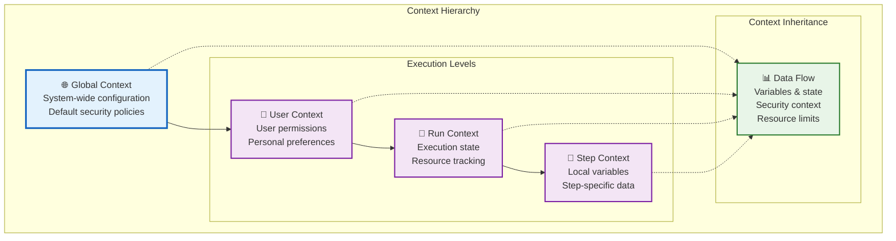

# 🎯 Core Responsibilities

The RunStateMachine serves as the central orchestrator for Vrooli's universal automation execution. Its responsibilities span from low-level execution management to high-level strategic coordination.

## 🌐 Universal Execution Management

### Platform Agnostic Execution
- **Universal routine execution**: Execute routines from any supported platform using the same engine
- **Consistent behavior**: Maintain predictable execution patterns across different workflow types
- **Navigator coordination**: Seamlessly integrate with BPMN, Langchain, Temporal, and other workflow platforms
- **Cross-platform compatibility**: Enable routines created on one platform to run on another

### Execution Strategy Optimization
- **Intelligent path selection**: Choose optimal execution routes based on current system state
- **Platform-specific optimization**: Leverage unique strengths of each workflow platform
- **Performance monitoring**: Track execution metrics and optimize based on historical data
- **Resource efficiency**: Minimize computational overhead while maximizing throughput

## 🔄 Recursive Composition Support

### Unlimited Nesting Architecture
- **Hierarchical execution**: Support routines containing other routines with unlimited depth
- **Context isolation**: Maintain separate execution contexts for each routine level
- **Dependency management**: Track and resolve complex inter-routine dependencies
- **Circular reference prevention**: Detect and prevent infinite recursion scenarios

### Subroutine Coordination
- **Parent-child communication**: Manage data flow between routine levels
- **Lifecycle management**: Control startup, execution, and cleanup of nested routines
- **Error escalation**: Properly bubble up errors from child routines to parents
- **Resource inheritance**: Pass down permissions, limits, and configuration

## 📊 Context Management

### Hierarchical Context Architecture

### Context Responsibilities
- **Variable management**: Track and scope variables across execution levels
- **State persistence**: Maintain execution state for pause/resume operations
- **Memory optimization**: Efficiently manage context memory usage
- **Garbage collection**: Clean up unused context data automatically

## 🔒 Sensitivity & Security Handling

### Data Sensitivity Enforcement
- **Sensitivity classification**: Automatically classify data based on content and source
- **Access control**: Enforce data access restrictions throughout execution
- **Data isolation**: Prevent sensitive data from leaking between routine boundaries
- **Audit logging**: Track all access to sensitive data for compliance

### Permission & Authorization
- **Deontic permission gates**: Check permissions before executing sensitive operations
- **Role-based access**: Enforce user roles and permissions throughout execution
- **Resource authorization**: Validate access to external resources and APIs
- **Dynamic permission evaluation**: Re-evaluate permissions as context changes

## ⚡ Parallel Coordination

### Concurrency Management
- **Branch parallelization**: Execute independent workflow branches simultaneously
- **Resource contention**: Manage conflicts between concurrent operations
- **Synchronization points**: Coordinate parallel branches at merge points
- **Deadlock prevention**: Detect and resolve potential deadlock scenarios

### Performance Optimization
- **Load balancing**: Distribute work across available computational resources
- **Priority scheduling**: Execute high-priority operations first
- **Resource pooling**: Share resources efficiently across parallel operations
- **Bottleneck identification**: Identify and resolve performance bottlenecks

## 💾 State Management & Recovery

### Execution State Tracking
- **Checkpoint creation**: Save execution state at critical points
- **State serialization**: Persist state in a recoverable format
- **Progress tracking**: Monitor completion status of all routine components
- **Rollback capability**: Revert to previous states when errors occur

### Recovery & Resilience
- **Automatic recovery**: Resume execution after system failures
- **Error compensation**: Execute compensating actions for failed operations
- **Retry strategies**: Implement intelligent retry logic for transient failures
- **Graceful degradation**: Continue execution when non-critical components fail

## 🧠 Intelligent Navigation

### Path Optimization
- **Execution path planning**: Determine optimal routes through complex workflows
- **Conditional branching**: Evaluate conditions and choose appropriate paths
- **Dynamic routing**: Adapt execution paths based on runtime conditions
- **Performance-based decisions**: Choose paths based on historical performance data

### Adaptive Execution
- **Learning from failures**: Adjust strategies based on previous execution outcomes
- **Performance profiling**: Track execution patterns and optimize accordingly
- **Resource-aware scheduling**: Consider available resources when planning execution
- **User preference integration**: Factor in user preferences and past choices

## 🔄 Strategy Evolution

### Conversational to Deterministic Transformation
- **Gradual automation**: Transform interactive processes into automated workflows
- **Pattern recognition**: Identify recurring conversational patterns for automation
- **User preference learning**: Adapt automation based on user feedback and behavior
- **Complexity management**: Handle the transition from simple to complex automations

### Continuous Improvement
- **Performance metrics**: Track and improve execution efficiency over time
- **Success rate monitoring**: Measure and optimize routine success rates
- **User satisfaction tracking**: Monitor user experience and satisfaction metrics
- **Feedback integration**: Incorporate user feedback into execution strategies

## 💰 Resource Management

### Credit & Cost Tracking
- **Credit consumption monitoring**: Track credit usage across all execution tiers
- **Cost prediction**: Estimate resource costs before execution begins
- **Budget enforcement**: Prevent execution when credit limits are exceeded
- **Usage optimization**: Minimize credit consumption while maintaining performance

### Computational Resource Management
- **Memory allocation**: Efficiently allocate and deallocate memory for executions
- **CPU utilization**: Balance computational load across available resources
- **Network bandwidth**: Manage network usage for external API calls
- **Storage management**: Handle temporary and persistent storage needs

### Time & Timeout Management
- **Execution time tracking**: Monitor how long operations take to complete
- **Timeout enforcement**: Prevent runaway operations from consuming excessive resources
- **SLA compliance**: Ensure executions meet defined service level agreements
- **Performance benchmarking**: Compare execution times against historical baselines

## 🔍 Monitoring & Observability

### Real-time Monitoring
- **Execution visibility**: Provide real-time insights into routine execution status
- **Performance metrics**: Track key performance indicators across all operations
- **Error detection**: Identify and alert on execution errors and anomalies
- **Resource utilization**: Monitor system resource usage in real-time

### Audit & Compliance
- **Execution logging**: Maintain detailed logs of all execution activities
- **Compliance reporting**: Generate reports for regulatory and audit requirements
- **Data lineage tracking**: Track data flow and transformations throughout execution
- **Security event logging**: Log all security-related events and decisions

This comprehensive set of responsibilities makes the RunStateMachine the **central nervous system** of Vrooli's automation platform, coordinating all aspects of routine execution while maintaining security, performance, and reliability standards. 