# 🎯 Multi-Step Routine Examples

This directory contains comprehensive examples of multi-step routines that showcase the power and versatility of Vrooli's universal execution architecture. Each routine demonstrates different execution strategies, from conversational AI interactions to deterministic automation workflows.

## 📋 Table of Contents

### 🧠 **Cognitive & Reasoning Routines**
- **[Metareasoning](./metareasoning.md)** - Self-reflective intelligence routines for avoiding pitfalls and maintaining alignment
- **[Decision Support & Prioritization](./decision-support.md)** - Structured decision-making and analytical workflows

### ⚡ **Productivity & Management Routines**  
- **[Productivity & Task Management](./productivity.md)** - Personal and team productivity optimization workflows

### 🛡️ **Event-Driven Agent Routines**
- **[Security Agents](./security-agents.md)** - Automated security monitoring and threat response routines
- **[Quality Agents](./quality-agents.md)** - Output validation, bias detection, and quality assurance routines
- **[Optimization Agents](./optimization-agents.md)** - Performance enhancement and cost optimization routines
- **[Monitoring Agents](./monitoring-agents.md)** - System observability and alerting routines

## 🎭 Execution Strategy Overview

Each routine example specifies its optimal execution strategy:

### 🗣️ **Conversational Mode**
- **Best for**: Creative problem-solving, user interaction, novel situations
- **Characteristics**: Adaptive responses, learning from context, human-like reasoning
- **Examples**: Brainstorming sessions, customer support, content creation

### 🧠 **Reasoning Mode**  
- **Best for**: Structured analysis, multi-factor decisions, complex evaluations
- **Characteristics**: Systematic frameworks, data-driven logic, step-by-step analysis
- **Examples**: Risk assessments, comparative analysis, strategic planning

### ⚙️ **Deterministic Mode**
- **Best for**: Repetitive tasks, validated processes, high-reliability operations
- **Characteristics**: Optimized automation, guaranteed consistency, minimal overhead
- **Examples**: Data processing, monitoring checks, routine maintenance

## 🏗️ Routine Architecture Patterns

Our examples demonstrate key architectural patterns:

### **Recursive Composition**
- **Multi-step containing multi-step**: Complex business processes with sub-workflows
- **Multi-step containing single-step**: Orchestrated flows using atomic operations
- **Dynamic subroutine selection**: Runtime choice of execution paths

### **Event-Driven Intelligence**
- **Reactive routines**: Triggered by system events and threshold breaches
- **Proactive monitoring**: Continuous assessment and early warning systems
- **Adaptive responses**: Learning from patterns and improving over time

### **Context Inheritance**
- **Shared state management**: Coordinated access to swarm resources and blackboard
- **Security propagation**: Consistent permission enforcement across routine hierarchies
- **Resource coordination**: Credit tracking and limit enforcement throughout execution

## 📊 BPMN Diagram Conventions

All routine examples include BPMN diagrams using these conventions:

```mermaid
graph LR
    Start([🚀 Start Event]) --> Task[📋 Task/Activity]
    Task --> Gateway{🔀 Gateway}
    Gateway -->|Condition A| SubRoutine[🔄 Sub-Routine]
    Gateway -->|Condition B| SingleStep[⚙️ Single-Step Action]
    SubRoutine --> End([✅ End Event])
    SingleStep --> End
    
    classDef startEnd fill:#e8f5e8,stroke:#2e7d32,stroke-width:2px
    classDef task fill:#e3f2fd,stroke:#1565c0,stroke-width:2px
    classDef gateway fill:#fff3e0,stroke:#f57c00,stroke-width:2px
    classDef routine fill:#f3e5f5,stroke:#7b1fa2,stroke-width:2px
    
    class Start,End startEnd
    class Task task
    class Gateway gateway
    class SubRoutine,SingleStep routine
```

### **Symbol Legend**
- **🚀 Start Events**: Entry points and triggers
- **📋 Tasks/Activities**: Work units and processing steps
- **🔀 Gateways**: Decision points and flow control
- **🔄 Sub-Routines**: Nested multi-step workflows
- **⚙️ Single-Step Actions**: Atomic operations
- **✅ End Events**: Completion and result points

## 🌟 Key Benefits Demonstrated

These examples showcase how Vrooli's architecture enables:

### **Universal Compatibility**
- **Platform agnostic**: Same routines can run on different workflow engines
- **Tool integration**: Seamless access to external APIs and services
- **Context awareness**: Smart adaptation based on execution environment

### **Intelligent Evolution**
- **Strategy learning**: Gradual optimization from conversational to deterministic
- **Pattern recognition**: Automatic identification of improvement opportunities
- **Adaptive behavior**: Self-tuning based on success metrics and user feedback

### **Compound Intelligence**
- **Knowledge sharing**: Insights from one routine benefit all others
- **Recursive improvement**: Routines that improve other routines
- **Emergent capabilities**: Complex behaviors arising from simple compositions

## 🚀 Using These Examples

Each routine example can be:

1. **Directly implemented** as a starting point for your automation needs
2. **Customized and extended** to match your specific requirements
3. **Combined and composed** to create more sophisticated workflows
4. **Used as templates** for developing similar automation patterns

Explore the category-specific documentation to dive deep into each type of routine and understand how they contribute to Vrooli's vision of **recursive self-improving intelligence**.

---

> 💡 **Ready to explore?** Start with [Metareasoning](./metareasoning.md) to see how AI agents can think about their own thinking, or jump to [Security Agents](./security-agents.md) to see how automated security works in practice. 