```mermaid
graph TB
    Start([🚀 Input Received Event]) --> ExtractContent[⚙️ Extract Input Content]
    ExtractContent --> PreProcess[⚙️ Normalize & Preprocess Text]
    
    PreProcess --> CheckPatterns[📋 Pattern Analysis Engine]
    CheckPatterns --> SyntaxAnalysis[⚙️ Analyze Syntax Structures]
    
    SyntaxAnalysis --> CheckBlacklist[⚙️ Check Against Blacklist]
    CheckBlacklist --> AnalyzeIntent[⚙️ Analyze Instruction Intent]
    
    AnalyzeIntent --> CalculateRisk{🔀 Risk Level?}
    CalculateRisk -->|Low| AllowThrough[⚙️ Allow Input Through]
    CalculateRisk -->|Medium| FlagForReview[📋 Flag for Manual Review]
    CalculateRisk -->|High| BlockInput[📋 Block Malicious Input]
    
    FlagForReview --> NotifyModerator[⚙️ Notify Human Moderator]
    BlockInput --> LogThreat[⚙️ Log Security Incident]
    
    AllowThrough --> LogClean[⚙️ Log Clean Input]
    NotifyModerator --> LogThreat
    LogThreat --> UpdatePatterns[🔄 Update Pattern Database]
    LogClean --> UpdatePatterns
    
    UpdatePatterns --> CheckFalsePositives{🔀 False Positive?}
    CheckFalsePositives -->|Yes| AdjustThresholds[⚙️ Adjust Detection Thresholds]
    CheckFalsePositives -->|No| SendAlert[⚙️ Send Security Alert]
    
    AdjustThresholds --> End([✅ Processing Complete])
    SendAlert --> End
    
    classDef startEnd fill:#e8f5e8,stroke:#2e7d32,stroke-width:2px
    classDef task fill:#e3f2fd,stroke:#1565c0,stroke-width:2px
    classDef gateway fill:#fff3e0,stroke:#f57c00,stroke-width:2px
    classDef routine fill:#f3e5f5,stroke:#7b1fa2,stroke-width:2px
    classDef action fill:#fce4ec,stroke:#ad1457,stroke-width:2px
    classDef critical fill:#ffebee,stroke:#c62828,stroke-width:2px
    
    class Start,End startEnd
    class CheckPatterns,FlagForReview,BlockInput task
    class CalculateRisk,CheckFalsePositives gateway
    class UpdatePatterns routine
    class ExtractContent,PreProcess,SyntaxAnalysis,CheckBlacklist,AnalyzeIntent,AllowThrough,NotifyModerator,LogThreat,LogClean,AdjustThresholds,SendAlert action
    class BlockInput,LogThreat critical
```

```mermaid
graph TB
    Start([🚀 Monitoring Cycle Triggered]) --> CollectMetrics[⚙️ Collect System Metrics]
    CollectMetrics --> GatherBaselines[⚙️ Retrieve Baseline Patterns]
    
    GatherBaselines --> AnalyzeBehavior[🔄 Behavioral Analysis Engine]
    AnalyzeBehavior --> DetectAnomalies[⚙️ Detect Statistical Anomalies]
    
    DetectAnomalies --> CorrelateEvents[⚙️ Correlate Related Events]
    CorrelateEvents --> AssessSeverity{🔀 Severity Level?}
    
    AssessSeverity -->|Info| LogInformation[⚙️ Log Informational Event]
    AssessSeverity -->|Warning| InvestigatePattern[📋 Investigate Pattern]
    AssessSeverity -->|Critical| ActivateResponse[📋 Activate Incident Response]
    
    InvestigatePattern --> GatherContext[⚙️ Gather Additional Context]
    ActivateResponse --> IsolateResources[📋 Isolate Affected Resources]
    
    GatherContext --> ValidateAnomaly{🔀 Confirmed Threat?}
    IsolateResources --> NotifySecurityTeam[⚙️ Notify Security Team]
    
    ValidateAnomaly -->|False Positive| UpdateBaselines[⚙️ Update Normal Baselines]
    ValidateAnomaly -->|Confirmed| EscalateIncident[📋 Escalate Security Incident]
    
    EscalateIncident --> ExecutePlaybook[🔄 Execute Response Playbook]
    UpdateBaselines --> LogInformation
    
    ExecutePlaybook --> DocumentIncident[⚙️ Document Incident Details]
    NotifySecurityTeam --> DocumentIncident
    LogInformation --> DocumentIncident
    
    DocumentIncident --> UpdateDetection[🔄 Update Detection Rules]
    UpdateDetection --> ScheduleFollowup[⚙️ Schedule Follow-up Review]
    
    ScheduleFollowup --> End([✅ Monitoring Cycle Complete])
    
    classDef startEnd fill:#e8f5e8,stroke:#2e7d32,stroke-width:2px
    classDef task fill:#e3f2fd,stroke:#1565c0,stroke-width:2px
    classDef gateway fill:#fff3e0,stroke:#f57c00,stroke-width:2px
    classDef routine fill:#f3e5f5,stroke:#7b1fa2,stroke-width:2px
    classDef action fill:#fce4ec,stroke:#ad1457,stroke-width:2px
    classDef critical fill:#ffebee,stroke:#c62828,stroke-width:2px
    
    class Start,End startEnd
    class InvestigatePattern,ActivateResponse,IsolateResources,EscalateIncident task
    class AssessSeverity,ValidateAnomaly gateway
    class AnalyzeBehavior,ExecutePlaybook,UpdateDetection routine
    class CollectMetrics,GatherBaselines,DetectAnomalies,CorrelateEvents,LogInformation,GatherContext,NotifySecurityTeam,UpdateBaselines,DocumentIncident,ScheduleFollowup action
    class ActivateResponse,IsolateResources,EscalateIncident critical
```

```mermaid
graph TB
    Start([🚀 Access Request Event]) --> ParseRequest[⚙️ Parse Access Request]
    ParseRequest --> ValidateIdentity[⚙️ Validate User Identity]
    
    ValidateIdentity --> CheckPermissions[📋 Check Current Permissions]
    CheckPermissions --> AnalyzeContext[⚙️ Analyze Request Context]
    
    AnalyzeContext --> RiskAssessment{🔀 Risk Assessment?}
    RiskAssessment -->|Low Risk| GrantAccess[⚙️ Grant Access]
    RiskAssessment -->|Medium Risk| RequireMFA[📋 Require Additional Auth]
    RiskAssessment -->|High Risk| DenyAccess[📋 Deny Access]
    
    RequireMFA --> ValidateMFA{🔀 MFA Successful?}
    ValidateMFA -->|Yes| GrantAccess
    ValidateMFA -->|No| DenyAccess
    
    GrantAccess --> LogAccess[⚙️ Log Successful Access]
    DenyAccess --> LogDenial[⚙️ Log Access Denial]
    
    LogAccess --> MonitorSession[📋 Monitor Active Session]
    LogDenial --> CheckPattern[🔄 Check Attack Pattern]
    
    MonitorSession --> UpdateBaseline[⚙️ Update Behavioral Baseline]
    CheckPattern --> CountFailures[⚙️ Count Failed Attempts]
    
    CountFailures --> ThresholdCheck{🔀 Threshold Exceeded?}
    ThresholdCheck -->|Yes| TriggerLockout[📋 Trigger Account Lockout]
    ThresholdCheck -->|No| UpdateBaseline
    
    TriggerLockout --> NotifyAdmin[⚙️ Notify Administrator]
    NotifyAdmin --> LogIncident[⚙️ Log Security Incident]
    
    UpdateBaseline --> ScheduleReview[⚙️ Schedule Permission Review]
    LogIncident --> ScheduleReview
    
    ScheduleReview --> End([✅ Access Validation Complete])
    
    classDef startEnd fill:#e8f5e8,stroke:#2e7d32,stroke-width:2px
    classDef task fill:#e3f2fd,stroke:#1565c0,stroke-width:2px
    classDef gateway fill:#fff3e0,stroke:#f57c00,stroke-width:2px
    classDef routine fill:#f3e5f5,stroke:#7b1fa2,stroke-width:2px
    classDef action fill:#fce4ec,stroke:#ad1457,stroke-width:2px
    classDef critical fill:#ffebee,stroke:#c62828,stroke-width:2px
    
    class Start,End startEnd
    class CheckPermissions,RequireMFA,DenyAccess,MonitorSession,TriggerLockout task
    class RiskAssessment,ValidateMFA,ThresholdCheck gateway
    class CheckPattern routine
    class ParseRequest,ValidateIdentity,AnalyzeContext,GrantAccess,LogAccess,LogDenial,UpdateBaseline,CountFailures,NotifyAdmin,LogIncident,ScheduleReview action
    class DenyAccess,TriggerLockout critical
```

```mermaid
graph TB
    Start([🚀 Audit Cycle Start]) --> LoadFrameworks[⚙️ Load Compliance Frameworks]
    LoadFrameworks --> ScanActivities[⚙️ Scan System Activities]
    
    ScanActivities --> CheckDataHandling[📋 Check Data Handling Practices]
    CheckDataHandling --> ValidateRetention[⚙️ Validate Data Retention]
    
    ValidateRetention --> AssessAccess[📋 Assess Access Controls]
    AssessAccess --> ReviewUserActivity[⚙️ Review User Activity Logs]
    
    ReviewUserActivity --> ComplianceCheck{🔀 Compliance Status?}
    ComplianceCheck -->|Compliant| DocumentCompliance[⚙️ Document Compliance]
    ComplianceCheck -->|Minor Issues| FlagForCorrection[📋 Flag for Correction]
    ComplianceCheck -->|Major Violations| ReportViolation[📋 Report Critical Violation]
    
    FlagForCorrection --> AssignRemediation[⚙️ Assign Remediation Tasks]
    ReportViolation --> NotifyCompliance[📋 Notify Compliance Officer]
    
    AssignRemediation --> TrackRemediation[⚙️ Track Remediation Progress]
    NotifyCompliance --> InitiateResponse[🔄 Initiate Compliance Response]
    
    DocumentCompliance --> GenerateReport[📋 Generate Compliance Report]
    TrackRemediation --> GenerateReport
    InitiateResponse --> GenerateReport
    
    GenerateReport --> ReviewFindings{🔀 Review Required?}
    ReviewFindings -->|Yes| ScheduleReview[⚙️ Schedule Management Review]
    ReviewFindings -->|No| ArchiveReport[⚙️ Archive Report]
    
    ScheduleReview --> UpdatePolicies[🔄 Update Policy Recommendations]
    ArchiveReport --> UpdatePolicies
    
    UpdatePolicies --> ScheduleNextAudit[⚙️ Schedule Next Audit]
    ScheduleNextAudit --> End([✅ Audit Cycle Complete])
    
    classDef startEnd fill:#e8f5e8,stroke:#2e7d32,stroke-width:2px
    classDef task fill:#e3f2fd,stroke:#1565c0,stroke-width:2px
    classDef gateway fill:#fff3e0,stroke:#f57c00,stroke-width:2px
    classDef routine fill:#f3e5f5,stroke:#7b1fa2,stroke-width:2px
    classDef action fill:#fce4ec,stroke:#ad1457,stroke-width:2px
    classDef critical fill:#ffebee,stroke:#c62828,stroke-width:2px
    
    class Start,End startEnd
    class CheckDataHandling,AssessAccess,FlagForCorrection,ReportViolation,NotifyCompliance,GenerateReport task
    class ComplianceCheck,ReviewFindings gateway
    class InitiateResponse,UpdatePolicies routine
    class LoadFrameworks,ScanActivities,ValidateRetention,ReviewUserActivity,DocumentCompliance,AssignRemediation,TrackRemediation,ScheduleReview,ArchiveReport,ScheduleNextAudit action
    class ReportViolation,NotifyCompliance critical
```

# 🛡️ Security Agent Routines

Security agent routines provide automated threat detection, response, and compliance monitoring through event-driven intelligence. These routines continuously monitor system behavior and respond to security events in real-time.

## 📋 Table of Contents

- [🔍 Prompt Injection Detector](#-prompt-injection-detector)
- [🚨 Anomaly Behavior Monitor](#-anomaly-behavior-monitor)
- [🔐 Access Control Validator](#-access-control-validator)
- [📊 Compliance Auditor](#-compliance-auditor)

---

## 🔍 Prompt Injection Detector

**Purpose**: Detect and prevent prompt injection attacks that attempt to manipulate AI model behavior through malicious input patterns.

**Execution Mode**: ⚙️ **Deterministic** - Fast pattern matching with predictable response times

**Description**: This routine monitors all user inputs and AI prompts for known injection patterns, suspicious structures, and manipulation attempts, blocking or sanitizing dangerous content before it reaches AI models.

### BPMN Workflow

---

## 🚨 Anomaly Behavior Monitor

**Purpose**: Detect unusual system behavior patterns that may indicate security breaches, unauthorized access, or system compromise.

**Execution Mode**: 🧠 **Reasoning** - Pattern analysis and anomaly detection requiring intelligent assessment

**Description**: This routine continuously monitors system metrics, user behaviors, and resource usage patterns to identify deviations from normal baselines that could indicate security threats.

### BPMN Workflow

---

## 🔐 Access Control Validator

**Purpose**: Continuously validate and enforce access controls, detecting unauthorized access attempts and privilege escalations.

**Execution Mode**: ⚙️ **Deterministic** - Real-time access validation with consistent enforcement

**Description**: This routine monitors all access requests, validates permissions against current policies, and detects suspicious access patterns that may indicate unauthorized activity or compromised accounts.

### BPMN Workflow

---

## 📊 Compliance Auditor

**Purpose**: Automatically monitor and audit system activities for compliance with regulatory requirements and internal policies.

**Execution Mode**: ⚙️ **Deterministic** - Systematic compliance checking with standardized procedures

**Description**: This routine continuously audits system activities, data handling practices, and user behaviors against compliance frameworks (GDPR, HIPAA, SOX, etc.) and generates compliance reports.

### BPMN Workflow

---

## 🎯 Implementation Notes

### **Event-Driven Architecture**
- **Real-Time Processing**: Routines respond to events within milliseconds for critical security threats
- **Event Correlation**: Cross-reference events across multiple security domains for comprehensive threat detection
- **Scalable Processing**: Handle high-volume event streams without performance degradation

### **Adaptive Learning**
- **Baseline Updates**: Continuously learn normal behavior patterns to reduce false positives
- **Threat Intelligence**: Integrate external threat feeds to stay current with evolving attack patterns
- **Feedback Loops**: Learn from security analyst decisions to improve detection accuracy

### **Integration Points**
- **SIEM Integration**: Connect with Security Information and Event Management systems
- **Identity Providers**: Integrate with Active Directory, LDAP, and modern identity platforms
- **Compliance Frameworks**: Support for GDPR, HIPAA, SOC 2, ISO 27001, and custom compliance requirements

### **Response Automation**
- **Graduated Response**: Implement proportional responses based on threat severity
- **Incident Orchestration**: Coordinate multiple security tools and processes during incidents
- **Communication Protocols**: Automated notification to appropriate stakeholders based on threat type

### **Metrics and Reporting**
- **Security KPIs**: Track mean time to detection, false positive rates, and response effectiveness
- **Compliance Metrics**: Monitor compliance posture and generate executive dashboards
- **Trend Analysis**: Identify security trends and emerging threats for proactive defense

These security agent routines create a **self-improving security ecosystem** that adapts to new threats while maintaining strong compliance posture and minimizing operational overhead through intelligent automation. 