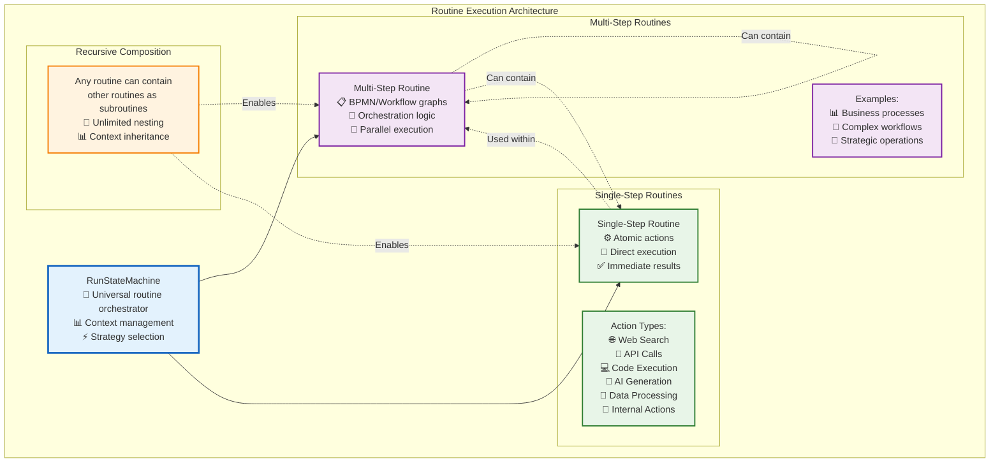

## **Single-Step vs Multi-Step Routine Architecture**

The RunStateMachine orchestrates two fundamental types of routines, each serving different purposes in the automation ecosystem:

```mermaid
graph TB
    subgraph "Routine Execution Architecture"
        RSM[RunStateMachine<br/>🎯 Universal routine orchestrator<br/>📊 Context management<br/>⚡ Strategy selection]
        
        subgraph "Multi-Step Routines"
            MSR[Multi-Step Routine<br/>📋 BPMN/Workflow graphs<br/>🔄 Orchestration logic<br/>🌿 Parallel execution]
            
            MSRExamples[Examples:<br/>📊 Business processes<br/>🔄 Complex workflows<br/>🎯 Strategic operations]
        end
        
        subgraph "Single-Step Routines"
            SSR[Single-Step Routine<br/>⚙️ Atomic actions<br/>🔧 Direct execution<br/>✅ Immediate results]
            
            SSRTypes[Action Types:<br/>🌐 Web Search<br/>📱 API Calls<br/>💻 Code Execution<br/>🤖 AI Generation<br/>📝 Data Processing<br/>🔧 Internal Actions]
        end
        
        subgraph "Recursive Composition"
            RC[Any routine can contain<br/>other routines as subroutines<br/>🔄 Unlimited nesting<br/>📊 Context inheritance]
        end
    end
    
    RSM --> MSR
    RSM --> SSR
    MSR -.->|"Can contain"| MSR
    MSR -.->|"Can contain"| SSR
    SSR -.->|"Used within"| MSR
    
    RC -.->|"Enables"| MSR
    RC -.->|"Enables"| SSR
    
    classDef rsm fill:#e3f2fd,stroke:#1565c0,stroke-width:3px
    classDef multi fill:#f3e5f5,stroke:#7b1fa2,stroke-width:2px
    classDef single fill:#e8f5e8,stroke:#2e7d32,stroke-width:2px
    classDef composition fill:#fff3e0,stroke:#f57c00,stroke-width:2px
    
    class RSM rsm
    class MSR,MSRExamples multi
    class SSR,SSRTypes single
    class RC composition
```
