```mermaid
graph TB
    subgraph "Routine Execution Architecture"
        RSM[RunStateMachine<br/>🯠Universal routine orchestrator<br/>📊 Context management<br/>⚡ Strategy selection]
        
        subgraph "Multi-Step Routines"
            MSR[Multi-Step Routine<br/>📋 BPMN/Workflow graphs<br/>🔄 Orchestration logic<br/>🌿 Parallel execution]
            
            MSRExamples[Examples:<br/>📊 Business processes<br/>🔄 Complex workflows<br/>🯠Strategic operations]
        end
        
        subgraph "Single-Step Routines"
            SSR[Single-Step Routine<br/>âš™ï¸ Atomic actions<br/>🔧 Direct execution<br/>✅ Immediate results]
            
            SSRTypes[Action Types:<br/>🌠Web Search<br/>📱 API Calls<br/>💻 Code Execution<br/>🤖 AI Generation<br/>📠Data Processing<br/>🔧 Internal Actions]
        end
        
        subgraph "Recursive Composition"
            RC[Any routine can contain<br/>other routines as subroutines<br/>🔄 Unlimited nesting<br/>📊 Context inheritance]
        end
    end
    
    RSM --> MSR
    RSM --> SSR
    MSR -.->|"Can contain"| MSR
    MSR -.->|"Can contain"| SSR
    SSR -.->|"Used within"| MSR
    
    RC -.->|"Enables"| MSR
    RC -.->|"Enables"| SSR
    
    classDef rsm fill:#e3f2fd,stroke:#1565c0,stroke-width:3px
    classDef multi fill:#f3e5f5,stroke:#7b1fa2,stroke-width:2px
    classDef single fill:#e8f5e8,stroke:#2e7d32,stroke-width:2px
    classDef composition fill:#fff3e0,stroke:#f57c00,stroke-width:2px
    
    class RSM rsm
    class MSR,MSRExamples multi
    class SSR,SSRTypes single
    class RC composition
```

# ⚙️ Single-Step vs Multi-Step Routine Architecture

The RunStateMachine orchestrates two fundamental types of routines, each serving different purposes in the automation ecosystem. This flexible architecture enables both simple atomic operations and complex orchestrated workflows.

## 🏗️ Routine Architecture Overview

## 🔄 Multi-Step Routines

Multi-step routines represent **complex orchestrated workflows** that coordinate multiple operations across time and resources.

### Key Characteristics
- **Graph-based structure**: Defined using BPMN, Langchain, or other workflow standards
- **Orchestration logic**: Manage dependencies, branching, and synchronization
- **Parallel execution**: Support concurrent operations where possible
- **State management**: Maintain context across multiple execution steps
- **Error handling**: Implement compensation flows and recovery strategies

### Common Use Cases
- **Business processes**: Customer onboarding, order fulfillment, approval workflows
- **Data pipelines**: ETL operations, data validation, and transformation chains
- **AI workflows**: Multi-agent coordination, research automation, content generation
- **Integration scenarios**: Cross-system data synchronization and API orchestration

### Example: Customer Onboarding Process

## ⚡ Single-Step Routines

Single-step routines represent **atomic actions** that perform specific, well-defined operations.

### Key Characteristics
- **Atomic operations**: Indivisible units of work
- **Direct execution**: Immediate processing without complex orchestration
- **Immediate results**: Produce output quickly and efficiently
- **Composable**: Can be combined into larger workflows
- **Reusable**: Standard building blocks for automation

### Action Categories

#### 🌐 Web & API Operations
- **Web search**: Query search engines and extract information
- **API calls**: Interact with REST/GraphQL services
- **Web scraping**: Extract data from websites
- **HTTP requests**: Send structured data to external services

#### 🤖 AI & Machine Learning
- **Text generation**: Create content using language models
- **Image processing**: Analyze, modify, or generate images
- **Data analysis**: Statistical analysis and pattern recognition
- **Translation**: Language translation and localization

#### 💻 Code & Data Processing
- **Code execution**: Run scripts in various programming languages
- **Data transformation**: Convert between formats and structures
- **File operations**: Read, write, and manipulate files
- **Database operations**: Query and update database records

#### 🔧 Internal Operations
- **Routine management**: Create, update, and delete routines
- **User management**: Handle authentication and authorization
- **System monitoring**: Check health and performance metrics
- **Configuration management**: Update system settings

## 🔄 Recursive Composition

The architecture's most powerful feature is **unlimited recursive composition**:

### Composition Patterns
- **Multi-step containing multi-step**: Complex workflows as subroutines
- **Multi-step containing single-step**: Atomic actions within orchestrated flows
- **Single-step containing multi-step**: Wrapper routines for complex operations
- **Unlimited nesting depth**: No artificial limits on composition complexity

### Context Inheritance
- **Data flow**: Variables and state pass between parent and child routines
- **Security context**: Permissions and access controls flow down the hierarchy
- **Resource limits**: Credit and time limits are inherited and enforced
- **Error propagation**: Failures bubble up with proper context

### Benefits of Recursive Composition

#### 🧩 Modularity
- **Reusable components**: Build libraries of common operations
- **Separation of concerns**: Isolate different aspects of complex workflows
- **Maintainability**: Update individual components without affecting the whole

#### 📈 Scalability
- **Parallel execution**: Independent subroutines can run concurrently
- **Resource optimization**: Efficient allocation based on actual needs
- **Load distribution**: Spread work across available computational resources

#### 🔧 Flexibility
- **Dynamic composition**: Assemble workflows at runtime based on conditions
- **Version management**: Update subroutines independently
- **A/B testing**: Compare different implementations of the same operation

## 🎯 Execution Strategy Selection

The RunStateMachine intelligently selects execution strategies based on routine characteristics:

### For Multi-Step Routines
- **Navigator selection**: Choose appropriate platform navigator (BPMN, Langchain, etc.)
- **Concurrency planning**: Determine safe parallel execution paths
- **Resource allocation**: Distribute credits and computational resources
- **Checkpoint management**: Enable pause/resume and error recovery

### For Single-Step Routines
- **Direct execution**: Bypass orchestration overhead for simple operations
- **Batching optimization**: Group similar operations for efficiency
- **Caching strategies**: Reuse results for identical operations
- **Timeout management**: Prevent runaway operations

This dual approach ensures that **simple operations remain fast** while **complex workflows get the orchestration they need**, creating an optimal balance between performance and capability.

## 🎯 Comprehensive Routine Examples

For detailed examples of multi-step routines across different categories, see our comprehensive **[Routine Examples Collection](./routine-examples/README.md)** which includes:

- **🧠 Metareasoning**: Self-reflective intelligence for avoiding pitfalls and maintaining alignment
- **⚡ Productivity & Task Management**: Personal and team productivity optimization workflows
- **🧭 Decision Support**: Structured decision-making and analytical frameworks
- **🛡️ Security Agents**: Event-driven security monitoring and threat response
- **✅ Quality Agents**: Output validation, bias detection, and quality assurance
- **⚡ Optimization Agents**: Performance enhancement and cost optimization
- **📊 Monitoring Agents**: System observability and alerting

Each example includes detailed BPMN workflows, execution mode recommendations, and implementation notes to help you understand how Vrooli's universal execution architecture enables sophisticated automation patterns. 