# ⚙️ RunStateMachine: Complete Architecture & Execution Lifecycle

> **TL;DR**: The RunStateMachine orchestrates individual routine executions across any workflow platform. This document provides the complete architecture with clean main lifecycle diagram, focused sub-process diagrams, and detailed state definitions for all navigator types and execution strategies.

---

## 🎯 RunStateMachine Overview

The RunStateMachine represents Vrooli's core innovation: a **universal routine execution engine** that's completely agnostic to the underlying automation platform. It handles workflow navigation, step execution, state management, and result aggregation across multiple navigator types (Native Vrooli, BPMN, Langchain, Temporal, etc.).

**Key Innovation**: Creates an unprecedented **universal automation ecosystem** where workflows from different platforms can share and execute each other's routines.

---

## 🔄 Main Execution Lifecycle

The following diagram shows the clean, primary execution flow with major state transitions:

```mermaid
stateDiagram-v2
    [*] --> Initializing: Routine execution request
    
    Initializing --> NavigatorSelection: Context prepared
    NavigatorSelection --> Planning: Navigator selected
    Planning --> Executing: Execution plan created
    
    Executing --> StepExecution: Execute next step
    StepExecution --> DeonticGate: Step completed
    DeonticGate --> StepValidation: ✓ Permitted
    DeonticGate --> PermissionDenied: ✗ Forbidden
    
    StepValidation --> StepComplete: Validation passed
    StepValidation --> StepRetry: Validation failed (retryable)
    StepValidation --> ExecutionError: Validation failed (critical)
    
    StepRetry --> StepExecution: Retry with modifications
    StepComplete --> BranchCoordination: Check for parallel/sequential
    
    BranchCoordination --> ParallelExecution: Parallel steps available
    BranchCoordination --> Executing: Continue sequential
    BranchCoordination --> EventWaiting: All branches waiting
    BranchCoordination --> Completed: All steps finished
    
    ParallelExecution --> ParallelSync: All parallel complete
    ParallelSync --> Executing: Continue workflow
    
    EventWaiting --> EventProcessing: Event received
    EventProcessing --> Executing: Resume execution
    
    Executing --> ResourceCheck: Monitor limits
    ResourceCheck --> Executing: Resources OK
    ResourceCheck --> ResourceExhausted: Limits exceeded
    
    Executing --> Paused: User pause request
    Executing --> Checkpoint: Create state snapshot
    
    Paused --> Executing: Resume requested
    Paused --> Cancelled: Cancel requested
    
    Checkpoint --> CheckpointSaved: State preserved
    CheckpointSaved --> Executing: Continue execution
    
    ExecutionError --> ErrorRecovery: Attempt recovery
    ErrorRecovery --> Executing: Recovery successful
    ErrorRecovery --> Failed: Recovery failed
    
    Completed --> ResultAggregation: Aggregate outputs
    ResultAggregation --> [*]: Return results
    
    PermissionDenied --> Failed: MOISE+ violation
    ResourceExhausted --> Failed: Resource limit violation
    Cancelled --> Cleanup: Clean up resources
    Failed --> Cleanup: Clean up resources
    Cleanup --> [*]: Execution terminated
    
    %% Emergency transitions
    StepExecution --> Emergency: Critical error
    ParallelExecution --> Emergency: Safety violation
    Emergency --> [*]: Immediate termination
```



---

## 🧭 Navigator Selection Process

The RunStateMachine supports multiple workflow platforms through a universal navigator interface:


---

## ⚙️ Branch Execution & Concurrency Management

Complex coordination logic for handling parallel and sequential execution patterns:


---

## 📡 Event System & Waiting States

Sophisticated event handling for workflow coordination and external integrations:


---

## 🛡️ MOISE+ Deontic Gate

Critical permission checking using MOISE+ organizational modeling for each step execution:


---

## 📋 Detailed State Definitions

### **🚀 Initialization States**

#### **Initializing**
- **Purpose**: Set up execution context and prepare for routine execution
- **Duration**: 1-10 seconds
- **Key Activities**:
  ```typescript
  interface InitializationProcess {
    validateRoutineDefinition(routineId: string): Promise<boolean>;
    selectNavigator(navigatorType: string): IRoutineStepNavigator;
    buildExecutionContext(request: RunRequest): RunContext;
    inheritSwarmContext(swarmConfig: ChatConfigObject): ParentContext;
    validateResourceLimits(limits: ResourceLimits): boolean;
  }
  ```
- **Navigator Integration**: Analyzes routine format and selects appropriate navigator
- **Context Setup**: Inherits swarm context and establishes execution environment
- **Exit Conditions**: Context validated and ready for navigator selection

#### **NavigatorSelection**
- **Purpose**: Determine and initialize the appropriate workflow navigator
- **Duration**: 2-15 seconds (depends on navigator complexity)
- **Navigator Types Supported**:
  - **Native Vrooli**: JSON-based step definitions with dependency graphs
  - **BPMN 2.0**: Standard business process model and notation
  - **Langchain**: Langchain workflow definitions and chains
  - **Temporal**: Temporal workflow definitions and activities
  - **Custom**: Extensible plugin system for custom formats
- **Selection Logic**:
  ```typescript
  async function selectNavigator(routine: RoutineDefinition): Promise<IRoutineStepNavigator> {
    // Format detection
    const format = await detectWorkflowFormat(routine);
    
    // Navigator factory
    switch (format) {
      case 'native_vrooli':
        return new NativeVrooliNavigator(routine);
      case 'bpmn_2_0':
        return new BpmnNavigator(routine);
      case 'langchain':
        return new LangchainNavigator(routine);
      case 'temporal':
        return new TemporalNavigator(routine);
      default:
        return new CustomNavigator(routine, format);
    }
  }
  ```
- **Exit Conditions**: Navigator successfully initialized and validated

#### **Planning**
- **Purpose**: Analyze routine structure and create execution plan
- **Duration**: 2-30 seconds (depends on complexity)
- **Navigator-Specific Planning**:
  
  **Native Vrooli Navigator**:
  ```typescript
  const executionPlan = {
    totalSteps: routine.steps.length,
    parallelizable: routine.steps.filter(s => s.parallelizable).length,
    estimatedDuration: routine.steps.reduce((sum, step) => sum + step.estimatedDuration, 0),
    dependencyChain: buildDependencyGraph(routine.steps),
    resourceRequirements: aggregateResourceNeeds(routine.steps)
  };
  ```
  
  **BPMN Navigator**:
  ```typescript
  const bpmnPlan = {
    startEvents: bpmnDefinition.getStartEvents(),
    parallelGateways: bpmnDefinition.getParallelGateways(),
    exclusiveGateways: bpmnDefinition.getExclusiveGateways(),
    subProcesses: bpmnDefinition.getSubProcesses(),
    estimatedPaths: analyzeBpmnPaths(bpmnDefinition)
  };
  ```

- **Resource Planning**: Estimates computational, memory, and credit requirements
- **Exit Conditions**: Execution plan created and validated

### **⚡ Execution States**

#### **Executing**
- **Purpose**: Main execution state coordinating step-by-step routine progress
- **Duration**: Variable (minutes to hours)
- **Core Execution Loop**:
  ```typescript
  async function executionLoop(runContext: RunContext): Promise<void> {
    while (!isComplete(runContext)) {
      // Get next available steps from navigator
      const availableSteps = await runContext.navigator.getAvailableNextLocations({
        currentLocation: runContext.currentStep,
        completedSteps: runContext.completedSteps,
        stepContext: runContext.stepContext
      });
      
      if (availableSteps.parallel.length > 1) {
        await transitionTo('BranchCoordination', availableSteps);
      } else if (availableSteps.sequential.length > 0) {
        await transitionTo('StepExecution', availableSteps.sequential[0]);
      } else if (availableSteps.waiting.length > 0) {
        await transitionTo('EventWaiting', availableSteps.waiting);
      } else {
        await transitionTo('Completed');
      }
      
      // Check for pause/cancel requests
      if (runContext.pauseRequested) {
        await transitionTo('Paused');
        break;
      }
      
      // Periodic checkpointing and resource monitoring
      if (shouldCreateCheckpoint(runContext)) {
        await transitionTo('Checkpoint');
      }
      
      if (shouldCheckResources(runContext)) {
        await transitionTo('ResourceCheck');
      }
    }
  }
  ```
- **Navigator Integration**: Works with any navigator through universal interface
- **State Monitoring**: Tracks progress, resource usage, and execution health

#### **StepExecution**
- **Purpose**: Execute individual routine steps using appropriate strategy
- **Duration**: 5 seconds to 30 minutes per step
- **Pre-Execution**: Always passes through DeonticGate for MOISE+ permission checking
- **Strategy-Based Execution**:
  
  **Conversational Strategy**:
  ```typescript
  const conversationalExecution = {
    approach: 'natural_language_reasoning',
    context: {
      stepDescription: step.description,
      availableInputs: resolvedInputs,
      conversationHistory: runContext.conversationHistory,
      creativityLevel: 'high'
    },
    execution: async () => {
      const prompt = buildConversationalPrompt(step, runContext);
      const result = await llmProvider.generateResponse(prompt);
      return processConversationalResult(result);
    }
  };
  ```
  
  **Reasoning Strategy**:
  ```typescript
  const reasoningExecution = {
    approach: 'structured_analysis',
    context: {
      analyticalFramework: step.reasoningFramework,
      dataInputs: structuredInputs,
      validationCriteria: step.validationRules,
      logicalConstraints: step.constraints
    },
    execution: async () => {
      const analysis = await performStructuredReasoning(step, runContext);
      const validation = await validateReasoningResult(analysis);
      return { analysis, validation, confidence: analysis.confidence };
    }
  };
  ```
  
  **Deterministic Strategy**:
  ```typescript
  const deterministicExecution = {
    approach: 'automated_process',
    context: {
      toolCalls: step.toolSequence,
      parameters: resolvedParameters,
      validationRules: step.outputValidation,
      errorHandling: step.errorHandling
    },
    execution: async () => {
      const results = [];
      for (const tool of step.toolSequence) {
        const toolResult = await unifiedExecutor.executeTool(tool);
        results.push(toolResult);
      }
      return aggregateToolResults(results);
    }
  };
  ```

  **Routing Strategy**:
  ```typescript
  const routingExecution = {
    approach: 'multi_routine_coordination',
    context: {
      subRoutines: step.subRoutines,
      coordinationPattern: step.coordinationPattern,
      aggregationLogic: step.aggregationLogic,
      parallelizable: step.parallelizable
    },
    execution: async () => {
      const subResults = new Map();
      
      // Execute sub-routines based on coordination pattern
      if (step.coordinationPattern === 'scatter-gather') {
        const parallelPromises = step.subRoutines.map(async (subRoutine) => {
          const result = await this.executeSubRoutine(subRoutine, runContext);
          subResults.set(subRoutine.routineId, result);
          return result;
        });
        await Promise.all(parallelPromises);
      } else {
        // Sequential execution for pipeline pattern
        for (const subRoutine of step.subRoutines) {
          const result = await this.executeSubRoutine(subRoutine, runContext);
          subResults.set(subRoutine.routineId, result);
        }
      }
      
      return this.aggregateRoutingResults(subResults, step.aggregationLogic);
    }
  };
  ```

- **MOISE+ Integration**: Every step execution is validated through the DeonticGate
- **Exit Conditions**:
  - Step completes successfully → DeonticGate
  - Critical error occurs → Emergency

#### **DeonticGate**
- **Purpose**: MOISE+ permission validation for each step execution
- **Duration**: 100ms - 2 seconds
- **Permission Checking Process**:
  ```typescript
  interface DeonticValidation {
    checkPermissions(agent: Agent, step: RoutineStep, context: RunContext): Promise<PermissionResult>;
    evaluateObligations(agent: Agent, step: RoutineStep): Promise<ObligationResult>;
    validateProhibitions(agent: Agent, step: RoutineStep): Promise<ProhibitionResult>;
    logAuthorizationDecision(decision: AuthorizationDecision): Promise<void>;
  }
  
  async function validateDeonticRules(
    executingAgent: Agent, 
    step: RoutineStep, 
    context: RunContext
  ): Promise<DeonticResult> {
    // Load MOISE+ organizational specification
    const orgSpec = await loadMoiseOrganization(context.teamId);
    
    // Check permissions (may/can)
    const permissions = await orgSpec.checkPermissions(executingAgent.role, step.action);
    if (!permissions.granted) {
      return { allowed: false, reason: 'insufficient_permissions', details: permissions.missing };
    }
    
    // Check obligations (must/should)
    const obligations = await orgSpec.checkObligations(executingAgent.role, step.action);
    if (!obligations.fulfilled) {
      return { allowed: false, reason: 'unfulfilled_obligations', details: obligations.pending };
    }
    
    // Check prohibitions (must_not/cannot)
    const prohibitions = await orgSpec.checkProhibitions(executingAgent.role, step.action);
    if (prohibitions.violated) {
      return { allowed: false, reason: 'prohibited_action', details: prohibitions.violations };
    }
    
    return { allowed: true, reason: 'authorized' };
  }
  ```
- **Exit Conditions**:
  - Permission granted → StepValidation
  - Permission denied → PermissionDenied → Failed

#### **StepValidation**
- **Purpose**: Validate step outputs and ensure quality standards
- **Duration**: 1-10 seconds
- **Validation Process**:
  ```typescript
  interface StepValidationProcess {
    validateOutputs(outputs: StepOutputs, schema: OutputSchema): ValidationResult;
    checkQualityMetrics(outputs: StepOutputs, standards: QualityStandards): QualityResult;
    verifyBusinessRules(outputs: StepOutputs, rules: BusinessRule[]): ComplianceResult;
    assessConfidence(outputs: StepOutputs, step: RoutineStep): ConfidenceResult;
  }
  
  const validationResult = {
    outputsValid: await validateAgainstSchema(stepOutputs, step.outputSchema),
    qualityAcceptable: await checkQualityThresholds(stepOutputs, step.qualityStandards),
    businessRulesCompliant: await verifyBusinessRules(stepOutputs, step.businessRules),
    confidenceAdequate: stepOutputs.confidence >= step.minimumConfidence,
    retryable: determineIfRetryable(validationErrors)
  };
  ```
- **Exit Conditions**:
  - All validations pass → StepComplete
  - Validation fails but retryable → StepRetry
  - Validation fails and non-retryable → ExecutionError

### **🔄 Coordination States**

#### **BranchCoordination**
- **Purpose**: Determine execution strategy for available steps (parallel vs sequential vs waiting)
- **Duration**: 1-5 seconds
- **Coordination Logic**:
  ```typescript
  interface BranchCoordination {
    analyzeAvailableSteps(steps: AvailableSteps): CoordinationDecision;
    assessResourceCapacity(parallelSteps: RoutineStep[]): ResourceAssessment;
    createExecutionPlan(steps: RoutineStep[], strategy: ExecutionStrategy): ExecutionPlan;
  }
  
  async function coordinateBranches(availableSteps: AvailableSteps): Promise<CoordinationDecision> {
    if (availableSteps.parallel.length > 1) {
      const resourceCheck = await assessParallelCapacity(availableSteps.parallel);
      if (resourceCheck.sufficient) {
        return { strategy: 'parallel', steps: availableSteps.parallel };
      } else {
        return { strategy: 'sequential', steps: selectHighestPriority(availableSteps.parallel) };
      }
    } else if (availableSteps.sequential.length > 0) {
      return { strategy: 'sequential', steps: availableSteps.sequential };
    } else if (availableSteps.waiting.length > 0) {
      return { strategy: 'event_waiting', steps: availableSteps.waiting };
    } else {
      return { strategy: 'completion', steps: [] };
    }
  }
  ```
- **Resource Awareness**: Considers available memory, CPU, and credits before parallel execution

#### **ParallelExecution**
- **Purpose**: Execute multiple steps concurrently with proper isolation
- **Duration**: Variable (limited by slowest parallel step)
- **Execution Management**:
  ```typescript
  async function executeParallelSteps(parallelSteps: RoutineStep[]): Promise<ParallelResults> {
    const executionPromises = parallelSteps.map(async (step, index) => {
      try {
        // Create isolated execution context for each step
        const stepContext = createIsolatedStepContext(step, runContext);
        
        // Execute through full step lifecycle (including DeonticGate)
        const result = await executeStepLifecycle(step, stepContext);
        
        return { stepId: step.stepId, result, success: true, index };
      } catch (error) {
        return { stepId: step.stepId, error, success: false, index };
      }
    });
    
    const results = await Promise.allSettled(executionPromises);
    return processParallelResults(results);
  }
  ```
- **Isolation**: Each parallel step gets isolated context to prevent interference
- **Error Handling**: Individual step failures don't cascade to other parallel steps

#### **EventWaiting**
- **Purpose**: Handle workflow branches waiting for external events
- **Duration**: Variable (until events occur or timeout)
- **Event Types Monitored**:
  - **Timer Events**: Scheduled triggers and timeouts
  - **Message Events**: External messages and webhooks
  - **Signal Events**: Inter-workflow and inter-system signals
  - **Boundary Events**: Error boundaries and escalation triggers
- **Event Processing**:
  ```typescript
  interface EventProcessor {
    processTimerEvent(event: TimerEvent): Promise<EventResult>;
    processMessageEvent(event: MessageEvent): Promise<EventResult>;
    processSignalEvent(event: SignalEvent): Promise<EventResult>;
    processBoundaryEvent(event: BoundaryEvent): Promise<EventResult>;
  }
  ```

### **🔧 Resource & State Management**

#### **ResourceCheck**
- **Purpose**: Monitor and validate resource consumption against limits
- **Duration**: 500ms - 3 seconds
- **Resource Monitoring**:
  ```typescript
  interface ResourceMonitoring {
    checkMemoryUsage(): MemoryStatus;
    checkCpuUtilization(): CpuStatus;
    checkCreditConsumption(): CreditStatus;
    checkTimeElapsed(): TimeStatus;
    checkConcurrencyLimits(): ConcurrencyStatus;
  }
  
  async function validateResourceLimits(context: RunContext): Promise<ResourceValidationResult> {
    const current = await getCurrentResourceUsage(context);
    const limits = context.resourceLimits;
    
    const validation = {
      memory: current.memory <= limits.maxMemory,
      cpu: current.cpu <= limits.maxCpu,
      credits: BigInt(current.credits) <= BigInt(limits.maxCredits),
      time: (Date.now() - context.startTime) <= limits.maxDuration,
      concurrency: current.parallelSteps <= limits.maxConcurrency
    };
    
    return {
      withinLimits: Object.values(validation).every(Boolean),
      violations: Object.entries(validation).filter(([_, valid]) => !valid).map(([key]) => key),
      usage: current,
      limits: limits
    };
  }
  ```
- **Exit Conditions**:
  - Resources within limits → Continue execution
  - Resources exceeded → ResourceExhausted → Failed

#### **Checkpoint**
- **Purpose**: Create recoverable state snapshots during execution
- **Duration**: 2-10 seconds
- **Checkpoint Data**:
  ```typescript
  interface ExecutionCheckpoint {
    checkpointId: string;
    runId: string;
    timestamp: number;
    state: RunStateMachineState;
    progress: {
      completedSteps: number;
      totalSteps: number;
      percentage: number;
    };
    context: SerializableRunContext;
    resourceUsage: ResourceUsageSnapshot;
    navigatorState: NavigatorStateSnapshot;
    recoveryInstructions: RecoveryInstructions;
  }
  ```
- **Navigator Integration**: Each navigator provides its own state serialization
- **Recovery**: Enables resumption from checkpoint after failures

### **📊 Completion & Cleanup States**

#### **Completed**
- **Purpose**: Handle successful routine completion
- **Duration**: 2-10 seconds
- **Completion Validation**:
  ```typescript
  interface CompletionProcess {
    validateAllStepsCompleted(navigator: IRoutineStepNavigator): Promise<boolean>;
    aggregateOutputs(completedSteps: CompletedStep[]): Promise<RoutineOutputs>;
    calculateQualityMetrics(executionData: ExecutionData): Promise<QualityMetrics>;
    generateExecutionReport(runContext: RunContext): Promise<ExecutionReport>;
    updateResourceUsage(finalUsage: ResourceUsage): Promise<void>;
  }
  ```
- **Navigator Completion**: Each navigator defines its own completion criteria

#### **ResultAggregation**
- **Purpose**: Aggregate and format final routine outputs according to navigator specifications
- **Duration**: 1-5 seconds
- **Navigator-Specific Aggregation**:
  ```typescript
  interface NavigatorResultAggregation {
    // Native Vrooli: Aggregate step outputs according to output mappings
    aggregateNativeOutputs(steps: CompletedStep[], mappings: OutputMapping[]): RoutineOutputs;
    
    // BPMN: Aggregate according to end event patterns
    aggregateBpmnOutputs(endEvents: BpmnEndEvent[], context: BpmnContext): RoutineOutputs;
    
    // Langchain: Aggregate according to chain output specifications
    aggregateLangchainOutputs(chainResult: LangchainResult): RoutineOutputs;
    
    // Temporal: Aggregate according to workflow return values
    aggregateTemporalOutputs(workflowResult: TemporalResult): RoutineOutputs;
  }
  ```

---

## 🔄 State Transition Matrix

| From State | To State | Trigger | Duration | Navigator-Specific |
|------------|----------|---------|----------|-------------------|
| `Initializing` | `NavigatorSelection` | Context ready | ~3s | No |
| `NavigatorSelection` | `Planning` | Navigator ready | ~10s | Yes |
| `Planning` | `Executing` | Plan validated | ~15s | Yes |
| `Executing` | `StepExecution` | Next step available | ~1s | Yes |
| `Executing` | `BranchCoordination` | Multiple steps available | ~1s | Yes |
| `Executing` | `EventWaiting` | All branches waiting | ~1s | Yes |
| `Executing` | `Completed` | All steps done | ~2s | Yes |
| `StepExecution` | `DeonticGate` | Step complete | Variable | No |
| `DeonticGate` | `StepValidation` | Permission granted | ~1s | No |
| `DeonticGate` | `PermissionDenied` | Permission denied | ~1s | No |
| `StepValidation` | `StepComplete` | Validation passed | ~2s | No |
| `StepValidation` | `StepRetry` | Retryable failure | ~2s | No |
| `StepValidation` | `ExecutionError` | Non-retryable failure | ~2s | No |
| `BranchCoordination` | `ParallelExecution` | Parallel strategy | ~3s | Yes |
| `BranchCoordination` | `Executing` | Sequential strategy | ~1s | Yes |
| `ParallelExecution` | `ParallelSync` | All parallel complete | Variable | No |
| `EventWaiting` | `EventProcessing` | Event received | Variable | Yes |
| `Completed` | `ResultAggregation` | Results ready | ~2s | Yes |
| **Any State** | `Emergency` | Critical error | ~1s | No |

---

## 📊 Performance Metrics & Navigator Comparison

### **Navigator Performance Characteristics**

| Navigator | Initialization | Planning | Step Execution | Memory Usage | Parallel Support |
|-----------|---------------|----------|----------------|--------------|------------------|
| **Native Vrooli** | < 5s | < 10s | Optimized | Low | Excellent |
| **BPMN** | < 15s | < 30s | Standard | Medium | Good |
| **Langchain** | < 10s | < 20s | Variable | Medium | Limited |
| **Temporal** | < 20s | < 45s | Robust | High | Excellent |
| **Custom** | Variable | Variable | Variable | Variable | Variable |

### **State Performance Targets**

| State | Target Duration | Success Rate | Critical Path |
|-------|----------------|--------------|---------------|
| `NavigatorSelection` | < 15s | > 99% | Yes |
| `DeonticGate` | < 2s | > 99% | Yes |
| `StepExecution` | Variable | > 85% | Yes |
| `BranchCoordination` | < 5s | > 95% | Yes |
| `EventWaiting` | Variable | > 90% | No |
| `ResourceCheck` | < 3s | > 99% | No |

---

## 🚀 Why This Architecture Enables Universal Automation

### **Navigator Abstraction**
The universal navigator interface allows any workflow platform to plug into Vrooli's execution engine, creating an unprecedented automation ecosystem where workflows can be shared across platforms.

### **MOISE+ Integration** 
The DeonticGate ensures that every step execution respects organizational permissions, obligations, and prohibitions, enabling safe multi-agent coordination at scale.

### **Event-Driven Coordination**
Sophisticated event handling enables workflows to coordinate with external systems, other workflows, and human actors through a unified event model.

### **Strategy Evolution**
The four-strategy execution model (Conversational → Reasoning → Deterministic → Routing) allows workflows to evolve automatically from experimental to production-ready.

**The Result**: A truly universal automation platform that works with any workflow format while maintaining safety, observability, and continuous improvement.

---

## 📚 Related Documentation

- **[Navigator System](navigators.md)** - Universal navigation interface and platform integrations
- **[Routine Types](routine-types.md)** - Comprehensive routine classification and execution patterns
- **[Tier 2 Architecture](README.md)** - Complete process intelligence overview
- **[MOISE+ Integration](../tier1-coordination-intelligence/moise-comprehensive-guide.md)** - Organizational modeling and deontic logic
- **[Event-Driven Architecture](../../event-driven/README.md)** - Event system and coordination patterns
- **[Strategy Evolution](../../emergent-capabilities/agent-examples/strategy-evolution-agents.md)** - How routines evolve across strategies

---

> 💡 **Key Insight**: The RunStateMachine provides **universal workflow execution** across **any automation platform** while maintaining **safety through MOISE+ permissions**, **observability through comprehensive state management**, and **continuous improvement through strategy evolution**. This creates the foundation for a truly interoperable automation ecosystem.