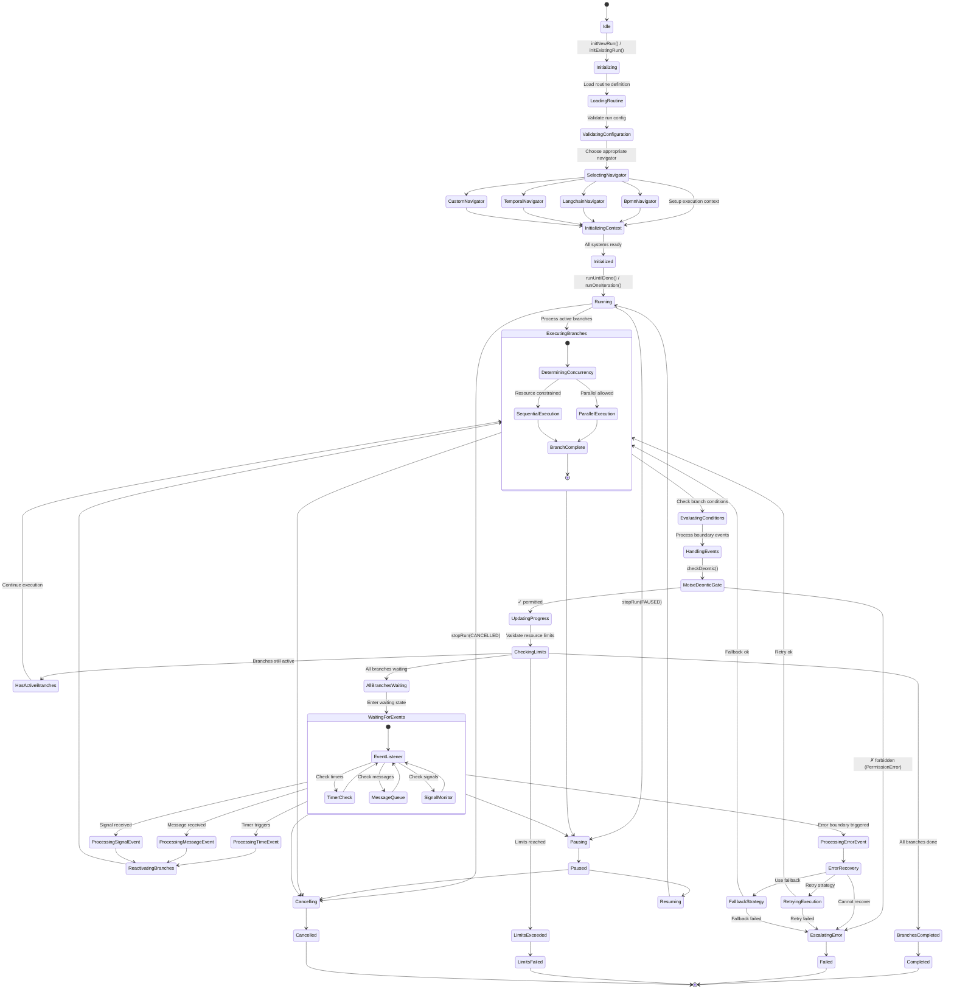

# Tier 2: Process Intelligence - RunStateMachine

**Purpose**: Navigator-agnostic routine execution with parallel coordination and state management

The `RunStateMachine` is at the heart of Vrooli's ability to execute diverse automation routines. The following diagram visualizes its lifecycle and the various states it transitions through while managing routine execution:

