# Tier 3: Execution Intelligence

**Purpose**: Strategy-aware step execution with adaptive optimization and comprehensive tool integration

**The Unified Execution Paradigm:**

Tier 3 represents the culmination of Vrooli's execution intelligence - where individual routine steps are executed with **strategy-aware adaptation** that evolves based on routine characteristics, usage patterns, and performance metrics. Unlike traditional workflow engines that execute steps uniformly, Vrooli's UnifiedExecutor applies different **execution strategies** dynamically:

- **Conversational Strategy**: Natural language processing for creative and exploratory tasks
- **Reasoning Strategy**: Structured analytical frameworks for complex decision-making  
- **Deterministic Strategy**: Reliable automation for proven, repeatable processes

This creates a **strategy evolution pipeline** where routines naturally progress from human-like flexibility to machine-like reliability as patterns emerge and best practices crystallize.

```mermaid
graph TB
  subgraph "Tier 3: Execution Intelligence – UnifiedExecutor"
    UnifiedExecutor[UnifiedExecutor<br/>🎯 Central execution coordinator<br/>🤖 Strategy-aware processing]

    %% ─────────── Strategy framework ───────────
    subgraph "Strategy Framework"
      StrategySelector[StrategySelector<br/>🧠 Context-aware selection]
      ConversationalStrategy[ConversationalStrategy<br/>💬 Natural-language tasks]
      ReasoningStrategy[ReasoningStrategy<br/>🧠 Structured analysis]
      DeterministicStrategy[DeterministicStrategy<br/>⚙️ Reliable automation]
    end

    %% ─────────── Context & state ───────────
    subgraph "Context & State Management"
      RunContext[RunContext<br/>📋 Runtime environment]
      ContextExporter[ContextExporter<br/>🔄 Cross-tier sync]
    end

    %% ─────────── Execution infra ───────────
    subgraph "Execution Infrastructure"
      ToolOrchestrator[ToolOrchestrator<br/>🔧 MCP tool coordination]
    MoiseBarrier[MOISE+ Norm Check<br/>🔒 Deontic enforcement]
      IOProcessor[IOProcessor<br/>📋 I/O handling & validation]
      ResourceManager[ResourceManager<br/>💰 Credit & time limits]
      ValidationEngine[ValidationEngine<br/>✅ Output QA & security]
    end

    %% ─────────── Telemetry only (no learning here) ───────────
    subgraph "Telemetry Emitter (stateless)"
      TelemetryShim[Telemetry Shim<br/>📊 Publishes perf.* / biz.* / safety.* events]
    end
  end

  %% Core flow
  UnifiedExecutor --> StrategySelector
  StrategySelector --> ConversationalStrategy
  StrategySelector --> ReasoningStrategy
  StrategySelector --> DeterministicStrategy

  UnifiedExecutor --> RunContext
  UnifiedExecutor --> ContextExporter

  UnifiedExecutor --> ResourceManager
  ResourceManager --> MoiseBarrier
  MoiseBarrier --> IOProcessor
  MoiseBarrier --> ToolOrchestrator

  IOProcessor --> ToolOrchestrator
  ToolOrchestrator --> ValidationEngine

  UnifiedExecutor --> TelemetryShim

  classDef executor fill:#e8f5e8,stroke:#2e7d32,stroke-width:3px
  classDef strategy fill:#fff3e0,stroke:#f57c00,stroke-width:2px
  classDef infra fill:#e3f2fd,stroke:#1565c0,stroke-width:2px
  classDef context fill:#f3e5f5,stroke:#7b1fa2,stroke-width:2px
  classDef telem fill:#ffebee,stroke:#c62828,stroke-width:2px

  class UnifiedExecutor executor
  class StrategySelector,ConversationalStrategy,ReasoningStrategy,DeterministicStrategy strategy
  class RunContext,ContextExporter context
  class ResourceManager,MoiseBarrier,IOProcessor,ToolOrchestrator,ValidationEngine infra
  class TelemetryShim telem
```



**Here's how the UnifiedExecutor works in detail:**

```mermaid
sequenceDiagram
    actor T2 as RunStateMachine  ▸  Tier 2  
    participant UE as UnifiedExecutor  ▸  Tier 3  
    participant SS as StrategySelector  
    participant RM as ResourceManager  
    participant IP as IOProcessor  
    participant STRAT as Selected Strategy <br/>(Conv / Reason / Determin.)  
    participant TO as ToolOrchestrator  
    participant VE as ValidationEngine  
    participant TS as TelemetryShim

    %% ───────────── Invocation ─────────────
    T2->>UE: RunStepContext(step, ctx, limits)

    %% ───────────── Preparation ────────────
    UE->>SS: chooseStrategy(ctx.manifest, usageHints)
    SS-->>UE: strategyType

    UE->>RM: reserveBudget(limits)
    RM-->>UE: ok
    alt budgetExceeded
        UE-->>T2: LimitExceededError
        TS-->>TS: emit perf.limit_exceeded
    else
        UE->>IP: buildInputPayload(ctx)
        IP-->>UE: preparedInputs

        %% ───────────── Execution ──────────────
        UE->>STRAT: executeStep(preparedInputs, ctx, tools)

        %% -- inside the strategy loop (may call tools 0–N times)
        loop each toolCall
            STRAT->>TO: runTool(name, args)
            TO->>RM: checkQuota(costEstimate)
            RM-->>TO: ok
            alt quotaOk
                TO-->>STRAT: toolResult
                TS-->>TS: emit perf.tool_call
            else quotaExceeded
                STRAT-->>UE: ResourceError
                TS-->>TS: emit perf.quota_abort
                UE-->>T2: ResourceError
            end
        end
        STRAT-->>UE: rawOutput

        %% ───────────── Post-processing ─────────
        UE->>VE: validate(rawOutput, schema)
        VE-->>UE: validatedOutput
        alt validationFails
            UE-->>T2: ValidationError
            TS-->>TS: emit safety.validation_fail
        else
            UE->>RM: finalizeUsage()
            RM-->>UE: usageReport

            %% ───────────── Completion ─────────────
            UE-->>T2: RunStepResult(validatedOutput, usageReport)
            TS-->>TS: emit perf.step_completed
        end
    end
```



## **Three-Strategy Execution Framework**

### **1. Conversational Strategy**

**Purpose**:

* Handle open-ended tasks via natural-language reasoning and creative problem-solving.
* Useful when the goal or approach isn’t fully defined yet, and human-like flexibility is required.

**Key Characteristics**:

* Adaptive, exploratory, and tolerant of ambiguity.
* Often involves human feedback loops.
* Outputs can be fuzzy and require further refinement.

**Illustrative Capabilities**:

* **Natural Language Processing**

  * **Prompt Engineering**

    * Context-aware prompt templates
    * Goal framing via dynamic template selection
    * Role-specific instructions
  * **Response Interpretation**

    * Intent extraction from model output
    * Sentiment and tone analysis
    * Tracking conversational context
  * **Creativity Engine**

    * Generating novel suggestions or brainstorming ideas
    * Applying “creative constraints” for specific scenarios
    * Iterative refinement based on partial feedback

* **Adaptive Reasoning**

  * **Situational Awareness**

    * Assessing the broader context and constraints
    * Aligning sub-goals with overall objectives
    * Dynamically adjusting lines of inquiry
  * **Exploratory Thinking**

    * Hypothesis generation (e.g., “What if we try X?”)
    * Experimental approaches to uncover insights
    * Evaluating intermediate findings for next steps
  * **Edge-Case Handling**

    * Spotting unusual or unexpected scenarios early
    * Graceful fallbacks when instructions conflict
    * Integrating newly learned patterns on the fly

* **Human-AI Collaboration**

  * **Human-in-the-Loop**

    * Prompting for clarification when ambiguous
    * Soliciting feedback on intermediate ideas
    * Guided oversight for high-risk decisions
  * **Uncertainty Handling**

    * Quantifying confidence scores for generated text
    * Asking clarifying questions to reduce ambiguity
    * Incorporating human decisions when model confidence is low
  * **Learning Capture**

    * Documenting patterns that emerge from back-and-forth
    * Building a simple working memory of past interactions
    * Flagging novel insights for later codification

### **2. Reasoning Strategy**

**Purpose**:

* Apply structured, logic-driven frameworks to tasks once basic conversational patterns are known.
* Good for multi-step decision trees, data-driven analysis, and evidence-based conclusions.

**Key Characteristics**:

* Emphasizes consistency, traceability, and justifiable outputs.
* Often involves deterministic sub-routines or scripts combined with LLM assistance.
* Balances human interpretability with partial automation.

**Illustrative Capabilities**:

* **Analytical Frameworks**

  * **Logical Structures**

    * Premise-conclusion chains (if-then reasoning)
    * Formal logic validation to catch contradictions
    * Inference rules for systematic deduction
  * **Data Analysis**

    * Statistical reasoning (e.g., mean, variance, trends)
    * Trend identification from datasets or text corpora
    * Evidence evaluation (“Which data supports X?”)
  * **Decision Trees**

    * Building branching logic for complex choices
    * Calculating outcome probabilities where possible
    * Selecting optimized paths based on defined criteria

* **Knowledge Integration**

  * **Fact Retrieval**

    * Querying an internal knowledge base or vector store
    * Semantic search to rank relevant documents
    * Ensuring relevant facts are surfaced before analysis
  * **Concept Mapping**

    * Identifying relationships between entities or ideas
    * Diagramming conceptual dependencies (e.g., cause/effect)
    * Highlighting gaps in available knowledge
  * **Evidence Synthesis**

    * Merging information from multiple sources
    * Resolving conflicting data points through comparison
    * Producing coherent, consolidated conclusions

* **Quality Assurance**

  * **Logic Validation**

    * Automated consistency checks on conclusions
    * Detecting fallacies or flawed inference steps
    * Ensuring each step follows established rules
  * **Bias Detection**

    * Scanning reasoning for potential cognitive biases
    * Measuring fairness with basic heuristics
    * Triggering corrective routines when bias is found
  * **Confidence Scoring**

    * Assigning confidence levels to each sub-conclusion
    * Quantifying uncertainty numerically (e.g., 0–1 scale)
    * Driving conditional flows based on confidence thresholds

### **3. Deterministic Strategy**

**Purpose**:

* Execute fully codified, repeatable processes once best practices are established.
* Ideal for high-volume, low-ambiguity tasks where reliability and cost-efficiency are paramount.

**Key Characteristics**:

* Strict validation, idempotency, and monitoring.
* Minimal to zero human intervention.
* Optimized for throughput, resource usage, and error-resilience.

**Illustrative Capabilities**:

* **Process Automation**

  * **Routine Execution**

    * Step-by-step procedural workflows (e.g., ETL pipelines)
    * State-machine logic for branching and parallelism
    * Built-in synchronization points to avoid race conditions
  * **API Integration**

    * REST/GraphQL calls to external services
    * Authentication management (tokens, retries)
    * Rate-limit handling and back-off strategies
  * **Data Transformation**

    * Schema validation (JSON ⇄ CSV, internal object mappings)
    * Format conversions (e.g., currency, date/time normalization)
    * Bulk data processing with error-tolerant mechanisms

* **Optimization & Efficiency**

  * **Cache Management**

    * Result memoization to skip redundant work
    * Local or distributed caching layers (TTL, invalidation)
    * Cache hit-rate tracking for performance tuning
  * **Batch Processing**

    * Grouping many small operations into bulk requests
    * Reducing API call overhead by aggregating inputs
    * Throughput optimization via parallel batching
  * **Resource Optimization**

    * Credit-cost analysis to choose cheaper model/API variants
    * Time-based scheduling to exploit off-peak pricing
    * Load balancing across parallel workers

* **Reliability & Monitoring**

  * **Error Handling**

    * Granular exception management with retries & fallback
    * Graceful degradation paths when dependencies fail
    * Automated “circuit breaker” to halt repeated failures
  * **Health Monitoring**

    * Service-level checks (availability, latency, error rate)
    * Alerts on SLA violations (e.g., > 99.9 % uptime)
    * Proactive remediation (auto-restart failing components)
  * **Quality Assurance**

    * Strict output validation against predefined schemas
    * Consistency checks to enforce data invariants
    * SLA compliance gates (e.g., “no processing beyond 5 min”)

## Strategy Selection Intelligence  — How a step decides *how* to run

Vrooli resolves a step's execution strategy through a **two-layer rule set**:

| Resolution layer | Rule | Notes |
|------------------|------|-------|
| **1. Declarative default** | Each Routine (and every nested Sub-routine) carries a `strategy` field in its manifest. Accepted values: `"conversational"`, `"reasoning"`, `"deterministic"`. Child routines always override the parent's setting, so a deterministic parent can embed a conversational brainstorming step without friction. | Think of this as the *author's intent* – predictable and easy to audit. |
| **2. Adaptive override** | At execution-time the `StrategySelector` may substitute a different strategy **only** when:<br/>• the declared strategy violates a hard policy (e.g. `"conversational"` forbidden in HIPAA context) | All substitutions are logged; the ImprovementEngine feeds results back to routine authors. |

```ts
// Manifest snippet
type RoutineConfig = {
  id: string
  name: string
  strategy?: "conversational" | "reasoning" | "deterministic"  // default: "conversational"
  ...
}
```

## **Tool Integration Architecture**

Tier 3's **ToolOrchestrator** provides a unified tool execution system built around the **Model Context Protocol (MCP)** that serves both external AI agents and internal swarms through a centralized tool registry.

```mermaid
graph TB
    subgraph "MCP Server Architecture"
        McpServerApp[McpServerApp<br/>🎯 Central MCP coordination<br/>🔌 Multi-mode connectivity<br/>🔐 Authentication & authorization]
        
        subgraph "Connection Modes"
            SSEMode[SSE Mode<br/>🌐 Server-Sent Events<br/>🔄 Remote agent access<br/>📊 WebSocket-like communication]
            
            STDIOMode[STDIO Mode<br/>💻 Standard I/O<br/>📱 Local agent access<br/>⚡ Direct process communication]
        end
        
        subgraph "Tool Registry System"
            ToolRegistry[ToolRegistry<br/>📋 Central tool coordination<br/>🔄 Built-in & dynamic tools<br/>⚡ Execution routing]
            
            BuiltInTools[BuiltInTools<br/>🛠️ Core MCP tools<br/>📊 Resource management<br/>🔧 System operations]
            
            SwarmTools[SwarmTools<br/>🐝 Swarm-specific tools<br/>👥 Team coordination<br/>📊 State management]
            
            DynamicServers[Dynamic Tool Servers<br/>🔄 Routine-specific servers<br/>🎯 Single-tool instances<br/>⚡ On-demand creation]
        end
    end
    
    subgraph "Tool Execution Pipeline"
        RequestRouter[Request Router<br/>🎯 Tool selection<br/>📊 Load balancing<br/>🔐 Permission validation]
        
        ApprovalSystem[Approval System<br/>👤 User intervention<br/>⏱️ Scheduled execution<br/>🚨 Timeout handling]
        
        ExecutionEngine[Execution Engine<br/>⚡ Sync/async execution<br/>📊 Resource tracking<br/>🔄 Error handling]
        
        ResponseHandler[Response Handler<br/>📤 Result formatting<br/>📊 Status reporting<br/>🔄 Event broadcasting]
    end
    
    McpServerApp --> SSEMode
    McpServerApp --> STDIOMode
    McpServerApp --> ToolRegistry
    
    ToolRegistry --> BuiltInTools
    ToolRegistry --> SwarmTools
    ToolRegistry --> DynamicServers
    
    ToolRegistry --> RequestRouter
    RequestRouter --> ApprovalSystem
    ApprovalSystem --> ExecutionEngine
    ExecutionEngine --> ResponseHandler
    
    classDef server fill:#e8f5e8,stroke:#2e7d32,stroke-width:3px
    classDef connection fill:#fff3e0,stroke:#f57c00,stroke-width:2px
    classDef registry fill:#e3f2fd,stroke:#1565c0,stroke-width:2px
    classDef execution fill:#f3e5f5,stroke:#7b1fa2,stroke-width:2px
    
    class McpServerApp server
    class SSEMode,STDIOMode connection
    class ToolRegistry,BuiltInTools,SwarmTools,DynamicServers registry
    class RequestRouter,ApprovalSystem,ExecutionEngine,ResponseHandler execution
```



## **Core Tool Architecture**

The system provides **six core tools** that enable comprehensive automation and coordination:

**1. Built-In System Tools**

```mermaid
graph TB
    subgraph "Built-In Tools (BuiltInTools class)"
        DefineTool[define_tool<br/>📋 Schema compression layer<br/>🎯 Dynamic tool definitions<br/>⚡ Context optimization]
        
        ResourceManage[resource_manage<br/>🗃️ CRUD operations<br/>📊 Universal resource access<br/>🔍 Find, Add, Update, Delete]
        
        SendMessage[send_message<br/>💬 Team communication<br/>🎯 Multi-recipient support<br/>📢 Event-driven messaging]
        
        RunRoutine[run_routine<br/>⚙️ Routine execution<br/>🔄 Sync/async modes<br/>📊 Resource allocation]
    end
    
    subgraph "DefineTool Schema Generation"
        ResourceVariants[Resource Variants<br/>📝 Note, Project, Standard<br/>🔄 Routine, API, Code<br/>📊 Dynamic sub-types]
        
        OperationSchemas[Operation Schemas<br/>🔍 Find filters<br/>➕ Add attributes<br/>🔄 Update attributes<br/>🗑️ Delete operations]
        
        CompressionBenefit[Compression Benefit<br/>📉 Reduced context size<br/>⚡ Faster tool discovery<br/>🎯 Precise parameter schemas]
    end
    
    DefineTool --> ResourceVariants
    ResourceVariants --> OperationSchemas
    OperationSchemas --> CompressionBenefit
    
    classDef tools fill:#e8f5e8,stroke:#2e7d32,stroke-width:2px
    classDef schema fill:#fff3e0,stroke:#f57c00,stroke-width:2px
    
    class DefineTool,ResourceManage,SendMessage,RunRoutine tools
    class ResourceVariants,OperationSchemas,CompressionBenefit schema
```


**2. Swarm-Specific Tools**

```mermaid
graph TB
    subgraph "Swarm Tools (SwarmTools class)"
        SpawnSwarm[spawn_swarm<br/>🐝 Child swarm creation<br/>💰 Resource allocation<br/>👥 Team inheritance]
        
        UpdateState[update_swarm_shared_state<br/>📊 State synchronization<br/>📋 Subtask management<br/>🗃️ Blackboard operations]
        
        EndSwarm[end_swarm<br/>🏁 Swarm termination<br/>📊 Final state capture<br/>🔐 Authorization checks]
    end
    
    subgraph "Spawn Swarm Modes"
        SimpleSpawn[Simple Spawn<br/>🎯 Leader + goal<br/>⚡ Quick deployment<br/>🔄 Resource inheritance]
        
        TeamSpawn[Team Spawn<br/>👥 Predefined team<br/>🏗️ Structured approach<br/>📊 Role-based allocation]
    end
    
    subgraph "State Management Operations"
        SubtaskOps[Subtask Operations<br/>➕ Add/update tasks<br/>🗑️ Remove tasks<br/>👤 Assign leaders]
        
        BlackboardOps[Blackboard Operations<br/>📝 Set key-value pairs<br/>🗑️ Delete entries<br/>🔄 Shared scratchpad]
        
        TeamConfigOps[Team Config Operations<br/>🏗️ MOISE+ updates<br/>👥 Role modifications<br/>📋 Structure changes]
    end
    
    SpawnSwarm --> SimpleSpawn
    SpawnSwarm --> TeamSpawn
    
    UpdateState --> SubtaskOps
    UpdateState --> BlackboardOps
    UpdateState --> TeamConfigOps
    
    classDef swarmTools fill:#f3e5f5,stroke:#7b1fa2,stroke-width:2px
    classDef spawn fill:#e8f5e8,stroke:#2e7d32,stroke-width:2px
    classDef state fill:#e3f2fd,stroke:#1565c0,stroke-width:2px
    
    class SpawnSwarm,UpdateState,EndSwarm swarmTools
    class SimpleSpawn,TeamSpawn spawn
    class SubtaskOps,BlackboardOps,TeamConfigOps state
```


## **Single-Step Routine Execution Engine**

When agents call `run_routine`, they trigger either **multi-step routines** (orchestrated by Tier 2's RunStateMachine) or **single-step routines** (executed directly by Tier 3). Single-step routines handle the actual actions that interact with external systems:


## **Single-Step Execution Implementation Details**

The single-step execution engine provides specialized handling for different action types:

- **Code Execution**: Runs in isolated child processes with strict resource limits, timeout enforcement, and security sandboxing to prevent malicious code execution.

- **API Calls**: Include comprehensive timeout/abort systems, rate limiting, credential management, and circuit breaker patterns for resilient external service integration.

- **Web Search**: Implements query optimization, provider selection, content extraction, and quality filtering to deliver relevant, safe search results.

- **Data Processing**: Provides format conversion, schema validation, and 
transformation logic with sensitivity-aware handling for different data types.

- **AI Generation**: Manages LLM interactions with prompt engineering, response 
processing, and quality assessment for consistent AI-generated content.

- **Internal Actions**: Handles Vrooli-specific operations like resource CRUD, state 
management, and system integrations with appropriate authorization.

Each execution type supports both **synchronous** and **asynchronous** operation 
modes, with the approval system allowing user intervention for sensitive operations 
through configurable policies in the chat/swarm configuration.

A sophisticated **approval and scheduling system** allows for user oversight and 
controlled execution:

```mermaid
graph TB
    subgraph "Tool Approval Architecture"
        ChatConfig[ChatConfig<br/>📋 Per-swarm configuration<br/>⚙️ Approval 
        policies<br/>⏱️ Scheduling rules]
        
        subgraph "Approval Policies"
            RequiresApproval[Requires Approval<br/>🔧 Specific tools<br/>🌐 All 
            tools<br/>❌ No approval needed]
            
            ApprovalTimeout[Approval Timeout<br/>⏱️ Configurable duration<br/>🚨 
            Auto-reject option<br/>👤 User-specific approval]
            
            ToolSpecificDelays[Tool-Specific Delays<br/>⏱️ Custom per-tool delays<br/
            >📊 Risk-based timing<br/>💰 Cost consideration]
        end
        
        subgraph "Execution Modes"
            SynchronousExec[Synchronous Execution<br/>⚡ Immediate execution<br/>🔄 
            Blocking operation<br/>📊 Direct response]
            
            AsynchronousExec[Asynchronous Execution<br/>📅 Scheduled execution<br/
            >🔄 Non-blocking operation<br/>📢 Event notification]
            
            PendingApproval[Pending Approval<br/>⏸️ User intervention required<br/
            >📊 Status tracking<br/>⏱️ Timeout monitoring]
        end
        
        subgraph "Pending Tool Call Management"
            PendingStore[Pending Store<br/>💾 Persistent storage<br/>📊 Status 
            tracking<br/>🔄 Retry logic]
            
            StatusTracking[Status Tracking<br/>📊 PENDING_APPROVAL<br/>✅ 
            APPROVED_READY<br/>❌ REJECTED_BY_USER<br/>⏱️ REJECTED_BY_TIMEOUT]
            
            ResourceTracking[Resource Tracking<br/>💰 Cost estimation<br/>⏱️ 
            Execution time<br/>📊 Attempt counting]
        end
    end
    
    ChatConfig --> RequiresApproval
    ChatConfig --> ApprovalTimeout
    ChatConfig --> ToolSpecificDelays
    
    RequiresApproval --> SynchronousExec
    RequiresApproval --> AsynchronousExec
    RequiresApproval --> PendingApproval
    
    PendingApproval --> PendingStore
    PendingStore --> StatusTracking
    StatusTracking --> ResourceTracking
    
    classDef config fill:#e8f5e8,stroke:#2e7d32,stroke-width:3px
    classDef policy fill:#fff3e0,stroke:#f57c00,stroke-width:2px
    classDef execution fill:#e3f2fd,stroke:#1565c0,stroke-width:2px
    classDef management fill:#f3e5f5,stroke:#7b1fa2,stroke-width:2px
    
    class ChatConfig config
    class RequiresApproval,ApprovalTimeout,ToolSpecificDelays policy
    class SynchronousExec,AsynchronousExec,PendingApproval execution
    class PendingStore,StatusTracking,ResourceTracking management
```



## **Dynamic Tool Server Architecture**

For routine execution, the system creates **dynamic, single-tool MCP servers**:

```typescript
interface DynamicToolServer {
    // Server Creation
    createRoutineServer(routineId: string): Promise<McpServer | null>;
    cacheServerInstance(toolId: string, server: McpServer): void;
    
    // Tool-Specific Capabilities
    exposeRoutineAsTools(routine: Routine): ToolDefinition[];
    handleRoutineExecution(routineId: string, args: RoutineArgs): Promise<RoutineResult>;
    
    // Resource Management
    inheritParentResources(parentSwarmId: string): ResourceAllocation;
    trackResourceUsage(toolId: string, usage: ResourceUsage): void;
    
    // Authorization
    validateToolAccess(toolId: string, requestor: Agent): AuthorizationResult;
    enforceResourceLimits(toolId: string, request: ToolRequest): LimitResult;
}

interface ToolApprovalConfig {
    // Policy Configuration
    requiresApprovalTools: string[] | "all" | "none";
    approvalTimeoutMs: number;
    autoRejectOnTimeout: boolean;
    
    // Scheduling Configuration
    defaultDelayMs: number;
    toolSpecificDelays: Record<string, number>;
    
    // Execution Tracking
    pendingToolCalls: PendingToolCallEntry[];
    executionHistory: ToolExecutionRecord[];
}
```

## **Tool Execution Flow**


## **Key Integration Features**

**1. Schema Compression via `define_tool`**
```typescript
// Instead of loading all resource schemas into context
const compressedContext = await defineTool({
    toolName: "resource_manage",
    variant: "Note", 
    op: "add"
});
// Returns precise schema for Note creation only
```

**2. Resource Allocation in Swarm Spawning**
```typescript
const childSwarm = await spawnSwarm({
    kind: "simple",
    swarmLeader: "analyst_bot",
    goal: "Analyze Q4 data",
    // Inherits portion of parent's resource allocation
    resourceAllocation: {
        maxCredits: parentAllocation.maxCredits * 0.3,
        maxDuration: parentAllocation.maxDuration * 0.5
    }
});
```

**3. Approval-Gated Execution**
```typescript
const chatConfig = {
    scheduling: {
        requiresApprovalTools: ["run_routine", "resource_manage"],
        approvalTimeoutMs: 600000, // 10 minutes
        toolSpecificDelays: {
            "run_routine": 5000, // 5 second delay
            "send_message": 0   // Immediate
        }
    }
};
```

This architecture provides a **unified tool execution layer** that serves both external AI agents (via MCP) and internal swarms, with comprehensive approval controls, resource management, and dynamic tool generation capabilities.

## Run Context Management

The **RunContext** provides essential runtime environment for step execution:

```typescript
interface RunContext {
    /** static */
    readonly runId: string;
    readonly stepSchema: RoutineStepSchema;
    readonly parent?: RunContext;variables and state
    
    readonly permissions: Permission[];              // Execution permissions and constraints
    readonly resourceLimits: ResourceLimits;         // Credit, time, and computational limits
    readonly qualityRequirements: QualityRequirements; // Output quality and validation rules
    
    // Tool Integration
    readonly availableTools: ToolDefinition[];       // Accessible tools and APIs
    readonly authenticationCredentials: Credentials; // API keys and authentication tokens
    readonly integrationConfigs: IntegrationConfig[]; // Third-party service configurations
    
    // State Management
    inheritFromParent(parentContext: RunContext): RunContext;
    createChildContext(overrides: ContextOverrides): RunContext;
    updateVariable(key: string, value: unknown): RunContext;
    validatePermissions(action: ExecutionAction): PermissionResult;

    /** dynamic */
    vars: Record<string, unknown>;
    intermediate: Record<string, unknown>;
    exports: ExportDeclaration[];      // populated by manifest or tool call
    sensitivity: Record<string, DataSensitivity>; // NONE | INSENSITIVE | SENSITIVE | CONFIDENTIAL

    /* helpers */
    createChild(overrides?: Partial<RunContextInit>): RunContext;
    markForExport(key: string, toParent?: boolean, toBlackboard?: boolean): void;
}
```

**Context Inheritance**: The system maintains a clear hierarchical flow where each level inherits appropriate context from its parent while maintaining security boundaries. Performance tracking, learning, and optimization are handled by specialized agents that subscribe to execution events rather than being embedded in the execution context itself.

> ℹ️ See the [Context and Memory Architecture](#context-and-memory-architecture) section for details on how context as a whole is managed and persisted.

## **Runtime Resource Accounting**

The **ResourceManager** ensures accurate tracking and enforcement of computational resources during execution:

```mermaid
graph TB
    subgraph "Runtime Resource Accounting Framework"
        ResourceManager[ResourceManager<br/>💰 Central resource coordination<br/>📊 Usage tracking<br/>🚫 Limit enforcement]
        
        subgraph "Credit Management"
            CreditTracker[Credit Tracker<br/>💰 Usage monitoring<br/>📊 Balance management<br/>⚠️ Limit enforcement]
        end
        
        subgraph "Time Management"
            TimeTracker[Time Tracker<br/>⏱️ Execution time monitoring<br/>📊 Performance analysis<br/>🎯 Bottleneck identification]
            
            TimeoutManager[Timeout Manager<br/>⏰ Execution time limits<br/>🚨 Timeout handling<br/>🔄 Recovery strategies]
        end
        
        subgraph "Computational Resources"
            CPUManager[CPU Manager<br/>⚡ Processing allocation<br/>📊 Usage optimization<br/>🔄 Load distribution]
            
            MemoryManager[Memory Manager<br/>💾 Memory allocation<br/>📊 Usage tracking<br/>🗑️ Garbage collection]
            
            ConcurrencyController[Concurrency Controller<br/>🔄 Parallel execution<br/>⚖️ Resource sharing<br/>📊 Synchronization]
        end
    end
    
    ResourceManager --> CreditTracker
    ResourceManager --> TimeTracker
    ResourceManager --> TimeoutManager
    ResourceManager --> CPUManager
    ResourceManager --> MemoryManager
    ResourceManager --> ConcurrencyController
    
    classDef manager fill:#e8f5e8,stroke:#2e7d32,stroke-width:3px
    classDef credit fill:#fff3e0,stroke:#f57c00,stroke-width:2px
    classDef time fill:#e3f2fd,stroke:#1565c0,stroke-width:2px
    classDef compute fill:#f3e5f5,stroke:#7b1fa2,stroke-width:2px
    
    class ResourceManager manager
    class CreditTracker credit
    class TimeTracker,TimeoutManager time
    class CPUManager,MemoryManager,ConcurrencyController compute
```



The ResourceManager focuses on immediate operational concerns: tracking resource consumption, enforcing hard limits, and ensuring execution stays within allocated bounds. Strategic cost tuning can be handled by optimiser agents that subscribe to `swarm/perf.*` events.

## **Learning and Optimization**

Learning and optimization are handled by specialized agents that subscribe to execution events rather than being embedded in Tier 3. Performance tracking, strategy evolution, and routine optimization occur through the event-driven architecture where specialized bots analyze execution patterns and suggest improvements through routine manifest patches.

## **Integration with Tier 1 and Tier 2**

Tier 3 integrates seamlessly with the upper tiers through well-defined interfaces:


## **Key Design Principles**

**1. MCP-First Architecture**
The system uses Model Context Protocol as the universal interface for tool integration:
- **External AI agents** connect via MCP to access Vrooli's tool ecosystem
- **Internal swarms** use the same MCP tools for consistency and reliability
- **Dynamic tool servers** provide routine-specific MCP endpoints

**2. Tool Approval as First-Class Citizen**
User oversight is built into the core architecture:
- **Configurable approval policies** per swarm and tool type
- **Scheduled execution** with user-defined delays
- **Resource-aware gating** based on cost and complexity

**3. Schema Compression for Efficiency**
The `define_tool` mechanism reduces context overhead:
- **On-demand schema generation** for specific resource types and operations
- **Precise parameter definitions** instead of comprehensive tool schemas
- **Dynamic adaptation** based on current execution context

**4. Resource Inheritance in Swarm Spawning**
Child swarms inherit controlled portions of parent resources:
- **Configurable allocation ratios** for credits, time, and computational resources
- **Hierarchical limit enforcement** prevents resource exhaustion
- **Graceful degradation** when limits are approached

**5. Unified Tool Execution Layer**
All tools, whether built-in or dynamic, follow consistent patterns:
- **Common authentication and authorization** across all tool types
- **Standardized error handling** and response formatting
- **Comprehensive logging and audit trails** for all tool executions

This MCP-based tool integration architecture provides the foundation for Vrooli's unified automation ecosystem, enabling seamless collaboration between AI agents, swarms, and external systems while maintaining strict resource control and user oversight.
