# Tier 3: Execution Intelligence

**Purpose**: Strategy-aware step execution with adaptive optimization and comprehensive tool integration

## 🎯 Overview

**The Unified Execution Paradigm:**

Tier 3 represents the culmination of Vrooli's execution intelligence - where individual routine steps are executed with **strategy-aware adaptation** that evolves based on routine characteristics, usage patterns, and performance metrics. Unlike traditional workflow engines that execute steps uniformly, Vrooli's UnifiedExecutor applies different **execution strategies** dynamically:

- **Conversational Strategy**: Natural language processing for creative and exploratory tasks
- **Reasoning Strategy**: Structured analytical frameworks for complex decision-making  
- **Deterministic Strategy**: Reliable automation for proven, repeatable processes

This creates a **strategy evolution pipeline** where routines naturally progress from human-like flexibility to machine-like reliability as patterns emerge and best practices crystallize.

```mermaid
graph TB
  subgraph "Tier 3: Execution Intelligence – UnifiedExecutor"
    UnifiedExecutor[UnifiedExecutor<br/>🎯 Central execution coordinator<br/>🤖 Strategy-aware processing]

    %% ─────────── Strategy framework ───────────
    subgraph "Strategy Framework"
      StrategySelector[StrategySelector<br/>🧠 Context-aware selection]
      ConversationalStrategy[ConversationalStrategy<br/>💬 Natural-language tasks]
      ReasoningStrategy[ReasoningStrategy<br/>🧠 Structured analysis]
      DeterministicStrategy[DeterministicStrategy<br/>⚙️ Reliable automation]
    end

    %% ─────────── Context & state ───────────
    subgraph "Context & State Management"
      RunContext[RunContext<br/>📋 Runtime environment]
      ContextExporter[ContextExporter<br/>🔄 Cross-tier sync]
    end

    %% ─────────── Execution infra ───────────
    subgraph "Execution Infrastructure"
      ToolOrchestrator[ToolOrchestrator<br/>🔧 MCP tool coordination]
    MoiseBarrier[MOISE+ Norm Check<br/>🔒 Deontic enforcement]
      IOProcessor[IOProcessor<br/>📋 I/O handling & validation]
      ResourceManager[ResourceManager<br/>💰 Credit & time limits]
      ValidationEngine[ValidationEngine<br/>✅ Output QA & security]
    end

    %% ─────────── Telemetry only (no learning here) ───────────
    subgraph "Telemetry Emitter (stateless)"
      TelemetryShim[Telemetry Shim<br/>📊 Publishes perf.* / biz.* / safety.* events]
    end
  end

  %% Core flow
  UnifiedExecutor --> StrategySelector
  StrategySelector --> ConversationalStrategy
  StrategySelector --> ReasoningStrategy
  StrategySelector --> DeterministicStrategy

  UnifiedExecutor --> RunContext
  UnifiedExecutor --> ContextExporter

  UnifiedExecutor --> ResourceManager
  ResourceManager --> MoiseBarrier
  MoiseBarrier --> IOProcessor
  MoiseBarrier --> ToolOrchestrator

  IOProcessor --> ToolOrchestrator
  ToolOrchestrator --> ValidationEngine

  UnifiedExecutor --> TelemetryShim

  classDef executor fill:#e8f5e8,stroke:#2e7d32,stroke-width:3px
  classDef strategy fill:#fff3e0,stroke:#f57c00,stroke-width:2px
  classDef infra fill:#e3f2fd,stroke:#1565c0,stroke-width:2px
  classDef context fill:#f3e5f5,stroke:#7b1fa2,stroke-width:2px
  classDef telem fill:#ffebee,stroke:#c62828,stroke-width:2px

  class UnifiedExecutor executor
  class StrategySelector,ConversationalStrategy,ReasoningStrategy,DeterministicStrategy strategy
  class RunContext,ContextExporter context
  class ResourceManager,MoiseBarrier,IOProcessor,ToolOrchestrator,ValidationEngine infra
  class TelemetryShim telem
```

**Here's how the UnifiedExecutor works in detail:**

```mermaid
sequenceDiagram
    actor T2 as RunStateMachine  ▸  Tier 2  
    participant UE as UnifiedExecutor  ▸  Tier 3  
    participant SS as StrategySelector  
    participant RM as ResourceManager  
    participant IP as IOProcessor  
    participant STRAT as Selected Strategy <br/>(Conv / Reason / Determin.)  
    participant TO as ToolOrchestrator  
    participant VE as ValidationEngine  
    participant TS as TelemetryShim

    %% ───────────── Invocation ─────────────
    T2->>UE: RunStepContext(step, ctx, limits)

    %% ───────────── Preparation ────────────
    UE->>SS: chooseStrategy(ctx.manifest, usageHints)
    SS-->>UE: strategyType

    UE->>RM: reserveBudget(limits)
    RM-->>UE: ok
    alt budgetExceeded
        UE-->>T2: LimitExceededError
        TS-->>TS: emit perf.limit_exceeded
    else
        UE->>IP: buildInputPayload(ctx)
        IP-->>UE: preparedInputs

        %% ───────────── Execution ──────────────
        UE->>STRAT: executeStep(preparedInputs, ctx, tools)

        %% -- inside the strategy loop (may call tools 0–N times)
        loop each toolCall
            STRAT->>TO: runTool(name, args)
            TO->>RM: checkQuota(costEstimate)
            RM-->>TO: ok
            alt quotaOk
                TO-->>STRAT: toolResult
                TS-->>TS: emit perf.tool_call
            else quotaExceeded
                STRAT-->>UE: ResourceError
                TS-->>TS: emit perf.quota_abort
                UE-->>T2: ResourceError
            end
        end
        STRAT-->>UE: rawOutput

        %% ───────────── Post-processing ─────────
        UE->>VE: validate(rawOutput, schema)
        VE-->>UE: validatedOutput
        alt validationFails
            UE-->>T2: ValidationError
            TS-->>TS: emit safety.validation_fail
        else
            UE->>RM: finalizeUsage()
            RM-->>UE: usageReport

            %% ───────────── Completion ─────────────
            UE-->>T2: RunStepResult(validatedOutput, usageReport)
            TS-->>TS: emit perf.step_completed
        end
    end
```

## 📚 Documentation Structure

This documentation is organized into focused sections covering different aspects of Tier 3:

### Core Components

- **[Strategy Framework](strategy-framework.md)** - The three execution strategies (Conversational, Reasoning, Deterministic) and strategy selection intelligence
- **[Tool Integration](tool-integration.md)** - MCP-based tool architecture, core tools, dynamic servers, and approval systems
- **[Single-Step Execution](single-step-execution.md)** - Direct action execution engine for web search, API calls, code execution, and more
- **[Context Management](context-management.md)** - Runtime environment management and context inheritance
- **[Resource Accounting](resource-accounting.md)** - Credit tracking, time management, and computational resource control

### Integration & Design

- **[Cross-Tier Integration](cross-tier-integration.md)** - How Tier 3 integrates with Tiers 1 & 2, plus key design principles

## 🔑 Key Design Principles

**1. MCP-First Architecture**
The system uses Model Context Protocol as the universal interface for tool integration:
- **External AI agents** connect via MCP to access Vrooli's tool ecosystem
- **Internal swarms** use the same MCP tools for consistency and reliability
- **Dynamic tool servers** provide routine-specific MCP endpoints

**2. Tool Approval as First-Class Citizen**
User oversight is built into the core architecture:
- **Configurable approval policies** per swarm and tool type
- **Scheduled execution** with user-defined delays
- **Resource-aware gating** based on cost and complexity

**3. Schema Compression for Efficiency**
The `define_tool` mechanism reduces context overhead:
- **On-demand schema generation** for specific resource types and operations
- **Precise parameter definitions** instead of comprehensive tool schemas
- **Dynamic adaptation** based on current execution context

**4. Resource Inheritance in Swarm Spawning**
Child swarms inherit controlled portions of parent resources:
- **Configurable allocation ratios** for credits, time, and computational resources
- **Hierarchical limit enforcement** prevents resource exhaustion
- **Graceful degradation** when limits are approached

**5. Unified Tool Execution Layer**
All tools, whether built-in or dynamic, follow consistent patterns:
- **Common authentication and authorization** across all tool types
- **Standardized error handling** and response formatting
- **Comprehensive logging and audit trails** for all tool executions

This MCP-based tool integration architecture provides the foundation for Vrooli's unified automation ecosystem, enabling seamless collaboration between AI agents, swarms, and external systems while maintaining strict resource control and user oversight. 